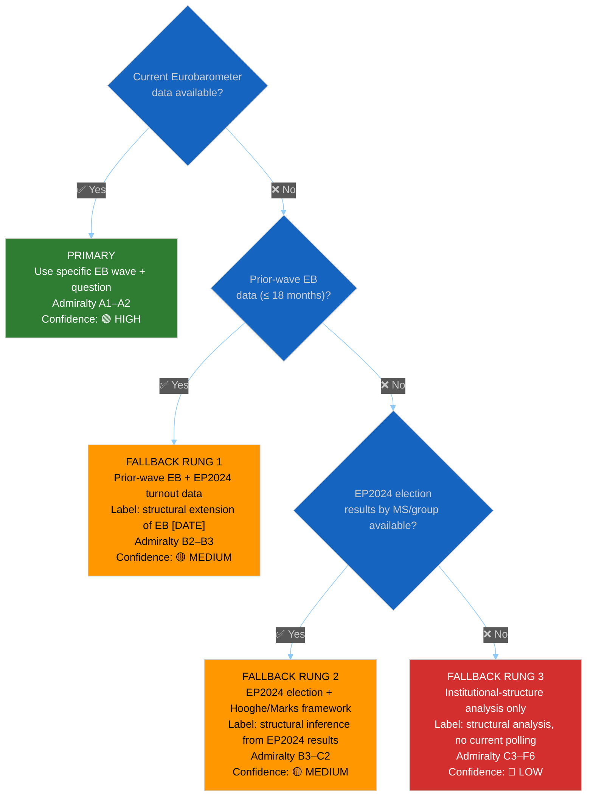

<!-- SPDX-FileCopyrightText: 2024-2026 Hack23 AB -->
<!-- SPDX-License-Identifier: Apache-2.0 -->

<p align="center">
  
</p>

<h1 align="center">🗳️ Voter Segmentation Methodology</h1>

<p align="center">
  <strong>📊 Eurobarometer Integration · Structural-Segmentation Fallback · Citation Requirements</strong><br>
  <em>🎯 EU Electorate Segments · Eurobarometer Primary Data · Required Fallback Rules · Confidence Tiers</em>
</p>

<p align="center">
  <a href="#"></a>
  <a href="#"></a>
  <a href="#"></a>
  <a href="#"></a>
</p>

**📋 Document Owner:** CEO | **📄 Version:** 1.0 | **📅 Last Updated:** 2026-05-14 (UTC)
**🔄 Review Cycle:** Quarterly | **⏰ Next Review:** 2026-08-14
**🏢 Owner:** Hack23 AB (Org.nr 5595347807) | **🏷️ Classification:** Public

---

## 🎯 Purpose

This document governs the production of `extended/voter-segmentation.md` artifacts. It codifies:

1. **Eurobarometer as primary source** — how to integrate current-cycle polling data.
2. **Structural-segmentation fallback** — what to do when Eurobarometer data is unavailable (fallback ladder, required labels).
3. **Citation requirements** — which specific Eurobarometer series to cite and how.
4. **Confidence rules** — how the triangulation step maps to confidence labels for this artifact.

> **Gap this document closes:** The 2026-05-14 methodology-reflection artifacts noted that `extended/voter-segmentation.md` was based on structural analysis rather than current EU opinion polling. No methodology page covered Eurobarometer-or-fallback integration. This document is that page.

---

## 🛡️ ISMS Policy Alignment

| Policy | Relevance |
|---|---|
| [Hack23 AI_Policy](https://github.com/Hack23/ISMS-PUBLIC/blob/main/AI_Policy.md) §3 | Evidence and provenance — Eurobarometer citations must be versioned |
| [Information Security Policy](https://github.com/Hack23/ISMS-PUBLIC/blob/main/Information_Security_Policy.md) §6 | Evidence handling — structural-fallback claims must be disclosed and graded |
| [Open Source Policy](https://github.com/Hack23/ISMS-PUBLIC/blob/main/Open_Source_Policy.md) | Eurobarometer data is EU public-domain; cite the specific report, not generic "Eurobarometer" |

---

## 1️⃣ Eurobarometer as Primary Source

### 1.1 Why Eurobarometer is Primary

Eurobarometer surveys are the **EU-institutional gold standard** for EU citizen attitudes. They are:
- Published by the European Commission on behalf of the European Parliament.
- Based on ≥ 26,000 interviews across all 27 EU Member States.
- Available with per-MS, per-demographic breakdown (age, education, urbanisation).
- Graded **A1–A2** under the Admiralty Code when cited with a specific wave and question number.

### 1.2 Eurobarometer Source Hierarchy

| Survey type | Publication cadence | Key questions | EP Relevance | Admiralty |
|-------------|---------------------|--------------|--------------|-----------|
| **Standard Eurobarometer (EB)** | 2× / year (spring + autumn) | QA1–QA22 (trust, satisfaction), national identity, EU membership | Aggregate EU attitudes | A1 |
| **Special Eurobarometer (SEB)** | Topic-specific | Parliamentary elections, climate, AI, migration | Deep-dive on EP policy domains | A1 |
| **Flash Eurobarometer** | Rapid, < 30 days | Event-driven (post-election, crisis) | Breaking/weekly runs | A2 |
| **EP Parlemeter** | Annual | Specific to EP institution trust and election intention | Electoral artifacts | A1 |

### 1.3 Canonical Citation Form

Every Eurobarometer citation must include:

```
[Eurobarometer Standard/Special/Flash EB NN — SEASON YYYY, Question QXX, p. NN]
```

**Examples:**
- `[EB 101 — Spring 2024, QA3a (EU membership positive), p. 14, A1]`
- `[EP Parlemeter 2024, Q3 (trust in EP), p. 8, A1]`
- `[Flash EB 546 — May 2026, Q2 (migration priority), A2]`

Do **not** write generic `[Eurobarometer, A1]` — the specific wave and question number are required for reproducibility.

---

## 2️⃣ Structural-Segmentation Fallback

When Eurobarometer data is unavailable for the current analysis run (EP MCP does not expose a Eurobarometer endpoint; the agentic workflow cannot fetch the publication), the analyst applies the **3-rung structural fallback** below.

### 2.1 Fallback Ladder



### 2.2 Rung Definitions

**Primary — Current Eurobarometer wave**

_Activates when:_ A Eurobarometer Standard, Special, or Parlemeter report published within the last 12 months is accessible and relevant to the segment claim.

_Required citation:_ Specific EB wave + question number + page reference (see §1.3).

_Confidence:_ 🟢 HIGH (A1).

---

**Fallback Rung 1 — Prior-wave Eurobarometer extended by EP2024 election data**

_Activates when:_ No current-cycle Eurobarometer is accessible but a prior wave (≤ 18 months old) is available in the analyst's knowledge base.

_Method:_ Use the prior EB wave for underlying segment structure; extend with EP2024 election turnout data by MS to update directional shifts.

_Required disclosure:_
```
[VOTER-SEG-FALLBACK: Rung 1]
Primary data unavailable: No current Eurobarometer wave accessible this run.
Fallback basis: EB [NN — SEASON YYYY] (structural extension) + EP2024 turnout by MS [A1].
Admiralty: B2 (EB) × A1 (EP2024) → B2 composite
Confidence: 🟡 MEDIUM
```

_Confidence:_ 🟡 MEDIUM maximum.

---

**Fallback Rung 2 — EP2024 election results + Hooghe/Marks framework**

_Activates when:_ Neither current nor recent Eurobarometer data is accessible, but EP2024 election results by MS and political group are available from EP MCP tools.

_Method:_ Map EP2024 vote shares and turnout by MS to Liesbet Hooghe / Gary Marks multi-level-governance segmentation framework. Segments: Europhiles/Euroskeptics × North/South/V4/Baltic/Nordic blocs × urban/rural × generation (post-Maastricht vs. pre-Maastricht voters).

_Required disclosure:_
```
[VOTER-SEG-FALLBACK: Rung 2]
Primary and Rung-1 data unavailable.
Fallback basis: EP2024 election results by MS [A1] + Hooghe/Marks framework [C2 academic].
Admiralty: B3 (structural inference)
Confidence: 🟡 MEDIUM
NOTE: Individual voting behaviour is unpredictable from structural segmentation alone.
```

_Confidence:_ 🟡 MEDIUM. The Mermaid quadrant chart's axes must be labelled as "Structural orientation" rather than "Current attitude" when Rung 2 is active.

---

**Fallback Rung 3 — Institutional structure only**

_Activates when:_ No Eurobarometer and no EP2024 results by MS are accessible.

_Method:_ Use known formal EP group seat distribution and treaty-based MS representation rules to infer broad segment outlines only (e.g. large MS vs. small MS, Northern vs. Southern budget contributors).

_Required disclosure:_
```
[VOTER-SEG-FALLBACK: Rung 3]
All polling and election data unavailable.
Basis: Institutional structure (EP group seats, MS weighting) only.
Admiralty: C3–F6
Confidence: 🔴 LOW
CAUTION: This segment analysis cannot speak to voter attitudes. It describes
formal political representation only, not citizen preferences.
```

_Confidence:_ 🔴 LOW mandatory. Rung-3 claims must appear only in caveat sections; they must not be the basis of any forward-looking electoral claim.

---

## 3️⃣ Required Segments and Their Primary Sources

Every `extended/voter-segmentation.md` artifact must cover **all applicable** segments below. Where a segment cannot be populated because no data is available, an explicit "data gap" row is required.

| Segment dimension | Primary source | Fallback source | Minimum depth floor |
|------------------|---------------|----------------|-------------------|
| **Europhile / Euroskeptic** | EB QA1 (EU membership positive/negative) | EP2024 group vote share | ≥120 words |
| **Regional bloc** (North/South/V4/Baltic/Nordic) | EB per-MS breakdown | EP2024 turnout by MS | ≥80 words per bloc |
| **Urban/rural** | EB urbanisation breakdown | World Bank rural population (% of total) [A2] | ≥80 words |
| **Age cohort** (pre-Maastricht / post-Maastricht / Gen Z) | EB age-group breakdowns | EP2024 youth turnout statistics | ≥80 words |
| **Education level** | EB education breakdowns | Eurostat education attainment statistics | ≥60 words |
| **Issue salience** (top 3 per segment) | EB QA14 (most important issues facing EU) | Policy-domain inference from EP2024 manifestos | ≥60 words per segment |
| **Political-group alignment** | EP2024 vote by segment | EB QD1 (party preference) | ≥80 words |
| **Swing segment** (2029 outlook) | EB trend over last 3 waves | Historical EP-election turnout trends | ≥100 words |

---

## 4️⃣ Citation Requirements

### 4.1 Mandatory Citations per Artifact

Every `extended/voter-segmentation.md` artifact must cite at least:

1. **One Eurobarometer wave** (current or fallback Rung 1) — or explicitly state the Rung-2/3 fallback.
2. **EP2024 election turnout data** (available from EP MCP `get_plenary_sessions` year=2024 or historical sources).
3. **One World Bank demographic indicator** for the urban/rural or age/education dimension (via `world-bank-get-social-data` tool).
4. **Hooghe/Marks academic citation** when Rung 2 is active (Hooghe, L. & Marks, G. (2018). *Cleavage theory meets Europe's crises*. European Journal of Political Research, 57(1), 109–135).

### 4.2 In-Text Citation Format

```markdown
| Segment | Size estimate | Primary source | Admiralty | Confidence |
|---------|--------------|---------------|-----------|-----------|
| Europhile (strong) | ~45 % of EU electorate | EB 101 Spring 2024, QA1a | A1 | 🟢 HIGH |
| Rural Euroskeptic | ~18 % of EU electorate | EB 99 Autumn 2023, QA1b + WB rural pop. | B2 | 🟡 MEDIUM |
```

### 4.3 Specific Eurobarometer Questions to Cite

| Claim type | Eurobarometer series | Specific question |
|------------|---------------------|------------------|
| EU membership support | Standard EB | QA1a "EU membership is a good thing" |
| EP trust | Standard EB | QA13 "Tend to trust: European Parliament" |
| Most important EU issues | Standard EB | QA14 "Most important issues facing EU" |
| Life satisfaction (proxy for economic discontent) | Standard EB | D73 |
| EP election intention | EP Parlemeter | Q1 "Likelihood to vote in EP elections" |
| EP-related awareness | EP Parlemeter | Q5 "Aware of upcoming EP elections" |

---

## 5️⃣ Confidence Rules for Voter-Segmentation Claims

| Claim type | Primary source | Maximum confidence |
|------------|---------------|-------------------|
| Current EU-wide attitudes | Current EB wave (< 12 months) | 🟢 HIGH (A1) |
| MS-level attitudes | EB per-MS breakdown (< 18 months) | 🟡 MEDIUM (A2) |
| EP election intention | EP Parlemeter (< 12 months) | 🟡 MEDIUM (A2) — election is inherently uncertain |
| Rung-1 structural extension | Prior-wave EB + EP2024 | 🟡 MEDIUM (B2) |
| Rung-2 structural inference | EP2024 + Hooghe/Marks | 🟡 MEDIUM (B3) — maximum for structural inference |
| Rung-3 institutional only | EP group seats only | 🔴 LOW (C3+) |
| 2029 electoral projection | Any source, > 3 years ahead | 🔴 LOW mandatory regardless of source |

### 5.1 Mandatory Caveat for Non-Primary Data

When Rung 2 or 3 is active, the artifact's **Overview** section must include:

> _"⚠️ This voter-segmentation analysis is based on [Rung 2: structural analysis from EP2024 results / Rung 3: institutional-structure analysis only], not on current EU opinion polling. Specific polling data (e.g. Eurobarometer [SEASON YEAR]) would strengthen this artifact. Confidence is capped at 🟡 MEDIUM [Rung 2] / 🔴 LOW [Rung 3]. Individual voting behaviour cannot be predicted from structural segmentation alone."_

---

## 6️⃣ Relationship to Other Artifacts

| Artifact | Voter-segmentation role |
|----------|------------------------|
| `intelligence/synthesis-summary.md` | Cites swing-segment finding from voter-segmentation as a forward-monitor |
| `intelligence/scenario-forecast.md` | Uses segment-level swing probabilities as scenario inputs |
| `intelligence/stakeholder-map.md` | Cross-references segment size for citizen-group power scores |
| `intelligence/coalition-dynamics.md` | May reference the Europhile/Euroskeptic breakdown as context for group alignment |
| `intelligence/pestle-analysis.md §Social` | Cites demographic and age-cohort breakdown |
| `extended/coalition-mathematics.md` | Uses national-delegation segments to model electoral swing scenarios |

---

## 📋 Quick-Reference Checklist

- [ ] **Eurobarometer cited first**: Current-wave EB attempted before any fallback.
- [ ] **Fallback rung declared**: If Eurobarometer unavailable, explicit `[VOTER-SEG-FALLBACK: Rung N]` marker in artifact Overview.
- [ ] **Specific EB wave + question**: Never generic "Eurobarometer" — wave number + question code required.
- [ ] **Rung 2/3 caveat in Overview**: Mandatory disclaimer paragraph when Rung 2 or 3 is active.
- [ ] **All 8 segments covered**: Each with depth floor text or explicit data-gap note.
- [ ] **Confidence correctly labeled**: 🟢 for primary; 🟡 for Rung 1/2; 🔴 for Rung 3 and all >3-year projections.
- [ ] **Mermaid quadrant labelled correctly**: "Current attitude" for Rung 0/1; "Structural orientation" for Rung 2/3.
- [ ] **World Bank demographic source cited**: At least once for urban/rural or age/education dimension.

---

## 🔗 Related Documents

- [`source-triangulation.md`](source-triangulation.md) — 4-step fallback ladder (voter-segmentation applies Rungs 1–3 from the same logic)
- [`confidence-calibration.md`](confidence-calibration.md) — unified confidence marker rules
- [`electoral-domain-methodology.md`](electoral-domain-methodology.md) — electoral domain methodology (EP election forecasting rules)
- [`electoral-cycle-methodology.md`](electoral-cycle-methodology.md) — multi-cycle EP election analysis
- [`osint-tradecraft-standards.md §2`](osint-tradecraft-standards.md) — Admiralty grading (Eurobarometer is A1)
- [`per-artifact-methodologies.md §voter-segmentation`](per-artifact-methodologies.md) — artifact construction rules

---

**Document Control:**
- **Path:** `analysis/methodologies/voter-segmentation-methodology.md`
- **Classification:** Public
- **Version:** 1.0 — Initial codification of Eurobarometer integration and structural-segmentation fallback rules, addressing the gap identified in 2026-05-14 methodology-reflection artifacts.
- **ISMS Reference:** Hack23/ISMS-PUBLIC AI Policy §3 (Evidence and provenance); Open Source Policy (public-domain data citation requirements)
