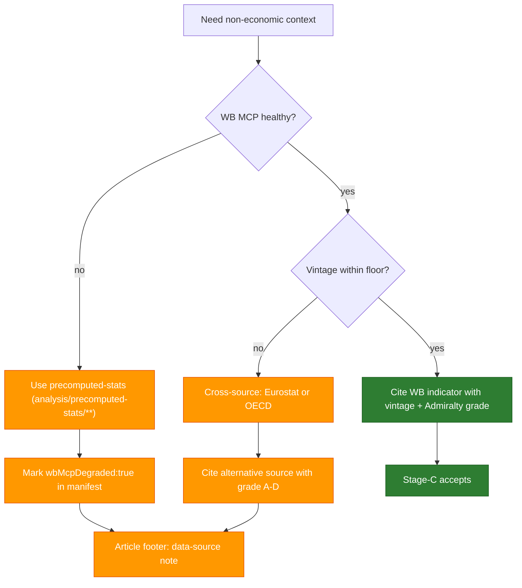

<!-- SPDX-FileCopyrightText: 2024-2026 Hack23 AB -->
<!-- SPDX-License-Identifier: Apache-2.0 -->

# World Bank Indicator → Article Type Mapping (Non-Economic Only — Wave-3)

**📋 Document Owner:** CEO | **📄 Version:** 1.2 | **📅 Last Updated:** 2026-04-25 (UTC)  
**🔄 Review Cycle:** Quarterly | **⏰ Next Review:** 2026-07-31  
**🏢 Owner:** Hack23 AB (Org.nr 5595347807) | **🏷️ Classification:** Public  
**🔗 Mirror file:** [`imf-indicator-mapping.md`](imf-indicator-mapping.md) (economic / fiscal / monetary / trade — Wave-4 partition)  
**📥 Feeds artifact:** [`economic-context.md`](../templates/economic-context.md) (Stage B.6, [`strategic-extensions-methodology.md`](strategic-extensions-methodology.md) §Economic Context)  
**🛂 Wave-2 OR-gate:** A policy-required article passes the economic-context gate when **either** an IMF indicator from the mirror file **or** a World Bank non-economic indicator from this mapping is cited with vintage and Admiralty grade. WB is the authoritative path for non-economic domains (health, education, social, environment, demographics, defence, agriculture, innovation, governance); legacy WB economic codes are retained for backward compatibility but MUST NOT appear in new articles.

**Purpose**: Canonical reference that maps European Parliament Monitor article
types to the most-relevant **non-economic** World Bank Open Data indicators.
Every news workflow cites this file so the AI agent selects indicators
consistently and the validator's quality gate remains enforceable.

**⚡ Wave-3 scope (April 2026)**: World Bank is the source for **health,
education, social, environment, demographics, defence, agriculture,
innovation, and governance** indicators only. **All economic / monetary /
fiscal / trade / FDI / exchange-rate / banking context (GDP, inflation,
unemployment, current account, fiscal balance, debt, monetary, REER) is
sourced from IMF** — see
[`imf-indicator-mapping.md`](imf-indicator-mapping.md) and
[`analysis/imf/`](../imf/). The legacy WB economic indicator codes listed
in § 1 are retained as raw-REST identifiers for backward compatibility
with pre-Wave-2 fixtures but **must not** be used in new articles — the
new-article policy is **IMF-primary**. Wave-4 (target ~2 weeks after
2026-04-24) will remove these WB economic codes from the production
article generation code path entirely.

**Retained WB domains (Wave-3)**:

| Domain | Covered by WB | Primary MCP tool |
|---|---|---|
| Social / demographics | POPULATION, LIFE_EXPECTANCY, BIRTH_RATE, DEATH_RATE, migration, dependency ratios | `get-social-data` + raw-REST `SP.POP.*` |
| Health | Health expenditure, physicians, hospital beds, immunisation, disease prevalence | `get-health-data` |
| Education | Literacy, school enrolment, completion, teachers, education expenditure | `get-education-data` |
| Environment | CO₂ emissions, renewable energy, forest area, water stress | raw-REST `EN.*`, `EG.FEC.RNEW.ZS` |
| Defence | Military expenditure (% GDP), armed-forces personnel | raw-REST `MS.MIL.*` |
| Agriculture | Agriculture % GDP, cereal yield, arable land | raw-REST `AG.*`, `NV.AGR.TOTL.ZS` |
| Innovation | R&D expenditure, high-tech exports, internet users, patents | raw-REST `GB.XPD.RSDV.GD.ZS`, `IT.NET.USER.ZS` |
| Governance | Women in Parliament, gender parity, business environment, rule of law (WGI) | raw-REST `SG.*`, `IC.*`, `RL.*` |

**Retired from WB (now IMF-primary under Wave-4)**: GDP, GDP_GROWTH,
GDP_PER_CAPITA, GNI, GNI_PER_CAPITA, EXPORTS_GDP, FDI_NET, INFLATION,
UNEMPLOYMENT — all redirected to `imf-fetch-data` with appropriate
WEO/FM/IFS/BOP/ER/PCPS SDMX codes.

**Scope**: Applies to article types where EU legislation intersects with
measurable non-economic outcomes. Article types without a direct policy
nexus (e.g. `breaking` for institutional news) remain opt-in.

**Enforcement (Wave-4)**: Stage-C editorial review of the markdown
artifacts enforces the IMF-primary policy: every economic / fiscal /
monetary / trade / FDI / exchange-rate claim must cite IMF; World Bank
is accepted only for non-economic domains (health, education, social,
environment, demographics, defence, agriculture, innovation,
governance). Pre-Wave-2 articles citing only WB indicators remain
green but new articles MUST cite IMF for economic context.

The earlier Wave-3 runtime gate (`articlePolicyHasEconomicContext`
OR-gate + `articlePolicyHasIMFEconomicEvidence` strict helper, dark-
launched behind `WAVE3_IMF_STRICT`) lived in
`src/utils/content-validator.ts` and `src/utils/validate-articles.ts`;
both were purged in the April-2026 aggregator-pipeline migration along
with the World Bank counterparts (`hasWorldBankEvidence`,
`articlePolicyHasWorldBank`, `WORLD_BANK_STRONG_FINGERPRINTS`,
`WORLD_BANK_INDICATOR_CODES`).

**Country-code guard**: `worldbank-mcp@1.0.1` rejects the aggregate codes
`EUU`, `EMU`, `ECS`, `OED`, `WLD`, `NAC`, `EAS`, `SSF` and the informal `UK`
alias. Agents must avoid these codes when calling the WB MCP. For
EU-level economic context use IMF `EU`/`EA` aggregates (accepted by the
IMF API). The earlier `isMCPSupportedWBCountryCode()` helper in
`src/utils/world-bank-data.ts` was purged in the April-2026 aggregator-
pipeline migration; the country-code allow-list is now an editorial rule
enforced at Stage A.

---

## 1. Indicator Codes (reference)

The MCP tool `get-economic-data` ⚠️ (deprecated for new articles — use IMF
`imf-fetch-data` instead) and siblings `get-social-data`,
`get-education-data`, `get-health-data` accept these stable codes:

| Code                    | Description                                    | Tool            |
| ----------------------- | ---------------------------------------------- | --------------- |
| `GDP`                   | Gross Domestic Product (current USD)           | economic        |
| `GDP_GROWTH`            | GDP growth rate (annual %)                     | economic        |
| `GDP_PER_CAPITA`        | GDP per capita (current USD)                   | economic        |
| `GNI`                   | Gross National Income (current USD)            | economic        |
| `GNI_PER_CAPITA`        | GNI per capita (current USD)                   | economic        |
| `EXPORTS_GDP`           | Exports of goods and services (% of GDP)       | economic        |
| `FDI_NET`               | FDI, net inflows (BoP, current USD)            | economic        |
| `INFLATION`             | Inflation, consumer prices (annual %)          | economic        |
| `UNEMPLOYMENT`          | Unemployment, total (% of labour force)        | economic        |
| `POPULATION`            | Total population                               | social          |
| `LIFE_EXPECTANCY`       | Life expectancy at birth (years)               | social          |
| `BIRTH_RATE`            | Crude birth rate (per 1,000 people)            | social          |
| `DEATH_RATE`            | Crude death rate (per 1,000 people)            | social          |
| `INTERNET_USERS`        | Individuals using the Internet (% of pop.)     | social          |
| `LITERACY_RATE`         | Adult literacy rate (%)                        | education       |
| `SCHOOL_ENROLLMENT`     | Primary enrolment (gross, %)                   | education       |
| `SCHOOL_COMPLETION`     | Primary completion rate (% of relevant age)    | education       |
| `TEACHERS_PRIMARY`      | Primary education teachers                     | education       |
| `EDUCATION_EXPENDITURE` | Government expenditure on education (% of GDP) | education       |
| `HEALTH_EXPENDITURE`    | Current health expenditure (% of GDP)          | health          |
| `PHYSICIANS`            | Physicians (per 1,000 people)                  | health          |
| `HOSPITAL_BEDS`         | Hospital beds (per 1,000 people)               | health          |
| `IMMUNIZATION`          | Measles immunisation rate (% of children)      | health          |
| `HIV_PREVALENCE`        | Prevalence of HIV, total (% pop. 15–49)        | health          |
| `MALNUTRITION`          | Prevalence of undernourishment (% of pop.)     | health          |
| `TUBERCULOSIS`          | Incidence of tuberculosis (per 100,000)        | health          |

## 2. Mandatory — policy article types (Wave-3 non-economic only)

The validator **fails** when the article has an economic claim without IMF
citation, or when a non-economic claim is missing its WB indicator. This
table lists the **non-economic** WB indicators expected; for economic
indicators, see [`imf-indicator-mapping.md §2`](imf-indicator-mapping.md).

| Article type        | Non-economic WB indicators                                        | Typical stakeholders            |
| ------------------- | ----------------------------------------------------------------- | ------------------------------- |
| `committee-reports` | Committee-specific: EMPL→`EDUCATION_EXPENDITURE`; ENVI→`HEALTH_EXPENDITURE`, `LIFE_EXPECTANCY`, `PHYSICIANS`; LIBE→`INTERNET_USERS`, `LITERACY_RATE`; CULT→`SCHOOL_ENROLLMENT`; DEVE→`MALNUTRITION`, `IMMUNIZATION`; FEMM→`SCHOOL_ENROLLMENT`; AGRI→`MALNUTRITION` | Member states, sectoral lobbies |
| `propositions`      | Topic-specific non-economic indicators (health/education/environment/defence) | Council, Commission, MEPs      |
| `motions`           | Same as `propositions`; distributional via WB Governance (non-economic only) | Civil society, national parties |
| `month-ahead`       | Relevant non-economic context (health, education, environment) for EU27 | Institutional actors           |
| `weekly-review`     | At least one non-economic indicator per policy cluster discussed  | General public, researchers     |
| `monthly-review`    | Same as `weekly-review` plus `POPULATION`, `LIFE_EXPECTANCY` when relevant | Subscribers, press            |

**Economic indicators for every article type above → IMF.** See
[`imf-indicator-mapping.md §2,§8`](imf-indicator-mapping.md) for
per-committee IMF indicator floors.

## 3. Optional — situational inclusion

| Article type | When to include a WB non-economic indicator                        |
| ------------ | ------------------------------------------------------------------ |
| `breaking`   | Only when the breaking event has a direct non-economic consequence (public health emergency, migration, defence) |
| `week-ahead` | When the week's agenda includes non-economic legislation (health, education, environment, defence) |

## 4. Committee → non-economic indicator quick-lookup (Wave-3)

Used by the `news-committee-reports` workflow to pick defaults for
**non-economic** context; the economic counterpart defaults live in
[`imf-indicator-mapping.md §2`](imf-indicator-mapping.md).

| Committee                                       | Non-economic WB indicators                     |
| ----------------------------------------------- | ---------------------------------------------- |
| AFET (Foreign Affairs)                          | (economic → IMF)                               |
| AGRI (Agriculture & Rural Development)          | `MALNUTRITION`, `NV.AGR.TOTL.ZS`               |
| BUDG (Budgets)                                  | (economic → IMF)                               |
| CONT (Budgetary Control)                        | (economic → IMF)                               |
| CULT (Culture & Education)                      | `EDUCATION_EXPENDITURE`, `LITERACY_RATE`, `SCHOOL_ENROLLMENT` |
| DEVE (Development)                              | `MALNUTRITION`, `IMMUNIZATION`, `LIFE_EXPECTANCY` |
| DROI (Human Rights subcommittee)                | `LIFE_EXPECTANCY`, `LITERACY_RATE`, WGI `RL.*` |
| ECON (Economic & Monetary Affairs)              | (economic → IMF)                               |
| EMPL (Employment & Social Affairs)              | `EDUCATION_EXPENDITURE`                        |
| ENVI (Environment, Public Health & Food Safety) | `HEALTH_EXPENDITURE`, `LIFE_EXPECTANCY`, `PHYSICIANS`, `EN.ATM.CO2E.PC`, `EG.FEC.RNEW.ZS` |
| FEMM (Women's Rights & Gender Equality)         | `LIFE_EXPECTANCY`, `SCHOOL_ENROLLMENT`, `SG.*` |
| IMCO (Internal Market & Consumer Protection)    | (economic → IMF)                               |
| INTA (International Trade)                      | (economic → IMF)                               |
| ITRE (Industry, Research & Energy)              | `INTERNET_USERS`, `GB.XPD.RSDV.GD.ZS`, `EG.FEC.RNEW.ZS` |
| JURI (Legal Affairs)                            | `INTERNET_USERS`, WGI `RL.*`                   |
| LIBE (Civil Liberties, Justice & Home Affairs)  | `INTERNET_USERS`, `LITERACY_RATE`, WGI `VA.*`  |
| PECH (Fisheries)                                | (economic → IMF)                               |
| PETI (Petitions)                                | None (procedural committee)                    |
| REGI (Regional Development)                     | (economic → IMF; non-economic convergence indicators as needed) |
| SEDE (Security & Defence subcommittee)          | `MS.MIL.XPND.GD.ZS`, `MS.MIL.TOTL.P1` (WB military) |
| TAX3 (Tax rulings special committee)            | (economic → IMF)                               |
| TRAN (Transport & Tourism)                      | (economic → IMF)                               |

## 5. Degradation policy

When `WB_MCP_OK=false` (see `scripts/wb-mcp-probe.sh`), workflows **must**:

1. Log the probe error in the analysis manifest (`wbMcpDegraded: true`).
2. For articles with a non-economic policy claim, include the phrase
   "World Bank" plus a note explaining the degradation in the article's
   *Data source* footer paragraph.
3. Use precomputed statistics (`analysis/precomputed-stats/**`) as fallback
   context — never fabricate figures.
4. Degradation of WB MCP does NOT degrade the mandatory IMF economic
   context — IMF SDMX REST is an independent source with its own probe
   (`scripts/imf-mcp-probe.sh`). Article gate still enforces IMF primary.

## 6. Visualisation pattern

World Bank series MUST be rendered as a declarative Chart.js canvas using
the standard pattern emitted by `src/templates/section-builders.ts`:

```html
<canvas data-chart-config="{&quot;type&quot;:&quot;line&quot;, ... }"></canvas>
```

See `js/chart-init.js` for the hydration logic. Inline Canvas API scripts are
forbidden (violates CSP `script-src 'self'`).

## 7. ISO 3166-1 alpha-3 country codes (allowlist)

WB MCP only accepts **single-country** ISO 3166-1 alpha-3 codes. The 27 EU
members plus the four canonical comparators below are the operational
allowlist for EU Parliament Monitor:

| Block | Codes |
|---|---|
| EU-27 | AUT, BEL, BGR, HRV, CYP, CZE, DNK, EST, FIN, FRA, DEU, GRC, HUN, IRL, ITA, LVA, LTU, LUX, MLT, NLD, POL, PRT, ROU, SVK, SVN, ESP, SWE |
| Comparators | GBR (post-Brexit benchmark), USA (Atlantic peer), JPN (G7 peer), CHE (single-market neighbour) |
| Enlargement | UKR, MDA, GEO, MNE, MKD, ALB, SRB, BIH, XKX, TUR (situational) |

**Banned aggregates** (rejected by `worldbank-mcp@1.0.1`):
`EUU` (European Union, all members), `EMU` (Euro area), `ECS` (Europe &
Central Asia), `OED` (OECD members), `WLD` (World), `NAC` (North America),
`EAS` (East Asia & Pacific), `SSF` (Sub-Saharan Africa). The informal
2-letter alias `UK` is also rejected — use `GBR`.

For EU-27 / EA-20 aggregates, use IMF (`imf-indicator-mapping.md §Country
codes`) which accepts `EU` and `EA`.

## 8. Vintage handling and freshness floors

WB indicators have **multi-year publication lag** — the typical vintage on
2026-04-25 for `EN.ATM.CO2E.PC` (CO₂ per capita) is 2022 data. Agents MUST:

1. **Cite the vintage year** explicitly. Never imply "current" when the
   data point is 3+ years old.
2. **Refuse to use a series** older than these freshness floors (cite via
   `manifest.dataVintage[]`):

| Domain | Freshness floor | Example |
|---|---|---|
| Population & demographics | ≤ 3 years | `SP.POP.TOTL` 2023 OK in 2026 |
| Health expenditure | ≤ 3 years | `SH.XPD.CHEX.GD.ZS` 2022 acceptable |
| Education | ≤ 4 years | `SE.XPD.TOTL.GD.ZS` 2021 acceptable |
| Environment (CO₂, energy) | ≤ 3 years | `EN.ATM.CO2E.PC` 2022 acceptable |
| Innovation (R&D, internet) | ≤ 3 years | `IT.NET.USER.ZS` 2023 OK |
| Defence | ≤ 2 years | `MS.MIL.XPND.GD.ZS` SIPRI mirror updated yearly |
| Governance (WGI) | ≤ 2 years | WGI updated each September |

3. When the floor is breached, escalate to the **fallback** (§9) — never
   silently use stale data. Vintage breaches are caught in
   `imf-vintage-audit.md` even though the artifact is named for IMF (it
   audits both sources).

## 9. Fallback hierarchy (when WB MCP unreachable or stale)



The **only** sources accepted as WB-stand-ins for non-economic data are
Eurostat (Admiralty A2 for EU-27 series), OECD Health Statistics
(Admiralty A2 for OECD members), and SIPRI (Admiralty A2 for defence).
Wikipedia, NGO summaries, and press tables are NOT acceptable substitutes.

## 10. Worked examples — six EP-domain selection scenarios

### Scenario 10.1 — ENVI committee report on EU air-quality directive

**Article type**: `committee-reports` · **Committee**: ENVI ·
**Procedure**: 2022/0347(COD) Ambient Air Quality Directive recast.

**Indicator selection**:

| Indicator | Code | Vintage | Use |
|---|---|---|---|
| CO₂ per capita | `EN.ATM.CO2E.PC` | 2022 | Sets the policy stakes |
| Renewable energy share | `EG.FEC.RNEW.ZS` | 2023 | Implementation feasibility |
| Life expectancy | `SP.DYN.LE00.IN` | 2023 | Health-outcome rationale |
| Health expenditure | `SH.XPD.CHEX.GD.ZS` | 2022 | Member-state burden |

**Country panel**: DEU, FRA, ITA, ESP, POL (5 largest EU populations) +
SWE, FIN (high-renewable peers) + comparator GBR.

**Anti-pattern caught**: an earlier draft cited `GDP_GROWTH` for "economic
impact of air-quality rules" — that's **economic** scope and must come
from IMF (`NGDP_RPCH`), not WB.

### Scenario 10.2 — DEVE motion on EU humanitarian aid budget

**Article type**: `motions` · **Committee**: DEVE.

**Indicators**: `MALNUTRITION` (`SN.ITK.DEFC.ZS`), `IMMUNIZATION`
(`SH.IMM.MEAS`), `LIFE_EXPECTANCY` (`SP.DYN.LE00.IN`), comparator
WGI Government Effectiveness (`GE.EST`).

**Country panel**: 5 largest aid recipients in the motion's annex (e.g.
NER, UKR, MDA, ETH, YEM). Note: country panel is selected from the
*motion's text*, not from a generic top-N list.

### Scenario 10.3 — propositions on AI Act enforcement

**Article type**: `propositions` · **Procedure**: AI Act
implementation regulation.

**Indicators**: `IT.NET.USER.ZS` (internet-user share, EU-27 + USA + CHN
proxy via `CHN`), `GB.XPD.RSDV.GD.ZS` (R&D % GDP — innovation capacity),
WGI Rule of Law `RL.EST` (enforcement readiness).

**Why not WB economic codes**: AI Act compliance cost is an **economic**
claim → IMF `imf-fetch-data` `WEO/NGDP_R` etc.

### Scenario 10.4 — week-ahead on enlargement (UKR, MDA, GEO)

**Article type**: `week-ahead` · **Indicators**: WGI Voice & Accountability
`VA.EST`, WGI Rule of Law `RL.EST`, Education expenditure `SE.XPD.TOTL.GD.ZS`,
plus `IT.NET.USER.ZS` (digital-readiness).

**Country panel**: UKR, MDA, GEO + comparators ROU, BGR (most-recent EU
accession countries) + DEU, FRA (donor anchors).

### Scenario 10.5 — FEMM report on gender pay gap directive

**Article type**: `committee-reports` · **Committee**: FEMM.

**Indicators**: `SCHOOL_ENROLLMENT` (`SE.PRM.ENRR`) — gender parity index
preferred, `SP.DYN.LE00.IN` female only, `SG.GEN.PARL.ZS` (women in
parliament), `SE.SEC.ENRR.FE.ZS` (female secondary enrolment).

**Note**: economic gap data (employment, earnings) → IMF `LP` series.

### Scenario 10.6 — SEDE subcommittee on European Defence Fund

**Article type**: `committee-reports` · **Committee**: SEDE.

**Indicators**: `MS.MIL.XPND.GD.ZS` (military expenditure % GDP, WB SIPRI
mirror), `MS.MIL.TOTL.P1` (armed forces personnel), comparator `MS.MIL.XPND.CD`
(absolute USD).

**Country panel**: All 27 EU members (defence is a 27-state interest), with
a sub-panel of the four largest spenders (DEU, FRA, ITA, POL) charted
explicitly.

## 11. Anti-patterns (Stage-C blocks)

| Anti-pattern | Why blocked | Correct approach |
|---|---|---|
| `GDP_GROWTH` cited in any new article | Economic claim → IMF primary | Use `imf-fetch-data WEO NGDP_RPCH` |
| `EUU` aggregate code | Rejected by WB MCP | Use IMF `EU` aggregate or 27-country panel |
| Series with no vintage year | Stage-C placeholder leakage | "WB SP.DYN.LE00.IN (2023)" |
| Single country, no comparator | Fails Economist-style rigour | Min 3-country panel + comparator |
| `UK` (informal alias) | Rejected by WB MCP | `GBR` |
| Static link to WB website | Volatile, breaks reproducibility | Cite indicator code; let MCP resolve |
| Mixing economic + non-economic in one chart | Wave-4 source split | Two charts; economic→IMF, non-economic→WB |
| Using `WLD` (World) for EU comparison | Diluted signal | EU-27 + 3-4 named comparators |
| Citing 2018 data in 2026 article | Breaches freshness floor §8 | Escalate to fallback §9 |
| WGI score without "Estimate" suffix | WGI has 4 columns: Estimate, StdErr, RankPct, Sources | Cite `RL.EST` not `RL` |

## 12. MCP tool quick-reference (this artifact's surface)

| Tool | When to call | Returns |
|---|---|---|
| `worldbank-mcp/get-economic-data` (deprecated for new articles) | Legacy macro context only | Time series for `GDP*`, `INFLATION`, `UNEMPLOYMENT` etc. |
| `worldbank-mcp/get-social-data` | Demographics, health-adjacent context | `POPULATION`, `LIFE_EXPECTANCY`, `BIRTH_RATE`, `INTERNET_USERS` |
| `worldbank-mcp/get-education-data` | CULT, EMPL, FEMM committees | `LITERACY_RATE`, `SCHOOL_ENROLLMENT`, `EDUCATION_EXPENDITURE` |
| `worldbank-mcp/get-health-data` | ENVI, DEVE committees, public-health stories | `HEALTH_EXPENDITURE`, `PHYSICIANS`, `IMMUNIZATION`, `MALNUTRITION` |
| `worldbank-mcp/raw-rest` (wrapper) | Environment, defence, governance, innovation | Any WB indicator code (e.g. `EN.ATM.CO2E.PC`, `MS.MIL.XPND.GD.ZS`, `RL.EST`) |
| `worldbank-mcp/wb-mcp-probe` | Stage A health check | `WB_MCP_OK=true|false`, latency |

Each tool call **must** record the indicator code, vintage year, country
panel, and Admiralty grade in `manifest.dataSources[]`.

## 13. Cross-checks against `economic-context.md` template

When `economic-context.md` is rendered, the agent fills it from **both**
sources:

- §3 "Macro indicators" → IMF (`imf-indicator-mapping.md`)
- §4 "Social / demographic context" → WB social
- §5 "Sector-specific context" → WB domain (health / education / env /
  defence / innovation / governance) per the committee mapping in §4 of
  this file
- §6 "Triangulation" → cross-source notes when WB and Eurostat disagree
  by ≥2% relative or ≥0.2 percentage points

## 14. Charting integration

Two visualisation patterns are accepted:

1. **Time-series line chart** — 5-10 years of one indicator across 3-7
   countries. Default for trend stories. Y-axis labelled with WB indicator
   short name + unit.
2. **Latest-value bar chart** — single year, sortable, 27 EU members.
   Default for "where does country X rank" stories. X-axis sorted
   ascending; EU-27 average shown as horizontal reference line.

Both render via `<canvas data-chart-config="...">` + `js/chart-init.js`.
Inline `<script>` is forbidden (CSP). Colour palette: Hack23 7-colour
(`#1565C0`, `#2E7D32`, `#FF9800`, `#D32F2F`, `#FFC107`, `#7B1FA2`, `#9E9E9E`).

---

**Maintained by**: Hack23 AB
**Version**: 1.2 (2026-04-25) — added §7 ISO country-code allowlist, §8
vintage floors, §9 fallback hierarchy, §10 six worked EP-domain selection
scenarios, §11 ten anti-patterns, §12 MCP tool quick-reference, §13
`economic-context.md` cross-check, §14 charting integration. v1.1
(2026-04-25 earlier): Wave-3/4 partition cleanup. v1.0 (2026-04-17):
initial extraction.

**Cross-references**:
- `.github/prompts/SHARED_PROMPT_PATTERNS.md` (World Bank Integration section)
- `.github/skills/ai-first-quality.md` (Quality Gates table)
- `.github/prompts/04-article-generation.md §5` (Stage-C economic-context review; the earlier `src/utils/validate-articles.ts` CLI `checkWorldBankEvidence` was purged in the April-2026 aggregator-pipeline migration)
- `scripts/wb-mcp-probe.sh` (connectivity probe)
- `analysis/templates/economic-context.md` (target artifact)
- `analysis/templates/imf-vintage-audit.md` (vintage audit covers WB too)
- `analysis/methodologies/imf-indicator-mapping.md` (mirror file — economic scope)
- `analysis/methodologies/osint-tradecraft-standards.md §2 Admiralty grading` (every WB citation needs a grade)
