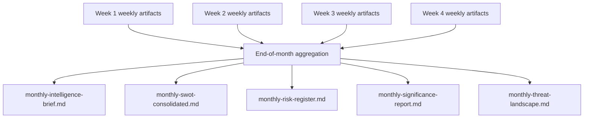

<p align="center">
  
</p>

<h1 align="center">📅 Monthly Analysis Directory — European Parliament</h1>

<p align="center">
  <strong>📊 Monthly Strategic Intelligence Briefs for EU Parliamentary Monitoring</strong><br>
  <em>🎯 YYYY-MM naming · Strategic intelligence · Long-term pattern analysis</em>
</p>

<p align="center">
  <a href="#"></a>
  <a href="#"></a>
  <a href="#"></a>
  <a href="#"></a>
</p>

**📋 Document Owner:** CEO | **📄 Version:** 1.0 | **📅 Last Updated:** 2026-03-30 (UTC)
**🏢 Owner:** Hack23 AB (Org.nr 5595347807) | **🏷️ Classification:** Public

---

## 🎯 Purpose

The `analysis/monthly/` directory stores monthly strategic intelligence briefs — the **highest-level analytical synthesis** in the EU Parliament Monitor analysis hierarchy. These aggregate all weekly analyses into strategic assessments with a 30-day horizon.

Monthly briefs serve:
1. **Strategic intelligence**: Month-over-month pattern analysis for EU political dynamics
2. **Archive anchor**: Canonical record as daily/weekly files age out
3. **Trend baseline**: Baselines against which future months are compared

---

## 📅 Naming Convention

```
analysis/monthly/
├── YYYY-MM/              ← ISO 8601 year-month (zero-padded)
│   ├── monthly-intelligence-brief.md
│   ├── monthly-swot-consolidated.md
│   ├── monthly-risk-register.md
│   ├── monthly-significance-report.md
│   └── monthly-threat-landscape.md
```

---

## 📁 Files Created Per Month

| File | Purpose | Source Data |
|------|---------|-------------|
| `monthly-intelligence-brief.md` | Executive strategic analysis; top 5 EP political developments | Weekly SWOT + risk register |
| `monthly-swot-consolidated.md` | Full SWOT synthesis with confidence decay applied | Weekly SWOT files; expired entries removed |
| `monthly-risk-register.md` | Complete risk register with trajectories (rising/stable/falling) | Weekly risk registers with trend analysis |
| `monthly-significance-report.md` | Top 10 most significant EU political events of the month | Daily significance scores for the month |
| `monthly-threat-landscape.md` | Multi-framework threat inventory (STRIDE + Attack Trees + LINDDUN) | Daily threat assessments for the month |

---

## 📊 Aggregation Flow



---

## 🗑️ Retention Policy

| Age | Status |
|-----|--------|
| 0–6 months | **Active** — regularly referenced |
| 7–12 months | **Recent** — primary historical reference |
| 13+ months | **Long-term archive** |

---

**Document Control:**
- **Path:** `/analysis/monthly/README.md`
- **Classification:** Public
- **Next Review:** 2026-06-30
