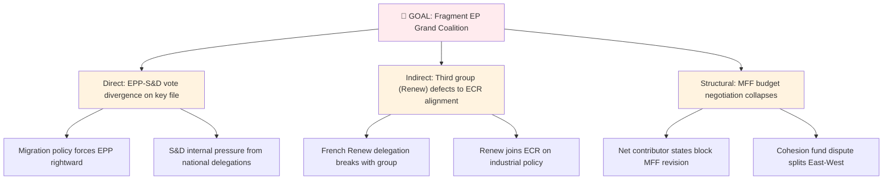
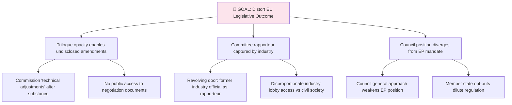

  

<h1 align="center">🎭 ISMS Threat Modeling → EU Political Threat Adaptation</h1>

  <strong>📊 Mapping STRIDE, ATT&CK, Attack Trees & LINDDUN to Democratic Process Threats</strong> 
  <em>🎯 STRIDE · MITRE ATT&CK · Attack Trees · LINDDUN · Threat Agents → EU Political Threats</em>

  
  
  
  

**📋 Document Owner:** CEO | **📄 Version:** 1.0 | **📅 Last Updated:** 2026-03-30 (UTC)
**🔄 Review Cycle:** Quarterly | **⏰ Next Review:** 2026-06-30
**🏢 Owner:** Hack23 AB (Org.nr 5595347807) | **🏷️ Classification:** Public

---

## 🎯 Purpose

This reference maps [Hack23 ISMS Threat_Modeling.md](https://github.com/Hack23/ISMS-PUBLIC/blob/main/Threat_Modeling.md) frameworks to EU Parliament Monitor's political threat analysis. The adaptation goes **beyond STRIDE** to include attack trees, LINDDUN privacy threats, PESTLE macro factors, and scenario-based threat modelling — providing a comprehensive multi-framework approach to EU democratic process threat assessment.

---

## 🎭 STRIDE → EU Political Threats

| STRIDE | Cybersecurity Threat | EU Political Threat | Example |
|:------:|---------------------|:-------------------:|---------|
| **S** | Impersonation | 🎭 **Disinformation** | Misrepresented voting records; false MEP attribution |
| **T** | Data modification | 📝 **Policy Corruption** | Undisclosed lobbying alters legislative text in trilogue |
| **R** | Denying action | 🚫 **Accountability Evasion** | MEP contradicts their roll-call vote record |
| **I** | Data exposure | 🔇 **Transparency Failure** | Trilogue documents withheld; lobbying meetings undisclosed |
| **D** | Service unavailability | ⛔ **Democratic Obstruction** | Committee quorum manipulation; amendment flooding |
| **E** | Unauthorized escalation | 👑 **Power Concentration** | Commission bypasses EP via delegated acts; Council overreach |

---

## 🌳 Attack Trees → EU Democratic Process Threats

### Attack Tree: Grand Coalition Destabilisation

### Attack Tree: Legislative Capture

---

## 🔒 LINDDUN → EU Political Privacy Threats

LINDDUN provides a systematic framework for privacy/data protection threats, applied to EU democratic processes:

| LINDDUN | Privacy Threat | EU Political Application |
|:-------:|---------------|-------------------------|
| **L** — Linkability | Linking data to identify patterns | Cross-referencing MEP declarations with voting patterns to infer undue influence |
| **I** — Identifiability | Identifying individuals from data | Petitioners' personal data exposed in PETI committee documents |
| **N** — Non-repudiation | Inability to deny actions | Roll-call voting records as accountability tool (positive use) |
| **D** — Detectability | Detecting data existence | OLAF investigation targets inferred from EP question patterns |
| **D** — Disclosure | Revealing sensitive information | MEP financial declarations revealing conflicts of interest |
| **U** — Unawareness | Users unaware of data processing | Citizens unaware that EP petition data is processed for political analysis |
| **N** — Non-compliance | Failure to follow regulations | EP data processing not compliant with GDPR obligations |

---

## 👥 Threat Agents → EU Political Actors

| ISMS Agent Type | EU Political Actor | Characteristics |
|:--------------:|:------------------:|-----------------|
| **External attacker** | Foreign state actor | Disinformation campaigns targeting EP elections (Russia, China) |
| **Insider threat** | Political group member acting against group interest | MEP defecting on key votes; leaking trilogue documents |
| **Nation-state** | EU Member State government | Council position undermining EP legislative position |
| **Organised crime** | Corporate/industry lobby | Regulatory capture through disproportionate access |
| **Competitor** | Opposition political group | Exploiting grand coalition fractures for alternative majority |
| **Hacktivist** | Transparency activist | Leaking confidential trilogue documents (democratic tension) |

---

## 🔗 Related Documents

- [methodologies/political-threat-framework.md](../methodologies/political-threat-framework.md) — Full threat framework
- [templates/threat-analysis.md](../templates/threat-analysis.md) — Threat analysis template
- [THREAT_MODEL.md](../../THREAT_MODEL.md) — Platform-level threat model

---

**Document Control:**
- **Path:** `/analysis/reference/isms-threat-modeling-adaptation.md`
- **Source ISMS Doc:** [Threat_Modeling.md](https://github.com/Hack23/ISMS-PUBLIC/blob/main/Threat_Modeling.md)
- **Classification:** Public
- **Next Review:** 2026-06-30
