<!-- SPDX-FileCopyrightText: 2024-2026 Hack23 AB -->
<!-- SPDX-License-Identifier: Apache-2.0 -->

  

<h1 align="center">📋 EU Parliament Monitor — Analysis Templates</h1>

  <strong>📊 Eight Structured Intelligence Templates for AI-Driven Political Analysis</strong> 
  <em>🎯 Classification · Risk · Threat · SWOT · Stakeholder · Significance · Synthesis · Per-File</em>

  
  
  
  

**📋 Document Owner:** CEO | **📄 Version:** 2.0 | **📅 Last Updated:** 2026-03-31 (UTC)
**🔄 Review Cycle:** Quarterly | **⏰ Next Review:** 2026-06-30
**🏢 Owner:** Hack23 AB (Org.nr 5595347807) | **🏷️ Classification:** Public

---

## 📚 Architecture Documentation Map

| Document | Focus | Description | Documentation Link |
| --- | --- | --- | --- |
| **[Architecture](../../ARCHITECTURE.md)** | 🏛️ Architecture | C4 model showing current system structure | [View Source](https://github.com/Hack23/euparliamentmonitor/blob/main/ARCHITECTURE.md) |
| **[Security Architecture](../../SECURITY_ARCHITECTURE.md)** | 🛡️ Security | Security controls and compliance mapping | [View Source](https://github.com/Hack23/euparliamentmonitor/blob/main/SECURITY_ARCHITECTURE.md) |
| **[Workflows](../../WORKFLOWS.md)** | ⚙️ DevOps | CI/CD pipeline documentation | [View Source](https://github.com/Hack23/euparliamentmonitor/blob/main/WORKFLOWS.md) |
| **[Analysis Directory](../README.md)** | 🔬 Analysis | Analysis directory overview and structure | [View Source](https://github.com/Hack23/euparliamentmonitor/blob/main/analysis/README.md) |
| **[AI Analysis Guide](../methodologies/ai-driven-analysis-guide.md)** | 🤖 Methodology | Per-file analysis protocol and quality gates | [View Source](https://github.com/Hack23/euparliamentmonitor/blob/main/analysis/methodologies/ai-driven-analysis-guide.md) |
| **[Threat Framework](../methodologies/political-threat-framework.md)** | 🎭 Methodology | Political Threat Landscape (6 dimensions) | [View Source](https://github.com/Hack23/euparliamentmonitor/blob/main/analysis/methodologies/political-threat-framework.md) |
| **[Risk Methodology](../methodologies/political-risk-methodology.md)** | ⚠️ Methodology | Likelihood × Impact scoring for EP events | [View Source](https://github.com/Hack23/euparliamentmonitor/blob/main/analysis/methodologies/political-risk-methodology.md) |
| **[SWOT Framework](../methodologies/political-swot-framework.md)** | 💼 Methodology | Evidence-based political SWOT quadrants | [View Source](https://github.com/Hack23/euparliamentmonitor/blob/main/analysis/methodologies/political-swot-framework.md) |
| **[Classification Guide](../methodologies/political-classification-guide.md)** | 🏷️ Methodology | 7-dimension EP event classification | [View Source](https://github.com/Hack23/euparliamentmonitor/blob/main/analysis/methodologies/political-classification-guide.md) |
| **[Style Guide](../methodologies/political-style-guide.md)** | ✍️ Methodology | Editorial and analytical style standards | [View Source](https://github.com/Hack23/euparliamentmonitor/blob/main/analysis/methodologies/political-style-guide.md) |

---

## 🔐 ISMS Policy Alignment

These analysis templates implement structured intelligence production mandated by Hack23 AB's ISMS framework:

| **ISMS Policy** | **Template Implementation** |
| --- | --- |
| [🛠️ Secure Development Policy](https://github.com/Hack23/ISMS-PUBLIC/blob/main/Secure_Development_Policy.md) | Structured templates enforce consistent analytical output; anti-pattern warnings prevent quality degradation |
| [📝 Change Management](https://github.com/Hack23/ISMS-PUBLIC/blob/main/Change_Management.md) | Template versioning, quarterly review cycle, document metadata tracking |
| [🔐 Information Security Policy](https://github.com/Hack23/ISMS-PUBLIC/blob/main/Information_Security_Policy.md) | Classification levels (PUBLIC/SENSITIVE/RESTRICTED) in every analysis output |
| [🔓 Open Source Policy](https://github.com/Hack23/ISMS-PUBLIC/blob/main/Open_Source_Policy.md) | SPDX license headers, REUSE compliance, transparent methodology documentation |
| [🤝 Third Party Management](https://github.com/Hack23/ISMS-PUBLIC/blob/main/Third_Party_Management.md) | All data sourced from official European Parliament MCP Server; evidence citations required |
| [🔍 Vulnerability Management](https://github.com/Hack23/ISMS-PUBLIC/blob/main/Vulnerability_Management.md) | Threat analysis template identifies political risks; risk assessment quantifies exposure |

### Compliance Framework Mapping

| **Framework** | **Version** | **Relevant Controls** | **Template Implementation** |
| --- | --- | --- | --- |
| **ISO 27001** | 2022 | A.5.10, A.8.3 | Information classification via political-classification template |
| **NIST CSF** | 2.0 | ID.RA, ID.RM | Risk identification and management via risk-assessment template |
| **CIS Controls** | v8.1 | 17.1 | Threat intelligence production via threat-analysis template |
| **EU CRA** | 2024 | Art. 10, Art. 11 | Transparency and vulnerability disclosure via stakeholder-impact template |

---

## 🎯 Purpose

This directory contains **eight reusable analysis templates** that AI agents fill when analysing European Parliament data. Each template enforces a specific analytical framework, requires evidence citations from EP MCP data, and produces structured intelligence that feeds into downstream article generation.

Templates are **not** standalone outputs. They form a **composable intelligence pipeline** — individual templates feed into the daily synthesis, which aggregates into weekly and monthly intelligence reports. The per-file analysis template is the most frequently used: every downloaded EP MCP data file receives a comprehensive analysis using this template.

**Critical mandates:**

- 🔍 AI agents must **READ actual EP data** and produce original analysis — never scripted boilerplate
- 📎 Every claim requires an **evidence citation** (EP procedure ID, adopted text reference, or MCP data file path)
- 📊 All outputs require **structured tables + colour-coded Mermaid diagrams** — plain prose alone is rejected
- 🎯 Every analysis must pass a **minimum 7.0/10 quality gate** before consumption by article generators

---

## 🔄 Template Usage Workflow

The following diagram shows the end-to-end pipeline from EP MCP data download through template-driven analysis to final publication:

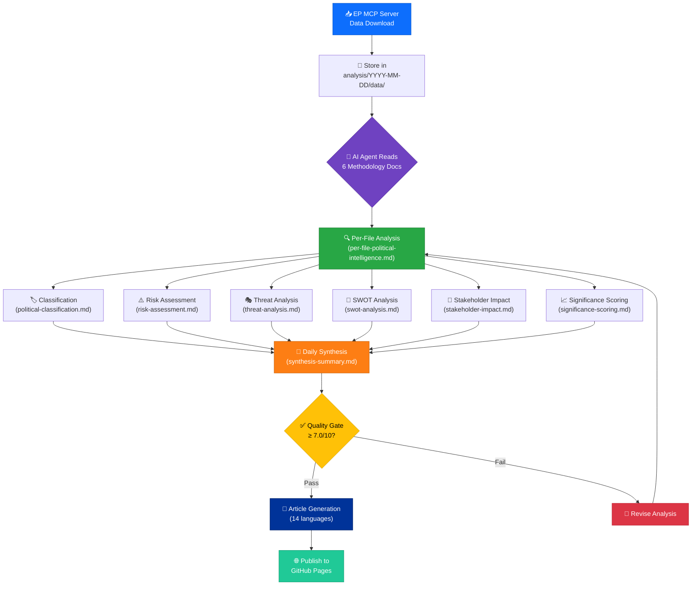

---

## 🗺️ Template Interconnection Map

All eight templates form an integrated intelligence network. The per-file analysis template consumes outputs from the six specialist templates, and the synthesis template aggregates all per-file analyses:

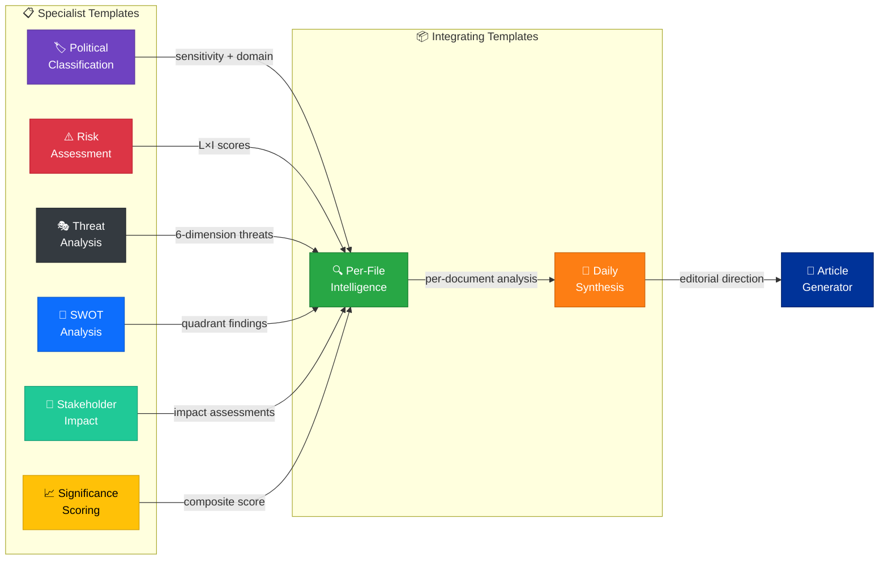

---

## 📑 Master Template Catalog

| # | Template | Purpose | Key Sections | MCP Data Sources | Output Format | Priority |
|:-:|----------|---------|-------------|------------------|---------------|:--------:|
| 1 | [🏷️ Political Classification](political-classification.md) | 7-dimension EP event classification (sensitivity, domain, urgency, scope, actor, impact, temporal) | Sensitivity Level, Policy Domain, Urgency Level, Geographic Scope, Actor Mapping, Impact Vector, Temporal Window | `get_plenary_sessions`, `get_procedures`, `get_adopted_texts`, `get_events` | Metadata table + checkbox dimensions + colour-coded Mermaid radar | 🔴 HIGH |
| 2 | [⚠️ Risk Assessment](risk-assessment.md) | Quantified political risk using 5×5 Likelihood × Impact matrix across 6 risk categories | Risk Context, Risk Register (6 categories), Heat Map, Mitigation Strategies, Monitoring Indicators | `get_voting_records`, `track_legislation`, `analyze_coalition_dynamics`, `detect_voting_anomalies` | Risk register table + L×I heat map Mermaid + trend arrows | 🔴 HIGH |
| 3 | [🎭 Threat Analysis](threat-analysis.md) | Multi-framework political threat assessment: Political Threat Landscape (6D) + Diamond Model + Attack Trees + PESTLE + Scenario Planning + Kill Chain | 6 Threat Dimensions, Diamond Model Profiles, Attack Tree Decomposition, PESTLE Matrix, Scenario Projections, Kill Chain Stages | `analyze_coalition_dynamics`, `detect_voting_anomalies`, `compare_political_groups`, `get_mep_declarations` | Dimension tables + severity ratings + trend indicators + Mermaid threat landscape | 🔴 HIGH |
| 4 | [💼 SWOT Analysis](swot-analysis.md) | Evidence-based political SWOT quadrant assessment for EU democratic landscape | SWOT Context, Strengths, Weaknesses, Opportunities, Threats, Strategic Implications, Cross-Quadrant Analysis | `get_adopted_texts`, `get_voting_records`, `get_procedures`, `compare_political_groups` | 4-quadrant tables with evidence columns + Mermaid quadrant chart | 🟡 MEDIUM |
| 5 | [👥 Stakeholder Impact](stakeholder-impact.md) | 7-lens stakeholder impact assessment across EU institutional actors and civil society | Assessment Context, 7 Stakeholder Groups (Council, Commission, EP Groups, National Parliaments, Civil Society, Industry, Citizens), Cross-Impact Matrix | `get_meps`, `get_committee_info`, `analyze_country_delegation`, `assess_mep_influence` | Stakeholder tables with impact direction + confidence labels + Mermaid impact diagram | 🟡 MEDIUM |
| 6 | [📈 Significance Scoring](significance-scoring.md) | 5-dimension composite score (0–10) for publication prioritisation decisions | Event Context, 5 Scoring Dimensions (Parliamentary Significance, Policy Impact, Institutional Relevance, Public Interest, Temporal Urgency), Composite Score, Publish Decision | `get_adopted_texts`, `get_plenary_sessions`, `get_procedures`, `get_events` | Scoring table (5 dimensions) + weighted composite + publish/hold/skip decision | 🔴 HIGH |
| 7 | [🧩 Synthesis Summary](synthesis-summary.md) | Daily intelligence synthesis aggregating all per-file analyses into editorial direction | Synthesis Context, Headline Intelligence, SWOT Summary, Risk Overview, Threat Dashboard, Stakeholder Map, Forward Indicators, Editorial Recommendations | All MCP tools (aggregated from per-file outputs) | Dashboard tables + Mermaid intelligence overview + 3 editorial decision points | 🔴 HIGH |
| 8 | [🔍 Per-File Intelligence](per-file-political-intelligence.md) | Deep per-document AI analysis — the **most used template** (every downloaded EP data file receives this) | Document Identity, Executive Summary, Political Classification, SWOT (Grand Coalition + Opposition), Risk Matrix, Threat Landscape, Stakeholder Assessment, Significance Score, Forward Indicators | Depends on document type (see [Document-Type Matrix](#-template-selection-by-mcp-data-category)) | Comprehensive `.analysis.md` file stored alongside data file | 🔴 CRITICAL |

---

## 📄 Template Details

### 1. 🏷️ Political Classification (`political-classification.md`)

**Produces:** A structured 7-dimension classification of an EP political event, determining sensitivity, policy domain, urgency, geographic scope, key actors, impact vectors, and temporal relevance.

**When to use:** As the **first step** in any analysis — classification determines which subsequent templates are required and at what depth. Every significant EP event must be classified before risk, threat, or SWOT analysis proceeds.

| Section | Content | Required? |
|---------|---------|:---------:|
| Document Metadata | Classification ID, event date, EP reference, classifier workflow | ✅ |
| Sensitivity Level | PUBLIC / SENSITIVE / RESTRICTED with rationale | ✅ |
| Policy Domain | Primary + secondary EP committee codes (ECON, LIBE, ENVI, etc.) | ✅ |
| Urgency Level | ROUTINE / ELEVATED / URGENT / CRITICAL | ✅ |
| Geographic Scope | EU-wide / Regional / National / Bilateral | ✅ |
| Actor Mapping | Key MEPs, political groups, committees involved | ✅ |
| Impact Vector | Legislative / Regulatory / Political / Economic | ✅ |
| Temporal Window | Short-term / Medium-term / Long-term horizon | ✅ |

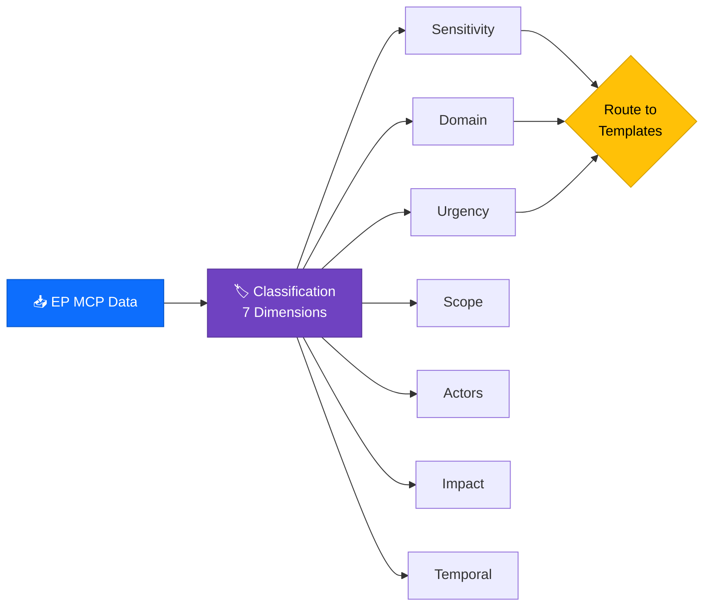

**Methodology:** [political-classification-guide.md](../methodologies/political-classification-guide.md)

---

### 2. ⚠️ Risk Assessment (`risk-assessment.md`)

**Produces:** A quantified risk register using a 5×5 Likelihood × Impact matrix across six political risk categories: Coalition Risk, Legislative Risk, Institutional Risk, Reputational Risk, Economic Risk, and Democratic Risk.

**When to use:** For events classified as ELEVATED urgency or above, or when legislative procedures enter critical stages (committee vote, plenary vote, trilogue). Also triggered by voting anomalies or coalition shift signals.

| Section | Content | Required? |
|---------|---------|:---------:|
| Risk Context | Analysis period, political context, overall risk level | ✅ |
| Risk Register | 6 categories with L×I scores (1–5 each) | ✅ |
| Heat Map | Colour-coded 5×5 Mermaid matrix | ✅ |
| Mitigation Strategies | Recommended monitoring and response actions | ✅ |
| Monitoring Indicators | Leading indicators to track risk trajectory | ✅ |

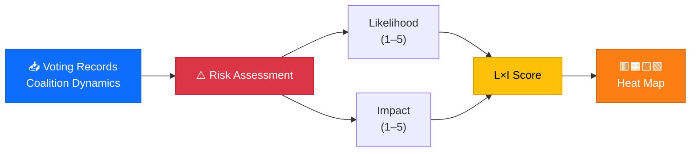

**Methodology:** [political-risk-methodology.md](../methodologies/political-risk-methodology.md)

---

### 3. 🎭 Threat Analysis (`threat-analysis.md`)

**Produces:** A multi-framework political threat assessment using the **Political Threat Landscape** as the primary model — a purpose-built 6-dimension framework for EU democratic threats. Additional frameworks (Diamond Model, Attack Trees, PESTLE, Scenario Planning, Kill Chain) layer on for threats rated MODERATE or above.

> **⚠️ Important:** This template uses **Political Threat Landscape** analysis — NOT STRIDE, DREAD, or PASTA. Those frameworks are designed for software security, not political intelligence. The 6 dimensions are purpose-built for EU parliamentary democracy.

**When to use:** For all periodic analysis cycles (daily, weekly, monthly) and for events that trigger coalition shifts, transparency concerns, or democratic erosion signals.

**The 6 Political Threat Landscape Dimensions:**

| # | Dimension | Focus Area | Severity Scale |
|:-:|-----------|------------|:--------------:|
| 1 | 🔄 Coalition Shifts | Voting pattern changes, alliance realignments, political group defections | 1–5 |
| 2 | 🔍 Transparency Deficit | Disclosure gaps, declaration irregularities, committee opacity | 1–5 |
| 3 | ↩️ Policy Reversal | Adopted position reversals, legislative rollbacks, commitment abandonment | 1–5 |
| 4 | 🏛️ Institutional Pressure | Inter-institutional tensions, competence disputes, procedural manipulation | 1–5 |
| 5 | 🚧 Legislative Obstruction | Procedure delays, amendment flooding, committee bottlenecks | 1–5 |
| 6 | 🗳️ Democratic Erosion | Participation decline, mandate violations, electoral integrity concerns | 1–5 |

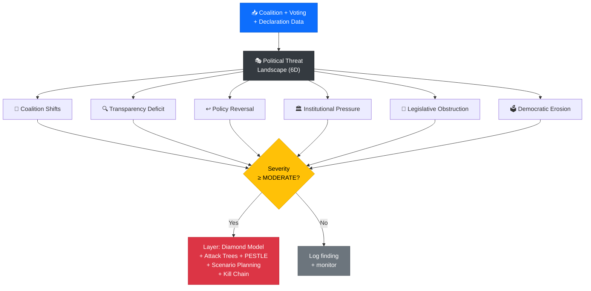

**Methodology:** [political-threat-framework.md](../methodologies/political-threat-framework.md)

---

### 4. 💼 SWOT Analysis (`swot-analysis.md`)

**Produces:** An evidence-based political SWOT assessment for the EU democratic landscape, with separate quadrants for Grand Coalition and Opposition dynamics. Every entry requires an EP document reference — opinion-only entries are prohibited.

**When to use:** For strategic landscape assessment during periodic analysis cycles, and for events with cross-party implications or institutional significance.

| Section | Content | Required? |
|---------|---------|:---------:|
| SWOT Context | Analysis period, political context, scope | ✅ |
| Strengths | Positive factors with EP evidence citations | ✅ |
| Weaknesses | Negative internal factors with evidence | ✅ |
| Opportunities | External positive developments with evidence | ✅ |
| Threats | External negative developments with evidence | ✅ |
| Strategic Implications | Cross-quadrant analysis and recommendations | ✅ |

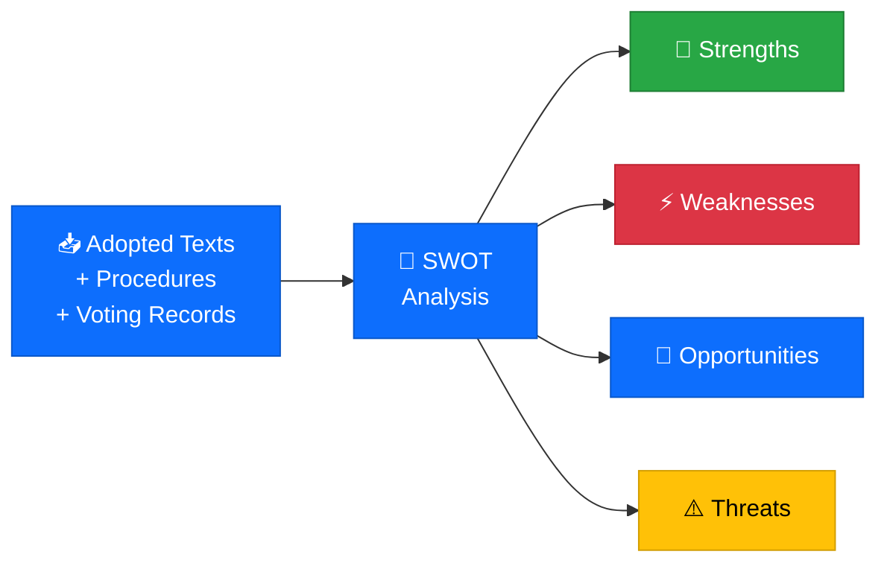

**Methodology:** [political-swot-framework.md](../methodologies/political-swot-framework.md)

---

### 5. 👥 Stakeholder Impact (`stakeholder-impact.md`)

**Produces:** A 7-lens stakeholder impact assessment covering all major EU institutional actors and civil society groups. Each stakeholder receives an impact rating (HIGH/MEDIUM/LOW/NONE), direction (positive/negative/neutral), and confidence level.

**When to use:** For legislative events affecting multiple EU actors, committee decisions with cross-institutional implications, and adopted texts with broad societal impact.

| Section | Content | Required? |
|---------|---------|:---------:|
| Assessment Context | Event reference, scope, analysis date | ✅ |
| European Council / Council of the EU | Impact, direction, evidence | ✅ |
| European Commission | Impact, direction, evidence | ✅ |
| EP Political Groups | Per-group impact assessment | ✅ |
| National Parliaments | Subsidiarity and transposition impact | ✅ |
| Civil Society / NGOs | Democratic participation impact | ✅ |
| Industry / Business | Regulatory and economic impact | ✅ |
| Citizens / Public | Direct citizen impact assessment | ✅ |

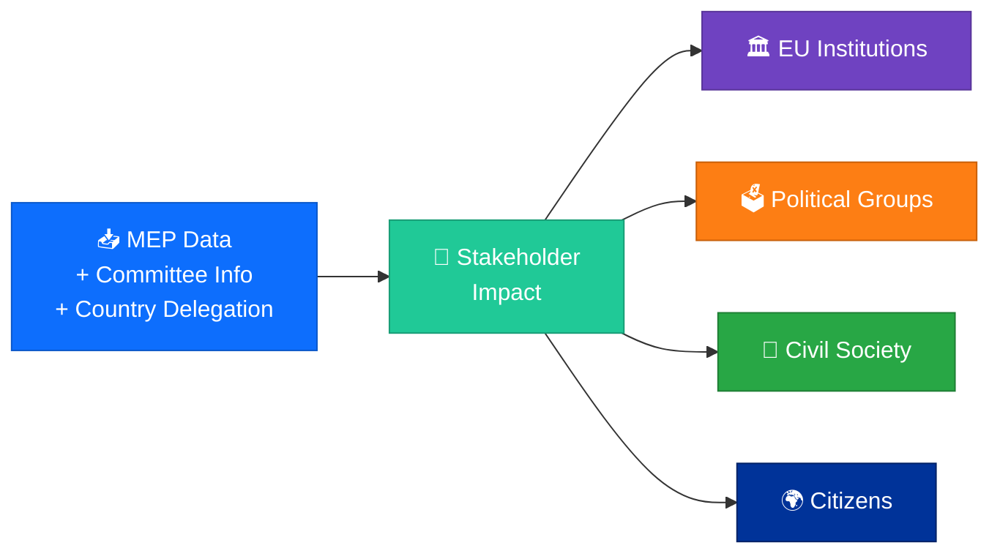

**Methodology:** Template is self-contained; cross-reference [ai-driven-analysis-guide.md](../methodologies/ai-driven-analysis-guide.md) for quality standards.

---

### 6. 📈 Significance Scoring (`significance-scoring.md`)

**Produces:** A 5-dimension composite score (0–10) that determines publication priority. Scores drive the editorial decision: **PUBLISH** (≥7.0), **HOLD** (5.0–6.9), or **SKIP** (<5.0).

**When to use:** For every event under consideration for article generation. Significance scoring is the **gatekeeper** between analysis and publication — no article should be generated for events scoring below 7.0.

| Section | Content | Required? |
|---------|---------|:---------:|
| Event Context | Score ID, event name, EP reference, classification ID | ✅ |
| Parliamentary Significance (0–10) | Legislative weight, procedural importance | ✅ |
| Policy Impact (0–10) | Regulatory and policy change magnitude | ✅ |
| Institutional Relevance (0–10) | Cross-institutional importance | ✅ |
| Public Interest (0–10) | Citizen engagement and media attention potential | ✅ |
| Temporal Urgency (0–10) | Time sensitivity and news cycle alignment | ✅ |
| Composite Score | Weighted average with publish/hold/skip decision | ✅ |

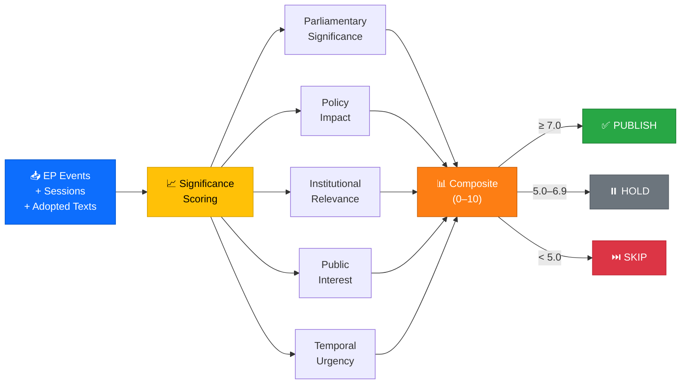

**Methodology:** Scoring dimensions defined in [ai-driven-analysis-guide.md](../methodologies/ai-driven-analysis-guide.md).

---

### 7. 🧩 Synthesis Summary (`synthesis-summary.md`)

**Produces:** A daily intelligence synthesis that aggregates all per-file analyses into a single editorial briefing. This is the template consumed directly by article generators to determine narrative direction, headline selection, and publication priority across all 14 languages.

**When to use:** Once per analysis cycle (daily, weekly, or monthly) after all per-file analyses are complete. The synthesis serves as the **single source of truth** for downstream article generation.

| Section | Content | Required? |
|---------|---------|:---------:|
| Synthesis Context | Synthesis ID, analysis date, document count, data sources | ✅ |
| Headline Intelligence | Top 3–5 findings ranked by significance score | ✅ |
| Aggregated SWOT Summary | Cross-document strength/weakness/opportunity/threat counts | ✅ |
| Risk Overview | Risk category ranges with trend arrows | ✅ |
| Threat Dashboard | Multi-framework summary across all documents | ✅ |
| Stakeholder Map | Aggregated stakeholder impacts with direction indicators | ✅ |
| Forward Indicators | 3 editorial decision points for the next analysis cycle | ✅ |
| Editorial Recommendations | Narrative direction and article type suggestions | ✅ |

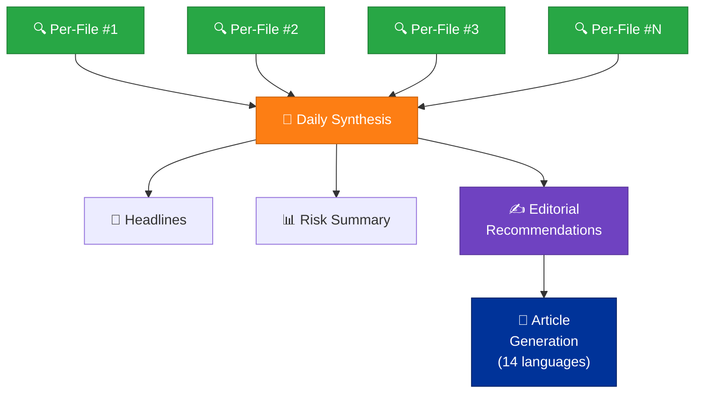

**Methodology:** Aggregation rules defined in [ai-driven-analysis-guide.md](../methodologies/ai-driven-analysis-guide.md).

---

### 8. 🔍 Per-File Political Intelligence (`per-file-political-intelligence.md`)

**Produces:** A comprehensive per-document analysis covering all six specialist frameworks in a single integrated output. This is the **most used template** — every downloaded EP MCP data file receives a `.analysis.md` file generated from this template, stored alongside the data file.

**When to use:** For **every** EP MCP data file downloaded during an analysis cycle. The per-file template is mandatory: no data file should exist without a corresponding analysis.

| Section | Content | Required? |
|---------|---------|:---------:|
| Document Identity | EP doc ref, type, date, committee, MCP tool source | ✅ |
| Executive Summary | 3–5 sentence intelligence summary with confidence labels | ✅ |
| Political Classification | Inline 7-dimension classification (from classification template) | ✅ |
| SWOT Assessment | Grand Coalition + Opposition quadrant analysis | ✅ |
| Risk Matrix | Likelihood × Impact scores for applicable risk categories | ✅ |
| Threat Landscape | Applicable dimensions from 6D Political Threat Landscape | ✅ |
| Stakeholder Assessment | 7-lens impact assessment for affected stakeholder groups | ✅ |
| Significance Score | 5-dimension composite with publish decision | ✅ |
| Forward Indicators | Timeline-based monitoring metrics | ✅ |

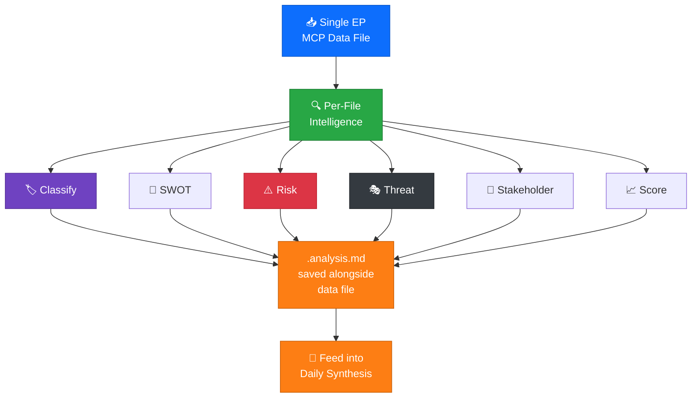

**Methodology:** Full per-file protocol defined in [ai-driven-analysis-guide.md](../methodologies/ai-driven-analysis-guide.md).

---

## 📊 Template Selection by MCP Data Category

Use this matrix to determine which templates apply to each EP data category. **Per-File Intelligence** always applies — additional specialist templates are triggered by the data type:

| MCP Data Category | Directory | Per-File | Classification | Risk | Threat | SWOT | Stakeholder | Significance |
|-------------------|-----------|:--------:|:--------------:|:----:|:------:|:----:|:-----------:|:------------:|
| **Adopted texts** (legislative resolutions) | `adopted-texts/` | ✅ | ✅ | ✅ | ⬜ | ⬜ | ⬜ | ✅ |
| **Committee documents** (reports, opinions) | `committee-documents/` | ✅ | ⬜ | ✅ | ⬜ | ⬜ | ✅ | ⬜ |
| **Legislative procedures** | `procedures/` | ✅ | ⬜ | ✅ | ⬜ | ✅ | ⬜ | ⬜ |
| **Plenary votes** (roll-call) | `votes/` | ✅ | ✅ | ⬜ | ✅ | ✅ | ⬜ | ⬜ |
| **Speeches** (plenary debates) | `speeches/` | ✅ | ⬜ | ⬜ | ⬜ | ⬜ | ✅ | ✅ |
| **Parliamentary questions** | `questions/` | ✅ | ✅ | ⬜ | ⬜ | ⬜ | ⬜ | ✅ |
| **Events** (hearings, conferences) | `events/` | ✅ | ⬜ | ✅ | ⬜ | ⬜ | ⬜ | ✅ |
| **MEP profiles** | `meps/` | ✅ | ✅ | ⬜ | ⬜ | ⬜ | ✅ | ⬜ |
| **MEP declarations** | `declarations/` | ✅ | ⬜ | ✅ | ✅ | ⬜ | ⬜ | ⬜ |
| **Plenary documents** | `plenary-documents/` | ✅ | ✅ | ✅ | ✅ | ✅ | ✅ | ✅ |
| **External documents** (Commission, Council) | `external-documents/` | ✅ | ⬜ | ✅ | ⬜ | ✅ | ⬜ | ⬜ |
| **World Bank data** | `world-bank/` | ✅ | ⬜ | ✅ | ⬜ | ✅ | ⬜ | ⬜ |

> **Legend:** ✅ = Primary template for this data type | ⬜ = Optional / use if relevant

---

## 🔀 Template Composition Pipeline

Analysis templates compose into a temporal aggregation pipeline. Per-file analyses feed daily synthesis, which aggregates into weekly intelligence, then monthly strategic reports:

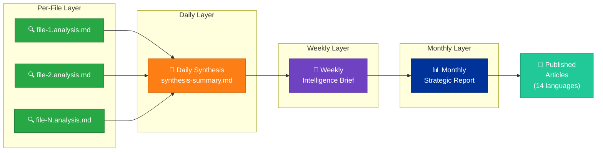

| Pipeline Stage | Input | Output | Frequency | Storage Location |
|----------------|-------|--------|-----------|------------------|
| **Per-File Analysis** | Single EP MCP data file | `{id}.analysis.md` alongside data | Per file download | `analysis/YYYY-MM-DD/{slug}/data/` |
| **Daily Synthesis** | All per-file analyses from one day | `synthesis-summary.md` | Daily | `analysis/YYYY-MM-DD/{slug}/` |
| **Weekly Brief** | 5–7 daily syntheses | Weekly intelligence report | Weekly | `analysis/daily/` |
| **Monthly Report** | 4–5 weekly briefs | Monthly strategic report | Monthly | `analysis/monthly/` |

---

## ✅ Quality Requirements

All template outputs must meet the quality gate defined in the [AI-Driven Analysis Guide](../methodologies/ai-driven-analysis-guide.md):

| Requirement | Threshold | Enforcement |
|-------------|-----------|-------------|
| **Overall Quality Score** | ≥ 7.0 / 10 | Self-assessed by AI agent; failed analyses must be revised |
| **Evidence Citations** | 100% of claims | Every factual assertion cites an EP document, MCP data file, or named source |
| **Structured Output** | Tables + Mermaid diagrams | Plain prose without structure is rejected |
| **Confidence Labels** | All assertions | HIGH / MEDIUM / LOW confidence on every finding |
| **Mermaid Diagrams** | Colour-coded with `style` directives | Unlabelled or unstyled diagrams are rejected |
| **Anti-Boilerplate** | Zero tolerance | Generic statements without data-specific analysis trigger revision |
| **Metadata Completeness** | All `[REQUIRED]` fields filled | Placeholder text in output is automatically rejected |
| **Template Compliance** | Exact section structure preserved | Sections must not be added, removed, or reordered |

### Quality Score Dimensions

The 7.0/10 quality gate is assessed across five dimensions:

1. **Analytical Depth** (weight: 30%) — Does the analysis go beyond surface-level observations?
2. **Evidence Quality** (weight: 25%) — Are citations specific (EP doc IDs, MCP data refs) rather than vague?
3. **Structural Compliance** (weight: 20%) — Does the output follow the template exactly?
4. **Insight Originality** (weight: 15%) — Does the analysis produce novel intelligence, not regurgitate input data?
5. **Presentation Quality** (weight: 10%) — Are Mermaid diagrams colour-coded and tables properly formatted?

---

## 🚫 Anti-Pattern Warnings

Templates enforce strict anti-patterns to prevent low-quality intelligence production:

| ❌ Anti-Pattern | Why It Fails | ✅ Correct Approach |
|----------------|-------------|-------------------|
| **Generic scripted prose** ("Coalition stability appears maintained") | Indicates the AI has NOT read the actual data | Cite specific voting records, coalition dynamics data, or anomaly detection outputs |
| **Using STRIDE, DREAD, or PASTA** for threat analysis | These are software security frameworks, not political intelligence models | Use **Political Threat Landscape** (6 dimensions: Coalition Shifts, Transparency Deficit, Policy Reversal, Institutional Pressure, Legislative Obstruction, Democratic Erosion) |
| **Placeholder text in output** (`[REQUIRED]`, `[TBD]`, `[TODO]`) | Indicates incomplete analysis | Fill every required field with actual data-driven content |
| **Unstyled Mermaid diagrams** | Missing colour coding makes diagrams unreadable and non-compliant | Add `style` directives with hex colours to every Mermaid node |
| **Opinion without evidence** ("The EU faces challenges") | Unsubstantiated claims violate evidence-based methodology | Every claim must cite: EP procedure ID, adopted text ref, or MCP data path |
| **Scores without dimension breakdowns** (e.g., "Risk: Medium") | Undimensioned scores are unverifiable and unreproducible | Provide full breakdown: L×I for risk, 5-dimension for significance, 6D for threat |
| **Copy-paste from previous analyses** | Recycled content misses document-specific intelligence | Analyse each data file independently; cross-reference prior work but never copy |
| **Missing confidence labels** | Without confidence tags, consumers cannot assess reliability | Tag every assertion: `[HIGH confidence]`, `[MEDIUM confidence]`, or `[LOW confidence]` |

---

## 📰 Workflow-Specific Template Routing

Each agentic workflow uses a **tailored subset** of templates. This ensures every article type produces analytics unique to its focus area:

```mermaid
flowchart TD
    subgraph "📋 8 Templates"
        T1["🏷️ Classification"]
        T2["⚠️ Risk Assessment"]
        T3["🎭 Threat Analysis"]
        T4["💼 SWOT"]
        T5["👥 Stakeholder Impact"]
        T6["📈 Significance"]
        T7["🧩 Synthesis"]
        T8["🔍 Per-File Intel"]
    end

    subgraph "📰 Workflows"
        BK["🔴 Breaking"]
        MO["📋 Motions"]
        PR["📜 Propositions"]
        CR["🏛️ Committee"]
        WA["📅 Week Ahead"]
        WR["📊 Weekly Review"]
        MA["📆 Month Ahead"]
        MR["📈 Monthly Review"]
    end

    T1 --> BK & MO & WR
    T2 --> BK & CR & PR & MR
    T3 --> MO & MA & MR
    T4 --> PR & WA & WR & MA & MR
    T5 --> CR & MO & MA
    T6 --> BK & WA & WR
    T7 --> WR & MR
    T8 --> BK & MO & PR & CR & WA & WR & MA & MR

    style BK fill:#dc3545,stroke:#b02a37,color:#fff
    style MO fill:#fd7e14,stroke:#ca6510,color:#fff
    style PR fill:#ffc107,stroke:#cc9a06,color:#000
    style CR fill:#198754,stroke:#146c43,color:#fff
    style WA fill:#0d6efd,stroke:#0a58ca,color:#fff
    style WR fill:#6f42c1,stroke:#59359a,color:#fff
    style MA fill:#d63384,stroke:#ab296a,color:#fff
    style MR fill:#0dcaf0,stroke:#0aa2c0,color:#000
    style T8 fill:#20c997,stroke:#1aa179,color:#fff
```

### Template Coverage Per Workflow

| Workflow | Primary Templates | Unique Analytics Produced |
|----------|------------------|--------------------------|
| **Breaking News** | Classification + Risk + Significance + Per-File | ⚡ Real-time urgency rating; today-only significance scoring; breaking alert classification |
| **Motions** | Classification + Threat + Stakeholder + Per-File | 🗳️ Per-resolution threat dimension mapping; political group impact analysis; defection tracking |
| **Propositions** | Risk + SWOT + Per-File | 📜 Legislative pipeline risk scoring; opportunity analysis for upcoming procedures |
| **Committee Reports** | Risk + Classification + Stakeholder + Per-File | 🏛️ Committee-level stakeholder mapping; document classification by committee domain |
| **Week Ahead** | SWOT + Risk + Significance + Per-File | 📅 Forward-looking SWOT for upcoming agenda; vote risk pre-assessment |
| **Weekly Review** | Classification + SWOT + Significance + Synthesis + Per-File | 📊 Outcome classification; week-level SWOT synthesis; performance metrics |
| **Month Ahead** | SWOT + Threat + Stakeholder + Per-File | 📆 Strategic SWOT outlook; emerging threat landscape; institutional stakeholder analysis |
| **Monthly Review** | ALL templates | 📈 Comprehensive analysis across all 8 templates; inter-temporal trend synthesis |

> **Per-File Intelligence** (`per-file-political-intelligence.md`) is applied to **every workflow** because every downloaded MCP data file receives individual deep analysis.

---

## 🔗 Related Documentation

| Document | Relationship |
|----------|-------------|
| [📖 Analysis Directory README](../README.md) | Parent directory overview; describes full analysis directory structure |
| [🤖 AI-Driven Analysis Guide](../methodologies/ai-driven-analysis-guide.md) | Master guide for per-file analysis protocol, quality gates, and anti-patterns |
| [🏷️ Classification Guide](../methodologies/political-classification-guide.md) | Full methodology for 7-dimension political event classification |
| [⚠️ Risk Methodology](../methodologies/political-risk-methodology.md) | Full methodology for 5×5 Likelihood × Impact political risk scoring |
| [🎭 Threat Framework](../methodologies/political-threat-framework.md) | Full methodology for 6-dimension Political Threat Landscape + layered frameworks |
| [💼 SWOT Framework](../methodologies/political-swot-framework.md) | Full methodology for evidence-based political SWOT quadrant analysis |
| [✍️ Style Guide](../methodologies/political-style-guide.md) | Editorial and analytical writing standards for EP intelligence |
| [📐 Architecture](../../ARCHITECTURE.md) | System architecture context for the analysis pipeline |
| [🔄 Workflows](../../WORKFLOWS.md) | CI/CD workflows that trigger and consume analysis template outputs |
| [🛡️ Security Architecture](../../SECURITY_ARCHITECTURE.md) | Security controls governing analysis data handling |

---

## 📝 Document Control

| Field | Value |
|-------|-------|
| **Document ID** | `TMPL-README-001` |
| **Title** | Analysis Templates — Directory Documentation |
| **Owner** | CEO |
| **Version** | 2.0 |
| **Classification** | Public |
| **Created** | 2026-03-30 |
| **Last Updated** | 2026-03-31 |
| **Review Cycle** | Quarterly |
| **Next Review** | 2026-06-30 |
| **Organisation** | Hack23 AB (Org.nr 5595347807) |
| **Approved By** | CEO |

---

  <em>📋 EU Parliament Monitor Analysis Templates — Structured Intelligence for Democratic Transparency</em> 
  <strong>© 2024-2026 Hack23 AB</strong> — <a href="https://hack23.com">hack23.com</a>

