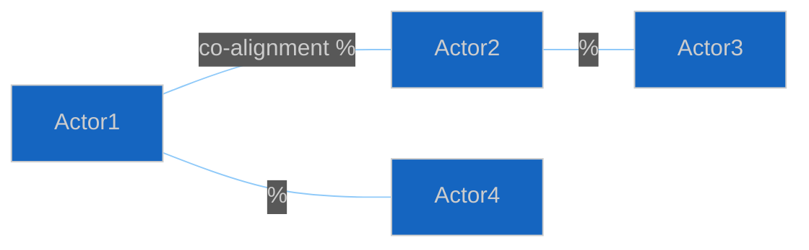

<!-- SPDX-FileCopyrightText: 2024-2026 Hack23 AB -->
<!-- SPDX-License-Identifier: Apache-2.0 -->

# 👥 Actor Mapping Template — Named Actors with Influence Weights

> **📌 Template Instructions:** Copy to `analysis/daily/{date}/{article-type}-run{N}/classification/actor-mapping.md`. Map ≥12 named actors with influence weights, committee seats, roll-call alignment, and alliance footprints. See [methodologies/per-artifact-methodologies.md §actor-mapping](../methodologies/per-artifact-methodologies.md#actor-mapping).

> **🎯 Purpose:** Comprehensive actor roster with quantified influence and documented alliances. Foundation for stakeholder maps and coalition analysis.

---

## 📋 Document Metadata

| Field | Value |
|-------|-------|
| **Report ID** | `[REQUIRED: AM-YYYY-MM-DD-runNN]` |
| **Analysis Period** | `[REQUIRED: YYYY-MM-DD to YYYY-MM-DD]` |
| **Actors Mapped** | `[REQUIRED: count ≥12]` |

---

## 1️⃣ Actor Table

| # | Actor Name | Role | Institutional Base | Influence Weight (0-10) | Justification |
|:-:|------------|------|-------------------|:-----------------------:|---------------|
| 1 | `[REQUIRED: name]` | `[REQUIRED: e.g. MEP / Political Group / Committee Chair / Commission DG]` | `[REQUIRED: e.g. "ENVI chair, Greens/EFA", "EPP group"]` | `[0-10]` | `[REQUIRED: cite MEP influence index, committee role, seat share, or procedural position]` |
| 2 | `[REQUIRED]` | `[REQUIRED]` | `[REQUIRED]` | `[0-10]` | `[REQUIRED]` |
| 3-12 | *[Continue for ≥12 actors]* | | | | |

---

## 2️⃣ Alliance Footprint

**Alliance pairs with ≥70% co-alignment:**

`[REQUIRED: list actor pairs reliably voting/speaking together, with evidence]`

---

## 3️⃣ Dissent Footprint

**Actors breaking with group most often:**

`[REQUIRED: list actors + topics where they dissent, with RCV IDs or speech citations]`

---

## 4️⃣ New-Actor Spotlight

**Actors gaining influence this period:** `[REQUIRED: list or "none"]`  
**Actors losing influence this period:** `[REQUIRED: list or "none"]`

---

**Document Control:** `/analysis/daily/{date}/{type}-run{N}/classification/actor-mapping.md` · Template v1.0 · Depth floor: 30 lines.
