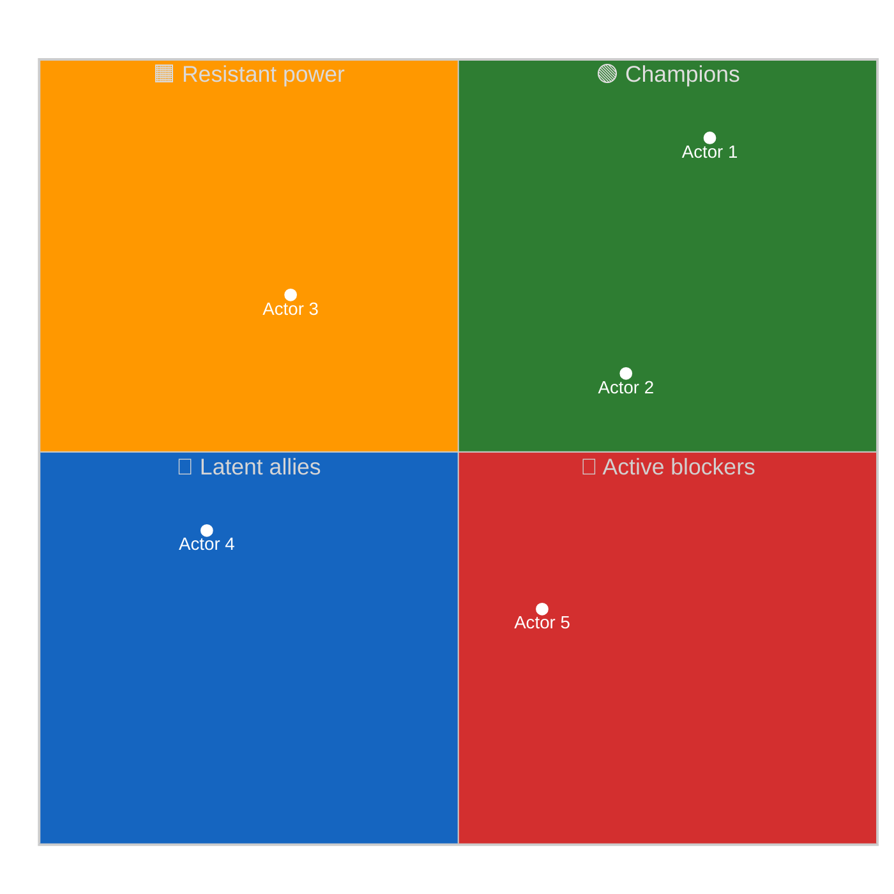
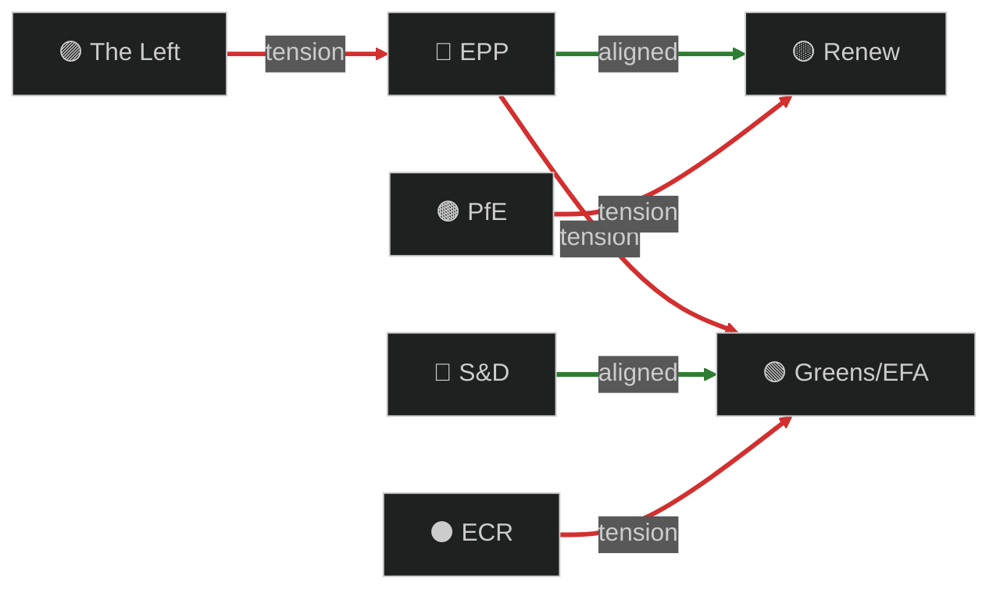

<!-- SPDX-FileCopyrightText: 2024-2026 Hack23 AB -->
<!-- SPDX-License-Identifier: Apache-2.0 -->

# 🎭 Actor Mapping Template — EP Power, Position & Network Analysis

> **📌 Template Instructions:** Copy to `analysis/daily/{date}/{article-type}-run{N}/classification/actor-mapping.md`. Map the political actors in play around the period's dominant issue: power, position, network ties, and information flow. See [methodologies/per-artifact-methodologies.md §actor-mapping](../methodologies/per-artifact-methodologies.md#actor-mapping).

> **🎯 Purpose:** Structured actor inventory with influence × position grid, alliance network, and information‑flow map. **Multi‑national extension over Riksdagsmonitor:** every actor row carries member‑state cluster + EP political group + committee role tags so cross‑border alignment patterns are explicit.

---

## 📋 Document Metadata

| Field | Value |
|-------|-------|
| **Report ID** | `[REQUIRED: AM-YYYY-MM-DD-runNN]` |
| **Issue Anchor** | `[REQUIRED: file → which issue these actors are mapped against]` |
| **Actors Mapped** | `[REQUIRED: count ≥10 across ≥4 distinct types]` |
| **Confidence** | `[REQUIRED: 🟢 HIGH / 🟡 MEDIUM / 🔴 LOW]` |
| **PIR Tags** | `[REQUIRED]` |

---

## 1️⃣ Actor Roster

| # | Actor | Type | EP Group | Member-state | Committee role | Power (1‑5) | Position on issue |
|:-:|-------|------|----------|--------------|----------------|:-----------:|-------------------|
| 1 | `[REQUIRED]` | `[Individual MEP / Political group / Committee / Council formation / Commissioner / Member-state delegation / Sectoral lobby / NGO / Member-state head of govt]` | `[EPP / S&D / Renew / Greens / ECR / The Left / PfE / ESN / NI / —]` | `[ISO‑2 / cluster]` | `[Chair / Vice‑chair / Rapporteur / Shadow / Member / —]` | `[1‑5]` | `[Strong-Pro / Pro / Neutral / Anti / Strong-Anti]` |
| 2 | `[REQUIRED]` | `[…]` | `[…]` | `[…]` | `[…]` | `[1-5]` | `[…]` |
| 3 | `[REQUIRED]` | `[…]` | `[…]` | `[…]` | `[…]` | `[1-5]` | `[…]` |
| 4 | `[REQUIRED]` | `[…]` | `[…]` | `[…]` | `[…]` | `[1-5]` | `[…]` |
| 5 | `[REQUIRED]` | `[…]` | `[…]` | `[…]` | `[…]` | `[1-5]` | `[…]` |

*(≥10 rows, ≥4 distinct types.)*

---

## 2️⃣ Influence × Position Grid

**Reading:** Top‑right = champions (high power, pro). Top‑left = active blockers. Bottom = lower-leverage actors. Newsroom focus naturally falls on the diagonal: high‑power blockers vs. high‑power champions.

---

## 3️⃣ Alliance & Tension Network

Color‑coded edge graph: green = alliance, red = tension/blockade.

**Network narrative:** `[REQUIRED: ≥80 words describing the strongest alliance, the most consequential tension, and the bridging actor (if any).]`

---

## 4️⃣ Top‑3 Power Brokers — Profiles

For the three actors with the highest *power × salience* on this issue.

### Power Broker 1: `[REQUIRED: name + role]`

**Influence (1‑5):** `[#]` · **Position:** `[Strong-Pro / Pro / Neutral / Anti / Strong-Anti]` · **Confidence:** `[🟢/🟡/🔴]`

**Why they matter:**

`[REQUIRED: ≥100 words — institutional levers (rapporteurship, committee chair, group whip), past behaviour pattern, current incentives, and one specific recent move evidencing the position.]`

**What would shift their position:**

`[REQUIRED: ≥40 words — observable trigger that has historically moved this actor.]`

---

### Power Broker 2: `[REQUIRED]`
*(Repeat structure)*

---

### Power Broker 3: `[REQUIRED]`
*(Repeat structure)*

---

## 5️⃣ Information‑Flow Map

Who briefs whom, who leaks to whom, who has cross‑institutional access (Council, Commission, member‑state capitals)?

| Source actor | Channel | Receiver actor | Information type |
|--------------|---------|----------------|------------------|
| `[REQUIRED]` | `[Coordinator briefing / Commission staff / Permanent rep / NGO / Press]` | `[REQUIRED]` | `[REQUIRED]` |
| `[REQUIRED]` | `[…]` | `[…]` | `[…]` |
| `[REQUIRED]` | `[…]` | `[…]` | `[…]` |

**Flow narrative:** `[REQUIRED: ≥60 words on whose information advantage matters most.]`

---

## 6️⃣ Reader Briefing — Plain Language

- **Who's pushing this:** `[REQUIRED: ≥30 words]`
- **Who's blocking:** `[REQUIRED: ≥30 words]`
- **Who's the swing vote:** `[REQUIRED: ≥30 words]`
- **What to watch next:** `[REQUIRED: ≥30 words]`

> 📰 **One‑sentence newsroom hook:** `[REQUIRED]`

---

## 7️⃣ Data Sources & Provenance

**EP MCP tools used:** `get_meps`, `get_committee_info`, `analyze_coalition_dynamics`, `get_voting_records`, `network_analysis`, `assess_mep_influence` *(REQUIRED: ≥3)*

| Source | Type | Admiralty | Link |
|--------|------|:---------:|------|
| `[REQUIRED]` | `[Primary EP / Council / Press / Sectoral]` | `[A1‑F6]` | `[URL]` |

---

## 8️⃣ Confidence & Caveats

- **Overall confidence:** `[REQUIRED: 🟢/🟡/🔴]`
- **Top uncertainty:** `[REQUIRED: ≥40 words]`
- **Validity window:** `[REQUIRED: how long this map remains accurate before next refresh]`

---

**Document Control:** `/analysis/daily/{date}/{type}-run{N}/classification/actor-mapping.md` · Template v2.0 · Depth floor: 130 lines · Mermaid diagrams: ≥2 · Reader briefing: required.
