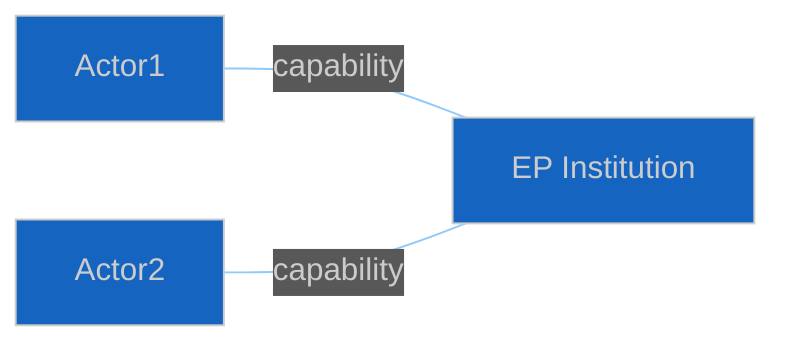

<!-- SPDX-FileCopyrightText: 2024-2026 Hack23 AB -->
<!-- SPDX-License-Identifier: Apache-2.0 -->

# 👤 Actor Threat Profiles Template — Diamond Model for Political Actors

> **📌 Template Instructions:** Copy to `analysis/daily/{date}/{article-type}-run{N}/threat-assessment/actor-threat-profiles.md`. Per-threat-actor profile using Diamond Model (adversary/capability/infrastructure/victim) adapted for political actors. See [methodologies/per-artifact-methodologies.md §actor-threat-profiles](../methodologies/per-artifact-methodologies.md#actor-threat-profiles).

> **🎯 Purpose:** Structured actor profiling identifying intent, capability, opportunity, and attack surface for named political threats.

---

## 📋 Document Metadata

| Field | Value |
|-------|-------|
| **Report ID** | `[REQUIRED: ATP-YYYY-MM-DD-runNN]` |
| **Actors Profiled** | `[REQUIRED: count ≥3]` |

---

## 1️⃣ Actor Roster

1. `[REQUIRED: named actor]`
2-3. *(≥3 required)*

---

## 2️⃣ Per-Actor Diamond

### Actor 1: `[REQUIRED: Name]`

| Element | Description |
|---------|-------------|
| **Intent** | `[REQUIRED: ≥40 words]` |
| **Capability** | `[REQUIRED: ≥40 words]` |
| **Opportunity** | `[REQUIRED: ≥40 words]` |
| **Attack Surface** | `[REQUIRED: ≥40 words — which EP institutions/procedures are vulnerable]` |

---

## 3️⃣ Relationship Map

`[REQUIRED: ≥60 words — how actors cooperate, compete, offset each other]`

---

## 4️⃣ Escalation Paths

`[REQUIRED: ≥60 words — how each profile could escalate in severity]`

---

**Document Control:** `/analysis/daily/{date}/{type}-run{N}/threat-assessment/actor-threat-profiles.md` · Template v1.0 · Depth floor: 30 lines.
