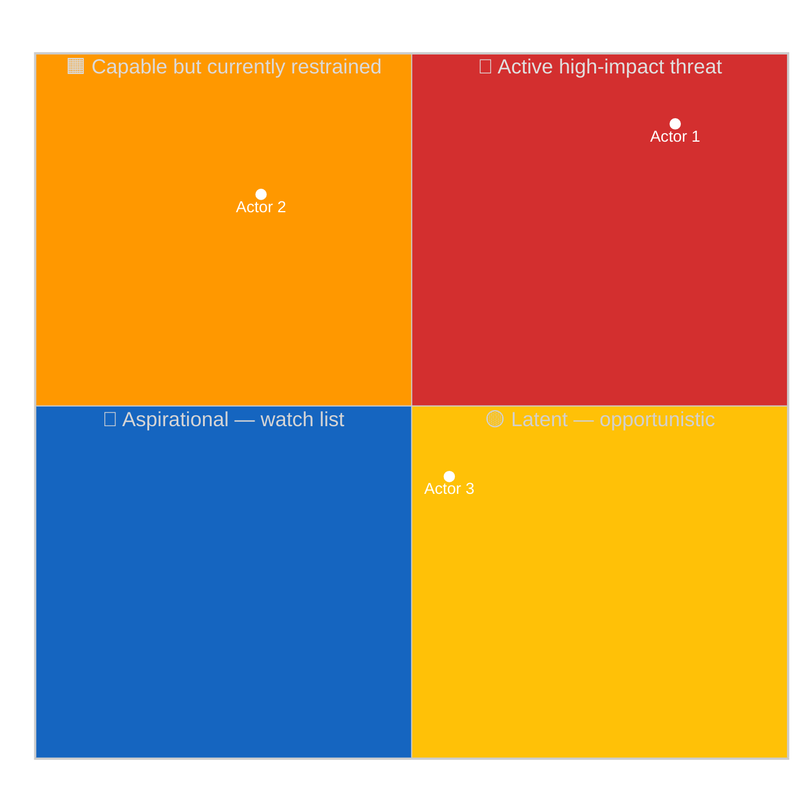
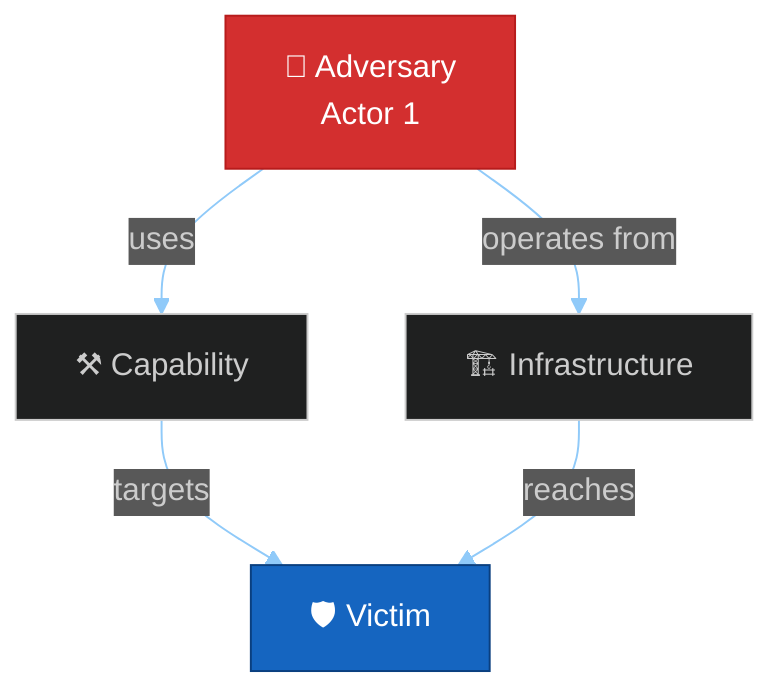
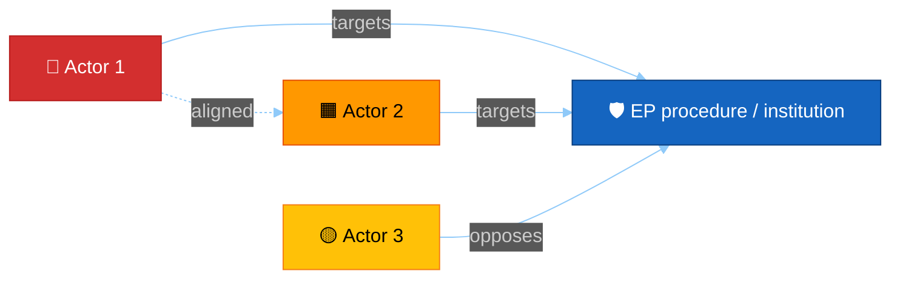

<!-- SPDX-FileCopyrightText: 2024-2026 Hack23 AB -->
<!-- SPDX-License-Identifier: Apache-2.0 -->

# 👤 Actor Threat Profiles Template — Diamond Model for EU Political Actors

> **📌 Template Instructions:** Copy to `analysis/daily/{date}/{article-type}-run{N}/threat-assessment/actor-threat-profiles.md`. Per‑actor profile applying the **Diamond Model** (adversary / capability / infrastructure / victim) adapted for political actors, plus capability×intent quadrant, escalation paths, and EU multi‑national exposure mapping. See [methodologies/per-artifact-methodologies.md §actor-threat-profiles](../methodologies/per-artifact-methodologies.md#actor-threat-profiles).

> **🎯 Purpose:** Structured actor profiling identifying **intent**, **capability**, **opportunity**, **attack surface**, and **member‑state cluster exposure** for named political threats — both extra‑institutional (foreign influence, illicit lobbying, disinformation) and intra‑institutional (norm erosion, procedural sabotage, capture). **Multi‑national extension over Riksdagsmonitor:** every actor is mapped against EU‑27 cluster surfaces so cross‑border campaigns become visible.

---

## 📋 Document Metadata

| Field | Value |
|-------|-------|
| **Report ID** | `[REQUIRED: ATP-YYYY-MM-DD-runNN]` |
| **Period** | `[REQUIRED: YYYY-MM-DD to YYYY-MM-DD]` |
| **Actors Profiled** | `[REQUIRED: count ≥3]` |
| **Confidence** | `[REQUIRED: 🟢 HIGH / 🟡 MEDIUM / 🔴 LOW]` |
| **PIR Tags** | `[REQUIRED]` |
| **Admiralty Source Floor** | `[REQUIRED: B2 across primary citations]` |

---

## 1️⃣ Actor Roster

| # | Actor | Type | Origin (state / org) | Cluster signal | Threat archetype |
|:-:|-------|------|----------------------|:--------------:|------------------|
| 1 | `[REQUIRED]` | `[State / Quasi-state / Political party / Industry lobby / NGO / Hostile media / Internal faction]` | `[REQUIRED]` | `[N / W / S / CE / external]` | `[Influence / Disruption / Capture / Coercion / Disinformation]` |
| 2 | `[REQUIRED]` | `[…]` | `[REQUIRED]` | `[…]` | `[…]` |
| 3 | `[REQUIRED]` | `[…]` | `[REQUIRED]` | `[…]` | `[…]` |

*(≥3 actors, ≥2 distinct types.)*

---

## 2️⃣ Capability × Intent Quadrant

**Reading:** Top‑right is where active newsroom focus belongs. Top‑left is the watch‑list (capable but not yet acting). Bottom‑right is rising‑intent actors who could acquire capability.

---

## 3️⃣ Per‑Actor Diamond Model

### Actor 1: `[REQUIRED: Name]`

| Element | Description |
|---------|-------------|
| **Adversary (Intent)** | `[REQUIRED: ≥80 words — strategic objectives, public posture, signalling pattern, and observed past behaviour. Cite specific public actions or analyst reports.]` |
| **Capability** | `[REQUIRED: ≥80 words — financial, organisational, technical, or rhetorical levers. Quantify where possible (e.g. "active in 8 EU‑27 member states" or "transparency-register spend €X").]` |
| **Infrastructure (Opportunity)** | `[REQUIRED: ≥80 words — entry points: lobby groups, friendly MEPs, ad networks, intermediary NGOs, or procedural mechanisms (e.g. amendment flooding).]` |
| **Victim (Attack Surface)** | `[REQUIRED: ≥80 words — which EP institutions / procedures / individual MEPs are exposed and why.]` |

**Cluster exposure (which EU‑27 clusters most vulnerable to this actor):**

| Cluster | Exposure | Mechanism |
|---------|:--------:|-----------|
| Northern | `[🟢/🟡/🔴]` | `[REQUIRED ≤30 words]` |
| Western | `[🟢/🟡/🔴]` | `[REQUIRED]` |
| Southern | `[🟢/🟡/🔴]` | `[REQUIRED]` |
| Central‑Eastern | `[🟢/🟡/🔴]` | `[REQUIRED]` |

---

### Actor 2: `[REQUIRED: Name]`
*(Repeat full Diamond + cluster table)*

---

### Actor 3: `[REQUIRED: Name]`
*(Repeat full Diamond + cluster table)*

---

## 4️⃣ Relationship & Co‑Operation Map

How profiled actors interact — coordinate, compete, offset.

**Co‑operation narrative:** `[REQUIRED: ≥80 words on whether profiled actors converge on the same target, divide labour, or actively offset each other. Cite observable co‑signals.]`

---

## 5️⃣ Escalation Paths

For each actor: how their threat profile could escalate one severity step in the next 4‑12 weeks.

| Actor | Current severity | Next escalation step | Indicator threshold | Time horizon |
|-------|:----------------:|----------------------|---------------------|:------------:|
| Actor 1 | `[Low/Med/High]` | `[REQUIRED: ≥30 words]` | `[REQUIRED: observable]` | `[weeks]` |
| Actor 2 | `[…]` | `[REQUIRED]` | `[REQUIRED]` | `[weeks]` |
| Actor 3 | `[…]` | `[REQUIRED]` | `[REQUIRED]` | `[weeks]` |

**Composite escalation narrative:** `[REQUIRED: ≥80 words — sequence in which escalations would compound, and the critical cross‑actor signal that would mark a regime shift.]`

---

## 6️⃣ Counter‑Posture & Detection

For each top‑severity actor, how the EP / Commission / member states could detect and counter — without endorsing specific tactics.

| Actor | Detection signal | Institutional counter‑lever | Reversibility |
|-------|------------------|-----------------------------|:-------------:|
| Actor 1 | `[REQUIRED]` | `[REQUIRED]` | `[Hard / Soft]` |
| Actor 2 | `[REQUIRED]` | `[REQUIRED]` | `[…]` |
| Actor 3 | `[REQUIRED]` | `[REQUIRED]` | `[…]` |

---

## 7️⃣ Reader Briefing — Plain Language

> 📰 **Newsroom hook:** `[REQUIRED: one‑sentence summary.]`

- **Who is the most active threat right now:** `[REQUIRED: ≥40 words]`
- **What they want:** `[REQUIRED: ≥40 words]`
- **What they could do next:** `[REQUIRED: ≥40 words]`
- **What citizens should watch for:** `[REQUIRED: ≥40 words]`

---

## 8️⃣ Data Sources & Provenance

**EP MCP tools used:** `get_meps`, `analyze_voting_patterns`, `get_mep_declarations`, `network_analysis`, `correlate_intelligence` *(REQUIRED: ≥3)*

| Source | Type | Admiralty | Link |
|--------|------|:---------:|------|
| `[REQUIRED]` | `[Primary EP / Transparency register / Press / Analyst report]` | `[A1‑F6]` | `[URL]` |
| `[REQUIRED]` | `[…]` | `[…]` | `[…]` |

---

## 9️⃣ Confidence & Caveats

- **Overall confidence:** `[REQUIRED: 🟢/🟡/🔴]`
- **Top uncertainty:** `[REQUIRED: ≥40 words]`
- **Validity window:** `[REQUIRED: how long this profile remains accurate before next refresh.]`
- **Ethical guard‑rail:** This template documents observable behaviour and public posture only; it MUST NOT speculate about non‑public motivations of named individuals beyond what cited sources support.

---

## 🛠️ Worked example — actor threat profile for a hypothetical PfE bridging MEP

### Profile: MEP X (PfE, COUNTRY-Y, ENVI shadow rapporteur)

**Position-on-axis**: capability HIGH (committee shadow + rapporteur
network), intent MIXED (anti-Green Deal but pro-industry), opportunity
MEDIUM (ENVI dossiers passing through their seat).

**Diamond Model**: Adversary: anti-EU-regulatory faction within PfE |
Capability: 8 PfE allies on ENVI; voting-bloc-discipline 92% per
`analyze_coalition_dynamics` | Infrastructure: national-party press,
CEE WhatsApp coordination groups, friendly Brussels media | Victim:
Green-Deal-implementation files passing ENVI scrutiny (specifically:
ETS extension, methane regulation, F-gas update).

**Behavioural signature**:

- Tabling pattern: amendments timed within 48h of trilogue rounds
- Speech pattern: high frequency of "competitiveness" + "regulatory burden" framing
- Voting pattern: aligned with EPP CEE bloc on industry-cost amendments,
  diverges on rule-of-law motions
- Question pattern: ≥3 written PQs/month on enforcement-cost issues

**Counter-leverage**: ENVI majority can pre-poll PfE positions before
tabling close-margin amendments; rapporteur can exclude PfE from
shadow-rapporteur informal coordination if shadow declines to act in
good faith; Article 4 rapporteur transparency rules invoked when needed.

**Ethical guard-rail**: this profile is built from public roll-call,
public statements, transparency-register entries, and published
parliamentary questions only. No personal-life data. No speculation
about non-public motivations beyond cited evidence.

## 🚫 Anti-patterns — actor-threat-profile failures

| Anti-pattern | Why it fails | Correct approach |
|---|---|---|
| Personal-life data on MEP | Violates §5.2 OSINT scope | Public political behaviour only |
| Profile of a non-active actor | Wasted artifact slot | Restrict to actors with ≥10 RCV participations / quarter |
| Single-source claim | Tradecraft fail | Cross-reference 2+ independent sources |
| Speculation about motivation | "Ethical guard-rail" violation | Behaviour-based language |
| No counter-leverage | Profile unactionable | Each profile: ≥1 counter-lever |
| Defamatory framing | Legal + ethical risk | Neutral analytic tone |
| No validity window | Profile may stale | "Valid 3 months; refresh on group-change events" |
| Diamond Model fields blank | Incomplete framework | All 4 fields filled or "n/a" with rationale |
| Conflating party-line with personal stance | Poor analytic granularity | Distinguish whip-aligned vs. independent positions |

## 🎯 EP MCP tool inputs

| Tool | Used for |
|---|---|
| `get_meps` + `get_mep_details` | Demographics, committees, group |
| `analyze_voting_patterns` | Personal cohesion/defection signature |
| `get_voting_records` | Specific RCV participation |
| `get_speeches` | Rhetorical signature |
| `get_parliamentary_questions` | Pressure-channel signature |
| `get_mep_declarations` | Transparency-register / interests |
| `assess_mep_influence` | Influence score |
| `network_analysis` | Bridging position |

## 🔗 Controlling methodology cross-references

- [`../methodologies/political-threat-framework.md`](../methodologies/political-threat-framework.md)
- [`../methodologies/osint-tradecraft-standards.md §5 Scope`](../methodologies/osint-tradecraft-standards.md)
- [`actor-mapping.md`](actor-mapping.md) — companion (descriptive only)

## ✅ Stage-C completeness signals

- Line floor: 140 lines
- ≥ 3 Mermaid diagrams (intent×capability quadrant + diamond + relationship map)
- ≥ 3 actor profiles (or fewer with explicit "ranked top-3" framing)
- Behavioural signature ≥ 4 dimensions per actor
- Counter-leverage + ethical guard-rail present

---

**Document Control:** `/analysis/daily/{date}/{type}-run{N}/threat-assessment/actor-threat-profiles.md` · Template v2.2 · Depth floor: 140 lines · Mermaid diagrams: ≥3 (quadrant + per‑actor diamond + relationship map) · Reader briefing: required.
