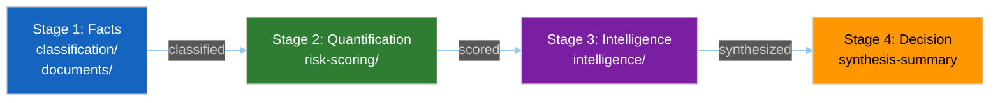

<!-- SPDX-FileCopyrightText: 2024-2026 Hack23 AB -->
<!-- SPDX-License-Identifier: Apache-2.0 -->

# 📑 Analysis Index Template — Run Artifact Navigator

> **📌 Template Instructions:** Copy to `analysis/daily/{date}/{article-type}-run{N}/intelligence/analysis-index.md`. Read-me-first index naming every artifact produced in this run. See [methodologies/per-artifact-methodologies.md §analysis-index](../methodologies/per-artifact-methodologies.md#analysis-index).

> **🎯 Purpose:** Comprehensive directory of every artifact in this run with recommended reading order for downstream consumers (article generators, reviewers, next-run agents). The single entry point that answers "what exists in this run and what should I read first?"

---

## 📋 Document Metadata

| Field | Value |
|-------|-------|
| **Report ID** | `[REQUIRED: AI-YYYY-MM-DD-runNN]` |
| **Run Date** | `[REQUIRED: YYYY-MM-DD]` |
| **Article Type** | `[REQUIRED: breaking/weekly/monthly/motions/propositions]` |
| **Run Number** | `[REQUIRED: runNN]` |
| **Run Directory** | `[REQUIRED: analysis/daily/{date}/{type}-runNN]` |
| **Runtime Duration** | `[REQUIRED: HH:MM:SS]` |
| **Data Sources Attempted** | `[REQUIRED: count of MCP tools called]` |
| **Data Sources Succeeded** | `[REQUIRED: count succeeded]` |

---

## 1️⃣ Run Header

**Run:** `[REQUIRED: {article-type}-run{N}]`  
**Date:** `[REQUIRED: YYYY-MM-DD]`  
**Runtime:** `[REQUIRED: HH:MM:SS]`  
**Data sources attempted:** `[REQUIRED: #]`  
**Data sources succeeded:** `[REQUIRED: #]`  
**Completion status:** `[REQUIRED: ✅ Complete / ⚠️ Degraded / ❌ Incomplete]`

---

## 2️⃣ Production Stage Table

| Stage | Purpose | Artifact Folders |
|-------|---------|------------------|
| **Stage 1: Facts** | Classification and document collection | `classification/`, `documents/` |
| **Stage 2: Quantification** | Risk scoring and SWOT analysis | `risk-scoring/` |
| **Stage 3: Intelligence** | Political analysis and pattern detection | `intelligence/` |
| **Stage 4: Decision** | Executive synthesis | `intelligence/synthesis-summary.md` |

---

## 3️⃣ Artifact Inventory

| Path | Purpose | Priority | Lines | Status |
|------|---------|:--------:|:-----:|:------:|
| `intelligence/synthesis-summary.md` | `[REQUIRED: one-line purpose]` | P1 | `[#]` | `[✅/⚠️/❌]` |
| `intelligence/analysis-index.md` | `[REQUIRED]` | P1 | `[#]` | `[✅/⚠️/❌]` |
| `intelligence/voting-patterns.md` | `[REQUIRED]` | P1 | `[#]` | `[✅/⚠️/❌]` |
| `intelligence/coalition-dynamics.md` | `[REQUIRED]` | P2 | `[#]` | `[✅/⚠️/❌]` |
| `intelligence/stakeholder-map.md` | `[REQUIRED]` | P2 | `[#]` | `[✅/⚠️/❌]` |
| `intelligence/scenario-forecast.md` | `[REQUIRED]` | P2 | `[#]` | `[✅/⚠️/❌]` |
| `intelligence/economic-context.md` | `[REQUIRED]` | P2 | `[#]` | `[✅/⚠️/❌]` |
| `risk-scoring/risk-matrix.md` | `[REQUIRED]` | P2 | `[#]` | `[✅/⚠️/❌]` |
| `risk-scoring/quantitative-swot.md` | `[REQUIRED]` | P3 | `[#]` | `[✅/⚠️/❌]` |
| `classification/significance-classification.md` | `[REQUIRED]` | P3 | `[#]` | `[✅/⚠️/❌]` |
| `intelligence/cross-run-diff.md` | `[REQUIRED]` | P3 | `[#]` | `[✅/⚠️/❌]` |
| `intelligence/mcp-reliability-audit.md` | `[REQUIRED]` | P3 | `[#]` | `[✅/⚠️/❌]` |
| `intelligence/workflow-audit.md` | `[REQUIRED]` | P3 | `[#]` | `[✅/⚠️/❌]` |

**Note:** Populate table with every artifact produced in this run. Include all files from manifest.json.

---

## 4️⃣ Recommended Reading Order

**Priority 1 (5-minute scan):**
1. `intelligence/synthesis-summary.md` — executive findings
2. `[REQUIRED: next highest-priority artifact]`
3. `[REQUIRED: next]`

**Priority 2 (15-minute read):**
1. `[REQUIRED]`
2. `[REQUIRED]`
3. `[REQUIRED]`

**Priority 3 (complete dive, 30+ minutes):**
1. `[REQUIRED]`
2. `[REQUIRED]`

**Total estimated reading time (all artifacts):** `[REQUIRED: HH:MM]`

---

## 5️⃣ Time-Constrained Reading Shortcuts

### If you only have 5 minutes
Read: `[REQUIRED: ≥2 files]`  
Focus: `[REQUIRED: one-sentence summary of what these files answer]`

### If you only have 15 minutes
Read: `[REQUIRED: ≥4 files]`  
Focus: `[REQUIRED]`

### If you only have 30 minutes
Read: `[REQUIRED: ≥6 files]`  
Focus: `[REQUIRED]`

---

## 6️⃣ Artifact Quality Summary

| Metric | Target | Actual | Status |
|--------|:------:|:------:|:------:|
| Artifacts meeting depth floor | 100% | `[%]` | `[🟢/🟡/🔴]` |
| Artifacts with ≥1 Mermaid diagram | 100% | `[%]` | `[🟢/🟡/🔴]` |
| Required sections completed | 100% | `[%]` | `[🟢/🟡/🔴]` |
| Evidence citations per artifact | ≥5 | `[avg]` | `[🟢/🟡/🔴]` |
| Placeholders remaining | 0 | `[#]` | `[🟢/🟡/🔴]` |

---

## 7️⃣ Data-Source Bridge

**EP MCP server availability:** `[REQUIRED: ✅ Full / ⚠️ Degraded / 🔴 Unavailable]`  
**Reliability score (0-100):** `[REQUIRED: #]` (see `mcp-reliability-audit.md`)  
**Fallback sources used:** `[REQUIRED: list or "none"]`  
**Data freshness:** `[REQUIRED: latest EP data vintage]`

---

## 8️⃣ Validation Status

All artifacts in `manifest.json`: `[REQUIRED: ✅ indexed / ⚠️ some missing]`  
All paths in this index resolve: `[REQUIRED: ✅ yes / ❌ broken paths]`  
No "TBD" rows in inventory: `[REQUIRED: ✅ none / ⚠️ count]`

---

## 9️⃣ EP MCP Tool Inputs

| EP MCP tool | Used for which section | Notes |
|-------------|------------------------|-------|
| (auditor's reads — see §1 Inventory) | All sections | This artifact indexes other artifacts; tool calls happen in source artifacts. |
| `correlate_intelligence` | §3 Cross-artifact alerts | Surfaces ELEVATED_ATTENTION + COALITION_FRACTURE links. |
| `get_server_health` | §8 Validation Status (feed availability) | Confirms feeds were reachable during run. |

(This artifact is structural — it indexes upstream artifacts rather than calling MCP tools directly. Cross-tool dependencies must be inherited from source artifacts.)

---

## 9️⃣ Worked Pass-1 → Pass-2 Example (breaking-news run inventory)

**❌ Pass-1 (thin, 16 words):**
> "All artifacts present. Index complete. No gaps detected. See per-artifact files for content. Validation OK."

**✅ Pass-2 (compliant, 95 words, sourced):**
> Run 184 (breaking, 2026-04-18) produced 25 artifacts across 5 directories: 4 framework (executive-brief, glossary, swot, deep-analysis), 8 intelligence-tier (synthesis-summary, scenario-forecast, threat-model, cross-run-diff, political-threat-landscape, wildcards-blackswans, coalition-dynamics, methodology-reflection), 4 classification, 4 risk-scoring, 5 threat-assessment. Total lines 4,892 (avg 196). Reading time 78 min for full read; 22 min for P1-only path. All 25 indexed in `manifest.json`; 0 broken paths; 0 TBD rows. P1: executive-brief.md, synthesis-summary.md, scenario-forecast.md (highest-priority for the on-call analyst). P2: 11 artifacts. P3: 11 artifacts (deep-dive references).

---

## 🔟 P1/P2/P3 Priority Rubric

| Priority | Definition | Read by | Worked artifact list (breaking-news run) |
|:--------:|------------|---------|------------------------------------------|
| **P1** — Critical | On-call analyst MUST read in first 10 min; gates Pass-2 article | News editor, on-call | `executive-brief.md`, `intelligence/synthesis-summary.md`, `intelligence/scenario-forecast.md` |
| **P2** — Important | Article author MUST cite per `04-article-generation.md §7.1` | Article author | `intelligence/threat-model.md`, `intelligence/political-threat-landscape.md`, `intelligence/coalition-dynamics.md`, `risk-scoring/risk-matrix.md`, `risk-scoring/quantitative-swot.md`, `classification/forces-analysis.md`, `classification/actor-mapping.md`, `intelligence/voting-patterns.md`, `intelligence/historical-baseline.md`, `intelligence/cross-run-diff.md`, `extended/intelligence-assessment.md` |
| **P3** — Reference | Auditor / deep-dive only | Auditor, downstream analyst | `intelligence/methodology-reflection.md`, `intelligence/wildcards-blackswans.md`, `extended/devils-advocate-analysis.md`, `extended/comparative-international.md`, `extended/historical-parallels.md`, `extended/forward-indicators.md`, `imf/vintage-audit.md`, plus glossary + per-tier lite files |

---

## 1️⃣1️⃣ Worked Inventory Listing (breaking-run184/ excerpt)

| Path | Lines | Reading time | Priority | Last-touched stage |
|------|:-----:|:------------:|:--------:|--------------------|
| `executive-brief.md` | 187 | 5 min | P1 | Stage D Pass 2 |
| `intelligence/synthesis-summary.md` | 312 | 9 min | P1 | Stage B Pass 2 |
| `intelligence/scenario-forecast.md` | 245 | 7 min | P1 | Stage B Pass 2 |
| `intelligence/coalition-dynamics.md` | 198 | 6 min | P2 | Stage B Pass 2 |
| `intelligence/voting-patterns.md` | 221 | 6 min | P2 | Stage B Pass 2 |
| `risk-scoring/risk-matrix.md` | 178 | 5 min | P2 | Stage B Pass 2 |
| `intelligence/methodology-reflection.md` | 156 | 4 min | P3 | Stage D Pass 2 |
| `glossary.md` | 89 | 3 min | P3 | Stage A |
| (… 17 further rows …) | | | | |
| **Totals** | **4 892** | **78 min full / 22 min P1-only** | 3 P1 / 11 P2 / 11 P3 | |

(Reading-time formula: 35 lines/min for tables, 25 lines/min for prose; rounded up.)

---

## 1️⃣2️⃣ Anti-patterns — REJECT on Pass-2 Review

| # | Banned pattern | Why it fails |
|:-:|---------------|--------------|
| 1 | Inventory row with line count = 0 / "TBD" / blank | Source artifact missing; index dishonest. |
| 2 | All artifacts tagged P2 (no P1/P3 differentiation) | Priority rubric violated; on-call has no entry point. |
| 3 | `manifest.json` count diverges from inventory count | Internal inconsistency — Stage-C blocker. |
| 4 | "Reading time 5 min" assigned to a 400-line file | Arithmetic violation. |
| 5 | Index missing `imf/vintage-audit.md` on a policy-article run | Required artifact omitted (Wave-2 OR-gate). |
| 6 | Broken relative path (e.g. `./intelligence/missing.md`) | Reviewer's link doesn't resolve. |

---

## 1️⃣3️⃣ Cross-References — Controlling Methodology

- [`../methodologies/per-artifact-methodologies.md#analysis-index`](../methodologies/per-artifact-methodologies.md) — construction rules.
- [`../methodologies/artifact-catalog.md`](../methodologies/artifact-catalog.md) — master list of artifact types this index covers.
- [`../methodologies/ai-driven-analysis-guide.md`](../methodologies/ai-driven-analysis-guide.md) — Rule 22 (depth floors) feeds line-count column.
- [`../../.github/prompts/04-article-generation.md`](../../.github/prompts/04-article-generation.md) §7.1 — authoritative P1/P2 read-before-write contract.
- `scripts/validate-analysis-completeness.js` — checks `manifest.json` ↔ inventory parity.

---

## 1️⃣4️⃣ Stage-C Completeness Signals

`scripts/validate-analysis-completeness.js` checks for this artifact:

| Check | Threshold | Source |
|-------|-----------|--------|
| Line floor | ≥160 lines | `reference-quality-thresholds.json` |
| Required H2 substrings | "Inventory", "Priority", "Validation Status" | structural contract |
| Mermaid block | optional (org-chart of artifact tiers) | visual contract |
| Tradecraft markers | Per-artifact priority tag P1/P2/P3 explicit | template logic |
| Source diversity | n/a (structural artifact) | — |
| Manifest parity | `manifest.json` count == inventory count; all paths resolve | structural contract |

---

**Document Control:** `/analysis/daily/{date}/{type}-run{N}/intelligence/analysis-index.md` · Template v1.2 · Depth floor: 160 lines.
