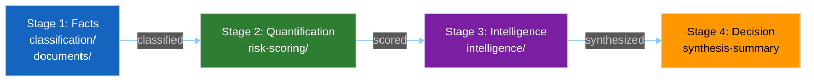

<!-- SPDX-FileCopyrightText: 2024-2026 Hack23 AB -->
<!-- SPDX-License-Identifier: Apache-2.0 -->

# 📑 Analysis Index Template — Run Artifact Navigator

> **📌 Template Instructions:** Copy to `analysis/daily/{date}/{article-type}-run{N}/intelligence/analysis-index.md`. Read-me-first index naming every artifact produced in this run. See [methodologies/per-artifact-methodologies.md §analysis-index](../methodologies/per-artifact-methodologies.md#analysis-index).

> **🎯 Purpose:** Comprehensive directory of every artifact in this run with recommended reading order for downstream consumers (article generators, reviewers, next-run agents). The single entry point that answers "what exists in this run and what should I read first?"

---

## 📋 Document Metadata

| Field | Value |
|-------|-------|
| **Report ID** | `[REQUIRED: AI-YYYY-MM-DD-runNN]` |
| **Run Date** | `[REQUIRED: YYYY-MM-DD]` |
| **Article Type** | `[REQUIRED: breaking/weekly/monthly/motions/propositions]` |
| **Run Number** | `[REQUIRED: runNN]` |
| **Run Directory** | `[REQUIRED: analysis/daily/{date}/{type}-runNN]` |
| **Runtime Duration** | `[REQUIRED: HH:MM:SS]` |
| **Data Sources Attempted** | `[REQUIRED: count of MCP tools called]` |
| **Data Sources Succeeded** | `[REQUIRED: count succeeded]` |

---

## 1️⃣ Run Header

**Run:** `[REQUIRED: {article-type}-run{N}]`  
**Date:** `[REQUIRED: YYYY-MM-DD]`  
**Runtime:** `[REQUIRED: HH:MM:SS]`  
**Data sources attempted:** `[REQUIRED: #]`  
**Data sources succeeded:** `[REQUIRED: #]`  
**Completion status:** `[REQUIRED: ✅ Complete / ⚠️ Degraded / ❌ Incomplete]`

---

## 2️⃣ Production Stage Table

| Stage | Purpose | Artifact Folders |
|-------|---------|------------------|
| **Stage 1: Facts** | Classification and document collection | `classification/`, `documents/` |
| **Stage 2: Quantification** | Risk scoring and SWOT analysis | `risk-scoring/` |
| **Stage 3: Intelligence** | Political analysis and pattern detection | `intelligence/` |
| **Stage 4: Decision** | Executive synthesis | `intelligence/synthesis-summary.md` |

---

## 3️⃣ Artifact Inventory

| Path | Purpose | Priority | Lines | Status |
|------|---------|:--------:|:-----:|:------:|
| `intelligence/synthesis-summary.md` | `[REQUIRED: one-line purpose]` | P1 | `[#]` | `[✅/⚠️/❌]` |
| `intelligence/analysis-index.md` | `[REQUIRED]` | P1 | `[#]` | `[✅/⚠️/❌]` |
| `intelligence/voting-patterns.md` | `[REQUIRED]` | P1 | `[#]` | `[✅/⚠️/❌]` |
| `intelligence/coalition-dynamics.md` | `[REQUIRED]` | P2 | `[#]` | `[✅/⚠️/❌]` |
| `intelligence/stakeholder-map.md` | `[REQUIRED]` | P2 | `[#]` | `[✅/⚠️/❌]` |
| `intelligence/scenario-forecast.md` | `[REQUIRED]` | P2 | `[#]` | `[✅/⚠️/❌]` |
| `intelligence/economic-context.md` | `[REQUIRED]` | P2 | `[#]` | `[✅/⚠️/❌]` |
| `risk-scoring/risk-matrix.md` | `[REQUIRED]` | P2 | `[#]` | `[✅/⚠️/❌]` |
| `risk-scoring/quantitative-swot.md` | `[REQUIRED]` | P3 | `[#]` | `[✅/⚠️/❌]` |
| `classification/significance-classification.md` | `[REQUIRED]` | P3 | `[#]` | `[✅/⚠️/❌]` |
| `intelligence/cross-run-diff.md` | `[REQUIRED]` | P3 | `[#]` | `[✅/⚠️/❌]` |
| `intelligence/mcp-reliability-audit.md` | `[REQUIRED]` | P3 | `[#]` | `[✅/⚠️/❌]` |
| `intelligence/workflow-audit.md` | `[REQUIRED]` | P3 | `[#]` | `[✅/⚠️/❌]` |

**Note:** Populate table with every artifact produced in this run. Include all files from manifest.json.

---

## 4️⃣ Recommended Reading Order

**Priority 1 (5-minute scan):**
1. `intelligence/synthesis-summary.md` — executive findings
2. `[REQUIRED: next highest-priority artifact]`
3. `[REQUIRED: next]`

**Priority 2 (15-minute read):**
1. `[REQUIRED]`
2. `[REQUIRED]`
3. `[REQUIRED]`

**Priority 3 (complete dive, 30+ minutes):**
1. `[REQUIRED]`
2. `[REQUIRED]`

**Total estimated reading time (all artifacts):** `[REQUIRED: HH:MM]`

---

## 5️⃣ Time-Constrained Reading Shortcuts

### If you only have 5 minutes
Read: `[REQUIRED: ≥2 files]`  
Focus: `[REQUIRED: one-sentence summary of what these files answer]`

### If you only have 15 minutes
Read: `[REQUIRED: ≥4 files]`  
Focus: `[REQUIRED]`

### If you only have 30 minutes
Read: `[REQUIRED: ≥6 files]`  
Focus: `[REQUIRED]`

---

## 6️⃣ Artifact Quality Summary

| Metric | Target | Actual | Status |
|--------|:------:|:------:|:------:|
| Artifacts meeting depth floor | 100% | `[%]` | `[🟢/🟡/🔴]` |
| Artifacts with ≥1 Mermaid diagram | 100% | `[%]` | `[🟢/🟡/🔴]` |
| Required sections completed | 100% | `[%]` | `[🟢/🟡/🔴]` |
| Evidence citations per artifact | ≥5 | `[avg]` | `[🟢/🟡/🔴]` |
| Placeholders remaining | 0 | `[#]` | `[🟢/🟡/🔴]` |

---

## 7️⃣ Data-Source Bridge

**EP MCP server availability:** `[REQUIRED: ✅ Full / ⚠️ Degraded / 🔴 Unavailable]`  
**Reliability score (0-100):** `[REQUIRED: #]` (see `mcp-reliability-audit.md`)  
**Fallback sources used:** `[REQUIRED: list or "none"]`  
**Data freshness:** `[REQUIRED: latest EP data vintage]`

---

## 8️⃣ Validation Status

All artifacts in `manifest.json`: `[REQUIRED: ✅ indexed / ⚠️ some missing]`  
All paths in this index resolve: `[REQUIRED: ✅ yes / ❌ broken paths]`  
No "TBD" rows in inventory: `[REQUIRED: ✅ none / ⚠️ count]`

---

**Document Control:** `/analysis/daily/{date}/{type}-run{N}/intelligence/analysis-index.md` · Template v1.1 · Depth floor: 160 lines.
