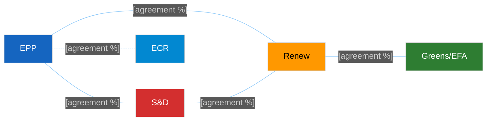

<!-- SPDX-FileCopyrightText: 2024-2026 Hack23 AB -->
<!-- SPDX-License-Identifier: Apache-2.0 -->

# 🤝 Coalition Dynamics Template — Group Cohesion & Alliance Pairs

> **📌 Template Instructions:** Copy to `analysis/daily/{date}/{article-type}-run{N}/intelligence/coalition-dynamics.md`. Analyze group cohesion scores and cross-party alliance pairs for the period's named votes. See [methodologies/per-artifact-methodologies.md §coalition-dynamics](../methodologies/per-artifact-methodologies.md#coalition-dynamics).

> **🎯 Purpose:** Group-level alliance analysis answering "which groups cooperate most often, where do defections occur, and is the Grand Coalition viable?" Distinct from `voting-patterns.md` (bloc-behavior focused) — this file is alliance-pair focused.

---

## 📋 Document Metadata

| Field | Value |
|-------|-------|
| **Report ID** | `[REQUIRED: CD-YYYY-MM-DD-runNN]` |
| **Analysis Period** | `[REQUIRED: YYYY-MM-DD to YYYY-MM-DD]` |
| **Roll-Call Votes Analyzed** | `[REQUIRED: count]` |
| **Confidence** | `[REQUIRED: 🟢/🟡/🔴]` |

---

## 1️⃣ Group Roster

| Group | Seats | Observed Cohesion (%) | Trend vs. Prior |
|-------|:-----:|:---------------------:|:---------------:|
| EPP | `[#]` | `[%]` | `[↑ / → / ↓]` |
| S&D | `[#]` | `[%]` | `[↑ / → / ↓]` |
| Renew | `[#]` | `[%]` | `[↑ / → / ↓]` |
| Greens/EFA | `[#]` | `[%]` | `[↑ / → / ↓]` |
| ECR | `[#]` | `[%]` | `[↑ / → / ↓]` |
| PfE | `[#]` | `[%]` | `[↑ / → / ↓]` |
| ESN | `[#]` | `[%]` | `[↑ / → / ↓]` |
| The Left | `[#]` | `[%]` | `[↑ / → / ↓]` |
| NI | `[#]` | `[%]` | `[↑ / → / ↓]` |

**Cohesion methodology:** `[REQUIRED: note if computed from per-MEP roll-call data or inferred from aggregate vote tallies. If EP voting feed has not yet published RCV data, mark LOW confidence.]`

---

## 2️⃣ Alliance Pair Table

**Top 5 alliance pairs by agreement rate:**

| Rank | Pair | Agreement Rate (%) | Trend vs. Prior Period | Evidence (RCV IDs) |
|:----:|------|:------------------:|:----------------------:|--------------------|
| 1 | `[Group A + Group B]` | `[%]` | `[↑ / → / ↓]` | `[REQUIRED: ≥1 RCV ID or note "aggregate-only"]` |
| 2 | `[REQUIRED]` | `[%]` | `[↑ / → / ↓]` | `[REQUIRED]` |
| 3 | `[REQUIRED]` | `[%]` | `[↑ / → / ↓]` | `[REQUIRED]` |
| 4 | `[REQUIRED]` | `[%]` | `[↑ / → / ↓]` | `[REQUIRED]` |
| 5 | `[REQUIRED]` | `[%]` | `[↑ / → / ↓]` | `[REQUIRED]` |

**Edge-weight interpretation:**
- Green edges (solid, ≥70%): Strong alliance
- Orange edges (dashed, 50-69%): Moderate cooperation
- Red edges (not shown, <50%): Fragile or absent cooperation

---

## 3️⃣ Defection Highlights

**Named MEPs breaking with group line:**

| MEP Name | Group | Vote Topic (RCV ID) | MEP Position | Group Position | Significance |
|----------|-------|---------------------|:------------:|:--------------:|--------------|
| `[REQUIRED: MEP name]` | `[Group]` | `[REQUIRED: topic + RCV ID]` | `[For/Against/Abstain]` | `[For/Against/Abstain]` | `[REQUIRED: why this defection matters, ≥30 words]` |
| `[REQUIRED]` | `[...]` | `[REQUIRED]` | `[...]` | `[...]` | `[REQUIRED]` |
| `[REQUIRED]` | `[...]` | `[REQUIRED]` | `[...]` | `[...]` | `[REQUIRED]` |

**Defection pattern analysis:**

`[REQUIRED: ≥80 words analyzing whether defections are random noise, coordinated dissent, or signals of shifting group positions. Identify any policy domains where defection rates spike.]`

---

## 4️⃣ Grand Coalition Status

**Definition:** EPP + S&D + Renew (baseline three-group majority)

**Viability indicator:** `[REQUIRED: 🟢 Stable / 🟡 Stressed / 🔴 Fractured]`

**Seat arithmetic:**
- EPP: `[# seats]`
- S&D: `[# seats]`
- Renew: `[# seats]`
- **Total:** `[# seats]` / 720 = `[%]`

**Cohesion on Grand Coalition votes:** `[REQUIRED: % agreement when all three groups vote together]`

**Named stress points:**

1. `[REQUIRED: specific vote or policy domain where Grand Coalition fractured, with RCV ID]`
2. `[REQUIRED: stress point 2]`
3. `[REQUIRED: stress point 3]`

**Stress narrative:**

`[REQUIRED: ≥100 words explaining what strains the Grand Coalition. Which policy domains create intra-coalition tension? Are stress points rising or stable?]`

---

## 5️⃣ Confidence Ledger

**Roll-call vote data availability:**

| Period | RCV IDs Available | Per-MEP Data | Aggregate-Only | Inference Required |
|--------|:-----------------:|:------------:|:--------------:|:------------------:|
| `[REQUIRED: this period]` | `[#]` | `[✅/❌]` | `[✅/❌]` | `[✅/❌]` |
| `[REQUIRED: prior period for comparison]` | `[#]` | `[✅/❌]` | `[✅/❌]` | `[✅/❌]` |

**Confidence caveats:**

`[REQUIRED: ≥80 words explaining where roll-call data is available vs. where structural inference is used. If EP voting feed has not yet published data for the period (typical 4-8 week delay), explicitly state this and mark affected claims as LOW confidence.]`

**EP MCP tools used:** `get_voting_records`, `analyze_coalition_dynamics`, `compare_political_groups`, `analyze_voting_patterns`

---

## 6️⃣ Forward Implications

**Next-period watch points:**

1. `[REQUIRED: which alliance pair to monitor for stability shifts]`
2. `[REQUIRED: which group's cohesion to track]`
3. `[REQUIRED: which policy domain may stress coalitions]`

**Expected coalition shifts:** `[REQUIRED: ≥60 words predicting how alliance landscape may change]`

---

**Document Control:** `/analysis/daily/{date}/{type}-run{N}/intelligence/coalition-dynamics.md` · Template v1.1 · Depth floor: 135 lines.
