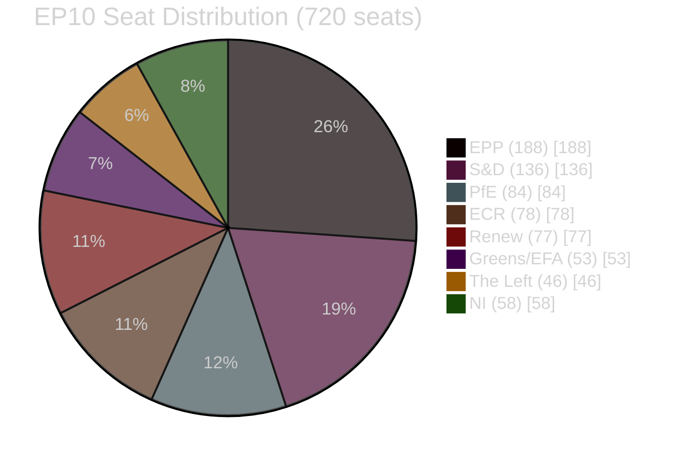
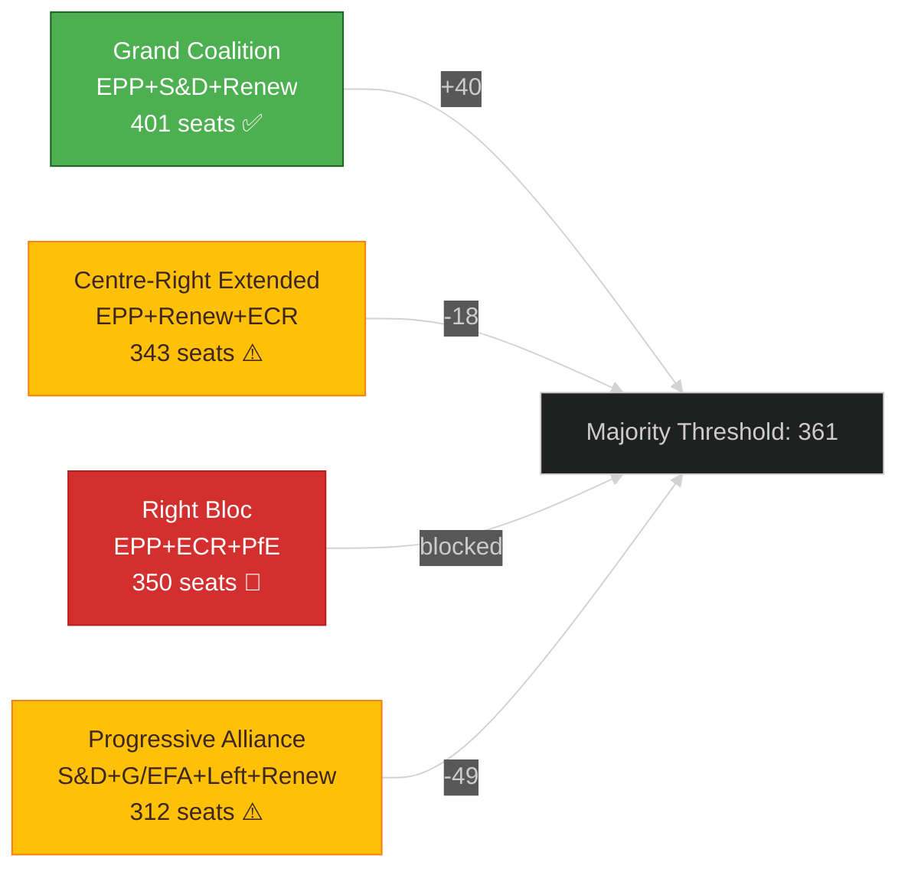

<!-- SPDX-FileCopyrightText: 2024-2026 Hack23 AB -->
<!-- SPDX-License-Identifier: Apache-2.0 -->

# 🧮 Coalition Mathematics Template

**Template Purpose:** Model majority-building arithmetic for the European Parliament, analyzing which political group coalitions can reach the 361-seat threshold and their policy implications.

**Methodology:** [electoral-domain-methodology.md §Part 1](../methodologies/electoral-domain-methodology.md#part-1--coalition-mathematics-coalition-mathematicsmd)

**Min Lines:** 200

---

## 📋 Header Block

```markdown
# Coalition Mathematics: {POLICY ISSUE / VOTE}

**Classification:** PUBLIC | SENSITIVE | RESTRICTED
**Date:** {ISO date}
**Subject:** {What coalition is being modeled for}
**EP10 Baseline:** 720 seats, 361 majority
**Data Source:** EP MCP `analyze_coalition_dynamics`, `get_voting_records`

---
```

## 📊 Section 1 — Current Seat Distribution

**Required:** Accurate EP10 political group composition.

```markdown
## EP10 Seat Distribution

| Political Group | Seats | Share | Coalition Role |
|-----------------|-------|-------|----------------|
| **EPP** | 188 | 26.1% | Centre-right anchor |
| **S&D** | 136 | 18.9% | Centre-left anchor |
| **PfE** | 84 | 11.7% | Right sovereignist (cordon sanitaire) |
| **ECR** | 78 | 10.8% | Right flank, selective ally |
| **Renew** | 77 | 10.7% | Liberal centre, kingmaker |
| **Greens/EFA** | 53 | 7.4% | Green-left bloc |
| **The Left** | 46 | 6.4% | Left opposition |
| **NI** | 58 | 8.1% | Non-Inscrits |
| **Total** | **720** | **100%** | **Majority: 361** |

*Source: European Parliament, as of {date}*
```

## 🥧 Section 2 — Seat Distribution Mermaid

**Required:** Visual representation of group sizes.



## 🤝 Section 3 — Coalition Scenarios

**Required:** ≥4 coalition scenarios with arithmetic and policy analysis.

### Coalition Scenario Template (repeat for each scenario)

````markdown
### Scenario {N}: {Coalition Name}

**Formula:** {Group 1} + {Group 2} + {Group 3} = {Total} seats

**Arithmetic:**
```
{Group 1}: {seats}
{Group 2}: {seats}
{Group 3}: {seats}
────────────────────
Total: {sum} seats
Majority threshold: 361
Margin: {sum - 361} seats (±{percentage}%)
```

**Viability:** ✅ VIABLE | ⚠️ MARGINAL | 🚫 BLOCKED

**Policy Implications:**
- {Policy area 1}: {Expected position}
- {Policy area 2}: {Expected position}
- {Policy area 3}: {Expected position}

**Stress Points:**
| Group Pair | Tension Area | Risk Level |
|------------|-------------|------------|
| {Group A} ↔ {Group B} | {Policy difference} | HIGH/MED/LOW |

**Historical Precedent:** {Reference to when this coalition has/hasn't worked}
````

### Standard Coalition Scenarios

```markdown
### Scenario 1: Grand Coalition (EPP + S&D + Renew)

**Formula:** EPP + S&D + Renew = 401 seats

**Arithmetic:**
EPP: 188
S&D: 136
Renew: 77
────────────────────
Total: 401 seats
Margin: +40 seats (+5.6%)

**Viability:** ✅ VIABLE — default governing formula

**Policy Implications:**
- Climate: Moderate Green Deal continuation
- Economy: Pro-market with social safeguards
- Migration: Centrist compromise approach
- Foreign policy: Atlanticist consensus

---

### Scenario 2: Centre-Right Extended (EPP + Renew + ECR)

**Formula:** EPP + Renew + ECR = 343 seats

**Arithmetic:**
EPP: 188
Renew: 77
ECR: 78
────────────────────
Total: 343 seats
Margin: -18 seats (requires defections)

**Viability:** ⚠️ MARGINAL — requires 18+ S&D or Greens defections

---

### Scenario 3: Right Bloc (EPP + ECR + PfE)

**Formula:** EPP + ECR + PfE = 350 seats

**Viability:** 🚫 BLOCKED — cordon sanitaire against PfE

---

### Scenario 4: Progressive Alliance (S&D + Greens/EFA + The Left + Renew)

**Formula:** S&D + Greens + Left + Renew = 312 seats

**Viability:** ⚠️ MARGINAL — requires 49+ EPP defections
```

## 📈 Section 4 — Coalition Feasibility Mermaid

**Required:** Visual comparison of coalition viability.



## 🎯 Section 5 — Issue-Specific Analysis

**Required:** Analysis of how coalition math applies to the specific policy issue.

```markdown
## Issue-Specific Coalition Analysis: {POLICY ISSUE}

### Expected Voting Pattern

| Political Group | Expected Position | Confidence | Reasoning |
|-----------------|-------------------|------------|-----------|
| EPP | FOR / AGAINST / SPLIT | 🟢/🟡/🔴 | {Brief rationale} |
| S&D | ... | ... | ... |
| Renew | ... | ... | ... |
| Greens/EFA | ... | ... | ... |
| ECR | ... | ... | ... |
| PfE | ... | ... | ... |
| The Left | ... | ... | ... |
| NI | ... | ... | ... |

### Projected Vote Count

**FOR:** {sum} seats ({percentage}%)
**AGAINST:** {sum} seats ({percentage}%)
**ABSTAIN/ABSENT:** {sum} seats ({percentage}%)

**Outcome:** ✅ PASS / ❌ FAIL / ⚠️ TOO CLOSE TO CALL

### Swing Analysis

| If {Group} changes position... | New count | Outcome |
|-------------------------------|-----------|---------|
| {Scenario 1} | {seats} | PASS/FAIL |
| {Scenario 2} | {seats} | PASS/FAIL |
```

## 🔀 Section 6 — Cross-Party Alliance Patterns

**Required:** Analysis of observed cross-party voting patterns.

```markdown
## Cross-Party Alliance Patterns

### Historical Alignment Rates (last 12 months)

| Group Pair | Alignment % | Sample Size | Trend |
|------------|-------------|-------------|-------|
| EPP ↔ S&D |  | {N votes} | ↑/↓/→ |
| EPP ↔ ECR |  | {N votes} | ↑/↓/→ |
| ECR ↔ PfE | {%} | {N votes} | ↑/↓/→ |

*Source: EP MCP `analyze_coalition_dynamics`, `compare_political_groups`*
```

## ⚠️ Section 7 — Cordon Sanitaire Analysis

**Required:** Explicit analysis of political constraints.

```markdown
## Political Constraints

### Cordon Sanitaire Status

| Group | Status | Implication |
|-------|--------|-------------|
| PfE | 🚫 Active cordon | EPP will not form explicit coalition |
| NI (AfD portion) | 🚫 Active cordon | Excluded from coalition arithmetic |
| ECR | ⚠️ Partial | EPP cooperates on selected issues |

### Constraint Impact
{Analysis of how political constraints affect coalition viability}
```

## 📝 Section 8 — Sources

**Required:** EP data sources for coalition analysis.

```markdown
## Sources

1. EP MCP `analyze_coalition_dynamics` — {retrieval timestamp}
2. EP MCP `get_voting_records` — {date range queried}
3. EP MCP `compare_political_groups` — {parameters}
4. [European Parliament composition]({URL}) — **A1**
```

## ✅ Quality Checklist

- [ ] All 8 political groups included with correct seat counts
- [ ] Seat total = 720, majority = 361
- [ ] ≥4 coalition scenarios modeled
- [ ] Arithmetic verified for each scenario
- [ ] Seat distribution pie chart included
- [ ] Coalition feasibility graph included
- [ ] Issue-specific voting projection included
- [ ] Swing analysis for critical groups
- [ ] Cross-party alignment rates documented
- [ ] Cordon sanitaire constraints explicitly stated

---

*Template version 1.0 — EU Parliament Monitor Coalition Mathematics*
