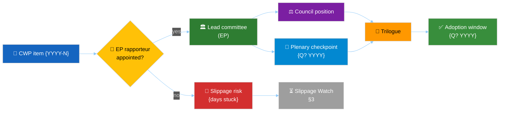

<!-- SPDX-FileCopyrightText: 2024-2026 Hack23 AB -->
<!-- SPDX-License-Identifier: Apache-2.0 -->

# 📜 Commission Work Programme Alignment Template

**Template Purpose:** Map EP positions vs the Commission Work Programme (CWP) line items. Quarterly+ artifact that surfaces which CWP commitments have an EP rapporteur, what stage each is at, and where EP vs Commission diverges.

**Methodology:** [forward-projection-methodology.md](../methodologies/forward-projection-methodology.md) and [electoral-cycle-methodology.md §6](../methodologies/electoral-cycle-methodology.md)

**Min Lines:** 180 (`quarter-ahead`), 220 (`year-ahead`, `year-in-review`, `term-outlook`), 240 (`election-cycle`).

**Required by:** `quarter-ahead`, `year-ahead`, `year-in-review`, `term-outlook`, `election-cycle`. Optional for `quarter-in-review`.

---

## 📋 Header Block

```markdown
# Commission Work Programme Alignment — CWP {YYYY} — {Run Date}

**Classification:** PUBLIC
**CWP edition:** {YYYY}
**CWP source document:** {ID from get_external_documents}
**EP-side stages tracked:** {N}
**Source:** get_external_documents (workType: commission-work-programme, communication)
```

---

## 🎯 Section 1 — CWP Snapshot



```markdown
| CWP item # | Title | Type (legislative / non-legislative) | Adopted? | EP rapporteur (committee, group) | Current EP stage | Plenary checkpoint | Adoption window |
|---|---|---|---|---|---|---|---|
| 2026-1 | … | legislative | ✅ proposal adopted | … (ENVI, S&D) | committee | Q3 2026 | Q4 2026 |
| … | … | … | … | … | … | … | … |
```

Mark the EP rapporteur cell `— (no rapporteur appointed yet)` when the CWP item has no EP-side counterpart yet — this is itself a signal that the priority is at risk of slipping out of the term.

---

## 🤝 Section 2 — Alignment Score per Item

For each CWP item with EP-side activity, score alignment 1–5:

```markdown
| CWP item | EP committee position | Commission position | Council position | Alignment (1–5) | Notes |
|---|---|---|---|---|---|
| 2026-1 | … | … | … | 3 | EP wants stronger Annex II than CWP foresaw |
```

---

## ⚠️ Section 3 — Slippage Watch

CWP items that have **not** moved stage in the trailing 90 days:

```markdown
| CWP item | Last stage transition | Days stuck | Plausible cause | WEP for completion within term |
|---|---|---|---|---|
| 2025-23 | committee referral | 142 | Council Trio handover blocked progress | Unlikely (15–40%) |
```

Stage C should 🟡-warn when ≥ 30% of CWP items show ≥ 90 days stuck.

---

## 🆕 Section 4 — New / Amended Commission Communications

Capture the trailing-90-day flow of Commission communications that touch the CWP scope (e.g. revised proposals, amended impact assessments).

```markdown
| Date | Communication | CWP item touched | EP-side reaction |
|---|---|---|---|
| 2026-04-15 | COM(2026)123 final | 2026-1 | ENVI motion to invite Commissioner; trilogue reset |
```

---

## 🪞 Section 5 — Drift vs Prior Run

Compare against the previous `commission-wp-alignment.md`. Surface any CWP item whose adoption window slipped beyond the horizon and any item whose alignment score moved ≥ 2 steps.

---

## 📝 Section 6 — Pass-2 Quality Self-Audit

```markdown
- [ ] CWP snapshot covers ≥ 80% of legislative CWP items adopted to date
- [ ] Alignment score populated for every CWP item with EP-side activity
- [ ] Slippage watch identifies the top-3 stuck items
- [ ] New / amended communications table populated for the trailing 90 days
- [ ] Drift vs prior run reconciled
```

---

## ⚙️ Section 7 — Methodology Compliance

Cite the CWP source document ID and any private/leaked Commission planning document only when corroborated by an Admiralty A2 source.
