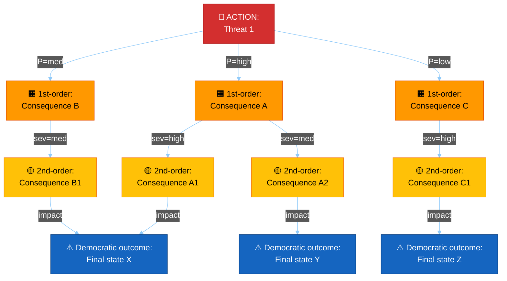
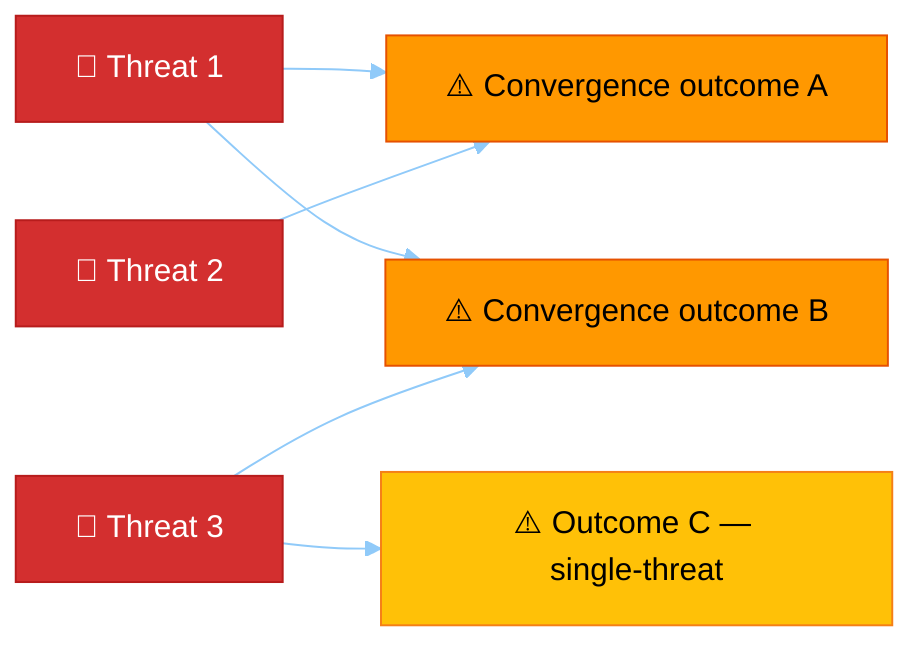
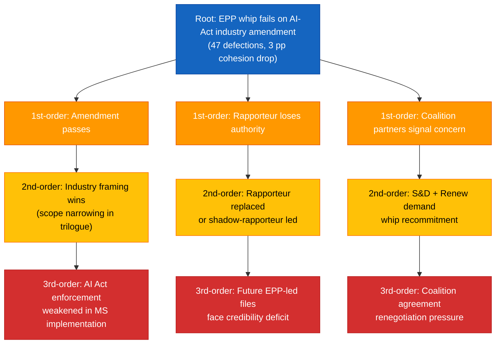

<!-- SPDX-FileCopyrightText: 2024-2026 Hack23 AB -->
<!-- SPDX-License-Identifier: Apache-2.0 -->

# 🌳 Consequence Trees Template — Multi-Level Threat Consequence Analysis

> **📌 Template Instructions:** Copy to `analysis/daily/{date}/{article-type}-run{N}/threat-assessment/consequence-trees.md`. Per‑threat consequence tree mapping action → first‑order consequence → second‑order consequence → democratic outcome. Include a **convergence diagram** showing where multiple threats hit the same outcome, and an **intervention‑points** map. See [methodologies/per-artifact-methodologies.md §consequence-trees](../methodologies/per-artifact-methodologies.md#consequence-trees).

> **🎯 Purpose:** Structured consequence mapping showing how named threats cascade through multiple causal levels to reach democratic outcomes (rule‑of‑law erosion, electoral capture, single‑market fragmentation, etc.), with explicit intervention‑point identification. **Multi‑national extension over Riksdagsmonitor:** every consequence chain carries cluster impact tags so cross‑border cascades surface explicitly.

---

## 📋 Document Metadata

| Field | Value |
|-------|-------|
| **Report ID** | `[REQUIRED: CT-YYYY-MM-DD-runNN]` |
| **Period** | `[REQUIRED: YYYY-MM-DD to YYYY-MM-DD]` |
| **Threats Analyzed** | `[REQUIRED: count ≥3]` |
| **Tree Depth** | `[REQUIRED: ≥3 levels per tree]` |
| **Convergence Outcomes Identified** | `[REQUIRED: count ≥1]` |
| **Confidence** | `[REQUIRED: 🟢 HIGH / 🟡 MEDIUM / 🔴 LOW]` |
| **PIR Tags** | `[REQUIRED]` |

---

## 1️⃣ Threat Roster

| # | Threat name | Source actor / mechanism | Cluster origin | Triggering event window |
|:-:|-------------|--------------------------|:--------------:|-------------------------|
| 1 | `[REQUIRED]` | `[REQUIRED]` | `[N/W/S/CE/external]` | `[REQUIRED: date range]` |
| 2 | `[REQUIRED]` | `[REQUIRED]` | `[…]` | `[REQUIRED]` |
| 3 | `[REQUIRED]` | `[REQUIRED]` | `[…]` | `[REQUIRED]` |

*(≥3 threats.)*

---

## 2️⃣ Consequence Tree — Threat 1: `[REQUIRED: name]`

**Tree depth:** ≥3 levels (action → first‑order → second‑order → democratic outcome)

**Branch table — Threat 1:**

| Branch path | Probability (WEP band) | Severity | Cluster impact | Mechanism (≥40 words) |
|-------------|:----------------------:|:--------:|:--------------:|------------------------|
| ROOT → A → A1 → X | `[Almost Certain / Very Likely / Likely / Even Chance / Unlikely / Very Unlikely / Almost No Chance]` | `[High/Med/Low]` | `[N/W/S/CE]` | `[REQUIRED: ≥40 words]` |
| ROOT → A → A2 → Y | `[…]` | `[…]` | `[…]` | `[REQUIRED]` |
| ROOT → B → B1 → X | `[…]` | `[…]` | `[…]` | `[REQUIRED]` |
| ROOT → C → C1 → Z | `[…]` | `[…]` | `[…]` | `[REQUIRED]` |

*(≥4 branches enumerated.)*

---

## 3️⃣ Consequence Tree — Threat 2: `[REQUIRED]`

*(Repeat full Mermaid + branch table structure.)*

---

## 4️⃣ Consequence Tree — Threat 3: `[REQUIRED]`

*(Repeat full Mermaid + branch table structure.)*

---

## 5️⃣ Cross‑Tree Convergence Map

Where multiple threats funnel into the same democratic outcome — these are the highest‑priority intervention points.

**Convergence narrative:** `[REQUIRED: ≥100 words — which democratic outcome is hit by the most threats, why this matters more than single‑threat outcomes, and what the compound effect would look like in practice.]`

---

## 6️⃣ Intervention‑Points Catalog

For each tree, identify the earliest branch where intervention can prevent escalation to the democratic outcome — and the institutional actor empowered to act.

| # | Tree | Branch intercepted | Intervention lever | Empowered actor | Time horizon | Reversibility |
|:-:|------|---------------------|---------------------|------------------|:------------:|:-------------:|
| 1 | Threat 1 | `[REQUIRED: branch]` | `[REQUIRED: ≥30 words]` | `[Commission / EP committee / Council / Court / member state]` | `[weeks]` | `[Hard / Soft]` |
| 2 | Threat 2 | `[REQUIRED]` | `[REQUIRED]` | `[…]` | `[weeks]` | `[…]` |
| 3 | Threat 3 | `[REQUIRED]` | `[REQUIRED]` | `[…]` | `[weeks]` | `[…]` |
| 4 | Convergence A | `[REQUIRED]` | `[REQUIRED]` | `[…]` | `[weeks]` | `[…]` |

*(≥4 intervention points; convergence outcomes get a dedicated row.)*

**Intervention narrative:** `[REQUIRED: ≥80 words — which intervention has highest leverage and which is most reversible if applied prematurely.]`

---

## 7️⃣ Cross‑Cluster Cascade Impact

| Cluster | Threat 1 cascade severity | Threat 2 cascade severity | Threat 3 cascade severity | Composite |
|---------|:-------------------------:|:-------------------------:|:-------------------------:|:---------:|
| Northern | `[🟢/🟡/🔴]` | `[🟢/🟡/🔴]` | `[🟢/🟡/🔴]` | `[🟢/🟡/🔴]` |
| Western | `[🟢/🟡/🔴]` | `[🟢/🟡/🔴]` | `[🟢/🟡/🔴]` | `[🟢/🟡/🔴]` |
| Southern | `[🟢/🟡/🔴]` | `[🟢/🟡/🔴]` | `[🟢/🟡/🔴]` | `[🟢/🟡/🔴]` |
| Central‑Eastern | `[🟢/🟡/🔴]` | `[🟢/🟡/🔴]` | `[🟢/🟡/🔴]` | `[🟢/🟡/🔴]` |

**Cluster narrative:** `[REQUIRED: ≥60 words — which cluster bears the largest aggregated cascade severity.]`

---

## 8️⃣ Reader Briefing — Plain Language

> 📰 **Newsroom hook:** `[REQUIRED: one‑sentence summary.]`

- **The threat that matters most this period:** `[REQUIRED: ≥40 words]`
- **What it could lead to in plain language:** `[REQUIRED: ≥40 words]`
- **The earliest moment to act:** `[REQUIRED: ≥40 words]`
- **Who is empowered to intervene:** `[REQUIRED: ≥40 words]`

---

## 9️⃣ Data Sources & Provenance

**EP MCP tools used:** `correlate_intelligence`, `early_warning_system`, `analyze_coalition_dynamics`, `track_legislation`, `get_procedures` *(REQUIRED: ≥3)*

| Source | Type | Admiralty | Link |
|--------|------|:---------:|------|
| `[REQUIRED]` | `[Primary EP / Court / Press / Analyst]` | `[A1‑F6]` | `[URL]` |
| `[REQUIRED]` | `[…]` | `[…]` | `[…]` |

---

## 🔟 Confidence & Caveats

- **Overall confidence:** `[REQUIRED: 🟢/🟡/🔴]`
- **Top uncertainty:** `[REQUIRED: ≥40 words]`
- **Counter‑evidence:** `[REQUIRED: ≥30 words on the strongest reason any of these trees might NOT cascade as drawn.]`
- **Validity window:** `[REQUIRED: how long these trees remain accurate before next refresh.]`

---

## 🛠️ Worked example — consequence tree on EPP whip-discipline failure

**Convergence**: L3A and L3C both lead to weaker AI-governance regime in
2027 if combined; this is the most-likely tail outcome (𝑃≈25%).

**Counter-evidence**: L2C may strengthen rather than weaken coalition if
S&D/Renew pressure produces a credible commitment from EPP leadership.
This branch carries 𝑃≈30% in the probability-redistribution.

**Validity window**: 4-6 weeks. Re-evaluate after the next IMCO vote
or coalition coordination meeting.

## 🚫 Anti-patterns — consequence-tree failures

| Anti-pattern | Why it fails | Correct approach |
|---|---|---|
| Single-branch tree | Misses alternatives | ≥3 branches per level |
| Tree without root event | Floating speculation | Anchor to a specific named event |
| Leaves without probability | Cannot rank scenarios | Each leaf carries 𝑃 estimate |
| Tree that converges to one outcome | Hidden determinism | Show convergence AND divergence paths |
| Mermaid alone, no narrative | Visual without analysis | Each level: ≥1 paragraph of explanation |
| 5+ levels deep | Loses tractability | Cap at 3 levels (1st, 2nd, 3rd order) |
| No counter-evidence | Single-perspective failure | §Counter-evidence required |
| Static tree, no validity window | Tree may stale | "Re-evaluate by date X" |

## 🎯 EP MCP tool inputs

| Tool | Used for |
|---|---|
| `track_legislation` | Procedure-anchored root events |
| `analyze_coalition_dynamics` | Coalition-stress branches |
| `monitor_legislative_pipeline` | Pipeline-impact branches |
| `get_voting_records` | Discipline-failure root events |
| `get_procedure_events` | Trilogue-collapse branches |

## 🔗 Controlling methodology cross-references

- [`../methodologies/political-threat-framework.md`](../methodologies/political-threat-framework.md) — threat → consequence chains
- [`../methodologies/strategic-extensions-methodology.md §Scenarios`](../methodologies/strategic-extensions-methodology.md)
- [`scenario-forecast.md`](scenario-forecast.md) — scenarios feed root events

## ✅ Stage-C completeness signals

- Line floor: 150 lines
- ≥ 4 Mermaid trees (one per threat root + convergence map)
- 1st / 2nd / 3rd order labelled per branch
- Probability per leaf
- Counter-evidence + validity window present

---

**Document Control:** `/analysis/daily/{date}/{type}-run{N}/threat-assessment/consequence-trees.md` · Template v2.2 · Depth floor: 150 lines · Mermaid diagrams: ≥4 (one tree per threat + convergence map) · Reader briefing: required.
