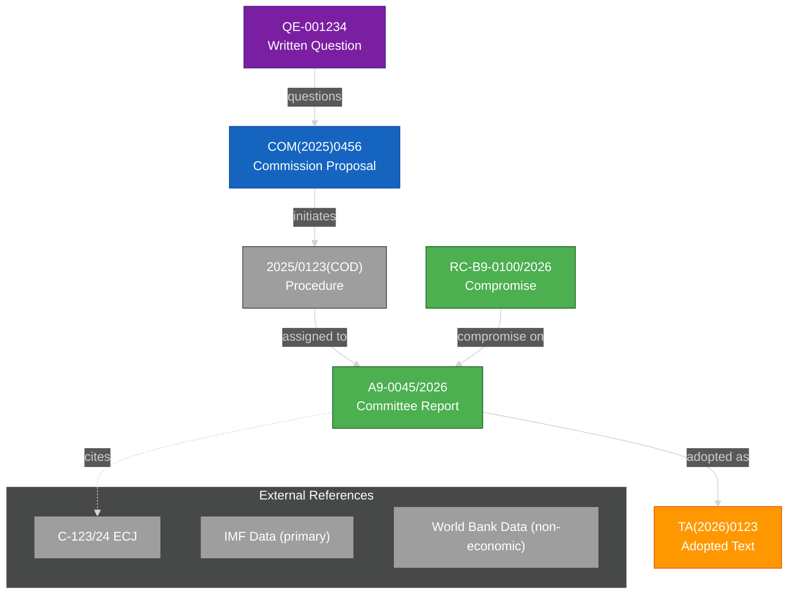

<!-- SPDX-FileCopyrightText: 2024-2026 Hack23 AB -->
<!-- SPDX-License-Identifier: Apache-2.0 -->

# 🗺️ Cross-Reference Map Template

**Template Purpose:** Document-to-document relationship mapping and claim provenance tracking — human-readable link graph showing how evidence flows through the analysis.

**Methodology:** [structural-metadata-methodology.md §Part 2](../methodologies/structural-metadata-methodology.md#part-2--cross-reference-mapmd-structure)

**Min Lines:** 150

---

## 📋 Header Block

```markdown
# Cross-Reference Map: {RUN ID}

**Classification:** PUBLIC
**Date:** {ISO date}
**Run ID:** {article-type}-{date}-run{NN}
**Artifacts Mapped:** {Count}
**Documents Referenced:** {Count}
**Citation Integrity:** {Percentage}%

---
```

## 🎯 Section 1 — Purpose

**Required:** Brief explanation of what this map provides.

```markdown
## Purpose

This cross-reference map enables:

1. **Claim Provenance** — trace any analytical claim back to its source document
2. **Document Relationships** — understand how EP documents relate to each other
3. **Citation Integrity** — verify that all claims are properly sourced
4. **Audit Trail** — provide transparency for analytical process
```

## 📊 Section 2 — Artifact → Source Matrix

**Required:** Table mapping each analysis artifact to its source documents.

```markdown
## Artifact → Source Matrix

| Artifact | Primary Sources | Secondary Sources | Source Count | Admiralty Range |
|----------|-----------------|-------------------|--------------|-----------------|
| `intelligence/synthesis-summary.md` | TA(2026)0123, A9-0045/2026 | QE-001234, COM(2025)456 | 8 | A1-B2 |
| `intelligence/stakeholder-map.md` | get_meps(country=*), get_voting_records | MEP statements, press | 12 | A1-C2 |
| `intelligence/scenario-forecast.md` | get_procedures, track_legislation | IMF WEO GDP projections | 6 | A1-B2 |
| `intelligence/pestle-analysis.md` | get_adopted_texts, get_external_documents | Eurostat, IMF | 10 | A1-B2 |
| `intelligence/threat-model.md` | analyze_coalition_dynamics, detect_voting_anomalies | Expert analysis | 7 | A1-C2 |
| `intelligence/coalition-dynamics.md` | compare_political_groups, get_voting_records | — | 5 | A1-A2 |
| `classification/significance-classification.md` | All EP documents | — | {N} | A1 |
| `risk-scoring/risk-matrix.md` | threat-model, stakeholder-map | Historical precedent | 8 | A1-B2 |
| ... | ... | ... | ... | ... |

### Matrix Legend

- **Primary Sources:** EP documents or MCP tool outputs directly cited
- **Secondary Sources:** Supporting evidence, external comparators
- **Source Count:** Total distinct sources referenced
- **Admiralty Range:** Span of source reliability grades used
```

## 🔗 Section 3 — Document → Document Links

**Required:** Table showing relationships between source documents.

```markdown
## Document → Document Links

| Document A | Relationship | Document B | Evidence |
|------------|--------------|------------|----------|
| COM(2025)0456 | Initiates | 2025/0123(COD) | Procedure creation |
| A9-0045/2026 | Reports on | 2025/0123(COD) | Committee assignment |
| TA(2026)0123 | Adopts | A9-0045/2026 | Plenary vote |
| QE-001234 | Questions | COM(2025)0456 | Parliamentary scrutiny |
| RC-B9-0100/2026 | Amends | B9-0098/2026 | Compromise amendment |
| TA(2026)0124 | References | TA(2025)0500 | Previous position |
| A9-0046/2026 | Cites | C-123/24 (ECJ) | Legal precedent |

### Relationship Types

| Type | Meaning |
|------|---------|
| **Initiates** | Creates a new legislative procedure |
| **Reports on** | Committee report on procedure |
| **Adopts** | Plenary adopts committee position |
| **Amends** | Modifies another document |
| **References** | Cites without formal legal connection |
| **Questions** | Parliamentary scrutiny of |
| **Responds to** | Official response to question/request |
| **Supersedes** | Replaces earlier document |
| **Implements** | Gives effect to higher-level act |
```

## 📈 Section 4 — Link Network Mermaid

**Required:** Visual representation of document relationships.



## ✅ Section 5 — Citation Integrity Check

**Required:** Verification that claims are properly sourced.

```markdown
## Citation Integrity Assessment

### Per-Artifact Integrity

| Artifact | Total Claims | Claims Sourced | Unsourced | Integrity % |
|----------|--------------|----------------|-----------|-------------|
| synthesis-summary.md | 24 | 24 | 0 | 100% ✅ |
| stakeholder-map.md | 18 | 17 | 1 | 94% ⚠️ |
| scenario-forecast.md | 15 | 15 | 0 | 100% ✅ |
| pestle-analysis.md | 30 | 30 | 0 | 100% ✅ |
| threat-model.md | 22 | 21 | 1 | 95% ⚠️ |
| devils-advocate-analysis.md | 32 | 32 | 0 | 100% ✅ |
| coalition-dynamics.md | 12 | 12 | 0 | 100% ✅ |
| **TOTAL** | **153** | **151** | **2** | **98.7%** ✅ |

### Unsourced Claims (Flagged)

| Artifact | Claim | Reason Unsourced | Mitigation |
|----------|-------|------------------|------------|
| stakeholder-map.md | {Specific claim} | {Why no source} | {How addressed} |
| threat-model.md | {Specific claim} | {Why no source} | {How addressed} |

### Integrity Standard

| Level | Threshold | Assessment |
|-------|-----------|------------|
| 🟢 Excellent | ≥98% | Current run |
| 🟡 Acceptable | 95-97% | — |
| 🔴 Below Standard | <95% | — |
```

## 📊 Section 6 — Source Distribution

**Required:** Breakdown of sources by Admiralty grade.

```markdown
## Source Distribution by Admiralty Grade

| Grade | Count | Percentage | Description |
|-------|-------|------------|-------------|
| **A1** | {N} | {%}% | EP plenary records, official votes |
| **A2** | {N} | {%}% | Committee documents, official statements |
| **B1** | {N} | {%}% | EP press releases, spokesperson |
| **B2** | {N} | {%}% | MEP statements, parliamentary questions |
| **B3** | {N} | {%}% | Council positions, MS government |
| **C2** | {N} | {%}% | Quality press with named sources |
| **C3** | {N} | {%}% | Press with anonymous sources |
| **TOTAL** | **{N}** | **100%** | |

### Source Quality Assessment

**Primary Source Ratio:** {A1+A2} / {Total} = {%}%

**Standard:** ≥60% primary sources (A1-A2) for analytical confidence
```

## 🔍 Section 7 — Claim Trace Examples

**Required:** Demonstrate how claims trace to sources.

```markdown
## Claim Provenance Examples

### Example 1: Political Group Position
- **Claim:** "EPP supports the Commission proposal with amendments to Article 5"
- **Artifact:** synthesis-summary.md, §Key Findings
- **Source Chain:**
  1. A9-0045/2026 EPP shadow rapporteur amendments — **A2**
  2. EPP group coordinator statement in committee — **B2**
  3. Roll-call vote record showing EPP voting pattern — **A1**
- **Confidence:** 🟢 HIGH (triangulated from 3 sources)

### Example 2: Coalition Dynamic
- **Claim:** "S&D-Greens/EFA alignment on environmental provisions exceeds 85%"
- **Artifact:** coalition-dynamics.md, §Cross-Party Alignment
- **Source Chain:**
  1. EP MCP `analyze_coalition_dynamics` output — **A1**
  2. get_voting_records for 2026 environment votes — **A1**
- **Confidence:** 🟢 HIGH (EP official data)

### Example 3: Stakeholder Position (External)
- **Claim:** "Industry association opposes Article 7 requirements"
- **Artifact:** stakeholder-map.md, §External Stakeholders
- **Source Chain:**
  1. Published position paper on EU Transparency Register — **B2**
  2. Trade press reporting of lobbying position — **C2**
- **Confidence:** 🟡 MEDIUM (no official EP record)
```

## 📝 Section 8 — EP MCP Tool Attribution

**Required:** Document which MCP tools fed which artifacts.

```markdown
## EP MCP Tool Attribution

| Tool | Artifacts Fed | Call Count | Data Volume |
|------|---------------|------------|-------------|
| `get_adopted_texts` | synthesis-summary, pestle, significance | 3 | 47 documents |
| `get_procedures` | scenario-forecast, track-legislation | 2 | 12 procedures |
| `get_meps` | stakeholder-map, actor-mapping | 4 | 720 MEPs |
| `get_voting_records` | coalition-dynamics, voting-patterns | 2 | 156 votes |
| `analyze_coalition_dynamics` | coalition-dynamics, threat-model | 1 | 1 analysis |
| `get_parliamentary_questions` | pestle, synthesis-summary | 1 | 34 questions |
| `detect_voting_anomalies` | threat-model, risk-matrix | 1 | 1 analysis |
| `compare_political_groups` | coalition-dynamics | 1 | 1 comparison |

### External Data Sources

| Source | Artifacts Fed | Admiralty Grade |
|--------|---------------|-----------------|
| IMF WEO / FM / IFS (primary economic) | economic-context, pestle, scenario-forecast, implementation-feasibility | A2 |
| Eurostat (Tier-1 triangulation) | comparative-international, economic-context | A2 |
| World Bank WGI (non-economic only) | comparative-international, pestle | B2 |
```

## ✅ Quality Checklist

- [ ] Artifact → Source matrix complete for all artifacts
- [ ] Document → Document links section populated
- [ ] Link network Mermaid visualizes key relationships
- [ ] Citation integrity ≥95% for all artifacts
- [ ] Unsourced claims flagged and explained
- [ ] Source distribution by Admiralty grade documented
- [ ] ≥60% primary sources (A1-A2)
- [ ] Claim trace examples demonstrate provenance
- [ ] EP MCP tool attribution complete

---

*Template version 1.0 — EU Parliament Monitor Cross-Reference Map*
