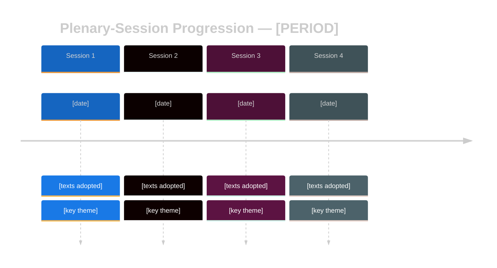

<!-- SPDX-FileCopyrightText: 2024-2026 Hack23 AB -->
<!-- SPDX-License-Identifier: Apache-2.0 -->

# 🔄 Cross-Session Intelligence Template — Plenary-Session Progression

> **📌 Template Instructions:** Copy to `analysis/daily/{date}/{article-type}-run{N}/intelligence/cross-session-intelligence.md`. Used by `week-in-review`, `month-in-review`, and `motions` runs (the latter covers the quarterly-scope case by aggregating a parliamentary quarter). See [methodologies/per-artifact-methodologies.md §cross-session-intelligence](../methodologies/per-artifact-methodologies.md#cross-session-intelligence).

> **🎯 Purpose:** Narrate the progression of parliamentary politics *across plenary sessions* within a period (week / month / quarter). Distinct from [`cross-run-diff.md`](../methodologies/per-artifact-methodologies.md#cross-run-diff) (which is cross-run of the *same* article type) — this file is the **session-over-session** story: how the political programme matured, where momentum accelerated, which session was the crystallisation moment.

---

## 📋 Document Metadata

| Field | Value |
|-------|-------|
| **Report ID** | `[REQUIRED: CSI-YYYY-MM-DD-runNN]` |
| **Period Covered** | `[REQUIRED: e.g. Q1 2026 (Jan–Mar)]` |
| **Sessions in Scope** | `[REQUIRED: ≥2 plenary part-sessions]` |
| **Parliament Term** | `[REQUIRED: EP9 / EP10]` |
| **Confidence** | `[REQUIRED: 🟢/🟡/🔴]` |

---

## 1️⃣ Session Overview

| Session | Dates | Sitting Days | Location | Texts Adopted | Theme |
|---------|-------|:-----------:|:--------:|:-------------:|-------|
| `[REQUIRED]` | `[REQUIRED]` | `[#]` | `Strasbourg/Brussels` | `[#]` | `[REQUIRED: 1-line theme]` |
| `[REQUIRED]` | `[REQUIRED]` | `[#]` | `[...]` | `[#]` | `[REQUIRED]` |
| `[REQUIRED]` | `[REQUIRED]` | `[#]` | `[...]` | `[#]` | `[REQUIRED]` |

**Period totals**: `[# sitting days]`, `[# adopted texts]`, `[# roll-call votes]`, `[# resolutions]`.

---

## 2️⃣ Progression Diagram

---

## 3️⃣ Session-by-Session Progression

### Session 1 — `[REQUIRED: name]`

**Character**: `[REQUIRED: 1 sentence]`

`[REQUIRED: ≥200 words of political narrative. Name the procedural moments, the rapporteurs, the coalition behaviour. Cite ≥2 RCV IDs or adopted-text IDs. Explain why this session mattered in the period's arc.]`

**Key adopted texts this session**:
- `[REQUIRED: TA-YY-YYYY-NNNN]` — `[REQUIRED: title]`
- `[REQUIRED]` — `[REQUIRED]`
- `[REQUIRED]` — `[REQUIRED]`

### Session 2 — `[REQUIRED: name]`

**Character**: `[REQUIRED]`

`[REQUIRED: ≥200 words — same structure]`

**Key adopted texts this session**: `[≥3]`

### Session 3 — `[REQUIRED: name]`

**Character**: `[REQUIRED]`

`[REQUIRED: ≥200 words]`

**Key adopted texts this session**: `[≥3]`

### Session N — `[REQUIRED]`

*(repeat as needed)*

---

## 4️⃣ Cross-Session Themes

| Theme | Sessions Touched | Trajectory | Key Evidence |
|-------|:----------------:|------------|--------------|
| `[REQUIRED: e.g. Defence Union]` | `[1, 2, 4]` | `[REQUIRED: ≥30 words — escalating / consolidating / pivoting]` | `[REQUIRED: ≥2 citations]` |
| `[REQUIRED]` | `[...]` | `[REQUIRED]` | `[REQUIRED]` |
| `[REQUIRED]` | `[...]` | `[REQUIRED]` | `[REQUIRED]` |
| `[REQUIRED]` | `[...]` | `[REQUIRED]` | `[REQUIRED]` |

≥4 themes required.

---

## 5️⃣ Crystallisation Moment

Identify the **single most strategically concentrated session** of the period and explain why.

**Session**: `[REQUIRED]`
**Analysis**: `[REQUIRED: ≥250 words. What made this session the crystallisation moment? What texts adopted? What coalitions formed? Which rapporteurs emerged? How does it compare historically?]`

---

## 6️⃣ Momentum Indicators

| Indicator | Session 1 | Session 2 | Session 3 | Session 4 | Direction |
|-----------|:---------:|:---------:|:---------:|:---------:|:---------:|
| Texts adopted / day | `[#]` | `[#]` | `[#]` | `[#]` | `[↑/→/↓]` |
| Grand Centre cohesion % | `[%]` | `[%]` | `[%]` | `[%]` | `[↑/→/↓]` |
| RCVs per sitting day | `[#]` | `[#]` | `[#]` | `[#]` | `[↑/→/↓]` |
| Plenary attendance % | `[%]` | `[%]` | `[%]` | `[%]` | `[↑/→/↓]` |
| `[additional metric]` | `[#]` | `[#]` | `[#]` | `[#]` | `[↑/→/↓]` |

---

## 7️⃣ Forward Outlook for Next Session

| Topic | Expected Treatment | Confidence | Key Trigger |
|-------|--------------------|:----------:|-------------|
| `[REQUIRED]` | `[REQUIRED: ≥50 words]` | `[🟢/🟡/🔴]` | `[REQUIRED]` |
| `[REQUIRED]` | `[REQUIRED]` | `[...]` | `[REQUIRED]` |
| `[REQUIRED]` | `[REQUIRED]` | `[...]` | `[REQUIRED]` |

≥3 forecasts required.

---

**Document Control:** `/analysis/daily/{date}/{type}-run{N}/intelligence/cross-session-intelligence.md` · Template v1.1 · Depth floor: 220 lines (motions quarterly-scope runs), 150 lines (week-in-review / month-in-review).
