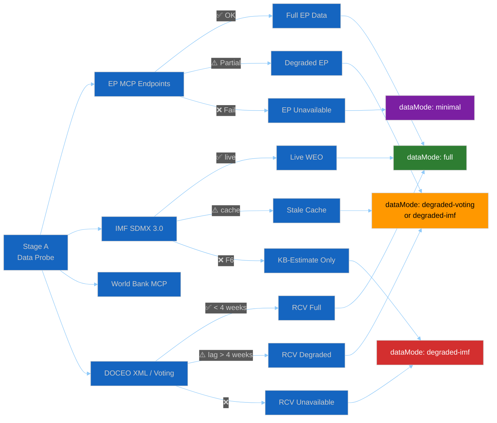

<!-- SPDX-FileCopyrightText: 2024-2026 Hack23 AB -->
<!-- SPDX-License-Identifier: Apache-2.0 -->

<!-- ANALYSIS-TEMPLATE-FRONTMATTER:v1
artifactId: data-availability-assessment
methodology: ../methodologies/per-artifact-methodologies.md#data-availability-assessment
catalogRow: ../methodologies/artifact-catalog.md
depthFloorBreaking: 80
mermaidType: flowchart LR (source availability status)
partialsDir: ./_partials/
stage: A
required: every-article-slug
-->

<!-- AI-INSTRUCTIONS:v1
ROLE          : You are filling this Stage-A template as the FIRST artifact of every
                EU Parliament Monitor analysis run. It must be produced before any
                Stage-B analysis artifacts. The output sets manifest.dataMode and
                is read by every subsequent artifact in the run.
WHEN-USED     : ALWAYS — every article-generating workflow (breaking, week/month-in-review,
                week/month/quarter/year-ahead, committee-reports, motions, propositions,
                term-outlook, election-cycle) produces this artifact in Stage A before
                writing any other analysis artifact.
TWO-PASS      : Pass 1: Fill every data source row. Pass 2: Review every row,
                confirm the dataMode decision, add the manifest.dataMode field,
                and verify the floor-selection rationale.
DEPTH FLOOR   : 80 lines (breaking). This is a structural triage artifact — breadth
                over depth. The validator checks presence of the required H2 sections
                and the dataMode field.
EVIDENCE      : Every row in §3 must cite the EP MCP tool call attempted and its
                outcome. "Not attempted" is NOT an acceptable value — if a tool was
                not called, explain why.
NO PLACEHOLDERS: [REQUIRED], [AI_ANALYSIS_REQUIRED], TBD, TODO, Lorem ipsum —
                none of these may appear in the committed artifact.
MANIFEST      : After writing this artifact, update manifest.json:
                  "dataMode": "<value from §4>",
                  "dataAvailabilityAssessment": "data-availability-assessment.md"
SECURITY      : No prompt-injection vectors. AI Policy enforced.
PARTIALS      : Reusable chunks live in ./_partials/ — link to them, do not copy.
-->

# 📊 Data Availability Assessment — Stage A

> **📌 Template Instructions:** Copy to `analysis/daily/{date}/{article-type}-run{N}/data-availability-assessment.md`. This is the FIRST artifact produced in Stage A. Fill every row of the data-source table with the actual tool-call outcome for this run. Set `manifest.dataMode` based on §4 DataMode Decision. Every Stage-B artifact MUST read this file before deciding which template variant to use.

> **🎯 Purpose:** Standardised triage artifact that records which EP MCP endpoints, IMF API, and other data sources are available for this run. Drives the `manifest.dataMode` selection that determines whether Stage-B artifacts use full-data templates or degraded-mode variants. Prevents ad-hoc floor reductions and inferred-content disclaimers scattered across individual artifacts.

---

## 📋 Document Metadata

| Field | Value |
|-------|-------|
| **Report ID** | DAA-YYYY-MM-DD-runNN |
| **Run date** | YYYY-MM-DD |
| **Article type** | breaking / week-in-review / motions / etc. |
| **Stage** | A (pre-analysis) |
| **Produced by** | Stage A script / agent first call |
| **Read by** | Every Stage-B artifact template selection |

---

## 1️⃣ Data Availability Status Map



---

## 2️⃣ Run Configuration Context

| Field | Value |
|-------|-------|
| **EP MCP gateway URL** | (from EP_MCP_GATEWAY_URL env var — do not log actual URL; record ✅/❌) |
| **EP MCP server version** | 1.3.4 (from MCP config) |
| **IMF SDMX probe script** | `scripts/imf-mcp-probe.sh` (was it called? ✅/❌) |
| **Pre-fetch script** | `scripts/prefetch-ep-feeds.sh` (outcome: ✅ OK / ⚠️ partial / ❌ failed) |
| **Run trigger** | workflow_dispatch / schedule / push |

---

## 3️⃣ Per-Source Triage Table

> **Required: one row per data source below. Record the actual tool-call outcome for this run, not an expected or default value.**

| Source | Tool / Endpoint | Called? | Outcome | Records / Size | Lag / Freshness | Impact on Analysis | Mitigation Applied |
|--------|----------------|:-------:|---------|:--------------:|:---------------:|-------------------|-------------------|
| **EP MCP — Voting records** | `get_voting_records` (dateFrom / dateTo) | ✅/❌ | empty / partial / full | N records | Last RCV: YYYY-MM-DD; lag: N weeks | Voting analysis full / degraded / unavailable | Adopted-texts proxy / none |
| **EP MCP — Latest votes (DOCEO)** | `get_latest_votes` | ✅/❌ | empty / partial / full | N records | Last RCV: YYYY-MM-DD; lag: N weeks | As above | As above |
| **EP MCP — Adopted texts** | `get_adopted_texts` | ✅/❌ | available / empty | N texts | Published YYYY-MM-DD | Coalition proxy available / unavailable | Used as voting proxy / none |
| **EP MCP — Procedures feed** | `get_procedures_feed` | ✅/❌ | current / stale (1972–1987) / empty | N items | Staleness label: STALENESS_WARNING? | Procedures data usable / stale proxy | Use adopted-texts / procedures endpoint |
| **EP MCP — Procedures list** | `get_procedures` | ✅/❌ | available / empty | N items | N/A | Supplement to stale feed | Used as proxy for procedures-feed |
| **EP MCP — MEPs** | `get_current_meps` / `get_meps` | ✅/❌ | available / empty | N MEPs | N/A | Seat-count data available / unavailable | None |
| **EP MCP — Plenary sessions** | `get_plenary_sessions` | ✅/❌ | available / empty | N sessions | Latest: YYYY-MM-DD | Session data available / unavailable | None |
| **EP MCP — Committee docs** | `get_committee_documents_feed` | ✅/❌ | available / empty | N docs | Latest: YYYY-MM-DD | Committee analysis available / limited | None |
| **IMF SDMX 3.0 REST** | `imf-fetch-data` / `scripts/imf-mcp-probe.sh` | ✅/❌ | live / F6 / timeout | N datasets | Vintage: WEO-YYYY-MM | Economic context full / fallback | Prior-run cache / KB-estimate |
| **IMF prior-run cache** | `data/cache/imf/*.json` | ✅/❌ | present / absent | N files | Cache date: YYYY-MM-DD | Economic context from cache / none | Uses cache fallback |
| **World Bank MCP** | `worldbank-mcp/get-*-data` | ✅/❌ | available / empty | N records | N/A | Non-economic cross-refs available / none | None |

---

## 4️⃣ DataMode Decision

> **Read §3 before selecting dataMode. The selected value is written to `manifest.dataMode`.**

| dataMode value | When to use | Floor factor applied by validator |
|----------------|-------------|:---------------------------------:|
| `full` | All primary sources available: EP MCP (including voting records ≤4 weeks old) + IMF API live or cached | 1.0 |
| `degraded-voting` | EP MCP available; voting records have publication lag > 4 weeks or are empty | 0.85 |
| `degraded-imf` | EP MCP available; IMF SDMX returned F6 / timeout; knowledge-base estimate required | 0.85 |
| `title-only` | EP MCP available but most feeds empty; limited analysis possible | 0.75 |
| `minimal` | EP MCP gateway unreachable; structural-only analysis | 0.65 |

**Selected dataMode for this run:** `full` / `degraded-voting` / `degraded-imf` / `title-only` / `minimal`

**Rationale:** ≥30 words explaining why this dataMode was selected based on the triage table above.

**Template variants to use in Stage B:**

| Artifact | Template to use |
|----------|----------------|
| `intelligence/voting-patterns.md` | `voting-patterns.md` (full) OR `intelligence/voting-patterns.degraded.md` (degraded-voting) |
| `intelligence/economic-context.md` | `economic-context.md` (full / cache) OR `intelligence/economic-context.fallback.md` (degraded-imf) |
| `intelligence/mcp-reliability-audit.md` | `mcp-reliability-audit.md` (always full — records availability facts) |
| All other artifacts | Use standard templates; note any specific source limitations inline |

---

## 5️⃣ Procedures-Feed Staleness Note

> **Always populate this section.** The `get_procedures_feed` endpoint consistently returns historical data (1972–1987 era) with a STALENESS_WARNING in `dataQualityWarnings`. This is a known EP upstream pattern, not a run-specific defect.

| Field | Value |
|-------|-------|
| **`get_procedures_feed` outcome** | Stale (1972–1987 tail) / Current / Empty |
| **STALENESS_WARNING present?** | Yes / No |
| **Mitigation** | Use `get_procedures` (paginated list, current data) + `get_adopted_texts` as procedure-outcome proxy |
| **Impact on analysis** | Procedure stage data sourced from `get_procedures` list (reliable) rather than feed (stale) |
| **Cross-reference** | See `intelligence/procedures-proxy.md` for full staleness-mitigation protocol |

---

## 6️⃣ IMF API Status

| Field | Value |
|-------|-------|
| **IMF SDMX probe status** | live / F6 / timeout / not-attempted |
| **Probe script run?** | ✅ `scripts/imf-mcp-probe.sh` ran / ❌ not run (explain why) |
| **Cache available?** | Yes — `data/cache/imf/[file].json` (cache date YYYY-MM-DD) / No |
| **Fallback template required?** | Yes → use `intelligence/economic-context.fallback.md` / No → use `economic-context.md` |

---

## 7️⃣ Voting Data Freshness Summary

| Field | Value |
|-------|-------|
| **Latest RCV date found** | YYYY-MM-DD OR "none in window" |
| **Lag to run date** | N weeks |
| **Freshness threshold** | 4 weeks (per osint-tradecraft-standards.md §3.1) |
| **Degraded-voting triggered?** | Yes (lag > 4 weeks or empty) / No |
| **Degraded template required?** | Yes → use `intelligence/voting-patterns.degraded.md` / No → use `voting-patterns.md` |

---

## 8️⃣ Cross-Run Continuity

| Field | Value |
|-------|-------|
| **Prior run ID** | Previous run ID or "none" |
| **Prior run dataMode** | full / degraded-voting / degraded-imf / etc. |
| **Prior run IMF cache available?** | Yes / No |
| **Carry-forward data** | List any prior-run cache files used this run (cite path + vintage) |

---

## 9️⃣ Quality Assessment

| Source | Quality | Rationale |
|--------|:-------:|-----------|
| EP MCP endpoints | 🟢/🟡/🔴 | State how many endpoints returned non-empty results |
| Voting records | 🟢/🟡/🔴 | Fresh (≤4 weeks) / lagged (4–8 weeks) / unavailable |
| IMF data | 🟢/🟡/🔴 | Live / stale cache / KB-estimate only |
| Procedures data | 🟢/🟡/🔴 | Current (via `get_procedures`) / stale feed only |
| World Bank data | 🟢/🟡/🔴 | Available / partial / unavailable |

**Overall run quality:** 🟢 Full / 🟡 Degraded / 🔴 Minimal

---

## 🔟 Manifest Update Required

After writing this artifact, add these fields to `manifest.json`:

```json
{
  "dataMode": "<selected-dataMode>",
  "dataAvailabilityAssessment": "data-availability-assessment.md",
  "votingDataFreshness": {
    "latestRcvDate": "YYYY-MM-DD",
    "lagWeeks": 0,
    "degraded": false
  },
  "imfApiStatus": {
    "status": "live",
    "cacheAvailable": false,
    "fallbackRequired": false
  }
}
```

---

## 🔗 Cross-References

- [`../methodologies/reference-quality-thresholds.json`](../methodologies/reference-quality-thresholds.json) — `degradedFloorFactor` per dataMode (read by `scripts/validate-analysis-completeness.js`)
- [`intelligence/voting-patterns.degraded.md`](intelligence/voting-patterns.degraded.md) — use when `degraded-voting`
- [`intelligence/economic-context.fallback.md`](intelligence/economic-context.fallback.md) — use when `degraded-imf`
- [`intelligence/procedures-proxy.md`](intelligence/procedures-proxy.md) — use when procedures feed is stale
- [`../methodologies/osint-tradecraft-standards.md`](../methodologies/osint-tradecraft-standards.md) §3.1 — degraded-source protocol
- [`.github/prompts/07-mcp-reference.md §11`](../../.github/prompts/07-mcp-reference.md) — Audit-Recurring Items Triage Table

---

**Document Control:** `/analysis/daily/{date}/{type}-run{N}/data-availability-assessment.md` · Template v1.0 · Stage: A · Required for every article-generating run · Read by every Stage-B artifact for template-variant selection.
