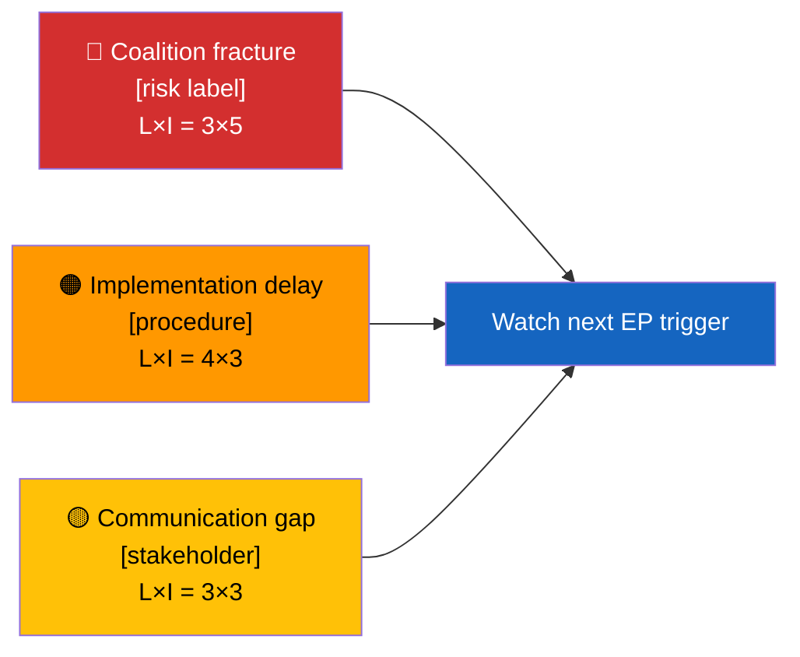

<!-- SPDX-FileCopyrightText: 2024-2026 Hack23 AB -->
<!-- SPDX-License-Identifier: Apache-2.0 -->

  

<h1 align="center">📰 Executive Brief Template — European Parliament</h1>

  <strong>📊 Decision-Grade BLUF for Editors and Duty Officers</strong> 
  <em>🎯 Bottom-Line-Up-Front · 3 Decisions · 60-Second Read · Confidence-Labeled</em>

  
  
  
  

**📋 Document Owner:** CEO | **📄 Version:** 2.1 | **📅 Last Updated:** 2026-04-25 (UTC)
**🏢 Owner:** Hack23 AB (Org.nr 5595347807) | **🏷️ Classification:** Public

> **📌 Template instructions:** Produce one root-level `executive-brief.md` per
> workflow folder: `analysis/daily/${ARTICLE_DATE}/${ARTICLE_TYPE_SLUG}/executive-brief.md`.
> `extended/executive-brief.md` is accepted only as a backwards-compatible
> fallback. The root file is the first artifact rendered in `article.md`.

> **✨ What to produce:** A BLUF that names the leading EP development, lists
> three editorial/monitoring decisions this brief supports, gives an 8-bullet
> 60-second read, ranks the top documents/procedures, and names the single top
> forward trigger. Every claim must be evidence-backed and confidence-labeled.

---

## 🔄 Tradecraft Context

| Element | Value |
|---------|-------|
| **F3EAD Stage** | **DISSEMINATE** — finished intelligence product for decision-makers |
| **PIRs Served** | `[REQUIRED: PIR-1, PIR-5, etc.]` |
| **Admiralty Floor** | **[B2]** — all evidence in this brief must reach ≥[B2] reliability |
| **WEP + ODNI** | Key judgments use **WEP** (almost certain / very likely / likely); confidence level reflects evidence quality |
| **Source Diversity Floor** | P0/P1 claims in BLUF: ≥3 sources minimum; single-source claims prohibited in executive brief |
| **SAT(s) Applied** | Key Assumptions Check (validation), Brainstorming (decision options) |
| **ICD 203 Standards** | 5 (customer relevance), 6 (logical argumentation), 9 (visual information) |

---

## 📋 Brief Context

| Field | Value |
|-------|-------|
| **Brief ID** | `EB-YYYY-MM-DD-NNN` |
| **Generated** | `YYYY-MM-DD HH:MM UTC` |
| **Scope** | `e.g., 2026-04-25 breaking` |
| **Documents / procedures covered** | `N` |
| **Overall Confidence** | `🟦 VERY HIGH / 🟩 HIGH / 🟧 MEDIUM / 🟥 LOW / ⬛ VERY LOW` |
| **Publication recommendation** | `PUBLISH / ANALYSIS-ONLY / SKIP` |
| **PIR Relevance** | `[REQUIRED: Primary PIR(s) addressed by this brief]` |
| **SEO Title Candidate** | `[REQUIRED: ≤70 chars, actor/procedure-led]` |
| **SEO Description Candidate** | `[REQUIRED: 150–160 chars, consequence-led]` |

---

## 🎯 BLUF (Bottom Line Up Front)

> **[2–4 sentences.** Lead with the #1 significance-ranked finding. Name the
> principal EP actor, political group, committee, Commission/Council actor, or
> procedure. State the concrete action taken or proposed. Quantify impact. End
> with confidence label and the strongest source reference.**]**

Example: *Parliament's ECON committee advanced a banking-union compromise today,
forcing EPP, S&D, and Renew to defend a narrower supervisory timetable before the
next plenary vote. The move lowers short-term coalition risk but raises
implementation pressure on national supervisors and the Commission. [🟩 HIGH —
sources: ECON agenda, procedure record, committee document].*

---

## 🧭 3 Decisions This Brief Supports

| # | Decision | Who Decides | Deadline | Evidence |
|:-:|----------|-------------|:--------:|----------|
| 1 | **Editorial:** publish or hold the article | Editor / duty officer | `+2 h` | `significance-scoring.md` top rank |
| 2 | **Monitoring:** flag next vote / committee meeting / trilogue milestone | Analyst | `YYYY-MM-DD` | EP procedure, plenary agenda, or committee calendar |
| 3 | **Forward-watch:** add one trigger to the watch board | Analysis lead | `+7 d` | `forward-indicators.md` / `scenario-forecast.md` |

---

## 📰 60-Second Read

- 🔴 **[Top development]** — who, what, where, when; cite procedure / document ID.
- 🟠 **[Second development]** — named actor, quantified effect, confidence label.
- 🟢 **[Positive development or coalition win]** — include political group or institution.
- 🟡 **[Point of tension or ambiguity]** — explain uncertainty in one line.
- 🔵 **[Economic / social context]** — IMF vintage + SDMX code when economic; WB only for non-economic residue.
- 🟣 **[Cross-reference]** — link to another artifact or EP source.
- 🩷 **[Emerging threat or disruption vector]** — political-threat-framework dimension.
- ⚪ **[Carry-forward or stale item]** — only if relevant; otherwise omit.

Each bullet must name either an EP document/procedure ID, a committee, a
political group, a vote count, a named institutional actor, or a primary-source
figure.

---

## 🗂️ Top Documents / Procedures Table

| Rank | EP reference | Title (short) | Significance | Confidence | Status |
|:----:|--------------|---------------|:------------:|:----------:|--------|
| 1 | `[REQUIRED: procedure/doc/vote ID]` | `[REQUIRED]` | `0.0–10.0` | `🟩 HIGH` | `[stage]` |
| 2 | `[REQUIRED]` | `[REQUIRED]` | `0.0–10.0` | `🟧 MEDIUM` | `[stage]` |
| 3 | `[REQUIRED]` | `[REQUIRED]` | `0.0–10.0` | `🟧 MEDIUM` | `[stage]` |

> Rank order must match `intelligence/significance-scoring.md`. If it diverges,
> update one of the two files during Pass-2 rewrite.

---

## ⚠️ Risk & Threat Snapshot

| Risk | L | I | Score | Trigger | Source | Admiralty |
|------|:-:|:-:|:-----:|---------|--------|:---------:|
| `[REQUIRED: risk label]` | `1–5` | `1–5` | `N` | `[observable trigger]` | `risk-scoring/risk-matrix.md` | **[A1/B2]** |
| `[REQUIRED]` | `1–5` | `1–5` | `N` | `[observable trigger]` | `threat-assessment/*` | **[A1/B2]** |

---

## 🔮 Top Forward Trigger

> **Single most important event to watch next.** Include date, type, and what
> its outcome would change.

Example: *Plenary vote expected 2026-05-06 to 2026-05-09. A broad
EPP-S&D-Renew yes outcome confirms grand-coalition discipline; visible ECR/PfE
alignment against the file raises the coalition-fracture risk from medium to
high and forces a scenario-forecast update.*

---

## 📎 Links

| Link | Path |
|------|------|
| Synthesis summary | `intelligence/synthesis-summary.md` |
| Significance scoring | `intelligence/significance-scoring.md` |
| Risk matrix | `risk-scoring/risk-matrix.md` |
| Stakeholder map | `intelligence/stakeholder-map.md` |
| Forward indicators / scenario forecast | `intelligence/scenario-forecast.md` |
| Data manifest | `extended/data-download-manifest.md` or `data/manifest.json` |
| Per-document analyses | `documents/` |

---

**Document Control**
- **Template path:** `/analysis/templates/executive-brief.md`
- **Preferred artifact path:** `analysis/daily/{date}/{type}/executive-brief.md`
- **Compatibility fallback:** `analysis/daily/{date}/{type}/extended/executive-brief.md`
- **Referenced by:** [`ai-driven-analysis-guide.md`](../methodologies/ai-driven-analysis-guide.md) and [`artifact-catalog.md`](../methodologies/artifact-catalog.md)
- **Classification:** Public
- **Next Review:** 2026-07-31
