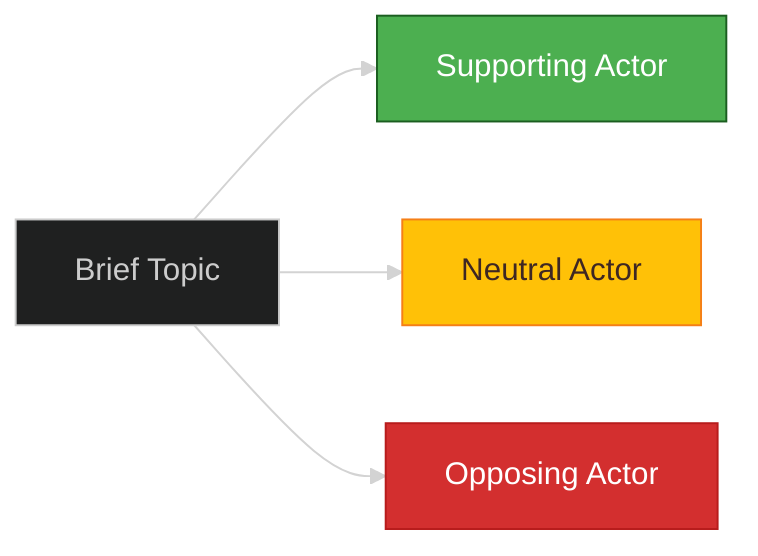

<!-- SPDX-FileCopyrightText: 2024-2026 Hack23 AB -->
<!-- SPDX-License-Identifier: Apache-2.0 -->

# 📊 Executive Brief Template

**Template Purpose:** Single-page strategic summary for decision-makers — distilled intelligence from a full analysis run.

**Methodology:** [strategic-extensions-methodology.md §Intelligence Assessment](../methodologies/strategic-extensions-methodology.md#part-4--intelligence-assessment-intelligence-assessmentmd)

**Min Lines:** 180

---

## 📋 Header Block

```markdown
# Executive Brief: {TOPIC}

**Classification:** PUBLIC | SENSITIVE | RESTRICTED
**Date:** {ISO date}
**Author:** EU Parliament Monitor (AI-assisted)
**Confidence:** 🟢 HIGH | 🟡 MEDIUM | 🔴 LOW
**Time Horizon:** {24h | 7d | 30d | 90d}
**PIRs Addressed:** {PIR-001, PIR-002, ...}

---
```

## 🎯 Section 1 — Bottom Line Up Front (BLUF)

**Required:** Single paragraph (≤80 words) stating the key finding, confidence level, and recommended action. Follows ICD 203 Standard 2 format.

```markdown
## Bottom Line Up Front

{BLUF statement — what decision-makers need to know immediately. State the conclusion first, supporting evidence follows. Include WEP probability band and time horizon.}

**Confidence:** {Level} — based on {source count} primary sources with {Admiralty range} reliability.
```

## 📊 Section 2 — Key Judgments

**Required:** 3-5 numbered key judgments, each with confidence label and evidence citation.

```markdown
## Key Judgments

1. **KJ-1:** {Judgment statement} — {WEP band} probability
   - **Evidence:** {Citation to EP source}
   - **Alternative View:** {One sentence contrary perspective}

2. **KJ-2:** {Judgment statement} — {WEP band} probability
   - **Evidence:** {Citation}
   - **Alternative View:** {Contrary perspective}

3. **KJ-3:** {Judgment statement} — {WEP band} probability
   - **Evidence:** {Citation}
   - **Alternative View:** {Contrary perspective}
```

## 👥 Section 3 — Key Actors

**Required:** Table of ≥6 key actors relevant to the brief topic.

```markdown
## Key Actors

| Actor | Role | Current Position | Influence | Watch Factor |
|-------|------|------------------|-----------|--------------|
| {MEP/Group/Institution} | {Position} | {Stance} | HIGH/MED/LOW | {What to monitor} |
| ... | ... | ... | ... | ... |
```

## 📈 Section 4 — Situation Mermaid

**Required:** Color-coded diagram showing the current situation state.

```markdown
## Situation Overview

{Mermaid diagram — quadrantChart, flowchart, or graph showing key relationships}
```

Example:



## ⚡ Section 5 — Implications

**Required:** 3 strategic implications for the short, medium, and long term.

```markdown
## Strategic Implications

### Short-term (24-72h)
{Immediate action implications}

### Medium-term (7-30d)
{Tactical planning implications}

### Long-term (30-90d)
{Strategic positioning implications}
```

## 🔮 Section 6 — Forward Indicators

**Required:** 3-5 observable indicators to monitor.

```markdown
## Forward Indicators

| Indicator | Current State | Threshold | Monitoring Source |
|-----------|--------------|-----------|-------------------|
| {What to watch} | {Baseline} | {Trigger value} | {EP MCP tool / source} |
| ... | ... | ... | ... |
```

## 📝 Section 7 — Sources

**Required:** Numbered source list with Admiralty grades.

```markdown
## Sources

1. [{Source title}]({URL}) — **{Admiralty grade}** — {Retrieval date}
2. ... 
```

## ✅ Quality Checklist

- [ ] BLUF ≤80 words with WEP band
- [ ] 3-5 Key Judgments with evidence
- [ ] ≥6 Key Actors in table
- [ ] Situation Mermaid included
- [ ] Short/Medium/Long implications
- [ ] ≥3 Forward Indicators
- [ ] All sources with Admiralty grades
- [ ] Classification header complete

---

*Template version 1.0 — EU Parliament Monitor Executive Brief*
