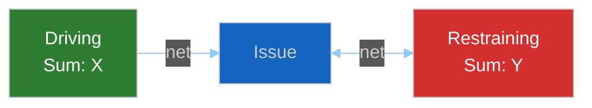

<!-- SPDX-FileCopyrightText: 2024-2026 Hack23 AB -->
<!-- SPDX-License-Identifier: Apache-2.0 -->

# ⚖️ Forces Analysis Template — Lewin Force-Field for EP Politics

> **📌 Template Instructions:** Copy to `analysis/daily/{date}/{article-type}-run{N}/classification/forces-analysis.md`. Apply Lewin force-field analysis: driving forces vs. restraining forces on the period's dominant issue. See [methodologies/per-artifact-methodologies.md §forces-analysis](../methodologies/per-artifact-methodologies.md#forces-analysis).

> **🎯 Purpose:** Structured force-field view of pressures pushing for or against policy change, with intervention point identification.

---

## 📋 Document Metadata

| Field | Value |
|-------|-------|
| **Report ID** | `[REQUIRED: FA-YYYY-MM-DD-runNN]` |
| **Issue Focus** | `[REQUIRED: one-line issue frame]` |

---

## 1️⃣ Issue Frame

`[REQUIRED: one-paragraph issue description]`

---

## 2️⃣ Driving Forces

| Force | Magnitude (1-5) | Origin | Evidence |
|-------|:---------------:|--------|----------|
| `[REQUIRED: named force]` | `[1-5]` | `[Institutional/Political/Economic/External]` | `[REQUIRED]` |
| *(≥5 required)* | | | |

---

## 3️⃣ Restraining Forces

| Force | Magnitude (1-5) | Origin | Evidence |
|-------|:---------------:|--------|----------|
| `[REQUIRED]` | `[1-5]` | `[...]` | `[REQUIRED]` |
| *(≥5 required)* | | | |

---

## 4️⃣ Net Pressure

**Narrative:** `[REQUIRED: direction + interpretation]`

---

## 5️⃣ Intervention Points

`[REQUIRED: where small input could flip balance, ≥60 words]`

---

**Document Control:** `/analysis/daily/{date}/{type}-run{N}/classification/forces-analysis.md` · Template v1.0 · Depth floor: 30 lines.
