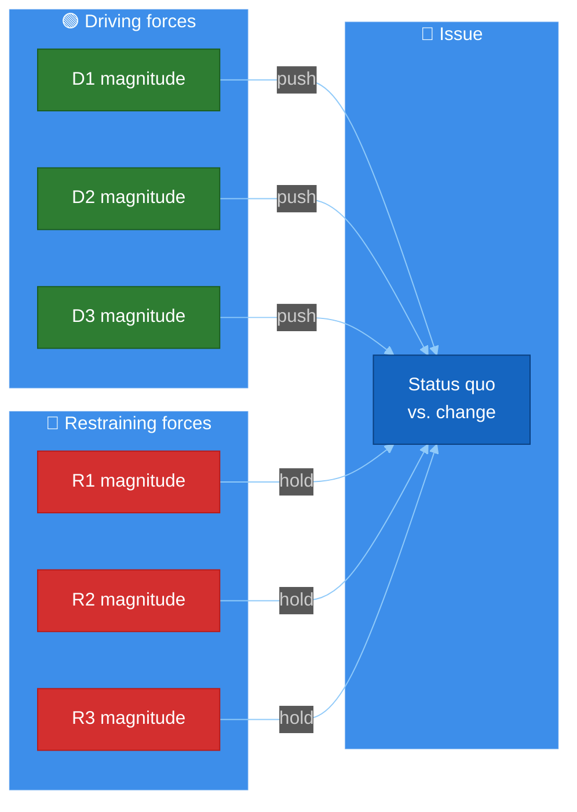
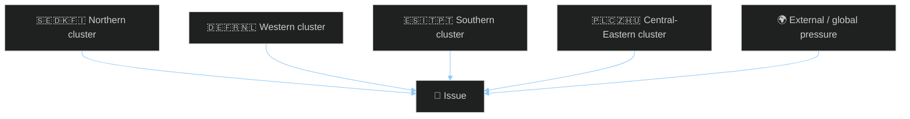

<!-- SPDX-FileCopyrightText: 2024-2026 Hack23 AB -->
<!-- SPDX-License-Identifier: Apache-2.0 -->

# ⚖️ Forces Analysis Template — Lewin Force‑Field for EU Parliament Politics

> **📌 Template Instructions:** Copy to `analysis/daily/{date}/{article-type}-run{N}/classification/forces-analysis.md`. Apply Lewin force‑field analysis: driving forces vs. restraining forces on the period's dominant issue, prioritised by reversibility and intervention leverage. See [methodologies/per-artifact-methodologies.md §forces-analysis](../methodologies/per-artifact-methodologies.md#forces-analysis).

> **🎯 Purpose:** Structured force‑field view of the political pressures pushing for or against a policy outcome, with explicit intervention‑point identification, EU multi‑national lens, and reader‑facing translation. **Multi‑national extension over Riksdagsmonitor:** every force is tagged with member‑state cluster origin so cross‑border dynamics surface explicitly.

---

## 📋 Document Metadata

| Field | Value |
|-------|-------|
| **Report ID** | `[REQUIRED: FA-YYYY-MM-DD-runNN]` |
| **Issue Focus** | `[REQUIRED: one-line issue frame]` |
| **Procedure / Decision Anchor** | `[REQUIRED: EP procedure ID, plenary item, or coalition motion]` |
| **Driving Forces Identified** | `[REQUIRED: count ≥5]` |
| **Restraining Forces Identified** | `[REQUIRED: count ≥5]` |
| **Confidence** | `[REQUIRED: 🟢 HIGH / 🟡 MEDIUM / 🔴 LOW]` |
| **PIR Tags** | `[REQUIRED]` |

---

## 1️⃣ Issue Frame

`[REQUIRED: ≥120 words paragraph describing the policy/political question, why it is the dominant pressure point of the period, and the observable outcome being pushed for vs. resisted. Cite the anchor procedure / vote / motion. Include the multi‑national dimension (which member‑state clusters care most).]`

**Status quo if no change:** `[REQUIRED: ≥40 words — what happens by default if neither side prevails.]`
**Outcome if drivers prevail:** `[REQUIRED: ≥40 words]`
**Outcome if restraints prevail:** `[REQUIRED: ≥40 words]`

---

## 2️⃣ Driving Forces

| # | Force | Magnitude (1‑5) | Reversibility | Origin | Member-state cluster | Evidence |
|:-:|-------|:---------------:|:-------------:|--------|----------------------|----------|
| 1 | `[REQUIRED]` | `[1‑5]` | `[Hard / Soft]` | `[Institutional / Political / Economic / External / Public‑opinion]` | `[N / W / S / CE / EU‑27]` | `[REQUIRED: citation]` |
| 2 | `[REQUIRED]` | `[1‑5]` | `[…]` | `[…]` | `[…]` | `[REQUIRED]` |
| 3 | `[REQUIRED]` | `[1‑5]` | `[…]` | `[…]` | `[…]` | `[REQUIRED]` |
| 4 | `[REQUIRED]` | `[1‑5]` | `[…]` | `[…]` | `[…]` | `[REQUIRED]` |
| 5 | `[REQUIRED]` | `[1‑5]` | `[…]` | `[…]` | `[…]` | `[REQUIRED]` |

*(≥5 required. Reversibility: Hard = embedded treaty/directive; Soft = position paper / coalition statement that can flip.)*

---

## 3️⃣ Restraining Forces

| # | Force | Magnitude (1‑5) | Reversibility | Origin | Member-state cluster | Evidence |
|:-:|-------|:---------------:|:-------------:|--------|----------------------|----------|
| 1 | `[REQUIRED]` | `[1‑5]` | `[Hard / Soft]` | `[…]` | `[…]` | `[REQUIRED]` |
| 2-5 | `[REQUIRED]` | `[…]` | `[…]` | `[…]` | `[REQUIRED]` |

*(≥5 required.)*

---

## 4️⃣ Net Pressure Diagram

Color‑coded force‑field. Width of arrows reflects magnitude.

**Net narrative:** `[REQUIRED: ≥80 words — direction of net pressure, the "tilt", and the procedural window in which it operates.]`

---

## 5️⃣ Cross‑Cluster Force Origin

How the forces map onto EU member‑state geography. This is the dimension that distinguishes EU Parliament analysis from a national parliament — every force has a multi‑national signature.

**Cluster narrative:** `[REQUIRED: ≥80 words explaining which cluster carries the dominant force and which is the swing block.]`

---

## 6️⃣ Intervention Points (Top‑3 Leverage Levers)

For each leverage point: what to push, who pushes it, when, and what indicates success.

### Lever 1: `[REQUIRED: name]`

**Type:** `[Procedural / Coalition / Public‑opinion / Economic / External]`
**Time window:** `[REQUIRED: specific date range or EP cycle stage]`

`[REQUIRED: ≥100 words — what change in input would shift the balance, who has the agency to deploy it, what observable signal would confirm the lever has been pulled.]`

**Success indicator:** `[REQUIRED: one observable metric or vote outcome.]`

---

### Lever 2: `[REQUIRED]`
*(Repeat structure)*

---

### Lever 3: `[REQUIRED]`
*(Repeat structure)*

---

## 7️⃣ Reader Briefing — Plain‑Language Translation

> 📰 **What this means in one paragraph:** `[REQUIRED: ≥60 words — newsroom‑grade summary of who is winning the push‑pull and what to watch.]`

- **What changes if drivers win:** `[REQUIRED: ≥30 words plain language]`
- **What changes if restraints win:** `[REQUIRED: ≥30 words plain language]`
- **Earliest decision point:** `[REQUIRED: date + venue]`

---

## 8️⃣ Data Sources & Provenance

**EP MCP tools used:** `analyze_coalition_dynamics`, `compare_political_groups`, `get_procedures`, `analyze_country_delegation` *(REQUIRED: ≥3)*

| Source | Type | Admiralty | Link |
|--------|------|:---------:|------|
| `[REQUIRED]` | `[…]` | `[A1‑F6]` | `[URL]` |
| `[REQUIRED]` | `[…]` | `[…]` | `[…]` |

---

## 9️⃣ Confidence & Top Uncertainty

- **Overall confidence:** `[REQUIRED: 🟢/🟡/🔴]`
- **Top uncertainty:** `[REQUIRED: ≥40 words]`
- **What would change my mind:** `[REQUIRED: ≥30 words — observable signal forcing re‑rating.]`

---

**Document Control:** `/analysis/daily/{date}/{type}-run{N}/classification/forces-analysis.md` · Template v2.0 · Depth floor: 120 lines · Mermaid diagrams: ≥2 · Reader briefing: required.
