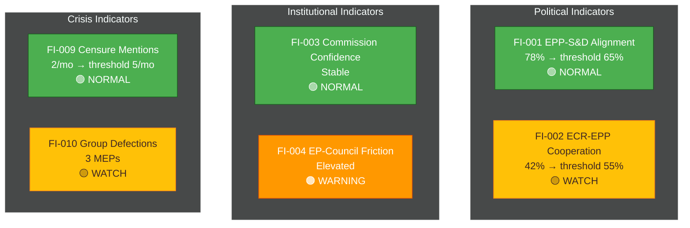

<!-- SPDX-FileCopyrightText: 2024-2026 Hack23 AB -->
<!-- SPDX-License-Identifier: Apache-2.0 -->

# 📈 Forward Indicators Template

**Template Purpose:** Define observable leading indicators that signal trajectory changes for European Parliament dynamics, enabling early warning and scenario validation.

**Methodology:** [electoral-domain-methodology.md §Part 6](../methodologies/electoral-domain-methodology.md#part-6--forward-indicators-forward-indicatorsmd)

**Min Lines:** 180

---

## 📋 Header Block

```markdown
# Forward Indicators: {TOPIC / SCENARIO SET}

**Classification:** PUBLIC | SENSITIVE | RESTRICTED
**Date:** {ISO date}
**Monitoring Period:** {Start date} to {End date}
**Linked Scenarios:** {Reference to scenario-forecast.md}
**Indicator Count:** {N}

---
```

## 🎯 Section 1 — Indicator Overview

**Required:** Summary of what indicators are tracking and why.

```markdown
## Indicator Purpose

**Monitoring Objective:** {What these indicators are designed to detect}

**Scenario Linkage:** These indicators validate/invalidate scenarios defined in:
- [scenario-forecast.md](./scenario-forecast.md) — Scenarios {S1, S2, S3, ...}

**Early Warning Target:** Detect trajectory changes {N days/weeks} before they manifest in observable outcomes.
```

## 📊 Section 2 — Indicator Master Table

**Required:** ≥10 indicators with all 7 structure fields.

```markdown
## Indicator Inventory

| ID | Category | Indicator | Baseline | Threshold | Frequency | Source | Linked Scenario |
|----|----------|-----------|----------|-----------|-----------|--------|-----------------|
| FI-001 | Political | {Description} | {Current value} | {Trigger value} | Daily/Weekly/Monthly | {EP MCP tool} | S{N} |
| FI-002 | Political | {Description} | {Value} | {Trigger} | {Freq} | {Source} | S{N} |
| FI-003 | Institutional | {Description} | {Value} | {Trigger} | {Freq} | {Source} | S{N} |
| FI-004 | Institutional | {Description} | {Value} | {Trigger} | {Freq} | {Source} | S{N} |
| FI-005 | Policy | {Description} | {Value} | {Trigger} | {Freq} | {Source} | S{N} |
| FI-006 | Policy | {Description} | {Value} | {Trigger} | {Freq} | {Source} | S{N} |
| FI-007 | Electoral | {Description} | {Value} | {Trigger} | {Freq} | {Source} | S{N} |
| FI-008 | External | {Description} | {Value} | {Trigger} | {Freq} | {Source} | S{N} |
| FI-009 | Crisis | {Description} | {Value} | {Trigger} | {Freq} | {Source} | S{N} |
| FI-010 | Crisis | {Description} | {Value} | {Trigger} | {Freq} | {Source} | S{N} |
```

## 🔍 Section 3 — Indicator Detail Cards

**Required:** Expanded analysis for each indicator.

### Indicator Card Template

```markdown
### FI-{NNN}: {Indicator Name}

**Category:** Political | Institutional | Policy | Electoral | External | Crisis

**Description:** {What this indicator measures and why it matters}

**Current State:**
- **Value:** {Current measurement}
- **Trend:** ↑ Rising | ↓ Falling | → Stable
- **Last Updated:** {ISO date}

**Thresholds:**
| Level | Value | Interpretation |
|-------|-------|----------------|
| 🟢 Normal | {range} | Business as usual |
| 🟡 Watch | {range} | Elevated attention warranted |
| 🟠 Warning | {range} | Active monitoring required |
| 🔴 Alert | {value} | Scenario reassessment triggered |

**Monitoring Method:**
- **EP MCP Tool:** `{tool_name}` with parameters `{params}`
- **Frequency:** {Daily/Weekly/Monthly}
- **Automation:** {Manual / Automated via workflow}

**Scenario Linkage:**
| Scenario | Indicator Role |
|----------|---------------|
| S{N} — {Name} | {Confirms / Disconfirms / Early warning for} |

**Historical Context:**
{1-2 sentences on what this indicator has shown in past situations}
```

## 📈 Section 4 — Indicator Dashboard Mermaid

**Required:** Visual status overview of all indicators.



## 🎛️ Section 5 — Indicator Categories

**Required:** Grouped analysis by indicator category.

```markdown
## Category Analysis

### Political Indicators (Coalition Dynamics)

**Purpose:** Monitor political group cohesion and cross-party cooperation patterns.

| ID | Indicator | Status | Trend |
|----|-----------|--------|-------|
| FI-001 | {Name} | 🟢/🟡/🟠/🔴 | ↑/↓/→ |
| FI-002 | {Name} | {Status} | {Trend} |

**Category Assessment:** {Overall assessment of political indicator set}

---

### Institutional Indicators (EP-Commission-Council)

**Purpose:** Monitor interinstitutional relations and legislative process health.

| ID | Indicator | Status | Trend |
|----|-----------|--------|-------|
| FI-003 | {Name} | 🟢/🟡/🟠/🔴 | ↑/↓/→ |
| FI-004 | {Name} | {Status} | {Trend} |

**Category Assessment:** {Overall assessment}

---

### Crisis Indicators (Early Warning)

**Purpose:** Detect emerging political crises before they manifest fully.

| ID | Indicator | Status | Trend |
|----|-----------|--------|-------|
| FI-009 | {Name} | 🟢/🟡/🟠/🔴 | ↑/↓/→ |
| FI-010 | {Name} | {Status} | {Trend} |

**Category Assessment:** {Overall assessment}
```

## 🔗 Section 6 — Scenario Linkage Matrix

**Required:** Map indicators to scenarios.

```markdown
## Scenario-Indicator Matrix

| Indicator | S1: Baseline | S2: Upside | S3: Downside | S4: Wildcard |
|-----------|:------------:|:----------:|:------------:|:------------:|
| FI-001 | → | ↑ | ↓ | ↓↓ |
| FI-002 | → | ↓ | ↑ | ↑↑ |
| FI-003 | → | ↑ | ↓ | ↓↓ |
| ... | ... | ... | ... | ... |

**Legend:** → Stable | ↑ Increase supports scenario | ↓ Decrease supports scenario | ↑↑/↓↓ Strong signal
```

## ⚠️ Section 7 — Alert Protocol

**Required:** Define response to indicator threshold breaches.

```markdown
## Alert Response Protocol

### Level Definitions

| Level | Meaning | Response |
|-------|---------|----------|
| 🟢 Normal | Within expected range | Continue routine monitoring |
| 🟡 Watch | Approaching threshold | Increase monitoring frequency |
| 🟠 Warning | Threshold breached | Reassess affected scenarios |
| 🔴 Alert | Critical threshold breached | Trigger scenario rewrite |

### Escalation Triggers

| Condition | Action |
|-----------|--------|
| Any 🔴 Alert | Immediate scenario reassessment |
| ≥3 indicators at 🟠 Warning | Joint assessment required |
| Trend reversal in ≥5 indicators | Baseline reassessment |
```

## 📝 Section 8 — Data Sources

**Required:** EP MCP tools and external sources for indicator data.

```markdown
## Data Sources

### EP MCP Tools
| Tool | Indicators Fed | Frequency |
|------|---------------|-----------|
| `analyze_coalition_dynamics` | FI-001, FI-002 | Weekly |
| `detect_voting_anomalies` | FI-010 | Weekly |
| `track_mep_attendance` | FI-007 | Monthly |
| `get_speeches` | FI-009 | Weekly |
| `early_warning_system` | FI-009, FI-010 | Daily |

### External Sources
| Source | Indicators Fed | Admiralty Grade |
|--------|---------------|-----------------|
| Eurobarometer | FI-007 | A2 |
| National polling | FI-007 | B2 |
| Brussels press | FI-008 | C2 |
```

## ✅ Quality Checklist

- [ ] ≥10 indicators defined
- [ ] Each indicator has all 7 structure fields
- [ ] Indicator categories balanced across Political/Institutional/Policy/Electoral/External/Crisis
- [ ] Dashboard Mermaid shows all indicators with status
- [ ] Scenario linkage explicit for each indicator
- [ ] Alert protocol defined with escalation triggers
- [ ] EP MCP tool mapping complete
- [ ] Historical context provided for key indicators
- [ ] Thresholds evidence-based, not arbitrary

---

*Template version 1.0 — EU Parliament Monitor Forward Indicators*
