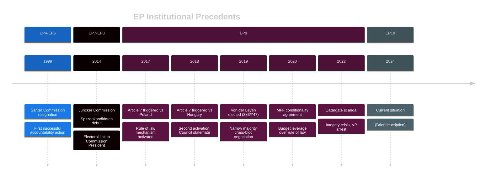

<!-- SPDX-FileCopyrightText: 2024-2026 Hack23 AB -->
<!-- SPDX-License-Identifier: Apache-2.0 -->

# 📜 Historical Parallels Template

**Template Purpose:** Apply historical precedent analysis to current European Parliament dynamics, identifying patterns and lessons from previous parliamentary terms and institutional events.

**Methodology:** [electoral-domain-methodology.md §Part 3](../methodologies/electoral-domain-methodology.md#-part-3--historical-parallels-historical-parallelsmd)

**Min Lines:** 220

---

## 📋 Header Block

```markdown
# Historical Parallels: {CURRENT EVENT/TOPIC}

**Classification:** PUBLIC | SENSITIVE | RESTRICTED
**Date:** {ISO date}
**Current Event:** {What is being compared to history}
**Time Period Surveyed:** {Date range of historical analysis}
**Parallels Identified:** {Count}

---
```

## 🎯 Section 1 — Current Situation Summary

**Required:** ≤120 words describing the current EP situation being analyzed through historical lens.

```markdown
## Current Situation

**Event:** {Current EP event requiring historical context}

**Key Characteristics:**
- {Characteristic 1}
- {Characteristic 2}
- {Characteristic 3}

**Why Historical Analysis Matters:** {1-2 sentences on why precedent is instructive}
```

## 📊 Section 2 — Parallel Inventory

**Required:** Table of ≥6 historical precedents with relevance assessment.

```markdown
## Historical Parallel Inventory

| # | Event | Date | EP Term | Relevance Score | Key Parallel |
|---|-------|------|---------|-----------------|--------------|
| P1 | {Historical event} | {YYYY-MM} | EP{N} | HIGH/MED/LOW | {What matches current} |
| P2 | ... | ... | ... | ... | ... |
| P3 | ... | ... | ... | ... | ... |
| P4 | ... | ... | ... | ... | ... |
| P5 | ... | ... | ... | ... | ... |
| P6 | ... | ... | ... | ... | ... |
```

## 🔍 Section 3 — Detailed Parallel Analysis

**Required:** For each HIGH-relevance parallel, provide structured analysis.

### Parallel Template (repeat for each HIGH-relevance event)

```markdown
### P{N}: {Event Name} ({Date})

#### Event Summary
{≤80 words describing what happened}

#### Institutional Context
- **EP Term:** EP{N} ({start-end years})
- **Political Composition:** {Dominant groups and coalition}
- **Commission:** {Commission name if relevant}
- **Key Actors:** {Named MEPs, Commissioners, MS leaders}

#### Coalition Dynamics
| Group/Actor | Position | Role in Outcome |
|-------------|----------|-----------------|
| {Actor} | Support/Oppose | {Contribution} |
| ... | ... | ... |

#### Outcome
- **Immediate:** {What happened in the short term}
- **Long-term:** {Lasting consequences}
- **Institutional Precedent:** {What rule or norm was established}

#### Applicability to Current Situation
| Dimension | Historical | Current | Match |
|-----------|-----------|---------|-------|
| Political composition | {EP{N} composition} | {EP10 composition} | HIGH/MED/LOW |
| Institutional stakes | {What was at stake} | {What is at stake} | HIGH/MED/LOW |
| Actor incentives | {Historical incentives} | {Current incentives} | HIGH/MED/LOW |
| External pressures | {Historical context} | {Current context} | HIGH/MED/LOW |

#### Causal Mechanism
**Why this parallel is instructive:**

{2-3 sentences explaining the causal mechanism that makes this precedent relevant — not just surface similarity but underlying dynamic}
```

## 📈 Section 4 — Timeline Mermaid

**Required:** Visual timeline of historical precedents.

```markdown
## Historical Timeline

{Mermaid timeline diagram showing precedent events}
```



## ⚖️ Section 5 — Pattern Synthesis

**Required:** Synthesis of lessons across parallels.

```markdown
## Pattern Synthesis

### Recurring Patterns Identified

| Pattern | Historical Evidence | Current Manifestation |
|---------|--------------------|-----------------------|
| {Pattern 1} | {Which precedents show this} | {How it appears now} |
| {Pattern 2} | {Which precedents show this} | {How it appears now} |
| {Pattern 3} | {Which precedents show this} | {How it appears now} |

### Lessons Applicable to Current Situation

1. **Lesson 1:** {Extracted lesson from historical analysis}
   - *Based on:* P{N}, P{N}
   - *Application:* {How this applies now}

2. **Lesson 2:** {Extracted lesson}
   - *Based on:* P{N}
   - *Application:* {How this applies now}

3. **Lesson 3:** {Extracted lesson}
   - *Based on:* P{N}, P{N}
   - *Application:* {How this applies now}
```

## 🚫 Section 6 — Dis-Analogies

**Required:** Explicit analysis of where historical parallels break down.

```markdown
## Dis-Analogies (Where History Doesn't Apply)

| Factor | Historical Context | Current Context | Implication |
|--------|-------------------|-----------------|-------------|
| {Factor 1} | {How it was} | {How it is now} | {Why parallel may not hold} |
| {Factor 2} | {How it was} | {How it is now} | {Why parallel may not hold} |
| {Factor 3} | {How it was} | {How it is now} | {Why parallel may not hold} |

### Critical Differences
{2-3 sentences on the most important ways the current situation differs from historical precedents}
```

## 🔮 Section 7 — Forecast Based on Precedent

**Required:** Probabilistic forecast derived from historical patterns.

```markdown
## Precedent-Based Forecast

Based on historical analysis, the following outcomes are assessed:

| Outcome | Probability | Historical Basis | Confidence |
|---------|-------------|------------------|------------|
| {Outcome A} | {WEP band} | {Which precedents support this} | 🟢/🟡/🔴 |
| {Outcome B} | {WEP band} | {Which precedents support this} | 🟢/🟡/🔴 |
| {Outcome C} | {WEP band} | {Which precedents support this} | 🟢/🟡/🔴 |

### Key Uncertainty
{What factor most limits the applicability of historical precedent to this forecast}
```

## 📝 Section 8 — Sources

**Required:** Academic and primary sources for historical analysis.

```markdown
## Sources

### Primary Sources (EP Records)
1. [{Document title}]({URL}) — **A1** — {Date}
2. ...

### Secondary Sources (Academic/Journalistic)
1. [{Source}]({URL}) — **{Admiralty grade}** — {Date}
2. ...

### Historical References
1. {Academic work on EP history}
2. {Commission/Council archives}
```

## ✅ Quality Checklist

- [ ] ≥6 historical parallels identified
- [ ] Each HIGH-relevance parallel has full structured analysis
- [ ] All 6 analysis elements present per parallel (summary, context, dynamics, outcome, applicability, causal mechanism)
- [ ] Timeline Mermaid included
- [ ] Pattern synthesis identifies ≥3 patterns
- [ ] ≥3 lessons extracted with application notes
- [ ] Dis-analogies section acknowledges limits
- [ ] Precedent-based forecast with WEP bands
- [ ] Sources include both primary (EP) and secondary references

---

*Template version 1.0 — EU Parliament Monitor Historical Parallels*
