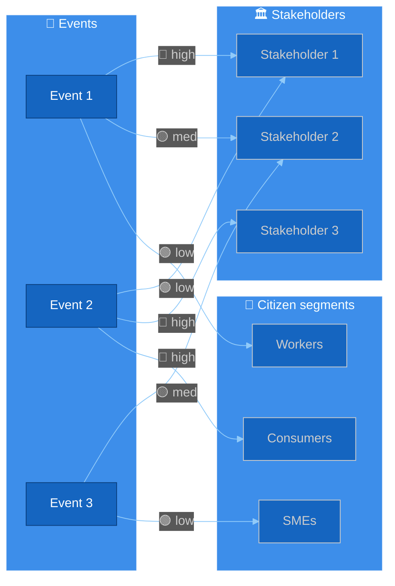
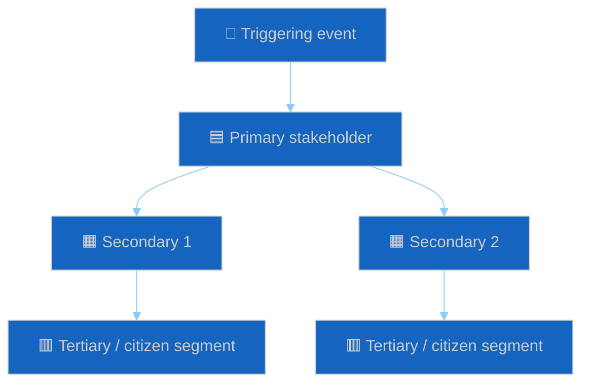

<!-- SPDX-FileCopyrightText: 2024-2026 Hack23 AB -->
<!-- SPDX-License-Identifier: Apache-2.0 -->

# 🎯 Impact Matrix Template — Event × Stakeholder × Citizen Impact Grid

> **📌 Template Instructions:** Copy to `analysis/daily/{date}/{article-type}-run{N}/classification/impact-matrix.md`. Event × stakeholder × dimension matrix showing **who is affected**, **how much**, **when**, and **what cascades follow**. See [methodologies/per-artifact-methodologies.md §impact-matrix](../methodologies/per-artifact-methodologies.md#impact-matrix).

> **🎯 Purpose:** Systematic impact assessment grid identifying which events hit which EU‑27 stakeholder constituencies and citizen segments, with directional/severity coding, cascade chains, and a reader‑facing translation layer for newsroom and citizen‑briefing reuse. **Multi‑national extension over Riksdagsmonitor:** EU member states, language groups, and supranational bodies are first‑class stakeholders alongside political groups.

---

## 📋 Document Metadata

| Field | Value |
|-------|-------|
| **Report ID** | `[REQUIRED: IM-YYYY-MM-DD-runNN]` |
| **Period** | `[REQUIRED: YYYY-MM-DD to YYYY-MM-DD]` |
| **Events Analyzed** | `[REQUIRED: count ≥5]` |
| **Stakeholder Constituencies** | `[REQUIRED: count ≥6, must include ≥1 EU‑27 member-state cluster]` |
| **Citizen Segments Covered** | `[REQUIRED: count ≥3 — e.g. consumers, workers, SMEs, students, pensioners]` |
| **Confidence** | `[REQUIRED: 🟢 HIGH / 🟡 MEDIUM / 🔴 LOW]` |
| **PIR Tags** | `[REQUIRED: PIR-1, PIR-2, …]` |
| **Admiralty Source Floor** | `[REQUIRED: B2 minimum across primary citations]` |

---

## 1️⃣ Event List

Number events 1..N in priority order. Each event MUST cite a specific EP procedure, plenary item, or roll‑call vote.

| # | Event / Decision | EP Reference | Date | Stage |
|:-:|------------------|--------------|------|-------|
| 1 | `[REQUIRED]` | `[procedure ID / vote ref]` | `[YYYY-MM-DD]` | `[1st reading / committee vote / plenary]` |
| 2 | `[REQUIRED]` | `[…]` | `[…]` | `[…]` |
| 3 | `[REQUIRED]` | `[…]` | `[…]` | `[…]` |
| 4 | `[REQUIRED]` | `[…]` | `[…]` | `[…]` |
| 5 | `[REQUIRED]` | `[…]` | `[…]` | `[…]` |

*(≥5 required)*

---

## 2️⃣ Stakeholder & Citizen Roster

Mix of (a) EU‑level institutional/political actors, (b) member‑state clusters, and (c) citizen segments. Multi‑national: distinct rows for at least three of the four EU member-state clusters {Northern, Southern, Central‑Eastern, Western}.

| # | Stakeholder / Constituency | Type | Scope |
|:-:|----------------------------|------|-------|
| 1 | `[REQUIRED]` | `[Political group / Member-state cluster / Sector / Citizen segment / Institution]` | `[EU-27 / sub-bloc / national / sectoral]` |
| 2-6 | `[REQUIRED]` | `[…]` | `[…]` |

*(≥6 required, with ≥3 distinct types)*

---

## 3️⃣ Impact Matrix — Direction × Severity × Time

Each cell carries **direction** (🟢 positive / 🟡 mixed / 🔴 negative / ⚪ none), **severity** (1‑3, where 3 = strategic / multi‑year), and a one‑line evidence pointer.

| Event ↓ / Stakeholder → | Stakeholder 1 | Stakeholder 2 | Stakeholder 3 | Stakeholder 4 | Stakeholder 5 | Stakeholder 6 |
|-------------------------|:-------------:|:-------------:|:-------------:|:-------------:|:-------------:|:-------------:|
| **Event 1** | `[🟢/🟡/🔴/⚪]` `[1‑3]` `[evidence pointer]` | `[…]` | `[…]` | `[…]` | `[…]` | `[…]` |
| **Event 2** | `[…]` | `[…]` | `[…]` | `[…]` | `[…]` | `[…]` |
| **Event 3** | `[…]` | `[…]` | `[…]` | `[…]` | `[…]` | `[…]` |
| **Event 4** | `[…]` | `[…]` | `[…]` | `[…]` | `[…]` | `[…]` |
| **Event 5** | `[…]` | `[…]` | `[…]` | `[…]` | `[…]` | `[…]` |

**Direction legend:** 🟢 Positive · 🟡 Mixed · 🔴 Negative · ⚪ None
**Severity legend:** 1 = local / temporary · 2 = sectoral / multi‑month · 3 = strategic / multi‑year

---

## 4️⃣ Heat‑Map Diagram

Color‑coded flowchart visualisation of the matrix. Use the **Standard universal init block** ([political-style-guide.md §Standard Mermaid init blocks](../methodologies/political-style-guide.md)).

**Reading the diagram:** Edge labels carry **direction × severity** (🟢 / 🟡 / 🔴 + low/med/high). Subgraphs separate institutional, sectoral, and citizen tiers so the newsroom can extract a citizen‑facing visual without re‑drawing.

---

## 5️⃣ Cascade & Spillover Map

Second‑order effects — when an event hits a stakeholder, who else is moved?

**Cascade narrative:** `[REQUIRED: ≥80 words describing one full chain — what triggers what, on what timescale, with what reversibility. Cite EP MCP queries used to confirm.]`

---

## 6️⃣ Hot‑Cell Narratives (Top‑3 by severity × salience)

### Cell: `[REQUIRED: Event X × Stakeholder Y]`

**Direction:** `[🟢/🟡/🔴]` · **Severity:** `[1-3]` · **Confidence:** `[🟢/🟡/🔴]` · **Admiralty:** `[A1‑F6]`

**What is happening:**

`[REQUIRED: ≥80 words plain‑language description of the event and the affected stakeholder. Cite specific EP activity, procedure IDs, or document IDs.]`

**Why it matters to this stakeholder:**

`[REQUIRED: ≥80 words — exposure mechanism, magnitude, time‑to‑impact.]`

**Citizen translation (newsroom hook):**

`[REQUIRED: ≥40 words — restate in plain language for a non‑specialist reader. Avoid acronyms.]`

*(≥3 hot‑cell narratives required, drawn from the highest severity × confidence cells.)*

---

### Cell: `[REQUIRED: Event X × Stakeholder Y]`
*(Repeat structure)*

---

### Cell: `[REQUIRED: Event X × Stakeholder Y]`
*(Repeat structure)*

---

## 7️⃣ Multi‑National Member‑State Lens

| Member‑state cluster | Strongest +impact event | Strongest -impact event | Net direction |
|----------------------|-------------------------|-------------------------|:-------------:|
| Northern (DK, FI, SE, …) | `[REQUIRED]` | `[REQUIRED]` | `[🟢/🟡/🔴]` |
| Western (DE, FR, NL, BE, AT, IE, LU) | `[REQUIRED]` | `[REQUIRED]` | `[🟢/🟡/🔴]` |
| Southern (ES, IT, PT, GR, CY, MT) | `[REQUIRED]` | `[REQUIRED]` | `[🟢/🟡/🔴]` |
| Central‑Eastern (PL, CZ, HU, SK, …) | `[REQUIRED]` | `[REQUIRED]` | `[🟢/🟡/🔴]` |

**Cluster narrative:** `[REQUIRED: ≥80 words — which cluster carries the largest net exposure and why. Reference Council positions if available.]`

---

## 8️⃣ Reader Briefing — What This Means For Citizens

Translate the matrix for a newsroom audience. Plain language, no acronyms without expansion.

- **Households / consumers:** `[REQUIRED: ≥40 words — concrete daily‑life implication.]`
- **Workers / job market:** `[REQUIRED: ≥40 words]`
- **Small & medium business:** `[REQUIRED: ≥40 words]`
- **Public services:** `[REQUIRED: ≥40 words]`
- **Cross‑border movers / EU citizens abroad:** `[REQUIRED: ≥40 words]`

> 📰 **Newsroom takeaway:** `[REQUIRED: one‑sentence headline‑grade summary the article H1/lede can quote verbatim.]`

---

## 9️⃣ Data Sources & Provenance

**EP MCP tools used:** `get_procedures`, `analyze_country_delegation`, `compare_political_groups`, `get_voting_records`, `get_adopted_texts` *(REQUIRED: ≥3 distinct tools)*

**External corroboration:** `[REQUIRED: ≥1 World Bank / IMF / Eurostat indicator OR official Council/Commission document with link]`

**Admiralty grades for primary sources:** `[REQUIRED: table or inline B2/A1/B3 grades on each major citation]`

| Source | Type | Admiralty | Link |
|--------|------|:---------:|------|
| `[REQUIRED]` | `[Primary EP / Member-state / Press / Sectoral]` | `[A1‑F6]` | `[URL]` |
| `[REQUIRED]` | `[…]` | `[…]` | `[…]` |

---

## 🔟 Confidence & Caveats

- **Overall confidence:** `[REQUIRED: 🟢 HIGH / 🟡 MEDIUM / 🔴 LOW]`
- **Top uncertainty:** `[REQUIRED: ≥40 words — the single biggest unknown that could flip the matrix.]`
- **What would change my mind:** `[REQUIRED: ≥30 words — observable trigger that would force reassessment.]`

---

**Document Control:** `/analysis/daily/{date}/{type}-run{N}/classification/impact-matrix.md` · Template v2.0 · Depth floor: 120 lines · Mermaid diagrams: ≥2 (heat‑map + cascade) · Reader briefing: required.
