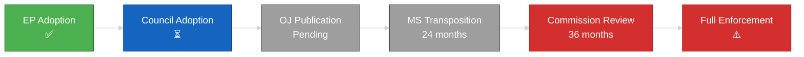

<!-- SPDX-FileCopyrightText: 2024-2026 Hack23 AB -->
<!-- SPDX-License-Identifier: Apache-2.0 -->

# 🔧 Implementation Feasibility Template

**Template Purpose:** Assess whether European Parliament legislative outputs are practically implementable — considering member state capacity, institutional constraints, and political will.

**Methodology:** [electoral-domain-methodology.md §Part 5](../methodologies/electoral-domain-methodology.md#-part-5--implementation-feasibility-implementation-feasibilitymd)

**Min Lines:** 200

---

## 📋 Header Block

```markdown
# Implementation Feasibility: {LEGISLATIVE ACT}

**Classification:** PUBLIC | SENSITIVE | RESTRICTED
**Date:** {ISO date}
**Subject:** {Reference number and title of legislation}
**Procedure:** {2024/XXXX(COD/NLE/etc.)}
**Stage:** {Commission Proposal / Committee / Plenary / Trilogue / Adopted}
**Overall Feasibility:** 🟢 HIGH | 🟡 MEDIUM | 🔴 LOW

---
```

## 🎯 Section 1 — Legislative Summary

**Required:** Brief summary of what the legislation requires.

```markdown
## Legislative Overview

**Title:** {Full title of legislative act}

**Reference:** {COM(20XX)XXX / A9-XXXX/20XX / TA(20XX)XXXX}

**Policy Area:** {Primary Europarl classification}

**Core Requirements:**
1. {Key requirement 1}
2. {Key requirement 2}
3. {Key requirement 3}

**Affected Actors:**
- Member States: {Which MS are primarily affected}
- Institutions: {Which EU institutions implement}
- Private sector: {Which industries/entities}

**Implementation Deadline:** {Date if specified}
```

## 📊 Section 2 — Feasibility Dimensions

**Required:** Assessment across all 6 implementation dimensions.

```markdown
## Feasibility Assessment

### 1. Legal Base
| Factor | Assessment | Evidence |
|--------|------------|----------|
| **Treaty Basis** | Art. {XXX} TFEU/TEU | {Explicit or implied competence} |
| **Subsidiarity** | ✅ Justified / ⚠️ Questionable / ❌ Violated | {Reasoning} |
| **Proportionality** | ✅ Proportionate / ⚠️ Marginal / ❌ Excessive | {Reasoning} |
| **Legal Certainty** | 🟢/🟡/🔴 | {Are requirements clearly defined?} |

**Legal Base Score:** 🟢 HIGH | 🟡 MEDIUM | 🔴 LOW

---

### 2. Member State Capacity
| MS Category | Capacity Assessment | Key Challenges |
|-------------|---------------------|----------------|
| **Large MS** (DE, FR, IT, ES, PL) | 🟢/🟡/🔴 | {Specific challenges} |
| **Medium MS** (NL, BE, CZ, etc.) | 🟢/🟡/🔴 | {Specific challenges} |
| **Small MS** (LU, MT, CY, etc.) | 🟢/🟡/🔴 | {Specific challenges} |
| **New MS** (post-2004) | 🟢/🟡/🔴 | {Specific challenges} |

**Transposition History:** {How well have MS transposed similar legislation?}

**MS Capacity Score:** 🟢 HIGH | 🟡 MEDIUM | 🔴 LOW

---

### 3. Political Will
| Actor | Position | Commitment Level |
|-------|----------|------------------|
| **Council** | {QMV position} | 🟢/🟡/🔴 |
| **Key MS Governments** | {Named positions} | 🟢/🟡/🔴 |
| **EP Political Groups** | {Coalition support} | 🟢/🟡/🔴 |
| **Commission** | {Enforcement appetite} | 🟢/🟡/🔴 |

**Political Will Score:** 🟢 HIGH | 🟡 MEDIUM | 🔴 LOW

---

### 4. Resource Requirements
| Resource Type | Estimate | MS Availability | Gap |
|---------------|----------|-----------------|-----|
| **Budget (annual)** | €{amount} | {Available vs required} | {Shortfall} |
| **Staff (FTE)** | {number} | {Available vs required} | {Shortfall} |
| **IT Systems** | {Description} | {Development status} | {Gap} |
| **Training** | {Requirements} | {Capacity to deliver} | {Gap} |

**Resource Score:** 🟢 HIGH | 🟡 MEDIUM | 🔴 LOW

---

### 5. Timeline Realism
| Phase | Deadline | Realistic Assessment |
|-------|----------|----------------------|
| **Transposition** | {Date} | 🟢/🟡/🔴 {months available} |
| **Operational Setup** | {Date} | 🟢/🟡/🔴 {assessment} |
| **Full Compliance** | {Date} | 🟢/🟡/🔴 {assessment} |

**Comparable Legislation Timeline:** {How long did similar acts take?}

**Timeline Score:** 🟢 HIGH | 🟡 MEDIUM | 🔴 LOW

---

### 6. Enforcement Mechanism
| Mechanism | Strength | Evidence |
|-----------|----------|----------|
| **Commission Powers** | {Infringement proceedings, delegated acts} | 🟢/🟡/🔴 |
| **ECJ Jurisdiction** | {Art. 258/260 TFEU} | 🟢/🟡/🔴 |
| **National Enforcement** | {MS agency designation} | 🟢/🟡/🔴 |
| **Private Enforcement** | {Direct effect, standing} | 🟢/🟡/🔴 |

**Enforcement Score:** 🟢 HIGH | 🟡 MEDIUM | 🔴 LOW
```

## 📈 Section 3 — Risk Matrix

**Required:** Consolidated risk assessment.

```markdown
## Implementation Risk Matrix

| Risk Factor | LOW | MEDIUM | HIGH | Current |
|-------------|:---:|:------:|:----:|:-------:|
| **MS Opposition** | <5 MS | 5-10 MS | >10 MS | {Count} MS |
| **Budget Gap** | <€100M | €100M-1B | >€1B | €{amount} |
| **Complexity** | <50 pages | 50-200 | >200 | {pages} |
| **Timeline** | >24 mo | 12-24 mo | <12 mo | {months} |
| **Precedent** | Proven | Mixed | Novel | {assessment} |

**Overall Risk Level:** 🟢 LOW | 🟡 MEDIUM | 🔴 HIGH
```

## 🔄 Section 4 — Implementation Pipeline Mermaid

**Required:** Visual representation of implementation stages.



## 🏛️ Section 5 — Member State Analysis

**Required:** Per-MS implementation assessment for major member states.

```markdown
## Member State Implementation Analysis

### Germany 🇩🇪
- **Capacity:** 🟢/🟡/🔴
- **Political Will:** {Current government position}
- **Transposition Track Record:** {Historical performance}
- **Key Challenge:** {Specific challenge}

### France 🇫🇷
- **Capacity:** 🟢/🟡/🔴
- **Political Will:** {Position}
- **Track Record:** {Performance}
- **Key Challenge:** {Challenge}

### Italy 🇮🇹
- **Capacity:** 🟢/🟡/🔴
- **Political Will:** {Position}
- **Track Record:** {Performance}
- **Key Challenge:** {Challenge}

### Poland 🇵🇱
- **Capacity:** 🟢/🟡/🔴
- **Political Will:** {Position}
- **Track Record:** {Performance}
- **Key Challenge:** {Challenge}

{Continue for additional key MS as relevant}

### MS Implementation Readiness Summary

| MS | Capacity | Will | Timeline Risk | Overall |
|----|----------|------|---------------|---------|
| DE | 🟢/🟡/🔴 | 🟢/🟡/🔴 | 🟢/🟡/🔴 | 🟢/🟡/🔴 |
| FR | ... | ... | ... | ... |
| IT | ... | ... | ... | ... |
| PL | ... | ... | ... | ... |
```

## ⚠️ Section 6 — Critical Path Risks

**Required:** Identification of implementation blockers.

```markdown
## Critical Path Risks

### Blocker 1: {Risk Name}
- **Description:** {What could block implementation}
- **Probability:** {WEP band}
- **Impact:** {Consequence if materialized}
- **Mitigation:** {What could reduce this risk}

### Blocker 2: {Risk Name}
- **Description:** {Description}
- **Probability:** {WEP}
- **Impact:** {Consequence}
- **Mitigation:** {Reduction strategy}

### Blocker 3: {Risk Name}
- **Description:** {Description}
- **Probability:** {WEP}
- **Impact:** {Consequence}
- **Mitigation:** {Reduction strategy}
```

## 📊 Section 7 — Comparable Legislation Performance

**Required:** Historical comparison to similar legislation.

```markdown
## Historical Comparison

| Legislation | Adoption | Transposition Deadline | Full Compliance | Infringement Cases |
|-------------|----------|------------------------|-----------------|-------------------|
| {Comparable 1} | {Year} | {Date} | {When achieved} | {Count} |
| {Comparable 2} | {Year} | {Date} | {When achieved} | {Count} |
| {Comparable 3} | {Year} | {Date} | {When achieved} | {Count} |

**Pattern:** {What does historical performance suggest for this legislation?}
```

## 📝 Section 8 — Sources

**Required:** Sources for implementation assessment.

```markdown
## Sources

### Legislative Documents
1. [{Legislative text}]({URL}) — **A1**
2. [{Impact assessment}]({URL}) — **A2**

### Commission Data
1. [{Transposition scoreboard}]({URL}) — **A1**
2. [{Infringement decisions}]({URL}) — **A1**

### EP MCP Data
- `track_legislation` — procedure ID: {ID}
- `monitor_legislative_pipeline` — status: {status}
- `get_external_documents` — Commission proposals
```

## ✅ Quality Checklist

- [ ] All 6 feasibility dimensions assessed
- [ ] Each dimension has evidence and score
- [ ] Risk matrix populated with current values
- [ ] Implementation pipeline Mermaid included
- [ ] ≥4 major MS analyzed individually
- [ ] ≥3 critical path risks identified with mitigation
- [ ] Historical comparison with ≥3 comparable laws
- [ ] Overall feasibility score justified
- [ ] Sources include legislative text and Commission data

---

*Template version 1.0 — EU Parliament Monitor Implementation Feasibility*
