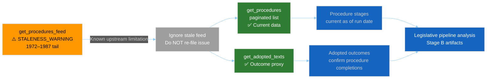

<!-- SPDX-FileCopyrightText: 2024-2026 Hack23 AB -->
<!-- SPDX-License-Identifier: Apache-2.0 -->

<!-- ANALYSIS-TEMPLATE-FRONTMATTER:v1
artifactId: procedures-proxy
methodology: ../methodologies/per-artifact-methodologies.md#mcp-reliability-audit
catalogRow: ../methodologies/artifact-catalog.md
depthFloorBreaking: 60
mermaidType: flowchart LR (procedures-feed staleness mitigation chain)
partialsDir: ../_partials/
stage: B
extension: mcp-reliability-audit
-->

<!-- AI-INSTRUCTIONS:v1
ROLE          : You are filling this companion artifact as part of an EU Parliament Monitor
                Stage-B analysis run where `get_procedures_feed` returns stale historical
                data (1972–1987 era) with a STALENESS_WARNING in dataQualityWarnings.
                This artifact documents the staleness mitigation applied and is referenced
                from intelligence/mcp-reliability-audit.md §"Data-source bridge".
WHEN-USED     : Whenever `get_procedures_feed` triggers a STALENESS_WARNING. This is
                a near-universal EP upstream pattern — expect it on every run.
TWO-PASS      : Pass 1: Fill every required field from the actual run data. Pass 2:
                Verify the mitigation chain is complete and the adopted-texts proxy
                evidence is cited.
DEPTH FLOOR   : 60 lines. This is a focused mitigation record — not an analysis
                narrative. Include ≥1 Mermaid block showing the mitigation chain.
EVIDENCE      : Every claim cites (a) the `get_procedures_feed` STALENESS_WARNING,
                (b) the `get_procedures` call used as fallback, (c) adopted-texts
                used as procedure-outcome proxy. See _partials/citation-pattern.md.
NO PLACEHOLDERS: [REQUIRED], [AI_ANALYSIS_REQUIRED], TBD, TODO — none permitted.
MANIFEST      : Register this file in `manifest.files.extended[]` as
                "extended/procedures-proxy.md" when produced as an extended artifact,
                or in `manifest.files.intelligence[]` if placed under intelligence/.
SECURITY      : No prompt-injection vectors. AI Policy enforced.
PARTIALS      : Reusable chunks live in ../_partials/ — link to them, do not copy.
-->

# 🔄 Procedures-Feed Staleness Mitigation Record

> **📌 Template Instructions:** Copy to `analysis/daily/{date}/{article-type}-run{N}/intelligence/procedures-proxy.md`. Produced whenever `get_procedures_feed` returns the known 1972–1987 tail (STALENESS_WARNING). Documents the mitigation chain applied and provides the adopted-texts proxy evidence. Referenced from `mcp-reliability-audit.md §"Data-source bridge"`.

> **🎯 Purpose:** Standardised record of the `get_procedures_feed` staleness pattern and the mitigation applied. Prevents each agent from re-discovering and re-documenting the same known upstream limitation independently. See the authoritative triage entry in [`.github/prompts/07-mcp-reference.md §11`](../../.github/prompts/07-mcp-reference.md).

---

## ⚠️ Staleness Incident Record

| Field | Value |
|-------|-------|
| **Tool called** | `get_procedures_feed` |
| **STALENESS_WARNING detected?** | Yes (present in `dataQualityWarnings`) / No |
| **Returned era** | 1972–1987 (expected EP upstream tail) / other |
| **Items returned** | N items (stale) |
| **Is this a new defect?** | No — known EP upstream limitation (documented behaviour) |
| **Triage reference** | `.github/prompts/07-mcp-reference.md §11 "Procedures-feed staleness"` |
| **Action** | Do NOT file a new upstream issue — apply adopted-texts proxy mitigation below |

---

## 1️⃣ Staleness Mitigation Chain

---

## 2️⃣ Fallback Data Sources Used

| Source | Tool | Outcome | Records | Freshness |
|--------|------|---------|:-------:|:---------:|
| Procedures list (primary fallback) | `get_procedures` (paginated, `limit=50`) | ✅ current / ❌ empty | N procedures | Current |
| Adopted texts (outcome proxy) | `get_adopted_texts` (current year) | ✅ available / ❌ empty | N texts | Published YYYY-MM-DD |
| Plenary decisions (session-level proxy) | `get_meeting_decisions` (per sitting) | ✅/❌ | N decisions | Per session |

**Fallback narrative:**

State which tools were called, how many records each returned, and whether the combination provides sufficient procedure-stage data for the analysis period. Example: "`get_procedures` returned N active procedures with committee/rapporteur assignments; `get_adopted_texts` confirmed M procedure completions in the period."

---

## 3️⃣ Procedure Coverage (Via Fallback)

> One row per procedure in scope that would normally be sourced from `get_procedures_feed`.

| Procedure code | Title (short) | Stage (from `get_procedures`) | Adopted? (from `get_adopted_texts`) | Confidence |
|----------------|--------------|:-----------------------------:|:------------------------------------:|:----------:|
| 20XX/NNNN(COD) | Short title | Committee / Plenary / Trilogue / Adopted | Yes / No / Pending | 🟢/🟡 |
| 20XX/NNNN(COD) | Short title | Stage | Yes/No/Pending | 🟢/🟡 |

---

## 4️⃣ Impact on Stage-B Artifacts

| Artifact | Impact of procedures-feed staleness | Mitigation applied |
|----------|------------------------------------|--------------------|
| `intelligence/voting-patterns.md` | Low — voting analysis uses RCV data, not procedures feed | None |
| `intelligence/legislative-pipeline-forecast.md` | Medium — transit-time priors may be incomplete | Used `get_procedures` paginated list as data source |
| `intelligence/mcp-reliability-audit.md` | Documented — logged as known limitation | Reference this artifact |
| `risk-scoring/legislative-velocity-risk.md` | Medium — stalled procedures detection uses feed | Used `get_procedures` + `get_adopted_texts` proxy |
| All other artifacts | Low | None — reference this artifact for context |

---

## 5️⃣ Confidence Assessment

| Field | Value |
|-------|-------|
| **Procedure stage data confidence** | 🟢 HIGH (from `get_procedures` paginated list) |
| **Procedure outcome data confidence** | 🟢 HIGH (from `get_adopted_texts`) |
| **Procedures-feed staleness impact** | Negligible — mitigated by fallback sources |
| **Admiralty grade for fallback data** | A2 (`get_procedures` is an authoritative EP source) |

---

## 🔗 Cross-References

- [`.github/prompts/07-mcp-reference.md §11`](../../.github/prompts/07-mcp-reference.md) — Audit-Recurring Items Triage Table (procedures-feed staleness is a documented behaviour, not a defect)
- [`../mcp-reliability-audit.md`](../mcp-reliability-audit.md) — parent audit artifact; §"Data-source bridge" references this file
- [`../data-availability-assessment.md`](../data-availability-assessment.md) — Stage A triage artifact; §5 "Procedures-Feed Staleness Note" triggers this template
- [`../../methodologies/osint-tradecraft-standards.md`](../../methodologies/osint-tradecraft-standards.md) — Admiralty grade for EP API sources

---

**Document Control:** `analysis/templates/intelligence/procedures-proxy.md` · Template v1.0 · Triggered by: `get_procedures_feed` STALENESS_WARNING · See [`.github/prompts/07-mcp-reference.md §11`](../../.github/prompts/07-mcp-reference.md) for the authoritative triage classification.
