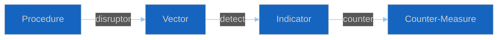

<!-- SPDX-FileCopyrightText: 2024-2026 Hack23 AB -->
<!-- SPDX-License-Identifier: Apache-2.0 -->

# ⚙️ Legislative Disruption Template — Adversarial Procedure-Level Threats

> **📌 Template Instructions:** Copy to `analysis/daily/{date}/{article-type}-run{N}/threat-assessment/legislative-disruption.md`. How adversarial pressure could stall, redirect, or capture specific procedures. See [methodologies/per-artifact-methodologies.md §legislative-disruption](../methodologies/per-artifact-methodologies.md#legislative-disruption).

> **🎯 Purpose:** Procedure-level threat analysis identifying disruption vectors, detection indicators, and institutional counter-measures.

---

## 📋 Document Metadata

| Field | Value |
|-------|-------|
| **Report ID** | `[REQUIRED: LD-YYYY-MM-DD-runNN]` |
| **Procedures Analyzed** | `[REQUIRED: count ≥3]` |

---

## 1️⃣ Targeted-Procedure List

| Procedure ID | Rapporteur | Current Stage | Disruption Opportunity Score (0-10) |
|--------------|-----------|---------------|:-----------------------------------:|
| `[REQUIRED]` | `[REQUIRED]` | `[REQUIRED]` | `[0-10]` |
| *(≥3 required)* | | | |

---

## 2️⃣ Disruption Playbook

### Procedure 1: `[REQUIRED: ID]`

**Named techniques:**
- Amendment flooding: `[REQUIRED: how this could stall]`
- Rapporteur targeting: `[REQUIRED]`
- Committee obstruction: `[REQUIRED]`
- Trilogue stalling: `[REQUIRED]`

---

## 3️⃣ Detection Indicators

`[REQUIRED: ≥60 words — what would reveal disruption early]`

---

## 4️⃣ Institutional Counter-Measures

**EP Rule of Procedure tools available:** `[REQUIRED: list with citations]`

---

**Document Control:** `/analysis/daily/{date}/{type}-run{N}/threat-assessment/legislative-disruption.md` · Template v1.0 · Depth floor: 30 lines.
