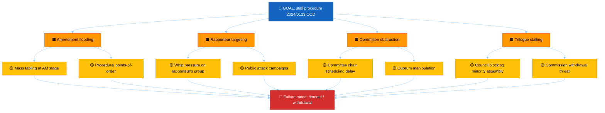

<!-- SPDX-FileCopyrightText: 2024-2026 Hack23 AB -->
<!-- SPDX-License-Identifier: Apache-2.0 -->

# ⚙️ Legislative Disruption Template — Procedure-Level Adversarial Threats

> **📌 Template Instructions:** Copy to `analysis/daily/{date}/{article-type}-run{N}/threat-assessment/legislative-disruption.md`. How adversarial pressure could **stall, redirect, capture, or sabotage** specific EP procedures. Build a per‑procedure **attack tree**, a MITRE‑style **technique catalog**, **detection indicators**, and **EP Rules‑of‑Procedure counter‑levers**. See [methodologies/per-artifact-methodologies.md §legislative-disruption](../methodologies/per-artifact-methodologies.md#legislative-disruption).

> **🎯 Purpose:** Procedure‑level threat analysis identifying disruption vectors, detection indicators, institutional counter‑measures, and EU‑27 cluster vulnerability profile. **Multi‑national extension over Riksdagsmonitor:** every disruption vector is tagged with the cluster from which the pressure originates and the cluster most exposed.

---

## 📋 Document Metadata

| Field | Value |
|-------|-------|
| **Report ID** | `[REQUIRED: LD-YYYY-MM-DD-runNN]` |
| **Period** | `[REQUIRED: YYYY-MM-DD to YYYY-MM-DD]` |
| **Procedures Analyzed** | `[REQUIRED: count ≥3]` |
| **Disruption Techniques Catalogued** | `[REQUIRED: count ≥6]` |
| **Confidence** | `[REQUIRED: 🟢 HIGH / 🟡 MEDIUM / 🔴 LOW]` |
| **PIR Tags** | `[REQUIRED]` |

---

## 1️⃣ Targeted Procedure List

| # | Procedure ID | Title | Rapporteur | Group | Current Stage | Disruption Opportunity Score (0‑10) | Cluster origin of pressure |
|:-:|--------------|-------|------------|-------|---------------|:-----------------------------------:|:--------------------------:|
| 1 | `[REQUIRED]` | `[REQUIRED]` | `[REQUIRED]` | `[group]` | `[stage]` | `[0‑10]` | `[N/W/S/CE/external]` |
| 2 | `[REQUIRED]` | `[REQUIRED]` | `[REQUIRED]` | `[…]` | `[…]` | `[0‑10]` | `[…]` |
| 3 | `[REQUIRED]` | `[REQUIRED]` | `[REQUIRED]` | `[…]` | `[…]` | `[0‑10]` | `[…]` |

*(≥3 procedures.)*

**Score scale (0‑10):**
- 0‑3 = routine procedural friction, low disruption potential
- 4‑6 = elevated friction (organised amendment campaigns, group whips diverging)
- 7‑10 = active disruption (rapporteur targeting, trilogue stalling, withdrawal threats)

---

## 2️⃣ Attack Tree — Top Procedure

For the highest‑score procedure, build a Mermaid attack tree showing how disruption could chain from initiating action to procedural failure.

**Tree narrative:** `[REQUIRED: ≥80 words — which branch is the highest‑probability path, which is the highest‑impact path, where the branches converge.]`

---

## 3️⃣ MITRE‑Style Disruption Technique Catalog

Catalogue of named techniques observed in EP history and applicable here. Each row maps a technique → a procedural choke‑point → a known counter‑lever from the Rules of Procedure.

| ID | Technique | Stage targeted | EU‑27 cluster origin (typical) | Detection indicator | RoP counter‑lever |
|:--:|-----------|----------------|:------------------------------:|---------------------|-------------------|
| LD-T01 | **Amendment flooding** | Committee AM stage | any | >300 amendments by a single group on a single file in <48h | RoP Rule 180 (admissibility filter), Rule 181 (block voting) |
| LD-T02 | **Rapporteur isolation** | Committee → plenary | any | Group whip publicly disowns rapporteur; shadow rapporteurs withdraw | RoP Rule 56 (rapporteur replacement), group coordinator escalation |
| LD-T03 | **Trilogue stalling** | Inter‑institutional | Council‑side | >3 missed trilogue rounds with no compromise text | Rule 71 (referral back to plenary), parliamentary public statement |
| LD-T04 | **Quorum manipulation** | Committee vote | any | Repeated late‑notice scheduling, attendance < 1/3 | Rule 178 (quorum challenge), chair public objection |
| LD-T05 | **Disinformation campaign** | Public framing | external | Coordinated inauthentic amplification on social platforms targeting rapporteur | Transparency register audit, DSA Art. 34 systemic‑risk reporting |
| LD-T06 | **Council common‑position pre‑empt** | Trilogue | Council‑side | Council adopts position before EP 1st reading completes | Rule 65 (interinstitutional negotiations protocol), Conference of Presidents engagement |
| `[REQUIRED: ADD MORE]` | `[REQUIRED]` | `[…]` | `[…]` | `[REQUIRED]` | `[REQUIRED]` |

*(Catalogue ≥6 techniques. The first six are the seed list; agents MUST extend with techniques specific to the period under analysis and CITE EP Rule numbers.)*

---

## 4️⃣ Detection Indicators (Per Procedure)

For each of the top‑3 procedures, list 3‑5 observable indicators that would reveal disruption is underway in time to act.

### Procedure 1: `[REQUIRED: ID]`

| # | Indicator | Source signal | Time‑to‑act |
|:-:|-----------|---------------|:-----------:|
| 1 | `[REQUIRED]` | `[REQUIRED — e.g. "Amendment count > 200 within 24h of tabling deadline"]` | `[hours/days]` |
| 2 | `[REQUIRED]` | `[REQUIRED]` | `[…]` |
| 3 | `[REQUIRED]` | `[REQUIRED]` | `[…]` |

*(Repeat for top‑3 procedures.)*

---

## 5️⃣ Counter‑Measure Map

Color‑coded flowchart showing how detection feeds counter‑levers.

**EP Rules of Procedure counter‑levers cited in this report:** `[REQUIRED: list with Rule numbers]`

---

## 6️⃣ Cross‑Cluster Vulnerability Profile

Which EU‑27 clusters are most exposed to disruption of these procedures?

| Cluster | Exposure to these disruptions | Dominant exposure mechanism |
|---------|:-----------------------------:|------------------------------|
| Northern | `[🟢/🟡/🔴]` | `[REQUIRED ≤30 words]` |
| Western | `[🟢/🟡/🔴]` | `[REQUIRED]` |
| Southern | `[🟢/🟡/🔴]` | `[REQUIRED]` |
| Central‑Eastern | `[🟢/🟡/🔴]` | `[REQUIRED]` |

**Cluster narrative:** `[REQUIRED: ≥60 words on which cluster is most institutionally vulnerable and why.]`

---

## 7️⃣ Reader Briefing — Plain Language

> 📰 **Newsroom hook:** `[REQUIRED: one‑sentence summary.]`

- **Which procedure is most at risk:** `[REQUIRED: ≥30 words]`
- **What "disruption" looks like in plain language:** `[REQUIRED: ≥30 words]`
- **What the EP can do about it:** `[REQUIRED: ≥30 words]`
- **What to watch in the next 4 weeks:** `[REQUIRED: ≥30 words]`

---

## 8️⃣ Data Sources & Provenance

**EP MCP tools used:** `get_procedures`, `monitor_legislative_pipeline`, `analyze_committee_activity`, `analyze_legislative_effectiveness` *(REQUIRED: ≥3)*

| Source | Type | Admiralty | Link |
|--------|------|:---------:|------|
| `[REQUIRED]` | `[Primary EP RoP / Procedure file / Press / Analyst report]` | `[A1‑F6]` | `[URL]` |
| `[REQUIRED]` | `[…]` | `[…]` | `[…]` |

---

## 9️⃣ Confidence & Caveats

- **Overall confidence:** `[REQUIRED: 🟢/🟡/🔴]`
- **Top uncertainty:** `[REQUIRED: ≥40 words]`
- **Ethical guard‑rail:** This template catalogues disruption *techniques* defensively, to enable detection and counter‑measure. It MUST NOT prescribe attack playbooks; every entry MUST pair with a counter‑lever.

---

**Document Control:** `/analysis/daily/{date}/{type}-run{N}/threat-assessment/legislative-disruption.md` · Template v2.0 · Depth floor: 140 lines · Mermaid diagrams: ≥2 (attack tree + counter‑measure map) · Reader briefing: required · Technique catalogue: ≥6 entries.
