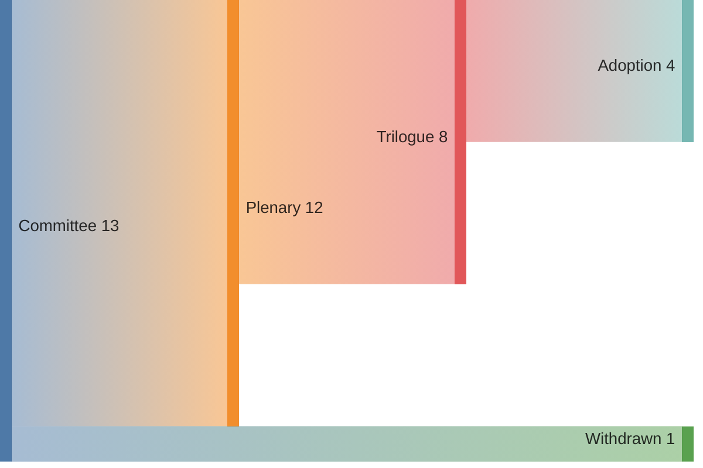

<!-- SPDX-FileCopyrightText: 2024-2026 Hack23 AB -->
<!-- SPDX-License-Identifier: Apache-2.0 -->

# 📊 Legislative Pipeline Forecast Template

**Template Purpose:** Per-procedure transit-time projection (committee → plenary → trilogue → adoption) with horizon-conditional probability of completion. Replaces the rapporteur-stage heuristic baked into `monitor_legislative_pipeline` with a Monte-Carlo prior over the trailing 24 months of stage-transition timings.

**Methodology:** [forward-projection-methodology.md §5](../methodologies/forward-projection-methodology.md#5-legislative-pipeline-transit-priors)

**Min Lines:** 200 (`quarter-in-review`), 220 (`quarter-ahead`, `year-in-review`), 260 (`year-ahead`).

**Required by:** `quarter-ahead`, `year-ahead`, `quarter-in-review`, `year-in-review`. Optional for `propositions`.

---

## 📋 Header Block

```markdown
# Legislative Pipeline Forecast — {Article-Type Slug} — {Run Date}

**Classification:** PUBLIC
**Horizon:** {next 90 days | next 12 months | trailing 90 days}
**Active Procedures Tracked:** {N}
**Reference Window for Prior:** {trailing 24 months — date range}
**Transit-Model Source:** scripts/aggregator/pipeline-transit-model.js (P10/P50/P90)
```

---

## 🎯 Section 1 — Pipeline Snapshot

Mermaid block depicting current stage occupancy:



---

## 📈 Section 2 — Active Procedure Forecast Table

For every active procedure (≥ N rows; one row per procedure):

```markdown
| Procedure ID | Title (short) | Current stage | P10 transit | P50 transit | P90 transit | P(complete by horizon) | Bottleneck stage | WEP band |
|---|---|---|---|---|---|---|---|---|
| 2024/0001(COD) | … | trilogue | 14 days | 35 days | 92 days | 70% | trilogue | Likely |
| … | … | … | … | … | … | … | … | … |
```

`P10/P50/P90` come from the trailing-24-month transit-time distribution per stage and procedure type. `P(complete by horizon)` is the cumulative probability that the remaining stages finish before horizon end.

---

## 🚧 Section 3 — Bottleneck Analysis

For the top-3 bottleneck stages by variance, document:

```markdown
### Bottleneck — {stage}

- **Trailing-24m P50 transit:** {days}
- **Variance vs prior 24 months:** {% change}
- **Plausible drivers:** {Council Trio handover, rapporteur change, summer recess, …}
- **Mitigation signals:** {extraordinary plenary, fast-track procedure, …}
```

---

## 📅 Section 4 — Horizon-Bound Completion Heatmap

Mermaid heatmap (or rendered table) of P(complete) across active procedures × horizon checkpoints (T+30, T+60, T+90, T+12m where applicable).

```markdown
| Procedure | T+30 | T+60 | T+90 | T+180 | T+12m |
|---|---|---|---|---|---|
| 2024/0001(COD) | 5% | 25% | 70% | 92% | 99% |
| … | … | … | … | … | … |
```

---

## 🔁 Section 5 — Cross-Run Diff

Compare against the last `legislative-pipeline-forecast.md` run's P50/P90 to detect drift. Stage C 🟡-warns when ≥ 30% of tracked procedures show > 50% drift in P(complete) without an explanatory event.

```markdown
| Procedure | Prior run P(complete by horizon) | This run | Δ | Plausible cause |
|---|---|---|---|---|
| 2024/0001(COD) | 50% | 70% | +20 | trilogue concluded last week |
```

---

## 🧮 Section 6 — Reference-Class Anchors

Links each forecast row to the analogue cohort used to compute its prior:

```markdown
| Procedure type | Reference cohort | Sample size | P50 transit (cohort) |
|---|---|---|---|
| COD ordinary | All COD trilogues 2024–2026 | N=… | … days |
| BUD annual | Annual budget trilogues 2019–2025 | N=7 | … days |
| INI own-init | All INI 2024–2026 | N=… | … days |
```

---

## ⚠️ Section 7 — Risk Annotations

For each high-stakes procedure, attach a one-line WEP-banded risk note (from [`risk-matrix.md`](./risk-matrix.md)):

```markdown
| Procedure | Risk | Likelihood × Impact | Notes |
|---|---|---|---|
| 2024/0042(COD) | Trilogue collapse | Likely × High | Council Trio handover mid-cycle |
```

---

## 📝 Section 8 — Pass-2 Quality Self-Audit

```markdown
- [ ] Every active procedure has P10/P50/P90 cited
- [ ] Bottleneck section names ≥ 3 stages with variance
- [ ] Cross-run diff covers ≥ 80% of carry-over procedures
- [ ] Reference-class cohort is named for every procedure type
- [ ] Risk annotations cite WEP band
```

---

## ⚙️ Section 9 — Methodology Compliance

Note any procedures excluded from the model (e.g. < 3 trailing analogues — fall back to rapporteur-stage heuristic and flag).
