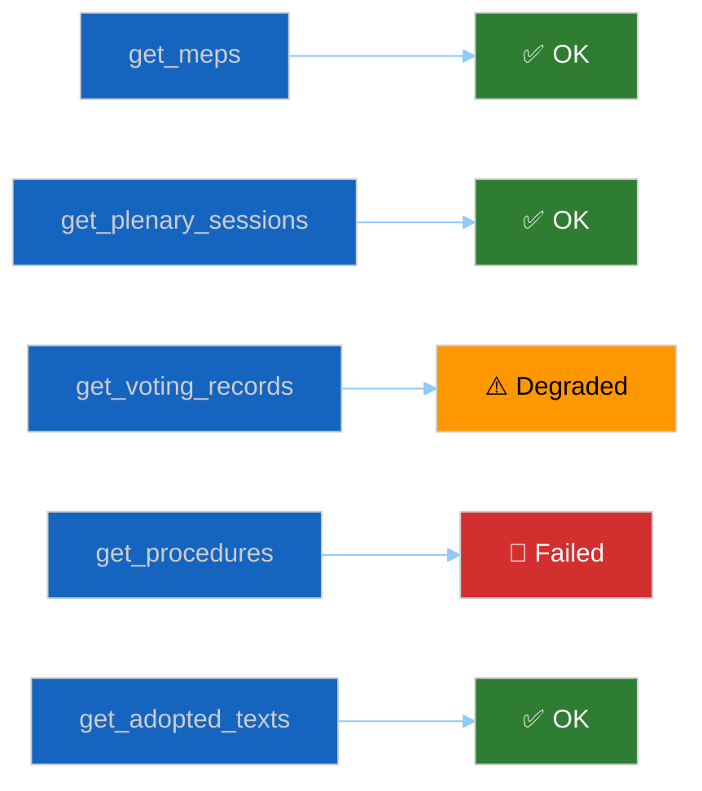

<!-- SPDX-FileCopyrightText: 2024-2026 Hack23 AB -->
<!-- SPDX-License-Identifier: Apache-2.0 -->

# 🛰️ MCP Reliability Audit Template — Endpoint Health & Uptime Report

> **📌 Template Instructions:** Copy to `analysis/daily/{date}/{article-type}-run{N}/intelligence/mcp-reliability-audit.md`. Endpoint-by-endpoint record of EP MCP availability and data freshness during the run. See [methodologies/per-artifact-methodologies.md §mcp-reliability-audit](../methodologies/per-artifact-methodologies.md#mcp-reliability-audit).

> **🎯 Purpose:** Comprehensive MCP server health assessment tracking which endpoints succeeded, which failed, which were degraded, and what workarounds were applied. First-class product concern — this is the deepest breaking-run artifact.

> **🚦 MANDATORY TRIAGE GATE — read before classifying any finding as a "defect".**
>
> The 2026-04-26 audits re-surfaced 9 EP/WB tool behaviours as defects when only 1 was a real server bug (item #1 in the triage table — `generate_political_landscape` 100-MEP sample). Before adding any row to §3 "Upstream Issues", look up every degraded/failed tool in [`.github/prompts/07-mcp-reference.md` §11 — Audit-Recurring Items Triage Table](/.github/prompts/07-mcp-reference.md). For each match:
>
> - 🔴 **REAL BUG** (real-bug rows): file/link the upstream `Hack23/European-Parliament-MCP-Server` issue. Item #1 in the triage table is **resolved in v1.2.15+** (PR [#405](https://github.com/Hack23/European-Parliament-MCP-Server/pull/405)) — note the gateway version and the resolution status; do NOT re-file.
> - 🟢 **LIMITATION** (documented EP/WB upstream limitation): set `Defect ID` to `"documented behaviour — see 07-mcp-reference.md §11 #N"`, record the listed mitigation, and **omit** the row from §3 "Upstream Issues" / "Issues needing creation".
> - 🔵 **CALLING-PATTERN** (consumer-side fix available): same as 🟢, plus add a `Configuration adjustment` recommendation in §7 pointing to the corrected invocation.
>
> Only symptoms NOT covered by the triage table reach the bug-filing path.

---

## 📋 Document Metadata

| Field | Value |
|-------|-------|
| **Report ID** | `[REQUIRED: MCP-YYYY-MM-DD-runNN]` |
| **Run Date** | `[REQUIRED: YYYY-MM-DD]` |
| **Endpoints Attempted** | `[REQUIRED: count]` |
| **Endpoints Succeeded** | `[REQUIRED: count]` |
| **Reliability Score (0-100)** | `[REQUIRED: #]` |
| **Overall Status** | `[REQUIRED: ✅ Full / ⚠️ Degraded / 🔴 Unavailable]` |

---

## 1️⃣ Endpoint Scoreboard



| Tool Name | Attempts | Successes | 4xx Errors | 5xx Errors | Timeouts | Latency (avg) | Data Age | Status |
|-----------|:--------:|:---------:|:----------:|:----------:|:--------:|:-------------:|:--------:|:------:|
| `get_meps` | `[#]` | `[#]` | `[#]` | `[#]` | `[#]` | `[ms]` | `[REQUIRED: e.g. "2 days old" or "N/A"]` | `[✅/⚠️/🔴]` |
| `get_plenary_sessions` | `[#]` | `[#]` | `[#]` | `[#]` | `[#]` | `[ms]` | `[REQUIRED]` | `[✅/⚠️/🔴]` |
| `get_voting_records` | `[#]` | `[#]` | `[#]` | `[#]` | `[#]` | `[ms]` | `[REQUIRED]` | `[✅/⚠️/🔴]` |
| `get_adopted_texts` | `[#]` | `[#]` | `[#]` | `[#]` | `[#]` | `[ms]` | `[REQUIRED]` | `[✅/⚠️/🔴]` |
| `get_procedures` | `[#]` | `[#]` | `[#]` | `[#]` | `[#]` | `[ms]` | `[REQUIRED]` | `[✅/⚠️/🔴]` |
| `get_committee_info` | `[#]` | `[#]` | `[#]` | `[#]` | `[#]` | `[ms]` | `[REQUIRED]` | `[✅/⚠️/🔴]` |
| `get_speeches` | `[#]` | `[#]` | `[#]` | `[#]` | `[#]` | `[ms]` | `[REQUIRED]` | `[✅/⚠️/🔴]` |
| `get_parliamentary_questions` | `[#]` | `[#]` | `[#]` | `[#]` | `[#]` | `[ms]` | `[REQUIRED]` | `[✅/⚠️/🔴]` |
| `analyze_coalition_dynamics` | `[#]` | `[#]` | `[#]` | `[#]` | `[#]` | `[ms]` | `[REQUIRED]` | `[✅/⚠️/🔴]` |
| `assess_mep_influence` | `[#]` | `[#]` | `[#]` | `[#]` | `[#]` | `[ms]` | `[REQUIRED]` | `[✅/⚠️/🔴]` |
| `compare_political_groups` | `[#]` | `[#]` | `[#]` | `[#]` | `[#]` | `[ms]` | `[REQUIRED]` | `[✅/⚠️/🔴]` |
| `get_all_generated_stats` | `[#]` | `[#]` | `[#]` | `[#]` | `[#]` | `[ms]` | `[REQUIRED]` | `[✅/⚠️/🔴]` |

**Status definitions:**
- ✅ OK: 100% success rate, latency <5s, data fresh
- ⚠️ Degraded: 50-99% success rate OR latency 5-30s OR data stale but usable
- 🔴 Failed: <50% success rate OR timeouts >50% OR data unavailable

---

## 2️⃣ Per-Endpoint Findings

### `[REQUIRED: Endpoint 1 — name failing or degraded endpoint]`

**Status:** `[⚠️ Degraded / 🔴 Failed]`

**Symptom:**

`[REQUIRED: ≥60 words describing what went wrong. Include error messages, HTTP status codes, timeout durations, or data-quality issues observed.]`

**Likely root cause:**

`[REQUIRED: ≥60 words analyzing the probable cause. Examples: "EP Open Data Portal upstream 503 errors", "Feed publication delay (known issue for RCV data)", "MCP server timeout configuration too aggressive for large result sets", "Authentication token expiry".]`

**Repro attempt:**

`[REQUIRED: ≥40 words describing what steps were taken to reproduce or diagnose. Did retry succeed? Did parameter adjustment help? Was fallback endpoint tested?]`

**Workaround used in this run:**

`[REQUIRED: ≥60 words explaining how the run compensated. Examples: "Used prior-run cached data from run{N-1}", "Switched to direct EP API endpoint bypass", "Applied IMF (primary economic) data as context bridge per Wave-4 policy", "Reduced query scope from year-filter to month-filter".]`

---

### `[REQUIRED: Endpoint 2]`

*(Repeat structure for every failing or degraded endpoint. Target ≥3 detailed subsections.)*

---

## 3️⃣ Upstream Issues

**Linked issues on `Hack23/European-Parliament-MCP-Server`:**

| Issue # | Title | Status | URL | Filed This Run? |
|:-------:|-------|:------:|-----|:---------------:|
| `[#123]` | `[REQUIRED: issue title]` | `[Open / Closed]` | `[REQUIRED: https://github.com/Hack23/European-Parliament-MCP-Server/issues/123]` | `[Yes / No]` |
| `[REQUIRED]` | `[REQUIRED]` | `[...]` | `[REQUIRED]` | `[Yes / No]` |
| `[REQUIRED]` | `[REQUIRED]` | `[...]` | `[REQUIRED]` | `[Yes / No]` |

**Issues needing creation:**

`[REQUIRED: list any degraded endpoints that DO NOT have an upstream GitHub issue and SHOULD have one. For each, provide: endpoint name, symptom summary, repro steps. Or note "all issues filed".]`

---

## 4️⃣ Data-Source Bridge

**Alternative sources compensating for EP MCP failures:**

| Failed EP MCP Tool | Alternative Source Used | Data Quality | Coverage |
|-------------------|------------------------|:------------:|:--------:|
| `[REQUIRED: tool name]` | `[REQUIRED: e.g. "Direct EP API endpoint", "IMF SDMX REST (primary economic)", "World Bank MCP (non-economic)", "Prior-run cache"]` | `[🟢 Equal / 🟡 Reduced / 🔴 Insufficient]` | `[% of needed data recovered]` |
| `[REQUIRED]` | `[REQUIRED]` | `[...]` | `[...]` |
| `[REQUIRED]` | `[REQUIRED]` | `[...]` | `[...]` |

**Bridge narrative:**

`[REQUIRED: ≥100 words explaining the overall data-source strategy when EP MCP was degraded. What was the fallback order? (EP MCP → direct EP API → IMF SDMX REST (primary economic, Wave-4) → World Bank MCP (non-economic only) → prior-run cache → degraded analysis with LOW confidence marker). Which artifacts were affected? Where are gaps acknowledged?]`

---

## 5️⃣ Reliability Index

**Calculation methodology:**

```
Adjusted Success Rate = (
  Successful calls — excluding 🔵/🟢-classified triage items
) / (
  Total calls — excluding 🔵/🟢-classified triage items
              — excluding 🟡 SLOW_FEED_WARNING (get_events_feed timeout)
)
```

> **Denominator exclusion rule (mandatory):** Items classified as 🟢 LIMITATION or 🔵 CALLING-PATTERN in `.github/prompts/07-mcp-reference.md` §11 are **excluded from both numerator and denominator** when computing success rate. They represent documented EP/WB API behaviour — including them would systematically penalise runs for expected EP behaviour (e.g., OJQ 404 for forward sessions, `get_events_feed` slow-feed timeouts during heavy load, `get_procedures_feed` recess-mode archive returns). Only 🔴 REAL BUG rows and symptoms not in the triage table count against the score.

```
Reliability Score = (
  (Adjusted success rate) × 50 +
  max(0, min(1, 1 - (Avg latency / 30s))) × 25 +
  (Data freshness score) × 25
)
```

> **Latency clamp:** the latency term is bounded to `[0, 1]` before weighting — a call slower than 30 s contributes `0` (never negative), and an instant call contributes `1`. This prevents pathological MCP latencies from driving the total reliability score below 0 when success-rate and freshness are reasonable.

**Component scores:**

| Component | Weight | Raw Score | Weighted Score |
|-----------|:------:|:---------:|:--------------:|
| Adjusted success rate¹ | 50% | `[REQUIRED: %]` | `[REQUIRED: #/50]` |
| Latency | 25% | `[REQUIRED: normalized 0-1]` | `[REQUIRED: #/25]` |
| Data freshness | 25% | `[REQUIRED: 1.0=same-day, 0.5=week-old, 0.0=month-old]` | `[REQUIRED: #/25]` |
| **Total** | **100%** | — | **`[REQUIRED: #/100]`** |

> ¹ **Adjusted success rate** = exclude from both numerator and denominator: (a) 🟢/🔵 triage-table matches — `documented behaviour — see 07-mcp-reference.md §11 #N`; (b) `get_events_feed` 🟡 SLOW_FEED_WARNING rows (timeout downgraded to warning by MCP client — not a reliability failure). Keep the count in a separate `🟡 Slow-feed warnings` row for transparency.

**Reliability breakdown by category:**

| Category | Tools | Score (0-100) |
|----------|-------|:-------------:|
| Data Retrieval (get_*) | `[REQUIRED: list]` | `[#]` |
| Analysis (analyze_*, assess_*, compare_*) | `[REQUIRED: list]` | `[#]` |
| Historical Stats | `[REQUIRED: list]` | `[#]` |

---

## 6️⃣ Trend vs. Prior Runs

| Run | Date | Reliability Score | Endpoints Failed | Notable Issues |
|:---:|:----:|:-----------------:|:----------------:|----------------|
| `[REQUIRED: current run]` | `[YYYY-MM-DD]` | `[#]` | `[#]` | `[REQUIRED: one-line]` |
| `[REQUIRED: run{N-1}]` | `[YYYY-MM-DD]` | `[#]` | `[#]` | `[REQUIRED]` |
| `[REQUIRED: run{N-2}]` | `[YYYY-MM-DD]` | `[#]` | `[#]` | `[REQUIRED]` |
| `[REQUIRED: run{N-3}]` | `[YYYY-MM-DD]` | `[#]` | `[#]` | `[REQUIRED]` |

**Trend narrative:**

`[REQUIRED: ≥80 words analyzing whether MCP reliability is improving, stable, or degrading over recent runs. What chronic issues persist? What recent fixes have helped?]`

---

## 7️⃣ Recommendations for Next Run

**Immediate actions:**

1. `[REQUIRED: specific action — e.g. "File GitHub issue for get_voting_records timeout behavior"]`
2. `[REQUIRED]`
3. `[REQUIRED]`

**Configuration adjustments:**

`[REQUIRED: list any MCP client timeout, retry, or parameter settings to adjust for next run]`

**Fallback-source readiness:**

`[REQUIRED: which alternative data sources should be pre-tested or pre-cached before next run to minimize degradation impact?]`

---

## 8️⃣ Confidence Assessment

**Overall confidence in EP MCP data quality this run:** `[REQUIRED: 🟢 HIGH / 🟡 MEDIUM / 🔴 LOW]`

**Confidence rationale:** `[REQUIRED: ≥60 words explaining where data is trustworthy vs. where workarounds introduce uncertainty or staleness.]`

---

## 🛠️ Worked example — MCP reliability audit row

| Tool | Calls | OK | Errors | p95 latency | Degradation handling |
|---|:-:|:-:|:-:|:-:|---|
| `get_voting_records` | 14 | 14 | 0 | 380 ms | None — fully healthy |
| `analyze_coalition_dynamics` | 7 | 6 | 1 (timeout) | 4.2 s | Retry with smaller window succeeded |
| `get_adopted_texts` | 5 | 4 | 1 (FRESHNESS_FALLBACK) | 1.1 s | augmented mode used; flagged in `manifest.dataFreshnessWarnings[]` |
| `imf-fetch-data` | 9 | 9 | 0 | 720 ms | None |
| `worldbank-mcp/raw-rest` | 4 | 3 | 1 (rate-limit 429) | 6.8 s | 60s back-off, succeeded on retry |
| `get_speeches` | 12 | 11 | 1 (5xx upstream) | 920 ms | Used cached prior-run data; tagged "stale-acceptable" |

**Aggregate health**: 91% success across 51 calls. Two non-fatal
degradations (FRESHNESS_FALLBACK, prior-run cache) tagged in manifest
and acknowledged in the article's data-source footer.

**Pre-cache recommendations for next run**:
1. Pre-warm `get_adopted_texts` for current week to reduce
   FRESHNESS_FALLBACK frequency.
2. Capture `analyze_coalition_dynamics` snapshots via smaller
   per-week windows.

## 🚫 Anti-patterns — mcp-reliability-audit failures

| Anti-pattern | Why it fails | Correct approach |
|---|---|---|
| Total errors only, no per-tool breakdown | Cannot identify root cause | Per-tool table |
| Counting cache hits as "OK" | Hides degradation | Tag "stale-acceptable" separately |
| No degradation note in article | Stage-C signal lost | Article footer mentions degradation |
| Latency reported only as mean | Tail behaviour invisible | p95 minimum, p50 + p99 ideal |
| FRESHNESS_FALLBACK ignored | Data quality risk | Always log + flag |
| Workaround narrative absent | No learning from incidents | Per-degradation: what was done |
| Timeline ignored | Cannot attribute to upstream issue | Timestamp every tool call |

## 🎯 Tool surface (this artifact's scope)

Every MCP tool used in the run must appear in the audit table. Sources:

- EP MCP (~80 tools surfaced)
- IMF MCP (~6 tools)
- WB MCP (~7 tools)

Each cell carries: call count, OK count, error breakdown, latency p95,
degradation handling.

## 🔗 Controlling methodology cross-references

- [`../methodologies/per-artifact-methodologies.md §mcp-reliability-audit`](../methodologies/per-artifact-methodologies.md)
- [`workflow-audit.md`](workflow-audit.md) — broader workflow-level audit
- [`data-download-manifest.md`](data-download-manifest.md) — companion artifact for raw-data manifest

## ✅ Stage-C completeness signals

- Line floor: 385 lines (this is one of the largest audit artifacts)
- Per-tool row for every MCP tool called
- Degradation note + handling per error
- Pre-cache recommendations for next run
- Confidence assessment present

---

**Document Control:** `/analysis/daily/{date}/{type}-run{N}/intelligence/mcp-reliability-audit.md` · Template v1.2 · Depth floor: 385 lines.
