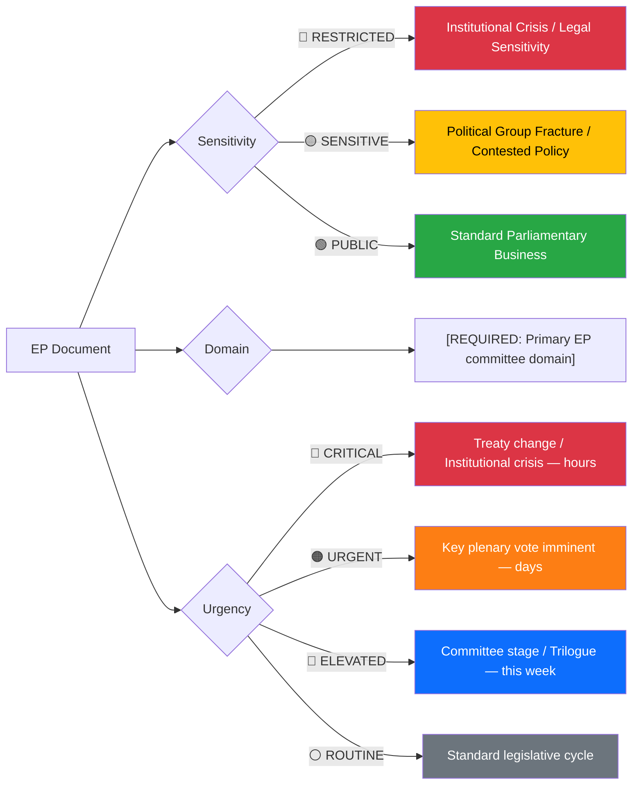
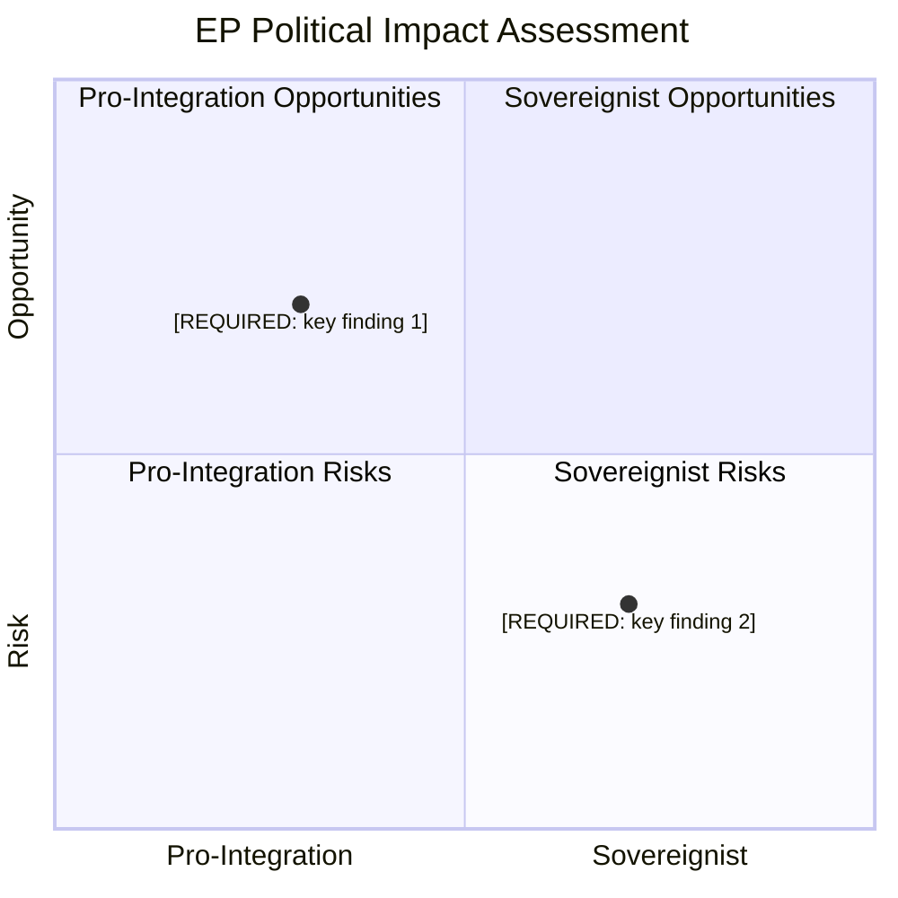
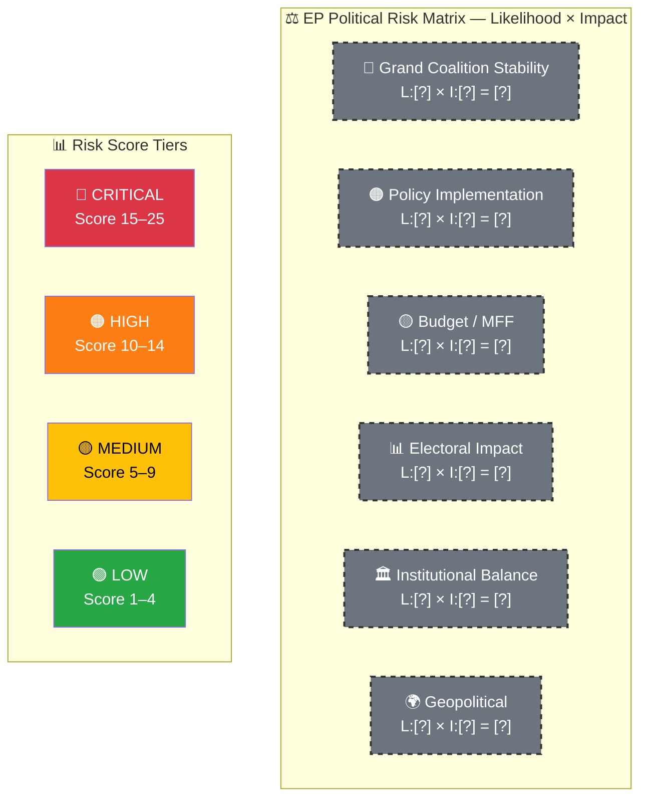

  

<h1 align="center">🔍 Per-File Political Intelligence Analysis Template — European Parliament</h1>

  <strong>📊 Deep AI-Driven Analysis for Individual EP Documents</strong> 
  <em>🎯 SWOT · Risk · Threat · Stakeholder Impact · Strategic Implications</em>

  
  
  
  

**📋 Document Owner:** CEO | **📄 Version:** 1.0 | **📅 Last Updated:** 2026-03-30 (UTC)
**🏢 Owner:** Hack23 AB (Org.nr 5595347807) | **🏷️ Classification:** Public

> **📌 Template Instructions:** This template is for **per-file** analysis. For each data file downloaded via EP MCP (e.g., an adopted text, vote record, committee document), the AI agent produces one analysis markdown file stored alongside the data file.
>
> **Example path:** `analysis/2026-03-30/committee-reports/data/adopted-texts/P9_TA-2026-0089.json` → `analysis/2026-03-30/committee-reports/data/adopted-texts/P9_TA-2026-0089.analysis.md`

> **🚨 Anti-Pattern Warning:** Plain prose without structured tables, Mermaid diagrams, or evidence citations is REJECTED. Every analysis file MUST follow this template exactly: metadata header, structured tables with evidence columns, ≥1 color-coded Mermaid diagram, confidence labels on all claims. See [ai-driven-analysis-guide.md](../methodologies/ai-driven-analysis-guide.md) for good vs. bad examples.

---

## 📋 Document Identity

| Field | Value |
|-------|-------|
| **Document ID** | `[REQUIRED: EP document reference, e.g. P9_TA(2026)0089]` |
| **Document Type** | `[REQUIRED: adopted-texts / committee-documents / procedures / votes / speeches / questions / events / meps / declarations / plenary-documents / external-documents]` |
| **Title** | `[REQUIRED: document title]` |
| **Date** | `[REQUIRED: document date or fetch date]` |
| **Parliamentary Term** | `[REQUIRED: e.g. EP10 (2024–2029)]` |
| **Committee** | `[If applicable: e.g. ENVI, ECON, LIBE]` |
| **Source MCP Tool** | `[REQUIRED: e.g. get_adopted_texts, get_voting_records, search_documents]` |
| **Analysis Timestamp** | `[REQUIRED: YYYY-MM-DD HH:MM UTC]` |
| **Analyst** | `[REQUIRED: workflow name, e.g. news-committee-reports]` |

---

## 🎯 Executive Summary

`[REQUIRED: 3–5 sentences capturing the political significance at intelligence level. Not just what happened, but what it means for EP power dynamics, political group cohesion, institutional balance, and democratic accountability. Include confidence label.]` **[HIGH/MEDIUM/LOW]**

---

## 📊 Political Classification

| Field | Assessment |
|-------|-----------|
| **Sensitivity Level** | `[REQUIRED: PUBLIC / SENSITIVE / RESTRICTED]` |
| **Primary Domain** | `[REQUIRED: EP committee code, e.g. ENVI, ECON, LIBE, AFET]` |
| **Secondary Domain(s)** | `[OPTIONAL: up to 2 additional committee domains]` |
| **Urgency** | `[REQUIRED: ROUTINE / ELEVATED / URGENT / CRITICAL]` |
| **Significance Score** | `[REQUIRED: 0–10]` |
| **Confidence** | `[REQUIRED: HIGH / MEDIUM / LOW]` |

---

## 💪 SWOT Impact Assessment

> *How does this document affect the EP political landscape? Each entry requires evidence.*

### Quadrant Overview

> ⚠️ AI Agent: Replace placeholder findings with actual data points from this document's analysis. Adjust coordinates based on real political positioning.

### Grand Coalition Impact (EPP + S&D + Renew)

| Quadrant | Statement | Evidence | Confidence | Impact |
|----------|-----------|----------|:----------:|:------:|
| ✅ Strength | `[If this strengthens grand coalition]` | `[EP doc reference]` | `H/M/L` | `H/M/L` |
| ⚠️ Weakness | `[If this exposes grand coalition vulnerability]` | `[EP doc reference]` | `H/M/L` | `H/M/L` |
| 🚀 Opportunity | `[If this creates grand coalition opportunity]` | `[EP doc reference]` | `H/M/L` | `H/M/L` |
| 🔴 Threat | `[If this threatens grand coalition]` | `[EP doc reference]` | `H/M/L` | `H/M/L` |

### Opposition / Alternative Coalition Impact (ECR + PfE + ESN + Left + Greens)

| Quadrant | Statement | Evidence | Confidence | Impact |
|----------|-----------|----------|:----------:|:------:|
| ✅ Strength | `[If this strengthens alternative formations]` | `[EP doc reference]` | `H/M/L` | `H/M/L` |
| ⚠️ Weakness | `[If this exposes opposition vulnerability]` | `[EP doc reference]` | `H/M/L` | `H/M/L` |
| 🚀 Opportunity | `[If this creates opposition opportunity]` | `[EP doc reference]` | `H/M/L` | `H/M/L` |
| 🔴 Threat | `[If this threatens opposition groups]` | `[EP doc reference]` | `H/M/L` | `H/M/L` |

---

## ⚖️ Risk Assessment

> **⚠️ AI Instructions:** Replace ALL `[?]` placeholders with actual numbers derived from the document data. Update node styles from grey dashed to the correct risk tier colour.

| Risk Type | Likelihood (1–5) | Impact (1–5) | Score | Assessment |
|-----------|:-----------------:|:------------:|:-----:|------------|
| Grand Coalition Stability | `[1-5]` | `[1-5]` | `[L×I]` | `[REQUIRED: how does this affect EPP-S&D-Renew cooperation?]` |
| Policy Implementation | `[1-5]` | `[1-5]` | `[L×I]` | `[REQUIRED: will this legislation be implemented effectively?]` |
| Budget / MFF | `[1-5]` | `[1-5]` | `[L×I]` | `[REQUIRED: fiscal implications for EU budget?]` |
| Electoral Impact | `[1-5]` | `[1-5]` | `[L×I]` | `[REQUIRED: how does this affect 2029 EP election positioning?]` |
| Institutional Balance | `[1-5]` | `[1-5]` | `[L×I]` | `[REQUIRED: EP vs Council vs Commission power dynamics?]` |
| Geopolitical | `[1-5]` | `[1-5]` | `[L×I]` | `[OPTIONAL: NATO, China, Russia, US trade implications]` |

**Overall Risk Level:** `[REQUIRED: CRITICAL / HIGH / MEDIUM / LOW]`

---

## 🎭 Threat Analysis (Multi-Framework)

> *Political threats assessed using the Political Threat Landscape (6 dimensions), supplemented with Diamond Model for adversary analysis, Attack Trees for systemic threats, and PESTLE for macro-environmental factors. Severity: 1=Negligible, 2=Minor, 3=Moderate, 4=Major, 5=Severe.*

### Threat Landscape Assessment

| Threat Dimension | Applicable? | Threat Description | Severity (1–5) | Evidence |
|----------------|:-----------:|-------------------|:--------------:|----------|
| 🎭 S — Disinformation | `[Y/N]` | `[Misrepresentation of positions, false attributions in EP debates]` | `[1-5]` | `[EP ref]` |
| 🔧 T — Process Manipulation | `[Y/N]` | `[Procedural manipulation, fast-tracking, rule bending in committee]` | `[1-5]` | `[EP ref]` |
| 📝 R — Accountability Evasion | `[Y/N]` | `[Voting record contradictions, position reversals by MEPs/groups]` | `[1-5]` | `[EP ref]` |
| 🔓 I — Transparency Failure | `[Y/N]` | `[Trilogue opacity, undisclosed lobbying, classification abuse]` | `[1-5]` | `[EP ref]` |
| 🚫 D — Democratic Obstruction | `[Y/N]` | `[Quorum manipulation, committee delays, amendment flooding]` | `[1-5]` | `[EP ref]` |
| ⬆️ E — Power Concentration | `[Y/N]` | `[Commission overreach, Council bypassing EP, group leader dominance]` | `[1-5]` | `[EP ref]` |

### Attack Tree Assessment

`[If applicable: Identify systemic threat paths — e.g., "Coalition destabilisation via migration policy disagreement → ECR-PfE alliance → grand coalition fracture". Include at least one attack tree if threat level is MODERATE or above.]`

### LINDDUN Privacy Assessment

`[If applicable: Data protection threats related to MEP declarations, lobbying transparency, citizen data in petitions. Reference GDPR compliance dimensions.]`

---

## 👥 Stakeholder Impact Matrix

> *Seven analytical lenses applied to this document, covering the EU institutional ecosystem.*

| Stakeholder | Impact Level | Key Assessment | Confidence |
|------------|:------------:|----------------|:----------:|
| 🇪🇺 EU Citizens (500M+) | `[HIGH/MEDIUM/LOW/NONE]` | `[REQUIRED: How does this affect citizens' rights, services, daily life?]` | `[H/M/L]` |
| 🏛️ EP Political Groups | `[HIGH/MEDIUM/LOW/NONE]` | `[REQUIRED: Which groups gain/lose from this? Grand coalition vs. opposition dynamics?]` | `[H/M/L]` |
| ⚖️ EU Institutions | `[HIGH/MEDIUM/LOW/NONE]` | `[REQUIRED: Commission, Council, CJEU impact? Institutional balance shift?]` | `[H/M/L]` |
| 🇪🇺 Member States | `[HIGH/MEDIUM/LOW/NONE]` | `[REQUIRED: Differential impact across member states? East-West or North-South dynamics?]` | `[H/M/L]` |
| 💰 Economic Actors | `[HIGH/MEDIUM/LOW/NONE]` | `[REQUIRED: Business, trade, fiscal, labour market implications?]` | `[H/M/L]` |
| 🤝 Civil Society | `[HIGH/MEDIUM/LOW/NONE]` | `[REQUIRED: NGOs, advocacy groups, unions — engagement and impact?]` | `[H/M/L]` |
| 🌍 International Partners | `[HIGH/MEDIUM/LOW/NONE]` | `[REQUIRED: US, UK, NATO, UN, developing countries — geopolitical implications?]` | `[H/M/L]` |

---

## 🔮 Forward Indicators

> *What to monitor as a consequence of this document.*

| # | Indicator | Timeline | Trigger Condition | Watch Priority |
|---|-----------|----------|-------------------|:--------------:|
| 1 | `[REQUIRED: specific future EP event or metric to monitor]` | `[days/weeks/months]` | `[what would trigger escalation]` | `🔴/🟠/🟡/🟢` |
| 2 | `[REQUIRED]` | `[timeline]` | `[trigger]` | `🔴/🟠/🟡/🟢` |
| 3 | `[OPTIONAL]` | `[timeline]` | `[trigger]` | `🔴/🟠/🟡/🟢` |

---

## 🔗 Cross-References

| Related Document | Relationship | EP Reference |
|-----------------|-------------|--------------|
| `[If related documents exist]` | `[supports / contradicts / amends / supersedes / responds-to]` | `[EP doc ref]` |

---

## 📊 Data Quality Assessment

| Metric | Value |
|--------|-------|
| **Source Completeness** | `[REQUIRED: Full text / Metadata only / Summary only]` |
| **Evidence Density** | `[REQUIRED: N evidence points cited]` |
| **Temporal Currency** | `[REQUIRED: Current / Recent (30d) / Dated (90d) / Stale (180d+)]` |
| **Analytical Confidence** | `[REQUIRED: HIGH / MEDIUM / LOW]` |

---

## 📂 MCP Data Files Used

`[REQUIRED: List all EP MCP data file paths consulted for this analysis]`

---

**Document Control:**
- **Template Path:** `/analysis/templates/per-file-political-intelligence.md`
- **Output Path:** Same directory as the JSON source file, named `{id}.analysis.md`
- **Framework References:** [SWOT.md](../../SWOT.md), [THREAT_MODEL.md](../../THREAT_MODEL.md)
- **Methodology:** [ai-driven-analysis-guide.md](../methodologies/ai-driven-analysis-guide.md)
- **Classification:** Public
- **Next Review:** 2026-06-30
