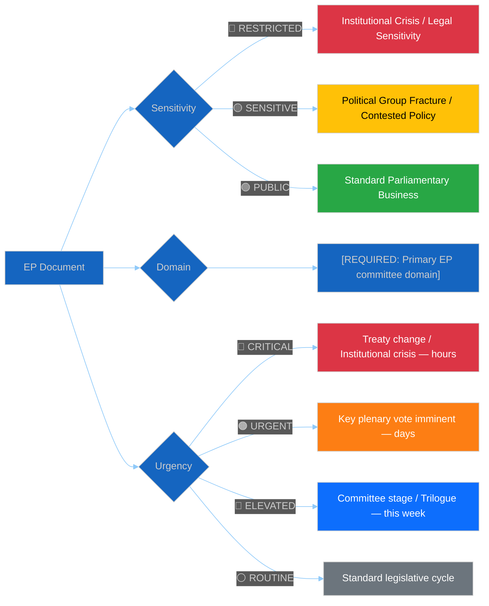
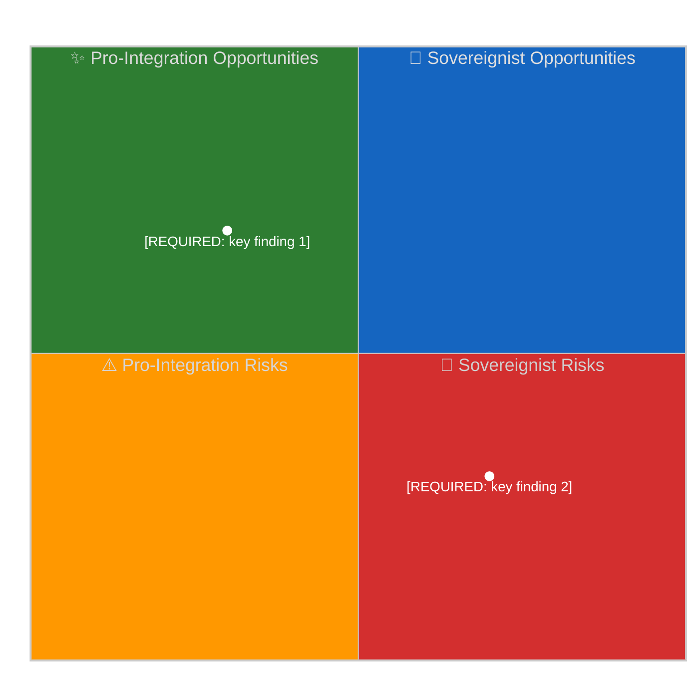
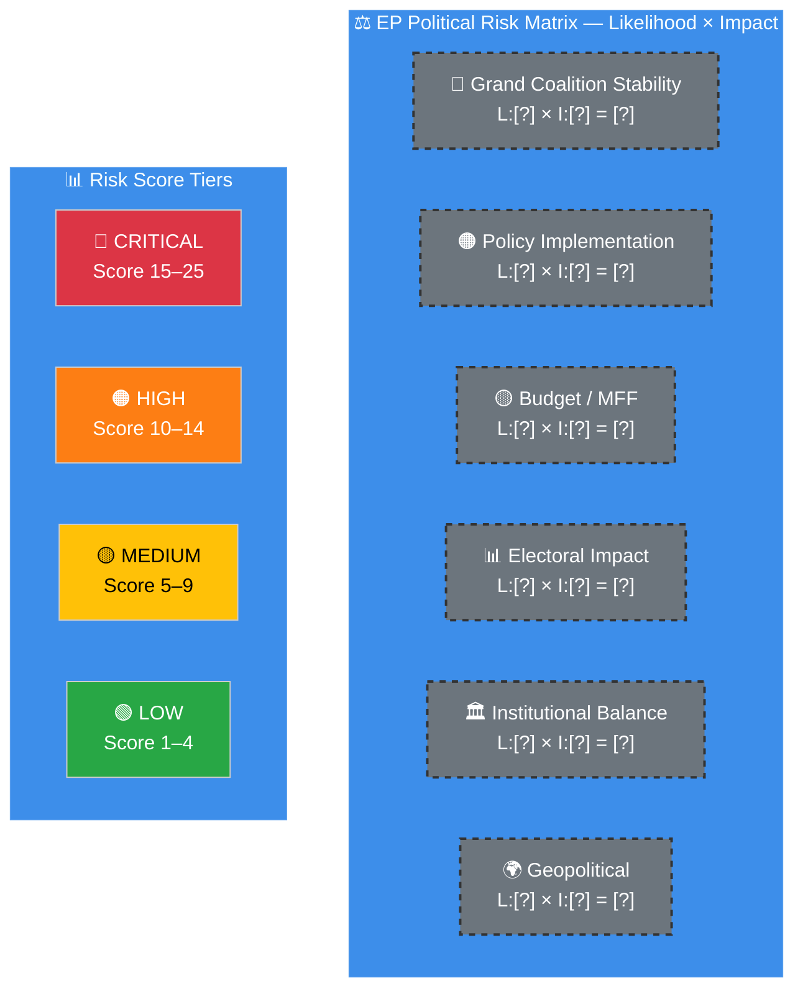
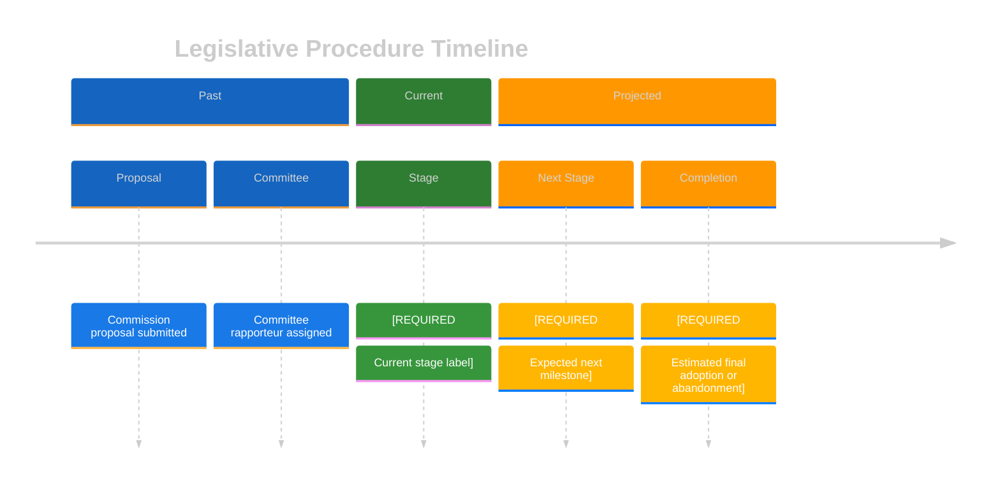
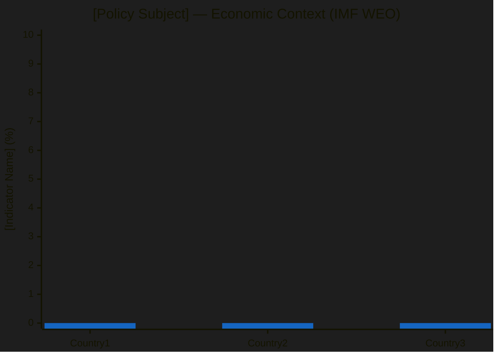

<p align="center">
  
</p>

<h1 align="center">🔍 Per-File Political Intelligence Analysis Template — European Parliament</h1>

<p align="center">
  <strong>📊 Deep AI-Driven Analysis for Individual EP Documents</strong><br>
  <em>🎯 SWOT · Risk · Threat · Stakeholder Impact · Strategic Implications</em>
</p>

<p align="center">
  <a href="#"></a>
  <a href="#"></a>
  <a href="#"></a>
  <a href="#"></a>
</p>

**📋 Document Owner:** CEO | **📄 Version:** 1.2 | **📅 Last Updated:** 2026-04-10 (UTC)
**🏢 Owner:** Hack23 AB (Org.nr 5595347807) | **🏷️ Classification:** Public

> **📌 Template Instructions:** This template is for **per-file** analysis. For each data file downloaded via EP MCP (e.g., an adopted text, vote record, committee document), the AI agent produces one analysis markdown file stored alongside the data file.
>
> **Example path:** `analysis/daily/2026-03-30/committee-reports/data/adopted-texts/P9_TA-2026-0089.json` → `analysis/daily/2026-03-30/committee-reports/data/adopted-texts/P9_TA-2026-0089.analysis.md`

> **🚨 Anti-Pattern Warning:** Plain prose without structured tables, Mermaid diagrams, or evidence citations is REJECTED. Every analysis file MUST follow this template exactly: metadata header, structured tables with evidence columns, ≥1 color-coded Mermaid diagram, confidence labels on all claims. See [ai-driven-analysis-guide.md](../methodologies/ai-driven-analysis-guide.md) for good vs. bad examples.

> **🔴 Per-File Deep Data Requirement (NEW):** For EACH document analyzed, the agent MUST attempt to fetch the full document via `track_legislation({ procedureId: "..." })` and/or `search_documents({ keyword: "..." })`. Analysis based solely on adopted text titles and TA numbers (metadata-only) MUST be marked LOW confidence. Fetch voting records, procedure timelines, and committee reports to support the analysis.

---

## 📋 Document Identity

| Field | Value |
|-------|-------|
| **Document ID** | `[REQUIRED: EP document reference, e.g. P9_TA(2026)0089]` |
| **Document Type** | `[REQUIRED: adopted-texts / committee-documents / procedures / votes / speeches / questions / events / meps / declarations / plenary-documents / external-documents]` |
| **Title** | `[REQUIRED: document title]` |
| **Date** | `[REQUIRED: document date or fetch date]` |
| **Parliamentary Term** | `[REQUIRED: e.g. EP10 (2024–2029)]` |
| **Committee** | `[If applicable: e.g. ENVI, ECON, LIBE]` |
| **Source MCP Tool** | `[REQUIRED: e.g. get_adopted_texts, get_voting_records, search_documents]` |
| **Analysis Timestamp** | `[REQUIRED: YYYY-MM-DD HH:MM UTC]` |
| **Analyst** | `[REQUIRED: workflow name, e.g. news-committee-reports]` |

---

## 🔧 EP MCP Tool Mapping

> **AI Instructions:** Use the following mapping to select the correct EP MCP tools for each section. These tools are from the `european-parliament-mcp-server` package. Call the listed tools and cite their output as evidence.

| Template Section | Primary EP MCP Tool(s) | Fallback Tool | Output Used |
|-----------------|----------------------|---------------|------------|
| 📋 Document Identity | `get_adopted_texts`, `get_procedures`, `get_committee_documents` | `search_documents` | Document metadata, reference IDs |
| 🎯 Executive Summary | `get_plenary_sessions`, `get_voting_records` | `generate_report` | Session context, vote outcomes |
| 📊 Political Classification | `analyze_voting_patterns`, `get_meps` | `get_committee_info` | Voting splits, group positions |
| 💪 SWOT Impact Assessment | `analyze_voting_patterns`, `compare_political_groups` | `analyze_coalition_dynamics` | Group cohesion, alliance patterns |
| ⚖️ Risk Assessment | `detect_voting_anomalies`, `analyze_coalition_dynamics` | `monitor_legislative_pipeline` | Anomalies, coalition stress |
| 🎭 Threat Analysis | `detect_voting_anomalies`, `early_warning_system` | `analyze_country_delegation` | Defection signals, instability |
| 👥 Stakeholder Impact | `get_meps`, `get_committee_info`, `get_parliamentary_questions` | `analyze_legislative_effectiveness` | Committee composition, MEP activity |
| 🔮 Forward Indicators | `get_events`, `get_plenary_sessions` | `monitor_legislative_pipeline` | Upcoming sessions, pipeline status |
| 🔗 Cross-References | `get_procedures`, `search_documents` | `get_procedure_events` | Related procedures, document links |
| 📊 Data Quality | All tools used above | — | Completeness assessment |

---

## 🎯 Executive Summary

> **🔴 AI-ONLY SECTION**: This summary MUST be original political intelligence analysis written by the AI agent after reading the actual EP data. NEVER use template placeholders, scripted boilerplate, or data-count summaries like "X documents were processed". Analyse what the data MEANS politically.

`[REQUIRED: 3–5 sentences capturing the political significance at intelligence level. Not just what happened, but what it means for EP power dynamics, political group cohesion, institutional balance, and democratic accountability. Name specific actors, legislation, and political implications. Include confidence label.]` **[HIGH/MEDIUM/LOW]**

---

## 📊 Political Classification


```mermaid
%%{init: {"theme":"dark","themeVariables":{"primaryColor":"#1565C0","primaryTextColor":"#ffffff","primaryBorderColor":"#0A3F7F","lineColor":"#90CAF9","secondaryColor":"#2E7D32","secondaryTextColor":"#ffffff","secondaryBorderColor":"#0F3F00","tertiaryColor":"#FF9800","tertiaryTextColor":"#000000","tertiaryBorderColor":"#7F4F00","mainBkg":"#1565C0","secondBkg":"#2E7D32","tertiaryBkg":"#FF9800","noteBkgColor":"#FFC107","noteTextColor":"#000000","noteBorderColor":"#7F6000","errorBkgColor":"#D32F2F","errorTextColor":"#ffffff","fontFamily":"Inter, Helvetica, Arial, sans-serif","pie1":"#1565C0","pie2":"#2E7D32","pie3":"#FF9800","pie4":"#D32F2F","pie5":"#FFC107","pie6":"#7B1FA2","pie7":"#9E9E9E","pie8":"#0288D1","pie9":"#388E3C","pie10":"#F57C00","pie11":"#C62828","pie12":"#FBC02D","pieTitleTextSize":"18px","pieSectionTextSize":"14px","pieLegendTextSize":"13px","pieStrokeColor":"#1e1e1e","pieOuterStrokeColor":"#1e1e1e","git0":"#1565C0","git1":"#2E7D32","git2":"#FF9800","git3":"#D32F2F","gitBranchLabel0":"#ffffff","gitBranchLabel1":"#ffffff","gitBranchLabel2":"#000000","gitBranchLabel3":"#ffffff","cScale0":"#1565C0","cScale1":"#2E7D32","cScale2":"#FF9800","cScale3":"#D32F2F","cScale4":"#FFC107","cScale5":"#7B1FA2","cScale6":"#9E9E9E","cScale7":"#0288D1","xyChart":{"backgroundColor":"#1e1e1e","plotColorPalette":"#1565C0,#2E7D32,#FF9800,#D32F2F,#FFC107,#7B1FA2,#9E9E9E"}}}}%%
graph LR
    A[EP Document] --> B{Sensitivity}
    B -->|"🔴 RESTRICTED"| C[Institutional Crisis / Legal Sensitivity]
    B -->|"🟡 SENSITIVE"| D[Political Group Fracture / Contested Policy]
    B -->|"🟢 PUBLIC"| E[Standard Parliamentary Business]

    A --> G{Domain}
    G --> H["[REQUIRED: Primary EP committee domain]"]

    A --> I{Urgency}
    I -->|"🔴 CRITICAL"| J[Treaty change / Institutional crisis — hours]
    I -->|"🟠 URGENT"| K[Key plenary vote imminent — days]
    I -->|"🔵 ELEVATED"| L[Committee stage / Trilogue — this week]
    I -->|"⚪ ROUTINE"| M[Standard legislative cycle]

    style C fill:#dc3545,color:#fff
    style D fill:#ffc107,color:#000
    style E fill:#28a745,color:#fff
    style J fill:#dc3545,color:#fff
    style K fill:#fd7e14,color:#fff
    style L fill:#0d6efd,color:#fff
    style M fill:#6c757d,color:#fff
```

| Field | Assessment |
|-------|-----------|
| **Sensitivity Level** | `[REQUIRED: PUBLIC / SENSITIVE / RESTRICTED]` |
| **Primary Domain** | `[REQUIRED: EP committee code, e.g. ENVI, ECON, LIBE, AFET]` |
| **Secondary Domain(s)** | `[OPTIONAL: up to 2 additional committee domains]` |
| **Urgency** | `[REQUIRED: ROUTINE / ELEVATED / URGENT / CRITICAL]` |
| **Significance Score** | `[REQUIRED: 0–10]` |
| **Confidence** | `[REQUIRED: HIGH / MEDIUM / LOW]` |

---

## 💪 SWOT Impact Assessment

> *How does this document affect the EP political landscape? Each entry requires evidence.*

### Quadrant Overview


```mermaid
%%{init: {
  "theme": "dark",
  "themeVariables": {
    "quadrant1Fill": "#1565C0",
    "quadrant2Fill": "#2E7D32",
    "quadrant3Fill": "#FF9800",
    "quadrant4Fill": "#D32F2F",
    "quadrantTitleFill": "#ffffff",
    "quadrantPointFill": "#ffffff",
    "quadrantPointTextFill": "#ffffff",
    "quadrantXAxisTextFill": "#ffffff",
    "quadrantYAxisTextFill": "#ffffff"
  },
  "quadrantChart": {
    "chartWidth": 700,
    "chartHeight": 700,
    "pointLabelFontSize": 14,
    "titleFontSize": 22,
    "quadrantLabelFontSize": 18,
    "xAxisLabelFontSize": 16,
    "yAxisLabelFontSize": 16
  }
}}%%
quadrantChart
    title 🎯 EP Political Impact Assessment
    x-axis "Pro-Integration" --> "Sovereignist"
    y-axis "Risk" --> "Opportunity"
    quadrant-1 "🚀 Sovereignist Opportunities"
    quadrant-2 "✨ Pro-Integration Opportunities"
    quadrant-3 "⚠️ Pro-Integration Risks"
    quadrant-4 "🔴 Sovereignist Risks"

    "[REQUIRED: key finding 1]": [0.3, 0.7]
    "[REQUIRED: key finding 2]": [0.7, 0.3]
```

> ⚠️ AI Agent: Replace placeholder findings with actual data points from this document's analysis. Adjust coordinates based on real political positioning.

### Grand Coalition Impact (EPP + S&D + Renew)

| Quadrant | Statement | Evidence | Confidence | Impact |
|----------|-----------|----------|:----------:|:------:|
| ✅ Strength | `[If this strengthens grand coalition]` | `[EP doc reference]` | `H/M/L` | `H/M/L` |
| ⚠️ Weakness | `[If this exposes grand coalition vulnerability]` | `[EP doc reference]` | `H/M/L` | `H/M/L` |
| 🚀 Opportunity | `[If this creates grand coalition opportunity]` | `[EP doc reference]` | `H/M/L` | `H/M/L` |
| 🔴 Threat | `[If this threatens grand coalition]` | `[EP doc reference]` | `H/M/L` | `H/M/L` |

### Opposition / Alternative Coalition Impact (ECR + PfE + ESN + Left + Greens)

| Quadrant | Statement | Evidence | Confidence | Impact |
|----------|-----------|----------|:----------:|:------:|
| ✅ Strength | `[If this strengthens alternative formations]` | `[EP doc reference]` | `H/M/L` | `H/M/L` |
| ⚠️ Weakness | `[If this exposes opposition vulnerability]` | `[EP doc reference]` | `H/M/L` | `H/M/L` |
| 🚀 Opportunity | `[If this creates opposition opportunity]` | `[EP doc reference]` | `H/M/L` | `H/M/L` |
| 🔴 Threat | `[If this threatens opposition groups]` | `[EP doc reference]` | `H/M/L` | `H/M/L` |

---

## ⚖️ Risk Assessment


```mermaid
%%{init: {"theme":"dark","themeVariables":{"primaryColor":"#1565C0","primaryTextColor":"#ffffff","primaryBorderColor":"#0A3F7F","lineColor":"#90CAF9","secondaryColor":"#2E7D32","secondaryTextColor":"#ffffff","secondaryBorderColor":"#0F3F00","tertiaryColor":"#FF9800","tertiaryTextColor":"#000000","tertiaryBorderColor":"#7F4F00","mainBkg":"#1565C0","secondBkg":"#2E7D32","tertiaryBkg":"#FF9800","noteBkgColor":"#FFC107","noteTextColor":"#000000","noteBorderColor":"#7F6000","errorBkgColor":"#D32F2F","errorTextColor":"#ffffff","fontFamily":"Inter, Helvetica, Arial, sans-serif","pie1":"#1565C0","pie2":"#2E7D32","pie3":"#FF9800","pie4":"#D32F2F","pie5":"#FFC107","pie6":"#7B1FA2","pie7":"#9E9E9E","pie8":"#0288D1","pie9":"#388E3C","pie10":"#F57C00","pie11":"#C62828","pie12":"#FBC02D","pieTitleTextSize":"18px","pieSectionTextSize":"14px","pieLegendTextSize":"13px","pieStrokeColor":"#1e1e1e","pieOuterStrokeColor":"#1e1e1e","git0":"#1565C0","git1":"#2E7D32","git2":"#FF9800","git3":"#D32F2F","gitBranchLabel0":"#ffffff","gitBranchLabel1":"#ffffff","gitBranchLabel2":"#000000","gitBranchLabel3":"#ffffff","cScale0":"#1565C0","cScale1":"#2E7D32","cScale2":"#FF9800","cScale3":"#D32F2F","cScale4":"#FFC107","cScale5":"#7B1FA2","cScale6":"#9E9E9E","cScale7":"#0288D1","xyChart":{"backgroundColor":"#1e1e1e","plotColorPalette":"#1565C0,#2E7D32,#FF9800,#D32F2F,#FFC107,#7B1FA2,#9E9E9E"}}}}%%
graph TD
    subgraph "⚖️ EP Political Risk Matrix — Likelihood × Impact"
        R1["🔴 Grand Coalition Stability<br/>L:[?] × I:[?] = [?]"]
        R2["🟠 Policy Implementation<br/>L:[?] × I:[?] = [?]"]
        R3["🟡 Budget / MFF<br/>L:[?] × I:[?] = [?]"]
        R4["📊 Electoral Impact<br/>L:[?] × I:[?] = [?]"]
        R5["🏛️ Institutional Balance<br/>L:[?] × I:[?] = [?]"]
        R6["🌍 Geopolitical<br/>L:[?] × I:[?] = [?]"]
    end

    subgraph "📊 Risk Score Tiers"
        T1["🔴 CRITICAL<br/>Score 15–25"]
        T2["🟠 HIGH<br/>Score 10–14"]
        T3["🟡 MEDIUM<br/>Score 5–9"]
        T4["🟢 LOW<br/>Score 1–4"]
    end

    style R1 fill:#6c757d,stroke:#333,stroke-width:2px,stroke-dasharray:5 5,color:#fff
    style R2 fill:#6c757d,stroke:#333,stroke-width:2px,stroke-dasharray:5 5,color:#fff
    style R3 fill:#6c757d,stroke:#333,stroke-width:2px,stroke-dasharray:5 5,color:#fff
    style R4 fill:#6c757d,stroke:#333,stroke-width:2px,stroke-dasharray:5 5,color:#fff
    style R5 fill:#6c757d,stroke:#333,stroke-width:2px,stroke-dasharray:5 5,color:#fff
    style R6 fill:#6c757d,stroke:#333,stroke-width:2px,stroke-dasharray:5 5,color:#fff
    style T1 fill:#dc3545,color:#fff
    style T2 fill:#fd7e14,color:#fff
    style T3 fill:#ffc107,color:#000
    style T4 fill:#28a745,color:#fff
```

> **⚠️ AI Instructions:** Replace ALL `[?]` placeholders with actual numbers derived from the document data. Update node styles from grey dashed to the correct risk tier colour.

| Risk Type | Likelihood (1–5) | Impact (1–5) | Score | Assessment |
|-----------|:-----------------:|:------------:|:-----:|------------|
| Grand Coalition Stability | `[1-5]` | `[1-5]` | `[L×I]` | `[REQUIRED: how does this affect EPP-S&D-Renew cooperation?]` |
| Policy Implementation | `[1-5]` | `[1-5]` | `[L×I]` | `[REQUIRED: will this legislation be implemented effectively?]` |
| Budget / MFF | `[1-5]` | `[1-5]` | `[L×I]` | `[REQUIRED: fiscal implications for EU budget?]` |
| Electoral Impact | `[1-5]` | `[1-5]` | `[L×I]` | `[REQUIRED: how does this affect 2029 EP election positioning?]` |
| Institutional Balance | `[1-5]` | `[1-5]` | `[L×I]` | `[REQUIRED: EP vs Council vs Commission power dynamics?]` |
| Geopolitical | `[1-5]` | `[1-5]` | `[L×I]` | `[OPTIONAL: NATO, China, Russia, US trade implications]` |

**Overall Risk Level:** `[REQUIRED: CRITICAL / HIGH / MEDIUM / LOW]`

---

## 🎭 Threat Analysis (Multi-Framework)

> *Political threats assessed using the Political Threat Landscape (6 dimensions), supplemented with Diamond Model for adversary analysis, Attack Trees for systemic threats, and PESTLE for macro-environmental factors. Severity: 1=Negligible, 2=Minor, 3=Moderate, 4=Major, 5=Severe.*

### Threat Landscape Assessment

| Threat Dimension | Applicable? | Threat Description | Severity (1–5) | Evidence |
|----------------|:-----------:|-------------------|:--------------:|----------|
| 🔄 CS — Coalition Shifts | `[Y/N]` | `[Realignment, defection, fragmentation of political group voting blocs]` | `[1-5]` | `[EP ref]` |
| 🔍 TD — Transparency Deficit | `[Y/N]` | `[Trilogue opacity, undisclosed lobbying, declaration gaps]` | `[1-5]` | `[EP ref]` |
| ↩️ PR — Policy Reversal | `[Y/N]` | `[Voting record contradictions, position reversals, legislative rollbacks]` | `[1-5]` | `[EP ref]` |
| 🏛️ IP — Institutional Pressure | `[Y/N]` | `[Commission overreach, Council bypassing EP, procedural manipulation]` | `[1-5]` | `[EP ref]` |
| ⏳ LO — Legislative Obstruction | `[Y/N]` | `[Pipeline stalling, amendment flooding, cross-institutional deadlock]` | `[1-5]` | `[EP ref]` |
| 📉 DE — Democratic Erosion | `[Y/N]` | `[Attendance decline, question quality degradation, norm weakening]` | `[1-5]` | `[EP ref]` |

### Attack Tree Assessment

`[If applicable: Identify systemic threat paths — e.g., "Coalition destabilisation via migration policy disagreement → ECR-PfE alliance → grand coalition fracture". Include at least one attack tree if threat level is MODERATE or above.]`

### Diamond Model Assessment

`[If applicable: For HIGH/SEVERE threats, map Adversary → Capability → Infrastructure → Victim relationships for each identified threat actor.]`

---

## 👥 Stakeholder Impact Matrix

> *Seven analytical lenses applied to this document, covering the EU institutional ecosystem.*

| Stakeholder | Impact Level | Key Assessment | Confidence |
|------------|:------------:|----------------|:----------:|
| 🇪🇺 EU Citizens (500M+) | `[HIGH/MEDIUM/LOW/NONE]` | `[REQUIRED: How does this affect citizens' rights, services, daily life?]` | `[H/M/L]` |
| 🏛️ EP Political Groups | `[HIGH/MEDIUM/LOW/NONE]` | `[REQUIRED: Which groups gain/lose from this? Grand coalition vs. opposition dynamics?]` | `[H/M/L]` |
| ⚖️ EU Institutions | `[HIGH/MEDIUM/LOW/NONE]` | `[REQUIRED: Commission, Council, CJEU impact? Institutional balance shift?]` | `[H/M/L]` |
| 🇪🇺 Member States | `[HIGH/MEDIUM/LOW/NONE]` | `[REQUIRED: Differential impact across member states? East-West or North-South dynamics?]` | `[H/M/L]` |
| 💰 Economic Actors | `[HIGH/MEDIUM/LOW/NONE]` | `[REQUIRED: Business, trade, fiscal, labour market implications?]` | `[H/M/L]` |
| 🤝 Civil Society | `[HIGH/MEDIUM/LOW/NONE]` | `[REQUIRED: NGOs, advocacy groups, unions — engagement and impact?]` | `[H/M/L]` |
| 🌍 International Partners | `[HIGH/MEDIUM/LOW/NONE]` | `[REQUIRED: US, UK, NATO, UN, developing countries — geopolitical implications?]` | `[H/M/L]` |

---

## 🔮 Forward Indicators

> *What to monitor as a consequence of this document.*

| # | Indicator | Timeline | Trigger Condition | Watch Priority |
|---|-----------|----------|-------------------|:--------------:|
| 1 | `[REQUIRED: specific future EP event or metric to monitor]` | `[days/weeks/months]` | `[what would trigger escalation]` | `🔴/🟠/🟡/🟢` |
| 2 | `[REQUIRED]` | `[timeline]` | `[trigger]` | `🔴/🟠/🟡/🟢` |
| 3 | `[OPTIONAL]` | `[timeline]` | `[trigger]` | `🔴/🟠/🟡/🟢` |

---

## 🔗 Cross-References

| Related Document | Relationship | EP Reference |
|-----------------|-------------|--------------|
| `[If related documents exist]` | `[supports / contradicts / amends / supersedes / responds-to]` | `[EP doc ref]` |

---

## 📊 Data Quality Assessment

| Metric | Value |
|--------|-------|
| **Source Completeness** | `[REQUIRED: Full text / Metadata only / Summary only]` |
| **Evidence Density** | `[REQUIRED: N evidence points cited]` |
| **Temporal Currency** | `[REQUIRED: Current / Recent (30d) / Dated (90d) / Stale (180d+)]` |
| **Analytical Confidence** | `[REQUIRED: HIGH / MEDIUM / LOW]` |

---

## 🔄 Cross-Session Delta Tracking

> **AI Instructions:** When multiple analysis runs occur on the same day (e.g., breaking-1 and breaking-2), complete this section to track how assessments have changed between sessions. If this is the first session of the day, mark "Baseline" and skip the delta columns.

| Field | Value |
|-------|-------|
| **Session Number** | `[REQUIRED: e.g. "Session 2 of 2" or "Baseline (Session 1)"]` |
| **Previous Session ID** | `[If applicable: e.g. "breaking-1 (2026-04-05T08:00Z)"]` |
| **Time Since Last Session** | `[If applicable: e.g. "6 hours"]` |
| **New Data Since Last Session** | `[If applicable: list new MCP data files not in previous session]` |

### Assessment Deltas

| Assessment | Previous Value | Current Value | Delta | Reason for Change |
|-----------|:-------------:|:------------:|:-----:|-------------------|
| Significance Score | `[prev or —]` | `[current]` | `[↑/↓/→]` | `[REQUIRED if changed: cite new evidence]` |
| Risk Level | `[prev or —]` | `[current]` | `[↑/↓/→]` | `[cite new evidence]` |
| Threat Level | `[prev or —]` | `[current]` | `[↑/↓/→]` | `[cite new evidence]` |
| SWOT Balance | `[prev or —]` | `[current]` | `[shift]` | `[cite new evidence]` |
| Stakeholder Impact | `[prev or —]` | `[current]` | `[↑/↓/→]` | `[cite new evidence]` |

**Cross-Session Confidence:** `[REQUIRED: Has confidence improved, degraded, or remained stable with additional data?]`

---

## 📅 Legislative Timeline Tracking

> **AI Instructions:** For documents that are part of an active legislative procedure, complete this section to track the procedure's position in the legislative calendar. Use `get_procedures` (parameter: `processId`, e.g. `processId: "2024/0001(COD)"`) and `track_legislation` (parameter: `procedureId`, e.g. `procedureId: "2024/0001(COD)"`) MCP tools to retrieve current status. Note the different parameter names: `processId` for `get_procedures`, `procedureId` for `track_legislation`.

| Field | Value |
|-------|-------|
| **Procedure ID** | `[REQUIRED if applicable: e.g. 2024/0001(COD)]` |
| **Current Stage** | `[REQUIRED: e.g. "Committee vote", "Plenary 1st reading", "Trilogue round 3", "Awaiting Council position"]` |
| **Stage Entry Date** | `[REQUIRED: YYYY-MM-DD]` |
| **Days in Current Stage** | `[REQUIRED: N days]` |
| **Expected Next Stage** | `[REQUIRED: e.g. "Plenary 2nd reading (est. 2026-06)"]` |
| **Deadline Risk** | `[REQUIRED: None / Low / Medium / High / CRITICAL — Is the procedure approaching a legislative deadline?]` |

### Legislative Timeline Diagram


```mermaid
%%{init: {"theme":"dark","themeVariables":{"primaryColor":"#1565C0","primaryTextColor":"#ffffff","primaryBorderColor":"#0A3F7F","lineColor":"#90CAF9","secondaryColor":"#2E7D32","secondaryTextColor":"#ffffff","secondaryBorderColor":"#0F3F00","tertiaryColor":"#FF9800","tertiaryTextColor":"#000000","tertiaryBorderColor":"#7F4F00","mainBkg":"#1565C0","secondBkg":"#2E7D32","tertiaryBkg":"#FF9800","noteBkgColor":"#FFC107","noteTextColor":"#000000","noteBorderColor":"#7F6000","errorBkgColor":"#D32F2F","errorTextColor":"#ffffff","fontFamily":"Inter, Helvetica, Arial, sans-serif","pie1":"#1565C0","pie2":"#2E7D32","pie3":"#FF9800","pie4":"#D32F2F","pie5":"#FFC107","pie6":"#7B1FA2","pie7":"#9E9E9E","pie8":"#0288D1","pie9":"#388E3C","pie10":"#F57C00","pie11":"#C62828","pie12":"#FBC02D","pieTitleTextSize":"18px","pieSectionTextSize":"14px","pieLegendTextSize":"13px","pieStrokeColor":"#1e1e1e","pieOuterStrokeColor":"#1e1e1e","git0":"#1565C0","git1":"#2E7D32","git2":"#FF9800","git3":"#D32F2F","gitBranchLabel0":"#ffffff","gitBranchLabel1":"#ffffff","gitBranchLabel2":"#000000","gitBranchLabel3":"#ffffff","cScale0":"#1565C0","cScale1":"#2E7D32","cScale2":"#FF9800","cScale3":"#D32F2F","cScale4":"#FFC107","cScale5":"#7B1FA2","cScale6":"#9E9E9E","cScale7":"#0288D1","xyChart":{"backgroundColor":"#1e1e1e","plotColorPalette":"#1565C0,#2E7D32,#FF9800,#D32F2F,#FFC107,#7B1FA2,#9E9E9E"}}}}%%
timeline
    title Legislative Procedure Timeline
    section Past
        Proposal : Commission proposal submitted
        Committee : Committee rapporteur assigned
    section Current
        Stage : [REQUIRED: Current stage label]
    section Projected
        Next Stage : [REQUIRED: Expected next milestone]
        Completion : [REQUIRED: Estimated final adoption or abandonment]
```

> ⚠️ AI Agent: Replace with actual procedure milestones from `get_procedures` / `track_legislation` output. If this document is not part of a formal procedure (e.g., a plenary speech, MEP question, or standalone event), mark this section `N/A — Not a legislative procedure document`.

### Historical Baseline Comparison

Compare the current procedure's pace against historical norms:

| Metric | This Procedure | EP10 Average | EP9 Average | Assessment |
|--------|:--------------:|:------------:|:-----------:|-----------|
| Days from proposal to committee vote | `[N]` | `[N]` | `[N]` | `[faster/slower/on-track]` |
| Days from committee to plenary 1st reading | `[N]` | `[N]` | `[N]` | `[faster/slower/on-track]` |
| Total procedure duration so far | `[N]` | `[N]` | `[N]` | `[faster/slower/on-track]` |

**Pace Assessment:** `[REQUIRED if procedure: Is this moving faster or slower than typical procedures of this type? Cite any delays with reasons (e.g., "Extended 14 weeks in committee due to EPP-S&D disagreement on amendment AM-073")]`

---

## 🏢 Committee Workload Benchmarking

> **AI Instructions:** When the document originates from or relates to a specific EP committee, benchmark that committee's current workload against historical activity levels. Use `analyze_committee_activity` and `get_committee_documents` MCP tools.

| Field | Value |
|-------|-------|
| **Lead Committee** | `[REQUIRED if applicable: e.g. ENVI, ECON, LIBE]` |
| **Opinion Committees** | `[If applicable: e.g. ITRE (opinion), BUDG (opinion)]` |
| **Rapporteur** | `[REQUIRED: MEP name and political group]` |
| **Shadow Rapporteurs** | `[REQUIRED: list with political group, e.g. "S&D: MEP A; Renew: MEP B; ECR: MEP C"]` |

### Committee Productivity Assessment

| Metric | Current Period | 90-Day Average | Benchmark Tier | Source |
|--------|:--------------:|:--------------:|:--------------:|--------|
| Reports in progress | `[N]` | `[N]` | `[Above/Below/At]` | `[MCP tool]` |
| Documents produced (30d) | `[N]` | `[N]` | `[Above/Below/At]` | `[MCP tool]` |
| Meeting frequency (per month) | `[N]` | `[N]` | `[Above/Below/At]` | `[MCP tool]` |
| Amendment volume (this dossier) | `[N]` | `[N]` | `[Above/Below/At]` | `[MCP tool]` |

**Workload Assessment:** `[REQUIRED if committee known: e.g. "ENVI committee is currently handling 12 active procedures — 40% above its EP10 average of 8.5, concentrated in climate and biodiversity files. This may create rapporteur bandwidth constraints for this dossier."]`

**❌ BAD (no benchmark):**
```markdown
The ENVI committee is working on this dossier along with other files.
```

**✅ GOOD (benchmarked, quantified):**
```markdown
ENVI currently has 12 active procedures (EP10 average: 8.5, EP9 average: 9.1 — 41% above average).
The rapporteur (MEP Schmidt, EPP) is simultaneously managing 3 other reports, exceeding the
typical single-rapporteur load. This creates a risk of delayed committee amendments for this dossier
(procedure 2024/0022(COD)); watch for a rapporteur extension request at the April 22 ENVI meeting.
```

---

## 🔀 Coalition Shift Detection

> **AI Instructions:** For documents that interact with coalition dynamics (votes, key positions, opposition statements), analyse whether this event signals any coalition shift. For coalition-level or political-group metrics, use `analyze_coalition_dynamics`, `compare_political_groups`, and/or `detect_voting_anomalies` with `politicalGroup`. Use `analyze_voting_patterns` only to drill into specific defectors or swing MEPs when a valid `mepId` is available.

### Coalition Stability Indicators

| Indicator | Current Value | 30-Day Baseline | Trend | Signal |
|-----------|:------------:|:---------------:|:-----:|--------|
| Grand coalition cohesion (EPP+S&D+Renew) | `[%]` | `[%]` | `[↑/→/↓]` | `[STABLE/WARNING/ALERT]` |
| EPP intra-group cohesion | `[%]` | `[%]` | `[↑/→/↓]` | `[STABLE/WARNING/ALERT]` |
| S&D intra-group cohesion | `[%]` | `[%]` | `[↑/→/↓]` | `[STABLE/WARNING/ALERT]` |
| Renew intra-group cohesion | `[%]` | `[%]` | `[↑/→/↓]` | `[STABLE/WARNING/ALERT]` |
| ECR-PfE cross-group alignment | `[%]` | `[%]` | `[↑/→/↓]` | `[STABLE/WARNING/ALERT]` |
| Cross-coalition votes (grand coalition + opposition) | `[N]` | `[N]` | `[↑/→/↓]` | `[STABLE/WARNING/ALERT]` |

**Coalition Shift Assessment:** `[REQUIRED if voting data available: Describe whether this event confirms, challenges, or shifts the current coalition pattern. Name specific defectors, swing votes, or realignment signals. E.g.: "11 EPP defections on RCV-2026-0298 represent the largest within-term EPP dissent on environmental policy, exceeding the previous high of 7 defections in 2024. If repeated on the May migration vote, it would reduce the grand coalition's functional majority from 41 to ≤17 seats above threshold."]`

### Defection Pattern Analysis

> Complete only if this document involves a recorded vote with cross-group or within-group defections.

| Group | Expected Position | Actual Votes | Defections | Defection Rate | vs. 30-Day Average |
|-------|:-----------------:|:------------:|:----------:|:--------------:|:-----------------:|
| EPP | `[For/Against/Abstain]` | `[F/A/Abs N]` | `[N]` | `[%]` | `[+/-pp vs baseline]` |
| S&D | `[For/Against/Abstain]` | `[F/A/Abs N]` | `[N]` | `[%]` | `[+/-pp vs baseline]` |
| Renew | `[For/Against/Abstain]` | `[F/A/Abs N]` | `[N]` | `[%]` | `[+/-pp vs baseline]` |
| ECR | `[For/Against/Abstain]` | `[F/A/Abs N]` | `[N]` | `[%]` | `[+/-pp vs baseline]` |
| PfE | `[For/Against/Abstain]` | `[F/A/Abs N]` | `[N]` | `[%]` | `[+/-pp vs baseline]` |

**Interpretation:** `[REQUIRED if vote data available: What do these defection patterns mean for coalition coherence? Are they isolated or part of a trend?]`

---

## 📊 IMF Economic Context (primary) + World Bank Non-Economic Cross-Refs

> **AI Instructions (Wave-4):** Include **IMF** data context for every policy subject with economic, fiscal, monetary, or trade implications — IMF is the mandatory primary source under Wave-4 policy. Use `imf-fetch-data` for WEO/FM/IFS/BOP/ER/PCPS/GFSR/EREO/FSI/GFS/DOT. Reference `analysis/imf/database-directory.md`, `analysis/imf/indicator-catalog.md`, and `analysis/methodologies/imf-indicator-mapping.md §2` for per-article-type indicator floors. Use **World Bank** only for non-economic cross-refs (health, education, social, environment, demographics, defence, agriculture, innovation, governance) — reference `analysis/worldbank/indicator-catalog.md`.

### Economic Indicators for This Policy (IMF primary)

| Indicator | SDMX code | Database | Country | Value | Year/Period | Trend | Vintage |
|-----------|-----------|:--------:|---------|------:|:-----------:|-------|---------|
| `[REQUIRED if economically relevant: e.g. Real GDP growth]` | `NGDP_RPCH` | `WEO` | `DEU` | `[value]` | `2025` | `[↑↓→]` | `WEO-April-2026` |
| `[Optional: additional indicator]` | | | | | | | |

### Non-Economic Cross-Refs (World Bank only)

| Indicator | WB code | Country | Value | Year | Trend | Source |
|-----------|---------|---------|------:|-----:|-------|--------|
| `[OPTIONAL: only when relevant — e.g. Health expenditure % GDP]` | `SH.XPD.CHEX.GD.ZS` | `DE` | `12.4%` | 2023 | `[↑↓→]` | WB MCP `get-health-data` |

### Mermaid Economic Context Chart

> Insert one of the Mermaid chart templates from `analysis/imf/chart-integration-guide.md` (for economic series) or `analysis/worldbank/chart-integration-guide.md` (for non-economic series) with real data. Example:


```mermaid
%%{init: {"theme":"dark","themeVariables":{"primaryColor":"#1565C0","primaryTextColor":"#ffffff","primaryBorderColor":"#0A3F7F","lineColor":"#90CAF9","secondaryColor":"#2E7D32","secondaryTextColor":"#ffffff","secondaryBorderColor":"#0F3F00","tertiaryColor":"#FF9800","tertiaryTextColor":"#000000","tertiaryBorderColor":"#7F4F00","mainBkg":"#1565C0","secondBkg":"#2E7D32","tertiaryBkg":"#FF9800","noteBkgColor":"#FFC107","noteTextColor":"#000000","noteBorderColor":"#7F6000","errorBkgColor":"#D32F2F","errorTextColor":"#ffffff","fontFamily":"Inter, Helvetica, Arial, sans-serif","pie1":"#1565C0","pie2":"#2E7D32","pie3":"#FF9800","pie4":"#D32F2F","pie5":"#FFC107","pie6":"#7B1FA2","pie7":"#9E9E9E","pie8":"#0288D1","pie9":"#388E3C","pie10":"#F57C00","pie11":"#C62828","pie12":"#FBC02D","pieTitleTextSize":"18px","pieSectionTextSize":"14px","pieLegendTextSize":"13px","pieStrokeColor":"#1e1e1e","pieOuterStrokeColor":"#1e1e1e","git0":"#1565C0","git1":"#2E7D32","git2":"#FF9800","git3":"#D32F2F","gitBranchLabel0":"#ffffff","gitBranchLabel1":"#ffffff","gitBranchLabel2":"#000000","gitBranchLabel3":"#ffffff","cScale0":"#1565C0","cScale1":"#2E7D32","cScale2":"#FF9800","cScale3":"#D32F2F","cScale4":"#FFC107","cScale5":"#7B1FA2","cScale6":"#9E9E9E","cScale7":"#0288D1","xyChart":{"backgroundColor":"#1e1e1e","plotColorPalette":"#1565C0,#2E7D32,#FF9800,#D32F2F,#FFC107,#7B1FA2,#9E9E9E"}}}}%%
xychart-beta
    title "[Policy Subject] — Economic Context (IMF WEO)"
    x-axis ["Country1", "Country2", "Country3"]
    y-axis "[Indicator Name] (%)" 0 --> 10
    bar [0, 0, 0]
```

### Which Indicators to Use (Wave-3 split)

| Policy Domain | Primary IMF Indicators (SDMX codes) | Non-Economic WB Indicators (if needed) | Comparison Group |
|--------------|-------------------------------------|----------------------------------------|------------------|
| Fiscal governance | `NGDP_RPCH` (growth), `GGXWDG_NGDP` (debt), `GGXONLB_NGDP` (primary balance) | — | Big Four (DE, FR, IT, ES) |
| Employment | `LUR` (unemployment), `NGDP_RPCH` | Youth unemployment, GINI (WB) | Mediterranean (IT, ES, GR, PT) |
| Defence/security | `GGX_NGDP` (gov expenditure % GDP) | `MS.MIL.XPND.GD.ZS` (mil expenditure — WB only) | NATO EU members vs US |
| Climate/environment | `PCPIPCH` (energy-driven inflation) | `EN.ATM.CO2E.PC`, `EG.FEC.RNEW.ZS` (WB) | Nordic (DK, FI, SE) vs EU avg |
| Trade/investment | `TX_RPCH` (export volume), `BFD_BP6_USD` (FDI), DOT bilateral | `TX.VAL.TECH.MF.ZS` (high-tech exports — WB) | EU vs G7, EU vs BRICS |
| Health | — | `SH.XPD.CHEX.GD.ZS`, `SH.MED.PHYS.ZS`, `SH.MED.BEDS.ZS` (WB) | Eurozone Core |
| Education | — | `SE.XPD.TOTL.GD.ZS`, `SE.TER.ENRR` (WB) | Nordic vs Convergence states |
| Monetary policy | `FPOLM_PA` (policy rate), `EREER_IX` (REER) | — | Euro Area only |
| Banking stability | `FSI/NPLR_PT` (NPL ratio), `FSI/CAPAR_PT` (capital adequacy) | — | Eurozone Core |

> **Important IMF tool note (Wave-4):** Every IMF citation MUST include (a) the SDMX indicator code (e.g. `NGDP_RPCH`), (b) the vintage in prose (`IMF WEO April 2026`), (c) the `data-vintage="WEO-April-2026"` HTML attribute on an enclosing `<section class="economic-context imf-economic-context">` element, and (d) a forecast marker (`forecast`/`projection`/`projects`/`expects`) within 30 words of any projected number. Because the current aggregator renders Markdown headings/tables as-is and does **not** inject that wrapper automatically, the IMF economic-context block MUST be authored with explicit raw HTML in the markdown artifact body, for example: `<section class="economic-context imf-economic-context" data-vintage="WEO-April-2026">…</section>`. Enforced at Stage-C editorial review per [`../methodologies/imf-indicator-mapping.md §5`](../methodologies/imf-indicator-mapping.md#5-forecast-labelling-rule); the legacy regex helper `validateIMFForecastMarker()` in `src/utils/imf-data.ts` was purged in the April-2026 aggregator-pipeline migration.
>
> **Important World Bank tool note:** Several non-economic indicator names are conceptual labels only and may be **API-only** or otherwise **not accepted as direct indicator keys** by standard WB MCP tools such as `get-social-data`/`get-health-data`/`get-education-data`.
>
> Before calling any WB indicator tool, **always use `search-indicators` first** to find the exact supported indicator code. If the required indicator is not available through the standard WB MCP tool path, use the **documented fallback/API mechanism** (for example **legacy `get_indicator_for_country`**) instead of passing the display label directly.

---

## 📂 MCP Data Files Used

`[REQUIRED: List all EP MCP data file paths consulted for this analysis]`

---

**Document Control:**
- **Template Path:** `/analysis/templates/per-file-political-intelligence.md`
- **Output Path:** Same directory as the JSON source file, named `{id}.analysis.md`
- **Version:** 1.2
- **What's New in 1.2:** Legislative Timeline Tracking section, Committee Workload Benchmarking section, Coalition Shift Detection section
- **What's New in 1.1:** EP MCP Tool Mapping per section, Cross-Session Delta Tracking
- **Framework References:** [SWOT.md](../../SWOT.md), [THREAT_MODEL.md](../../THREAT_MODEL.md)
- **Methodology:** [ai-driven-analysis-guide.md](../methodologies/ai-driven-analysis-guide.md)
- **Classification:** Public
- **Next Review:** 2026-06-30
