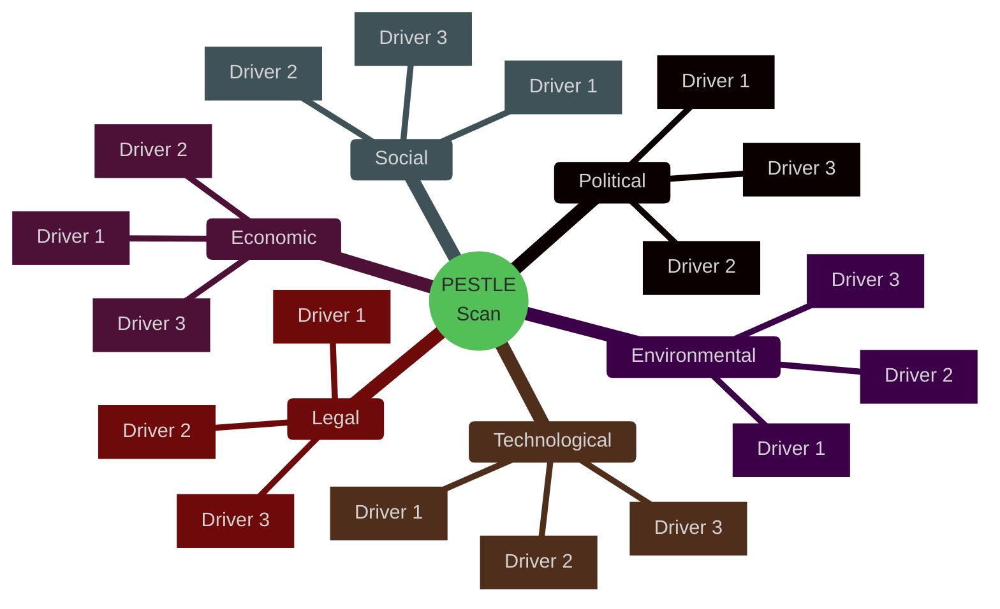

<!-- SPDX-FileCopyrightText: 2024-2026 Hack23 AB -->
<!-- SPDX-License-Identifier: Apache-2.0 -->

# 🌍 PESTLE Analysis Template — Six-Dimension Environmental Scan

> **📌 Template Instructions:** Copy to `analysis/daily/{date}/{article-type}-run{N}/intelligence/pestle-analysis.md`. Scan Political, Economic, Social, Technological, Legal, and Environmental factors shaping the period's dominant issue. See [methodologies/per-artifact-methodologies.md §pestle-analysis](../methodologies/per-artifact-methodologies.md#pestle-analysis).

> **🎯 Purpose:** Structured environmental scan capturing external forces across six dimensions that shape EP policy debates and legislative outcomes.

---

## 📋 Document Metadata

| Field | Value |
|-------|-------|
| **Report ID** | `[REQUIRED: PESTLE-YYYY-MM-DD-runNN]` |
| **Analysis Period** | `[REQUIRED: YYYY-MM-DD to YYYY-MM-DD]` |
| **Issue Focus** | `[REQUIRED: one-line issue frame]` |
| **Confidence** | `[REQUIRED: 🟢/🟡/🔴]` |

---

## 1️⃣ Issue Frame

**Question this scan answers:**

`[REQUIRED: ≥100 words stating the policy question or legislative domain the PESTLE dimensions address. What is at stake? Which EP committees or procedures does this affect?]`

---

## 2️⃣ PESTLE Dimensions

---

### Political

**Pressure rating:** `[REQUIRED: 🟢 Low / 🟡 Moderate / 🔴 High]`

`[REQUIRED: ≥150 words analyzing political forces — coalition dynamics, member-state positions, Council configurations, Commission priorities, geopolitical pressures. Cite ≥2 evidence sources: EP votes, Council conclusions, Commission communications, or external political events.]`

**Key drivers:**
- `[REQUIRED: named driver 1]`
- `[REQUIRED: named driver 2]`

---

### Economic

**Pressure rating:** `[REQUIRED: 🟢 Low / 🟡 Moderate / 🔴 High]`

`[REQUIRED: ≥150 words analyzing economic pressures — GDP trends, fiscal constraints, trade flows, sectoral performance, monetary policy. Cite ≥2 evidence sources with **IMF as primary** (WEO / Fiscal Monitor / IFS / BOP), plus optional Eurostat or ECB for triangulation. World Bank only for non-economic cross-refs (health, education, social, environment, demographics, defence, agriculture, innovation, governance). Reference imf-indicator-mapping.md as the primary source of citation codes; worldbank-indicator-mapping.md only for non-economic.]`

**Key drivers:**
- `[REQUIRED: named driver 1 with indicator code]`
- `[REQUIRED: named driver 2 with indicator code]`

---

### Social

**Pressure rating:** `[REQUIRED: 🟢 Low / 🟡 Moderate / 🔴 High]`

`[REQUIRED: ≥150 words analyzing social forces — public opinion, demographic trends, labor markets, inequality, migration patterns, citizen engagement. Cite ≥2 evidence sources: Eurobarometer, national surveys, NGO reports, or social movement activity.]`

**Key drivers:**
- `[REQUIRED: named driver 1]`
- `[REQUIRED: named driver 2]`

---

### Technological

**Pressure rating:** `[REQUIRED: 🟢 Low / 🟡 Moderate / 🔴 High]`

`[REQUIRED: ≥150 words analyzing technological forces — digital transformation, innovation pressures, platform governance, AI/automation impacts, cybersecurity threats, infrastructure gaps. Cite ≥2 evidence sources: Commission digital reports, industry studies, or regulatory filings.]`

**Key drivers:**
- `[REQUIRED: named driver 1]`
- `[REQUIRED: named driver 2]`

---

### Legal

**Pressure rating:** `[REQUIRED: 🟢 Low / 🟡 Moderate / 🔴 High]`

`[REQUIRED: ≥150 words analyzing legal constraints and opportunities — treaty provisions, pending CJEU cases, international obligations, regulatory frameworks, compliance deadlines. Cite ≥2 evidence sources: treaty articles, CJEU rulings, international agreements, or EP legal service opinions.]`

**Key drivers:**
- `[REQUIRED: named driver 1 with treaty/case citation]`
- `[REQUIRED: named driver 2 with citation]`

---

### Environmental

**Pressure rating:** `[REQUIRED: 🟢 Low / 🟡 Moderate / 🔴 High]`

`[REQUIRED: ≥150 words analyzing environmental pressures — climate targets, biodiversity loss, pollution levels, resource scarcity, adaptation needs, Green Deal implementation. Cite ≥2 evidence sources: EEA reports, climate science assessments, or sectoral environmental data.]`

**Key drivers:**
- `[REQUIRED: named driver 1]`
- `[REQUIRED: named driver 2]`

---

## 3️⃣ Pressure Synthesis

### Reinforcing Dimensions

`[REQUIRED: ≥100 words identifying which PESTLE dimensions amplify each other. Example: "Political pressure from Council climate hawks reinforces Environmental pressure from EEA emissions data, creating dual momentum for stricter regulatory action."]`

### Offsetting Dimensions

`[REQUIRED: ≥100 words identifying which dimensions create countervailing pressures. Example: "Economic slowdown pressures (GDP contraction) offset Social pressures for expanded welfare spending, creating fiscal-constraint dilemma."]`

---

## 4️⃣ Implications for EP

**Committee implications:**

| Committee | PESTLE Dimensions Affected | Pressure Direction | Legislative Response Expected |
|-----------|---------------------------|:------------------:|------------------------------|
| `[REQUIRED: e.g. ENVI]` | `[REQUIRED: e.g. Political + Environmental]` | `[↑ / → / ↓]` | `[REQUIRED: one-line]` |
| `[REQUIRED: e.g. ECON]` | `[REQUIRED]` | `[...]` | `[REQUIRED]` |
| `[REQUIRED]` | `[REQUIRED]` | `[...]` | `[REQUIRED]` |

**Coalition implications:**

`[REQUIRED: ≥80 words explaining how PESTLE pressures are likely to reshape coalition behavior. Which groups face aligned vs. conflicting pressures? What compromise positions might emerge?]`

**Procedure implications:**

`[REQUIRED: ≥80 words identifying specific procedures or legislative files likely to be accelerated, stalled, or redirected by PESTLE forces. Cite procedure IDs where known.]`

---

## 5️⃣ Data Sources

**EP MCP tools used:** `get_procedures`, `get_adopted_texts`, `search_documents`  
**External data sources:** `[REQUIRED: list IMF (primary economic), Eurostat, ECB, EEA, and optionally World Bank (non-economic only) sources consulted]`  
**IMF indicators cited:** `[REQUIRED: list SDMX codes and vintage e.g. "NGDP_RPCH (WEO April 2026)"]`  
**World Bank indicators cited:** `[OPTIONAL — non-economic domains only; list codes or note "none"]`  
**IMF indicators cited:** `[REQUIRED: list series or note "none"]`

---

## 6️⃣ Confidence Assessment

**Overall confidence:** `[REQUIRED: 🟢 HIGH / 🟡 MEDIUM / 🔴 LOW]`

**Confidence by dimension:**

| Dimension | Confidence | Rationale |
|-----------|:----------:|-----------|
| Political | `[🟢/🟡/🔴]` | `[REQUIRED: one-line]` |
| Economic | `[🟢/🟡/🔴]` | `[REQUIRED: note if WB/IMF data was available]` |
| Social | `[🟢/🟡/🔴]` | `[REQUIRED]` |
| Technological | `[🟢/🟡/🔴]` | `[REQUIRED]` |
| Legal | `[🟢/🟡/🔴]` | `[REQUIRED: note if treaty/CJEU citation was available]` |
| Environmental | `[🟢/🟡/🔴]` | `[REQUIRED]` |

---

**Document Control:** `/analysis/daily/{date}/{type}-run{N}/intelligence/pestle-analysis.md` · Template v1.0 · Depth floor: 250 lines.
