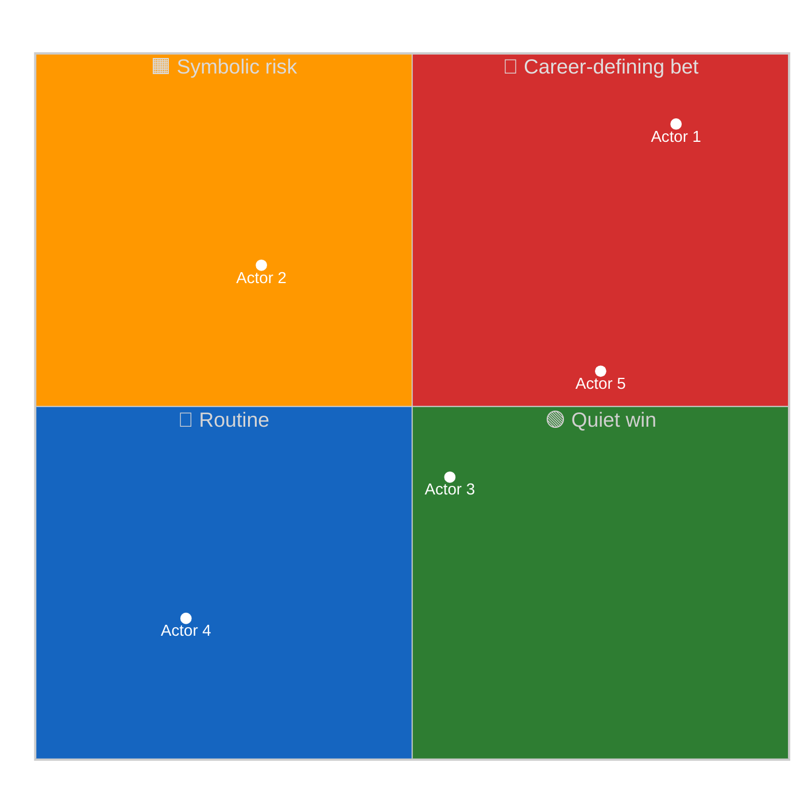
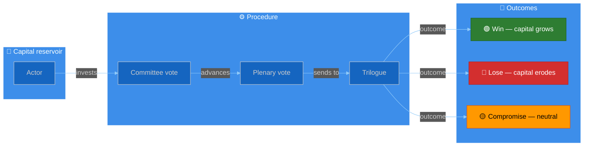
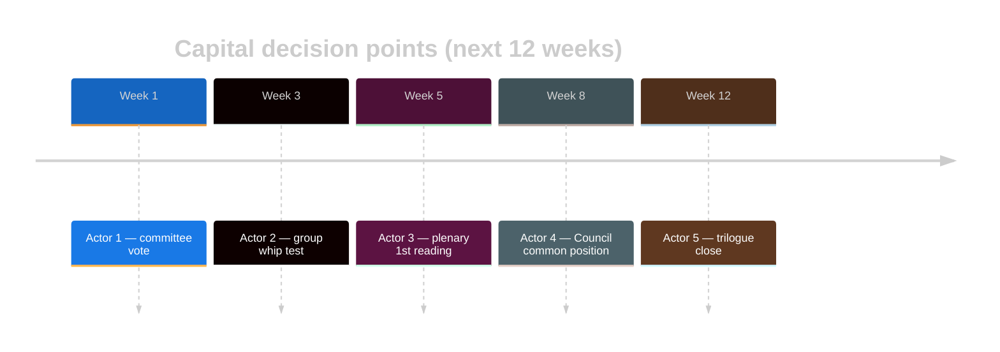

<!-- SPDX-FileCopyrightText: 2024-2026 Hack23 AB -->
<!-- SPDX-License-Identifier: Apache-2.0 -->

# 💼 Political Capital Risk Template — Named-Actor Capital Exposure

> **📌 Template Instructions:** Copy to `analysis/daily/{date}/{article-type}-run{N}/risk-scoring/political-capital-risk.md`. Track named rapporteur / chair / group-leader / Council president political capital exposure on the period's top positions, with capital-erosion timelines, precedent matching, and citizen-facing translation. See [methodologies/per-artifact-methodologies.md §political-capital-risk](../methodologies/per-artifact-methodologies.md#political-capital-risk) and [political-risk-methodology.md](../methodologies/political-risk-methodology.md).

> **🎯 Purpose:** Follow‑the‑stakes analysis identifying which political actors have invested capital in which positions, what their downside risk is, and how their exposure varies across EU member‑state clusters. **Multi‑national extension over Riksdagsmonitor:** every actor row carries (a) EP political group, (b) member‑state of origin, (c) cluster signal, so cross‑border capital flows surface explicitly.

---

## 📋 Document Metadata

| Field | Value |
|-------|-------|
| **Report ID** | `[REQUIRED: PCR-YYYY-MM-DD-runNN]` |
| **Period** | `[REQUIRED: YYYY-MM-DD to YYYY-MM-DD]` |
| **Actors Analyzed** | `[REQUIRED: count ≥5]` |
| **Member-State Clusters Covered** | `[REQUIRED: ≥3 of {Northern, Western, Southern, Central‑Eastern}]` |
| **Confidence** | `[REQUIRED: 🟢 HIGH / 🟡 MEDIUM / 🔴 LOW]` |
| **PIR Tags** | `[REQUIRED]` |
| **Admiralty Source Floor** | `[REQUIRED: B2 minimum across primary citations]` |

---

## 1️⃣ Named Actor Capital Table

Each actor row is a **named individual or institutional position** (rapporteur, group leader, committee chair, Council presidency, Commissioner, member‑state head of government when their EP delegation is materially affected).

| # | Actor (name + role) | EP Group | Member‑state | Cluster | Position Staked | Capital Invested | Counter‑Party | Downside if Defeated |
|:-:|---------------------|----------|--------------|:-------:|------------------|:----------------:|---------------|----------------------|
| 1 | `[REQUIRED]` | `[EPP/S&D/Renew/Greens/ECR/The Left/PfE/ESN/NI]` | `[ISO‑2]` | `[N/W/S/CE]` | `[REQUIRED: e.g. "Rapporteur for Regulation 2024/0123(COD)"]` | `[🟢 Low / 🟡 Medium / 🔴 High]` | `[opposing group / Council formation / lobby]` | `[REQUIRED: ≥40 words]` |
| 2 | `[REQUIRED]` | `[…]` | `[…]` | `[…]` | `[…]` | `[…]` | `[…]` | `[…]` |
| 3 | `[REQUIRED]` | `[…]` | `[…]` | `[…]` | `[…]` | `[…]` | `[…]` | `[…]` |
| 4 | `[REQUIRED]` | `[…]` | `[…]` | `[…]` | `[…]` | `[…]` | `[…]` | `[…]` |
| 5 | `[REQUIRED]` | `[…]` | `[…]` | `[…]` | `[…]` | `[…]` | `[…]` | `[…]` |

*(≥5 rows.)*

---

## 2️⃣ Capital Exposure × Reputation Quadrant

**Reading:** Top‑right is where headlines live — the actors whose political careers are most contingent on this period's outcomes. Newsroom focus naturally falls there.

---

## 3️⃣ Capital Flow Diagram

Color‑coded movement of capital through the procedure stages.

---

## 4️⃣ Capital‑Erosion Timeline

When does each actor's capital reach its decision moment? Useful for newsroom planning.

**Timeline narrative:** `[REQUIRED: ≥80 words — which decision point is most consequential, and which actor's capital is on the most fragile schedule.]`

---

## 5️⃣ Top‑3 Capital Bets — Detailed Profiles

For the three actors with the highest **capital × reputation sensitivity**.

### Bet 1: `[REQUIRED: actor name + role]`

**Position staked:** `[REQUIRED]` · **Capital invested:** `[🟢/🟡/🔴]` · **Confidence:** `[🟢/🟡/🔴]`

**Why this is a high‑capital bet:**

`[REQUIRED: ≥120 words — the actor's prior commitments, public statements, intra‑group reputation, and what they will lose if defeated. Cite ≥1 prior procedure or vote.]`

**Cluster signal:** `[REQUIRED: ≥40 words — does this position align them with their member‑state cluster's typical stance, or break from it?]`

**What a defeat would look like:**

`[REQUIRED: ≥60 words — observable signals (whip rebellion, Council blocking minority, Commission withdrawal, etc.) that would mark this as a defeat.]`

---

### Bet 2: `[REQUIRED]`
*(Repeat structure)*

---

### Bet 3: `[REQUIRED]`
*(Repeat structure)*

---

## 6️⃣ Precedent Table (Historical Capital Bets)

Prior bets of similar magnitude/structure, for base‑rate calibration.

| # | Year | Similar Bet | Actor (then) | Outcome | Capital Effect | Lesson for current bet |
|:-:|:----:|-------------|--------------|---------|:--------------:|------------------------|
| 1 | `[YYYY]` | `[REQUIRED]` | `[REQUIRED]` | `[Win / Loss / Compromise]` | `[+ / 0 / −]` | `[REQUIRED: ≥40 words]` |
| 2 | `[YYYY]` | `[REQUIRED]` | `[REQUIRED]` | `[…]` | `[…]` | `[REQUIRED]` |
| 3 | `[YYYY]` | `[REQUIRED]` | `[REQUIRED]` | `[…]` | `[…]` | `[REQUIRED]` |

*(≥3 historical precedents.)*

**Base‑rate estimate:** `[REQUIRED: % chance the current top bet succeeds, derived from the precedents — show your work.]`

---

## 7️⃣ Cross‑Cluster Capital Flow

How capital risk distributes across EU member‑state clusters — the dimension absent from a national parliament's analogue.

| Cluster | Net capital exposure | Dominant exposed actor | Cluster swing risk |
|---------|:--------------------:|------------------------|:------------------:|
| Northern (DK, FI, SE, …) | `[🟢/🟡/🔴]` | `[REQUIRED]` | `[🟢/🟡/🔴]` |
| Western (DE, FR, NL, BE, AT, IE, LU) | `[🟢/🟡/🔴]` | `[REQUIRED]` | `[🟢/🟡/🔴]` |
| Southern (ES, IT, PT, GR, CY, MT) | `[🟢/🟡/🔴]` | `[REQUIRED]` | `[🟢/🟡/🔴]` |
| Central‑Eastern (PL, CZ, HU, SK, …) | `[🟢/🟡/🔴]` | `[REQUIRED]` | `[🟢/🟡/🔴]` |

**Cluster narrative:** `[REQUIRED: ≥80 words — which cluster carries the largest aggregated exposure, and which is the swing block.]`

---

## 8️⃣ Reader Briefing — Plain Language

> 📰 **Newsroom hook:** `[REQUIRED: one‑sentence headline‑grade summary the article H1/lede can quote verbatim.]`

- **Whose career is on the line:** `[REQUIRED: ≥30 words]`
- **What they are betting on:** `[REQUIRED: ≥30 words]`
- **What a defeat looks like:** `[REQUIRED: ≥30 words]`
- **Earliest decision point:** `[REQUIRED: date + venue]`

---

## 9️⃣ Outlook & Confidence

**Most likely outcome (next 4 weeks):** `[REQUIRED: ≥80 words — base case + WEP band, e.g. "Likely (60‑80%) — committee passage, but Council compromise erodes ~30% of original ambition."]`

**Top uncertainty:** `[REQUIRED: ≥40 words]`

**What would change my mind:** `[REQUIRED: ≥30 words observable trigger.]`

---

## 🔟 Data Sources & Provenance

**EP MCP tools used:** `get_meps`, `assess_mep_influence`, `analyze_legislative_effectiveness`, `analyze_voting_patterns`, `get_procedures` *(REQUIRED: ≥3)*

| Source | Type | Admiralty | Link |
|--------|------|:---------:|------|
| `[REQUIRED]` | `[Primary EP / Council / Group / Press / Sectoral]` | `[A1‑F6]` | `[URL]` |
| `[REQUIRED]` | `[…]` | `[…]` | `[…]` |
| `[REQUIRED]` | `[…]` | `[…]` | `[…]` |

---

**Document Control:** `/analysis/daily/{date}/{type}-run{N}/risk-scoring/political-capital-risk.md` · Template v2.1 · Depth floor: 130 lines · Mermaid diagrams: ≥3 (quadrant + flow + timeline) · Reader briefing: required.
