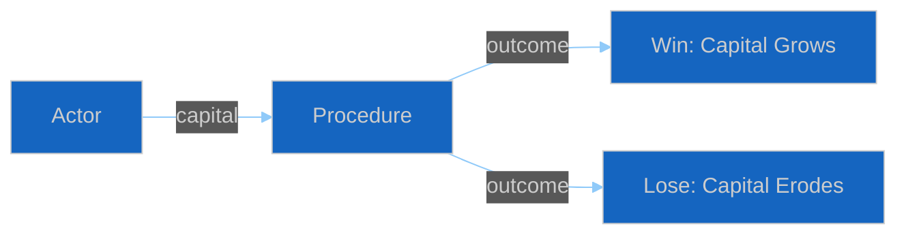

<!-- SPDX-FileCopyrightText: 2024-2026 Hack23 AB -->
<!-- SPDX-License-Identifier: Apache-2.0 -->

# 💼 Political Capital Risk Template — Named-Actor Capital Exposure

> **📌 Template Instructions:** Copy to `analysis/daily/{date}/{article-type}-run{N}/risk-scoring/political-capital-risk.md`. Track named rapporteur/chair/group-leader political capital exposure per top position. See [methodologies/per-artifact-methodologies.md §political-capital-risk](../methodologies/per-artifact-methodologies.md#political-capital-risk).

> **🎯 Purpose:** Follow-the-stakes analysis identifying which political actors have invested capital in which positions and what their downside risk is.

---

## 📋 Document Metadata

| Field | Value |
|-------|-------|
| **Report ID** | `[REQUIRED: PCR-YYYY-MM-DD-runNN]` |
| **Actors Analyzed** | `[REQUIRED: count]` |

---

## 1️⃣ Named Actor Capital Table

| Actor | Position Staked | Capital Invested | Counter-Party | Downside if Defeated |
|-------|----------------|:----------------:|---------------|----------------------|
| `[REQUIRED: MEP name + role]` | `[REQUIRED: e.g. "Rapporteur for Regulation XYZ"]` | `[🟢 Low / 🟡 Medium / 🔴 High]` | `[REQUIRED: opposing group/faction]` | `[REQUIRED: ≥30 words]` |
| `[REQUIRED]` | `[REQUIRED]` | `[...]` | `[REQUIRED]` | `[REQUIRED]` |

---

## 2️⃣ Capital Flow Diagram

---

## 3️⃣ Precedent Table

| Similar Bet (Historical) | Outcome | Lessons |
|-------------------------|---------|---------|
| `[REQUIRED]` | `[Win/Loss]` | `[REQUIRED: ≥30 words]` |

---

## 4️⃣ Outlook

`[REQUIRED: ≥60 words — capital likely preserved/eroded/lost]`

---

**Document Control:** `/analysis/daily/{date}/{type}-run{N}/risk-scoring/political-capital-risk.md` · Template v1.0 · Depth floor: 30 lines.
