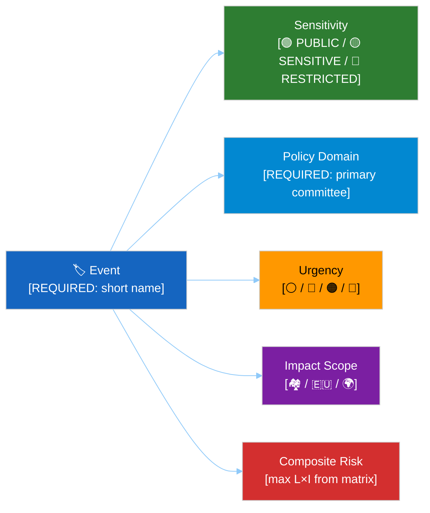

<!-- SPDX-FileCopyrightText: 2024-2026 Hack23 AB -->
<!-- SPDX-License-Identifier: Apache-2.0 -->

# 🏷️ Political Event Classification Template — European Parliament

> **📌 Template Instructions:** Copy this file to `analysis/YYYY-MM-DD/{article-type-slug}/` and rename to `{event-slug}-classification.md`. Replace all `[REQUIRED]` and `[OPTIONAL]` placeholders with actual values. See [methodologies/political-classification-guide.md](../methodologies/political-classification-guide.md) for full methodology. MCP data is at `analysis/YYYY-MM-DD/{article-type-slug}/data/`.

> **🚨 Anti-Pattern Warning:** Plain prose without structured tables, Mermaid diagrams, or evidence citations is REJECTED. Every classification file MUST follow this template exactly: metadata header, structured tables with evidence columns, colour-coded Mermaid diagram, confidence labels on all claims. See [methodologies/ai-driven-analysis-guide.md](../methodologies/ai-driven-analysis-guide.md) for good vs. bad examples. **Never use scripted boilerplate — AI must analyse the actual document.**

> **🔴 AI ANALYSIS REQUIRED**: Every field in this template MUST be filled by the AI agent through genuine analysis of the EP data. Never use scripted defaults, template placeholders in final output, or data-count summaries. Analyse what the data MEANS politically.

> **🔴 Classification Data Sources (NEW):** Political alignment scores (Left-Right 1-10) MUST be derived from actual voting patterns, not assumed from group labels. Use `get_voting_records` for the relevant plenary session, or `analyze_coalition_dynamics` for structural composition. If voting data is unavailable, note "alignment score estimated from group composition, not verified voting data" and cap confidence at MEDIUM.

---

## 📋 Document Metadata

| Field | Value |
|-------|-------|
| **Classification ID** | `[REQUIRED: CLS-YYYY-MM-DD-NNN]` |
| **Document Type** | Political Event Classification |
| **Event Date** | `[REQUIRED: YYYY-MM-DD]` |
| **Classification Date** | `[REQUIRED: YYYY-MM-DD HH:MM UTC]` |
| **Primary EP Reference** | `[REQUIRED: EP procedure ID, document ref, or MCP data file path]` |
| **Secondary Source(s)** | `[OPTIONAL: Additional references, comma-separated]` |
| **Classified By** | `[REQUIRED: workflow name, e.g. news-week-ahead]` |

---

## 🏷️ Classification Dimensions

### 1. Sensitivity Level

- [ ] 🟢 **PUBLIC** — Routine EP activity; freely publishable
- [ ] 🟡 **SENSITIVE** — Politically charged; requires careful framing
- [ ] 🔴 **RESTRICTED** — Legal sensitivity; requires editorial review

**Sensitivity Rationale:** `[REQUIRED: 1–2 sentences]`

### 2. Policy Domain

**Primary Domain:** `[REQUIRED: EP committee code, e.g. ECON, LIBE, ENVI]`
**Secondary Domain(s):** `[OPTIONAL: up to two additional committee codes]`

### 3. Urgency Level

- [ ] ⚪ **ROUTINE** — Standard legislative process
- [ ] 🔵 **ELEVATED** — Active committee review or vote within 2 weeks
- [ ] 🟠 **URGENT** — Plenary vote within 48 hours or emergency debate
- [ ] 🔴 **CRITICAL** — Institutional crisis, Article 7, or emergency session

**Urgency Rationale:** `[REQUIRED: 1–2 sentences]`

### 4. Impact Scope

- [ ] 🏘️ **NATIONAL** — Affects specific member state(s) only
- [ ] 🇪🇺 **EU-WIDE** — Affects all EU citizens or institutions
- [ ] 🌍 **INTERNATIONAL** — External relations, trade, or global dimension

---

## 🗺️ Classification Overview Diagram

Every classification file includes a color-coded overview diagram that places this event on the four classification axes. Use the Hack23 theme palette (blue=input, green=safe, orange=caution, red=critical, purple=synthesis).



> The `style S / U / C` lines above are placeholders showing example default colours only. **Replace each fill value to match the level you selected above, using the canonical palette from [political-style-guide.md](../methodologies/political-style-guide.md):** 🟢 `#2E7D32` / 🟡 `#FFC107` / 🟠 `#FF9800` / 🔴 `#D32F2F` / ⚪ `#90A4AE` / 🔵 `#0288D1`. In this template, 🟡 is always `#FFC107` and 🟠 is always `#FF9800`, so a reader scanning the diagram alone can read the classification at a glance.

---

## 📊 Impact Analysis Matrix

Score likelihood and impact on 1–5 scale. Risk Score = Likelihood × Impact.

| Dimension | Likelihood (1–5) | Impact (1–5) | Risk Score | Notes |
|-----------|:---------------:|:------------:|:----------:|-------|
| **Democratic Process** | `[#]` | `[#]` | `[L×I]` | `[OPTIONAL]` |
| **Economic Impact** | `[#]` | `[#]` | `[L×I]` | `[OPTIONAL]` |
| **Social Cohesion** | `[#]` | `[#]` | `[L×I]` | `[OPTIONAL]` |
| **Coalition Stability** | `[#]` | `[#]` | `[L×I]` | `[OPTIONAL]` |
| **International Relations** | `[#]` | `[#]` | `[L×I]` | `[OPTIONAL]` |

**Composite Risk Score:** `[REQUIRED: max of the above scores]`

---

## 📊 7-Dimension Classification Scores

| Dimension | Level | Numeric (10–100) |
|-----------|-------|:-----------------:|
| Public Interest Sensitivity | `[explosive/sensitive/standard/routine]` | `[#]` |
| Democratic Integrity Impact | `[critical/significant/moderate/minor]` | `[#]` |
| Policy Urgency | `[immediate/short-term/medium-term/long-term]` | `[#]` |
| Economic Impact | `[transformative/major/moderate/minimal]` | `[#]` |
| Governance Impact | `[systemic/significant/procedural/routine]` | `[#]` |
| Political Capital Impact | `[career-defining/significant/notable/negligible]` | `[#]` |
| Legislative Impact | `[treaty-level/directive/regulation/administrative]` | `[#]` |

**Weighted Classification Score:** `[REQUIRED: apply weights from methodology guide]`
**Overall Classification:** `[REQUIRED: CRITICAL / HIGH / MEDIUM / LOW]`

---

## 🔖 Cross-Reference Tags

```
Primary Actors:     [REQUIRED: political groups or MEPs, e.g. "EPP, S&D, ECR"]
Committee:          [OPTIONAL: e.g. "ENVI", "LIBE"]
Parliamentary Term: [REQUIRED: e.g. "2024-2029"]
Related Procedures: [OPTIONAL: EP procedure IDs]
MCP Data Files:     [REQUIRED: paths to analysis/YYYY-MM-DD/{article-type-slug}/data/ files used]
```

---

## 📝 Classification Rationale

### Summary of Event
`[REQUIRED: 2–4 sentences describing the event, key actors, and EP context. Cite specific document IDs, committee names, and MEP names.]`

### Classification Justification
`[REQUIRED: Explain why each dimension was assigned its value. Reference evidence from MCP data files.]`

### Confidence Assessment
- **Source Quality:** `[HIGH / MEDIUM / LOW]` — `[reason]`
- **Information Completeness:** `[HIGH / MEDIUM / LOW]` — `[reason]`
- **Overall Confidence:** `[HIGH / MEDIUM / LOW]`

### Recommended Action
- [ ] 📰 **Publish** — Include in next news cycle (significance ≥ 6)
- [ ] ⚡ **Breaking** — Publish immediately (significance ≥ 8 + URGENT/CRITICAL)
- [ ] 📋 **Monitor** — Track for follow-up; do not publish standalone
- [ ] 🗄️ **Archive** — Low significance; archive for trend analysis only

---

## 📊 Calibration Example (Filled)

> *This example demonstrates how to complete the template for a real EP event. Use it as a scoring anchor.*

**Event:** Plenary adoption of revised Emissions Trading System extension (ETS III)

| Field | Value |
|-------|-------|
| **Classification ID** | `CLS-2026-03-15-001` |
| **Document Type** | Political Event Classification |
| **Event Date** | `2026-03-15` |
| **Classification Date** | `2026-03-15 16:00 UTC` |
| **Primary EP Reference** | `P9_TA(2026)0095` |
| **Classified By** | `news-breaking` |

| Dimension | Value | Justification |
|-----------|:-----:|---------------|
| **Sensitivity** | 🟡 SENSITIVE | ETS extension involves cross-group tensions; Greens/EFA and ECR oppose from opposing directions |
| **Primary Domain** | ENVI | Environment committee lead; secondary: ITRE, ECON |
| **Urgency** | 🟠 URGENT | Final plenary vote; no further amendment possible |
| **Impact Scope** | 🇪🇺 EU-WIDE | Affects all EU member states; maritime and aviation sectors EU-wide |

| Dimension | Likelihood (1–5) | Impact (1–5) | Risk Score |
|-----------|:---------------:|:------------:|:----------:|
| Democratic Process | 2 | 2 | 4 |
| Economic Impact | 4 | 5 | **20** |
| Social Cohesion | 3 | 3 | 9 |
| Coalition Stability | 3 | 4 | 12 |
| International Relations | 4 | 4 | 16 |

**Composite Risk Score:** 20 (Economic Impact — max)

| 7-Dimension Score | Level | Numeric |
|-------------------|-------|:-------:|
| Public Interest Sensitivity | sensitive | 70 |
| Democratic Integrity Impact | moderate | 50 |
| Policy Urgency | immediate | 90 |
| Economic Impact | major | 80 |
| Governance Impact | significant | 65 |
| Political Capital Impact | significant | 70 |
| Legislative Impact | directive | 75 |

**Weighted Classification Score:** 72/100
**Overall Classification:** **HIGH**
**Recommended Action:** ⚡ **Breaking** (HIGH classification + URGENT urgency)

---

## 🗓️ Recess-Period Classification Rules

> **AI Instructions:** During EP recess periods (August, December–January, and constituency weeks), apply the following modified classification rules. Recess periods adjust **publication timing and urgency handling** but do NOT change the **raw significance score or classification**. The raw score/classification remains as computed; only the recommended *action* (when/how to publish) is modified. This aligns with the significance-scoring template's distinction between raw scores and calendar-adjusted editorial decisions (see `significance-scoring.md` § EP Calendar Awareness).

### Recess Period Detection

| Period | Typical Dates | EP Activity Level | Classification Impact |
|--------|--------------|:-----------------:|----------------------|
| **Summer Recess** | Late July – August | ⚪ Minimal | Urgency capped at ROUTINE unless institutional crisis |
| **Winter Recess** | Late December – mid-January | ⚪ Minimal | Urgency capped at ROUTINE unless institutional crisis |
| **Constituency Week** | Varies (check EP calendar) | 🔵 Low | Urgency downgraded by one level (URGENT→ELEVATED) |
| **Pre-Plenary Week** | Monday before plenary | 🟡 Moderate | Standard rules apply; committee work concluding |
| **Plenary Session Week** | Per EP calendar (Strasbourg/Brussels) | 🟠 High | Standard rules apply; full urgency scale |

### Recess Classification Overrides

| Condition | Standard Urgency | Adjusted Urgency | Recommended Action | Rationale |
|-----------|:----------------:|:----------------:|--------------------|-----------|
| Routine committee output during recess | ROUTINE | ROUTINE | **ARCHIVE** | No audience; queue for session return |
| ELEVATED event during constituency week | ELEVATED | **ROUTINE** | **MONITOR** | Reduced EP engagement; track for plenary week |
| URGENT event during summer recess | URGENT | **ELEVATED** | **MONITOR + PRE-POSITION** | Prepare analysis; publish when EP reconvenes |
| CRITICAL event during any recess (e.g., motion of censure) | CRITICAL | **CRITICAL** | **NO OVERRIDE / PUBLISH** | Constitutional/institutional crises override recess rules |

### Current Calendar Context

| Field | Value |
|-------|-------|
| **Current EP Status** | `[REQUIRED: e.g. "In Session (Plenary)" / "Constituency Week" / "Summer Recess"]` |
| **Recess Override Applied?** | `[REQUIRED: YES (specify override) / NO]` |
| **Original Urgency** | `[If overridden: original urgency level]` |
| **Adjusted Urgency** | `[If overridden: adjusted urgency level]` |

---

**Document Control:**
- **Template Path:** `/analysis/templates/political-classification.md`
- **Version:** 2.2
- **Advanced Dimensions:** Political Temperature Index, Strategic Significance, Coalition Impact Vector, Recess-Period Classification Rules
- **Framework Reference:** [methodologies/political-classification-guide.md](../methodologies/political-classification-guide.md)
- **Classification:** Public
- **Next Review:** 2026-07-31
