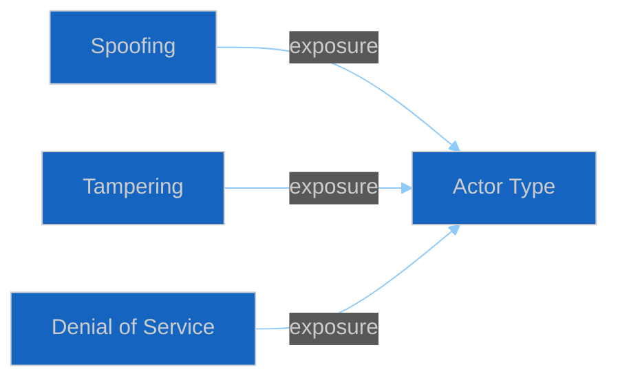

<!-- SPDX-FileCopyrightText: 2024-2026 Hack23 AB -->
<!-- SPDX-License-Identifier: Apache-2.0 -->

# 🔐 Political STRIDE Assessment Template — STRIDE for Political Threats

> **📌 Template Instructions:** Copy to `analysis/daily/{date}/{article-type}-run{N}/threat-assessment/political-stride-assessment.md`. STRIDE reinterpreted for political actors: Spoofing/Tampering/Repudiation/Information disclosure/Denial of service/Elevation of privilege. See [methodologies/per-artifact-methodologies.md §political-stride-assessment](../methodologies/per-artifact-methodologies.md#political-stride-assessment).

> **🎯 Purpose:** Apply cybersecurity threat-modeling framework to political threats, ensuring comprehensive coverage of democratic attack vectors.

---

## 📋 Document Metadata

| Field | Value |
|-------|-------|
| **Report ID** | `[REQUIRED: PSA-YYYY-MM-DD-runNN]` |
| **Actor Categories Analyzed** | `[REQUIRED: count]` |

---

## 1️⃣ Political STRIDE Definitions

**STRIDE letters adapted for EP political context:**

| Letter | Political Interpretation |
|:------:|-------------------------|
| **S** | **Spoofing:** Identity manipulation (e.g., astroturf campaigns misrepresenting citizen groups) |
| **T** | **Tampering:** Procedural tampering (e.g., amendment flooding, rule gaming) |
| **R** | **Repudiation:** Deniability of positions (e.g., voting record obscuration, off-record agreements) |
| **I** | **Information Disclosure:** Selective leaks or transparency weaponization |
| **D** | **Denial of Service:** Legislative obstruction (e.g., committee stalling, amendment voting delays) |
| **E** | **Elevation of Privilege:** Rule gaming for institutional advantage (e.g., exploiting procedural gaps) |

---

## 2️⃣ STRIDE × Actor Matrix

| Actor Category | S | T | R | I | D | E |
|----------------|:-:|:-:|:-:|:-:|:-:|:-:|
| `[REQUIRED: e.g. "Far-right MEP groups"]` | `[🟢/🟡/🔴]` | `[🟢/🟡/🔴]` | `[🟢/🟡/🔴]` | `[🟢/🟡/🔴]` | `[🟢/🟡/🔴]` | `[🟢/🟡/🔴]` |
| `[REQUIRED]` | `[...]` | `[...]` | `[...]` | `[...]` | `[...]` | `[...]` |

**Severity scale:** 🟢 Low / 🟡 Moderate / 🔴 High

---

## 3️⃣ Per-Cell Threat Narratives

### Cell: `[REQUIRED: Actor Category × STRIDE Letter]`

`[REQUIRED: ≥50 words explaining how this actor uses this threat vector in the EP political context. Include specific examples or procedural mechanisms where observable.]`

*(Repeat for all non-empty cells)*

---

## 4️⃣ Residual Risk After EP Safeguards

| STRIDE Letter | Existing Safeguard | Residual Risk |
|:-------------:|-------------------|:-------------:|
| **S** | `[REQUIRED: EP rule or practice]` | `[🟢/🟡/🔴]` |
| **T** | `[REQUIRED]` | `[🟢/🟡/🔴]` |
| **R** | `[REQUIRED]` | `[🟢/🟡/🔴]` |
| **I** | `[REQUIRED]` | `[🟢/🟡/🔴]` |
| **D** | `[REQUIRED]` | `[🟢/🟡/🔴]` |
| **E** | `[REQUIRED]` | `[🟢/🟡/🔴]` |

---

## 5️⃣ Priority of Mitigations

**Recommended mitigation priority:**

1. `[REQUIRED: STRIDE letter + rationale for priority]`
2. `[REQUIRED]`
3. `[REQUIRED]`

---

**Document Control:** `/analysis/daily/{date}/{type}-run{N}/threat-assessment/political-stride-assessment.md` · Template v1.0 · Depth floor: 30 lines.
