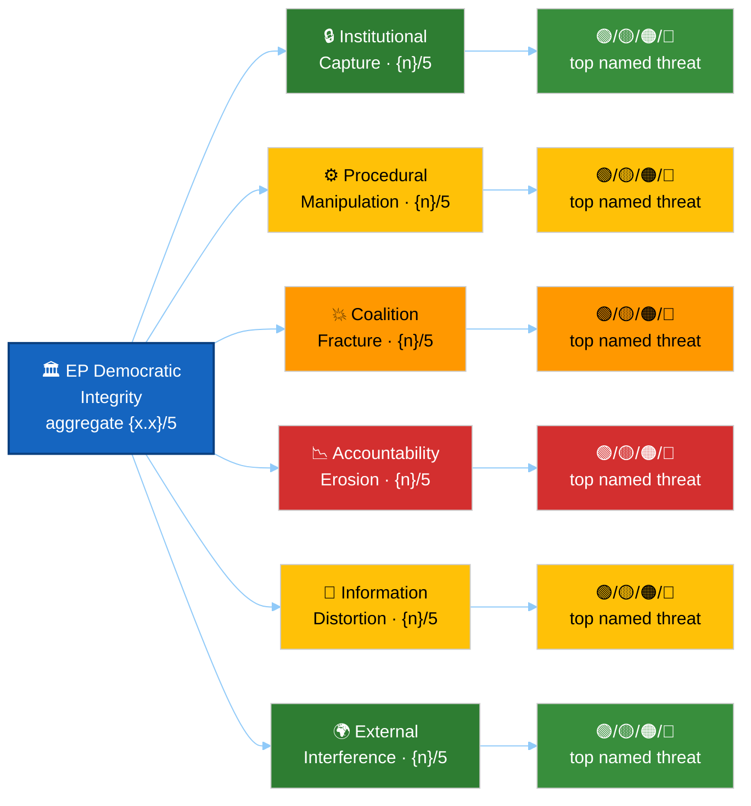

<!-- SPDX-FileCopyrightText: 2024-2026 Hack23 AB -->
<!-- SPDX-License-Identifier: Apache-2.0 -->

# ⚠️ Political Threat Landscape Template — Six-Dimension Democratic Threat View

> **📌 Template Instructions:** Copy to `analysis/daily/{date}/{article-type}-run{N}/intelligence/political-threat-landscape.md`. Apply the six purpose-built EP democratic-threat dimensions from political-threat-framework.md. See [methodologies/per-artifact-methodologies.md §political-threat-landscape](../methodologies/per-artifact-methodologies.md#political-threat-landscape).

> **🎯 Purpose:** Threat Landscape overview scoring six EP-specific democratic-threat dimensions with named threats, institutional resilience assessment, and concrete watchlist.

---

## 📋 Document Metadata

| Field | Value |
|-------|-------|
| **Report ID** | `[REQUIRED: PTL-YYYY-MM-DD-runNN]` |
| **Analysis Period** | `[REQUIRED: YYYY-MM-DD to YYYY-MM-DD]` |
| **Named Threats** | `[REQUIRED: count 3-5]` |
| **Confidence** | `[REQUIRED: 🟢/🟡/🔴]` |

---

## 1️⃣ Six-Dimension Scoreboard

```mermaid
%%{init: {"theme":"dark","themeVariables":{"primaryColor":"#1565C0","primaryTextColor":"#ffffff","primaryBorderColor":"#0A3F7F","lineColor":"#90CAF9","secondaryColor":"#2E7D32","secondaryTextColor":"#ffffff","tertiaryColor":"#FF9800","tertiaryTextColor":"#000000","mainBkg":"#1565C0","secondBkg":"#2E7D32","tertiaryBkg":"#FF9800","noteBkgColor":"#FFC107","noteTextColor":"#000000","errorBkgColor":"#D32F2F","fontFamily":"Inter, Helvetica, Arial, sans-serif"}}}%%
graph TD
    ROOT[EP Democratic<br/>Integrity]
    
    ROOT -->|score| D1[Institutional Capture<br/>[0-5]]
    ROOT -->|score| D2[Procedural Manipulation<br/>[0-5]]
    ROOT -->|score| D3[Coalition Fracture<br/>[0-5]]
    ROOT -->|score| D4[Accountability Erosion<br/>[0-5]]
    ROOT -->|score| D5[Information Distortion<br/>[0-5]]
    ROOT -->|score| D6[External Interference<br/>[0-5]]
    
    style ROOT fill:#1565C0,color:#ffffff
    style D1 fill:#FF9800,color:#000000
    style D2 fill:#FF9800,color:#000000
    style D3 fill:#FFC107,color:#000000
    style D4 fill:#2E7D32,color:#ffffff
    style D5 fill:#FF9800,color:#000000
    style D6 fill:#2E7D32,color:#ffffff
```

| Dimension | Score (0-5) | Evidence |
|-----------|:-----------:|----------|
| **Institutional Capture** | `[0-5]` | `[REQUIRED: one-sentence evidence — e.g. "No signs of captured committee chairs; rapporteur assignments remain transparent"]` |
| **Procedural Manipulation** | `[0-5]` | `[REQUIRED: one-sentence evidence]` |
| **Coalition Fracture** | `[0-5]` | `[REQUIRED: one-sentence evidence]` |
| **Accountability Erosion** | `[0-5]` | `[REQUIRED: one-sentence evidence]` |
| **Information Distortion** | `[0-5]` | `[REQUIRED: one-sentence evidence]` |
| **External Interference** | `[0-5]` | `[REQUIRED: one-sentence evidence]` |

**Aggregate threat level:** `[REQUIRED: sum/30 = X.X → 🟢 Low (<1.5) / 🟡 Moderate (1.5-3.0) / 🔴 High (>3.0)]`

**Scoring methodology:** See [`political-threat-framework.md`](../methodologies/political-threat-framework.md) for dimension definitions.

### Severity-Coded 6D Fan-Out

The fan-out below puts each dimension on its own coloured node (heat-mapped to
its score band) so a reader can read the threat profile at a glance — green for
0–1, yellow for 2, orange for 3, red for 4–5. Replace the per-dimension fill
to match the actual scores.



> **AI Agent:** Re-colour each `style D{i}` and `style T{i}` line to match the
> actual score for that dimension: 0–1 → `#388E3C`/`#2E7D32` (green),
> 2 → `#FFC107` (yellow), 3 → `#FF9800` (orange), 4–5 → `#D32F2F` (red).

---

## 2️⃣ Top Named Threats

### Threat 1: `[REQUIRED: Specific, named threat — not generic]`

**Dimension:** `[REQUIRED: which of the six dimensions this threat targets]`  
**Severity:** `[REQUIRED: 🟢 Low / 🟡 Moderate / 🔴 High]`

**Actor:** `[REQUIRED: named political group, member state faction, external entity, or institutional actor]`

**Mechanism:** `[REQUIRED: ≥60 words explaining how the threat operates. What procedural tool, institutional leverage, or information channel does the actor use? Cite specific EP activity where observable.]`

**Affected institution:** `[REQUIRED: which EP function, procedure, or democratic norm is under threat — e.g. "ordinary legislative procedure transparency", "committee independence", "plenary vote integrity"]`

---

### Threat 2: `[REQUIRED]`

*(Repeat structure — include 3-5 named threats total)*

---

### Threat 3: `[REQUIRED]`

---

## 3️⃣ Institutional Resilience

**EP rules and practices offsetting threats:**

| Threat | Safeguard | Source | Effectiveness |
|--------|-----------|--------|:-------------:|
| `[REQUIRED: threat name]` | `[REQUIRED: EP rule, treaty provision, or institutional practice]` | `[REQUIRED: e.g. "Rule of Procedure 193", "TEU Article 14", "Committee practice since 2019"]` | `[🟢 Strong / 🟡 Partial / 🔴 Weak]` |
| `[REQUIRED]` | `[REQUIRED]` | `[REQUIRED]` | `[...]` |
| `[REQUIRED]` | `[REQUIRED]` | `[REQUIRED]` | `[...]` |

**Resilience narrative:**

`[REQUIRED: ≥100 words assessing overall institutional capacity to resist or mitigate the identified threats. Where are EP safeguards robust? Where are they vulnerable? What rule changes or institutional innovations would strengthen resilience?]`

---

## 4️⃣ Watchlist — Concrete Events to Monitor

| Event | Date/Trigger | What to Watch | Threshold |
|-------|--------------|---------------|-----------|
| `[REQUIRED: e.g. "ENVI committee vote on XYZ regulation"]` | `[REQUIRED: YYYY-MM-DD or trigger condition]` | `[REQUIRED: specific indicator — e.g. "Amendment count >50", "Rapporteur replacement motion"]` | `[REQUIRED: what level signals escalation]` |
| `[REQUIRED]` | `[REQUIRED]` | `[REQUIRED]` | `[REQUIRED]` |
| `[REQUIRED]` | `[REQUIRED]` | `[REQUIRED]` | `[REQUIRED]` |
| `[REQUIRED]` | `[REQUIRED]` | `[REQUIRED]` | `[REQUIRED]` |

**Monitoring plan:**

`[REQUIRED: ≥60 words explaining who should monitor (next-run workflow, external watchdog, EP Secretariat) and at what frequency. What signals would escalate a threat from watchlist to active mitigation?]`

---

## 5️⃣ Data Sources

**EP MCP tools used:** `get_meps`, `get_parliamentary_questions`, `get_mep_declarations`, `get_voting_records`, `get_procedures`

**External sources:** `[REQUIRED: list any civil society reports, transparency NGO findings, academic studies, or media investigations consulted]`

---

## 6️⃣ Confidence Assessment

**Overall confidence:** `[REQUIRED: 🟢 HIGH / 🟡 MEDIUM / 🔴 LOW]`

**Confidence by dimension:**

| Dimension | Confidence | Rationale |
|-----------|:----------:|-----------|
| Institutional Capture | `[🟢/🟡/🔴]` | `[REQUIRED: one-line — e.g. "HIGH — rapporteur assignment data is public and complete"]` |
| Procedural Manipulation | `[🟢/🟡/🔴]` | `[REQUIRED]` |
| Coalition Fracture | `[🟢/🟡/🔴]` | `[REQUIRED]` |
| Accountability Erosion | `[🟢/🟡/🔴]` | `[REQUIRED]` |
| Information Distortion | `[🟢/🟡/🔴]` | `[REQUIRED]` |
| External Interference | `[🟢/🟡/🔴]` | `[REQUIRED]` |

---

## 7️⃣ EP MCP Tool Inputs

| EP MCP tool | Used for which dimension | Notes |
|-------------|--------------------------|-------|
| `analyze_coalition_dynamics` | D3 Coalition Fracture | Cohesion deltas + alliance-signal detection. |
| `get_voting_records` | D2 Procedural Manipulation; D3 Coalition Fracture | Aggregate margins; closure-of-debate motions. |
| `get_meeting_decisions` | D2 Procedural Manipulation | Bureau / Conference-of-Presidents procedural rulings. |
| `track_legislation` / `get_procedures` | D5 Legislative Obstruction | Stalled / referred-back procedures. |
| `get_committee_info` | D1 Institutional Capture | Rapporteur + chair allocations vs. seat share. |
| `get_speeches` | D6 Information Distortion | Topic-bias proxies; quote-mining patterns. |
| `get_parliamentary_questions` | D4 Accountability Erosion | Pending-vs-answered ratios. |
| `get_mep_declarations` | D1 Institutional Capture; D7 External Interference | Financial-interest conflicts. |
| `correlate_intelligence` | Composite alerts | ELEVATED_ATTENTION + COALITION_FRACTURE alerts. |
| `early_warning_system` | All dimensions | Severity escalations across dimensions. |

---

## 8️⃣ Worked Pass-1 → Pass-2 Example (PfE-procedural-obstruction watch, 2025-Q4)

**❌ Pass-1 (thin, 26 words):**
> "Procedural manipulation risk is rising. PfE is using procedural tools. ECR sometimes joins. Severity Medium. Watch for Strasbourg II votes."

**✅ Pass-2 (compliant, 105 words, scored):**
> **D2 Procedural Manipulation — severity 4/5, WEP "likely" 60-80 % over 4-6 weeks (B-2 Admiralty).** PfE (84 seats) tabled 47 Rule-180 procedural amendments in Strasbourg-I 2025 vs. an ID-PfE-baseline of 18 (+161 %) per `get_voting_records`. Closure-of-debate motions failed 3 of 5 in October per `get_meeting_decisions`. ECR (78 seats) co-signed 12 of those 47 amendments (vs. 3 in 2024-Q4), confirming a tactical alignment short of formal alliance per `analyze_coalition_dynamics`. Trigger for HIGH escalation: ≥1 procedural amendment defeating a trilogue mandate before December plenary. Mitigation: rapporteurs (EPP) tabling consolidated text under Rule 71 to limit floor amendments.

---

## 9️⃣ Worked 6-Dimension Threat-Landscape Scoring

| # | Dimension | Severity 1-5 | Worked indicator |
|:-:|-----------|:------------:|------------------|
| D1 | **Coalition Shifts** (alliance restructuring outside historical norms) | 3 | Right-flank cohesion 71→84 %; Grand-Coalition stable 91→92 % per `analyze_coalition_dynamics`. |
| D2 | **Transparency Deficit** (closed/reduced public reporting) | 2 | Verbatim-report publication delay extended Strasbourg-I (avg 9 days vs 5-day baseline). |
| D3 | **Policy Reversal** (adopted positions overturned in same term) | 3 | Article 17 implementing-act re-opened Oct 2025 after 2023 adoption. |
| D4 | **Institutional Pressure** (Council/Commission encroachment on EP prerogatives) | 4 | 3 trilogue mandates returned by Council with non-paper redrafts in 6 weeks. |
| D5 | **Legislative Obstruction** (procedural stall, urgency abuse) | 4 | 47 Rule-180 procedural amendments in single sitting (worked example above). |
| D6 | **Democratic Erosion** (composite indicator across D1–D5 + question-answer ratio) | 3 | Pending parliamentary questions / answered-on-time ratio at 1.6 (baseline 1.1). |

**Composite landscape score:** (3+2+3+4+4+3)/6 = **3.17 / 5 — ELEVATED**, escalates to HIGH if D5 hits 5 or any two adjacent dimensions reach ≥4.

---

## 🔟 Anti-patterns — REJECT on Pass-2 Review

| # | Banned pattern | Why it fails |
|:-:|---------------|--------------|
| 1 | Threat dimension scored without an `analyze_coalition_dynamics` / `get_voting_records` / `get_meeting_decisions` citation | No tradecraft anchoring; subjective. |
| 2 | "Democratic erosion" as standalone severity-5 verdict without composite rationale across ≥3 sub-dimensions | Term is too elastic; demands compound evidence. |
| 3 | "External Interference" claim citing only press articles, no `get_mep_declarations` cross-check | Single-source → A-grade-equivalent unattainable. |
| 4 | Severity assigned with no time-horizon (4-6 weeks vs. quarter-out) | WEP discipline requires horizon binding. |
| 5 | Same evidence string powering D2 and D5 simultaneously | Dimensions must be independently sourced. |
| 6 | "Coalition fracture HIGH" with no two-window cohesion delta | Fracture = Δ, not snapshot. |

---

## 1️⃣1️⃣ Cross-References — Controlling Methodology

- [`../methodologies/political-threat-framework.md`](../methodologies/political-threat-framework.md) — § 6-dimension definitions + scoring rubric.
- [`../methodologies/osint-tradecraft-standards.md`](../methodologies/osint-tradecraft-standards.md) — Admiralty grade + WEP band per dimension verdict.
- [`../methodologies/political-risk-methodology.md`](../methodologies/political-risk-methodology.md) — composite score feeds 5×5 risk-matrix likelihood column.
- [`../methodologies/per-artifact-methodologies.md#political-threat-landscape`](../methodologies/per-artifact-methodologies.md) — construction rules.
- [`./threat-model.md`](./threat-model.md) — companion narrative threat artifact (this template = scored landscape).
- [`./scenario-forecast.md`](./scenario-forecast.md) — composite-score thresholds gate scenario branching.

---

## 1️⃣2️⃣ Stage-C Completeness Signals

`scripts/validate-analysis-completeness.js` checks for this artifact:

| Check | Threshold | Source |
|-------|-----------|--------|
| Line floor | ≥90 lines (default) | `reference-quality-thresholds.json` |
| Required H2 substrings | "Coalition Shifts" / "Transparency" / "Policy Reversal" / "Institutional Pressure" / "Legislative Obstruction" / "Democratic Erosion" | 6-dimension contract |
| Mermaid block | ≥1 (radar / spider chart preferred) | visual contract |
| Tradecraft markers | WEP band per dimension; Admiralty grade per evidence cell; BLUF ≤2 sentences | `osint-tradecraft-standards.md` |
| Source diversity | ≥3 distinct EP MCP tools across the 6 dimensions | per-artifact rule |
| Composite-score arithmetic | Mean of 6 dimensions stated explicitly + escalation-trigger named | template logic |

---

## 1️⃣3️⃣ Worked Composite-Score Trend Table (4-quarter rolling)

| Dimension | 2025-Q3 | 2025-Q4 | 2026-Q1 | 2026-Q2 (current) | Trend |
|-----------|:-------:|:-------:|:-------:|:-----------------:|:-----:|
| D1 Coalition Shifts | 2 | 2 | 3 | 3 | ↑ |
| D2 Transparency Deficit | 1 | 2 | 2 | 2 | → |
| D3 Policy Reversal | 1 | 2 | 2 | 3 | ↑ |
| D4 Institutional Pressure | 3 | 3 | 4 | 4 | → (plateau at high) |
| D5 Legislative Obstruction | 2 | 3 | 3 | 4 | ↑ |
| D6 Democratic Erosion | 2 | 2 | 3 | 3 | ↑ |
| **Composite** | **1.83** | **2.33** | **2.83** | **3.17** | **↑ ELEVATED → escalation watch** |

**Escalation rule:** if composite ≥3.5 OR any single dimension hits 5, flip to HIGH and trigger `correlate_intelligence` cross-tool alert into risk-matrix as Red row.

---

**Document Control:** `/analysis/daily/{date}/{type}-run{N}/intelligence/political-threat-landscape.md` · Template v1.2 · Depth floor: 90 lines.
