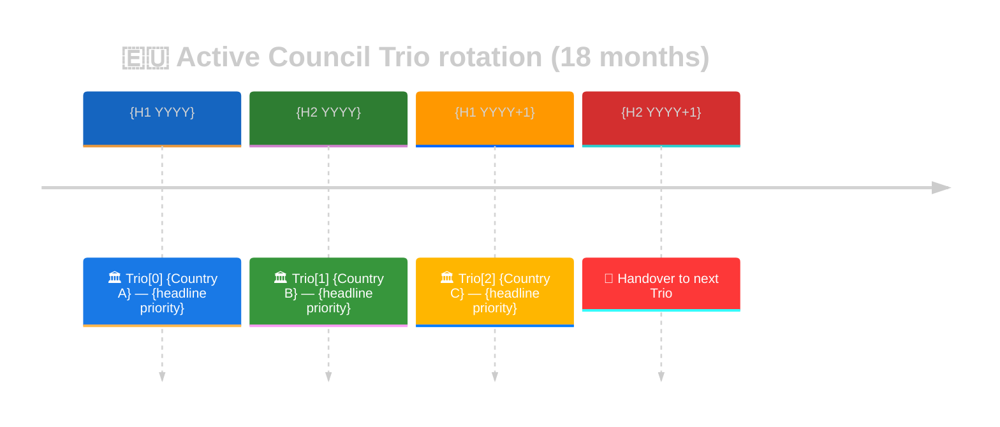
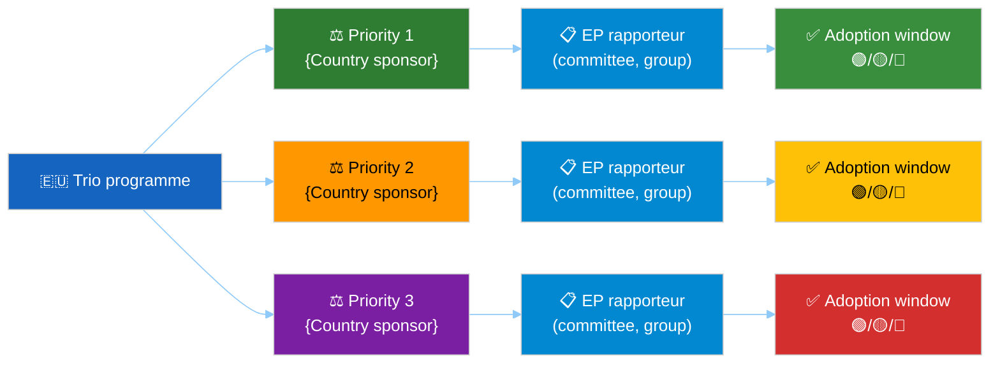

<!-- SPDX-FileCopyrightText: 2024-2026 Hack23 AB -->
<!-- SPDX-License-Identifier: Apache-2.0 -->

# 🇪🇺 Presidency Trio Context Template

**Template Purpose:** Council Trio Presidency overlay — legislative priorities, completed/pending files, handover timeline. Required for every horizon ≥ quarter.

**Methodology:** [forward-projection-methodology.md §4 (Trio rupture tripwire)](../methodologies/forward-projection-methodology.md#4-structural-break-detection) and [electoral-cycle-methodology.md §6](../methodologies/electoral-cycle-methodology.md)

**Min Lines:** 180 (`quarter-ahead`), 220 (`year-ahead`, `year-in-review`, `term-outlook`), 240 (`election-cycle`).

**Required by:** `quarter-ahead`, `year-ahead`, `year-in-review`, `term-outlook`, `election-cycle`. Optional for `quarter-in-review`.

---

## 📋 Header Block

```markdown
# Presidency Trio Context — {Trio designation} — {Run Date}

**Classification:** PUBLIC
**Active Trio:** {Country A → Country B → Country C} ({term-start} → {term-end})
**Current Presidency:** {Country, half-year}
**Trio Programme:** {URL or external-document ID}
**Source:** get_external_documents (workType: trio-programme, presidency-priorities)
```

---

## 🎯 Section 1 — Active-Trio Summary





```markdown
| Slot | Country | Term | Lead minister(s) | Headline priority |
|---|---|---|---|---|
| Trio[0] (current) | {C} | H1/H2 YYYY | … | … |
| Trio[1] (next) | {C} | H1/H2 YYYY | … | … |
| Trio[2] (after) | {C} | H1/H2 YYYY | … | … |
```

---

## 📋 Section 2 — Trio Programme — Legislative Priorities

For each of the active Trio's declared headline priorities, document EP-side rapporteur and stage:

```markdown
| Priority | Trio sponsor | Procedure ID | EP rapporteur | Current stage | Adoption window | Status (🟢/🟡/🔴) |
|---|---|---|---|---|---|---|
| {priority} | {country} | {2024/...} | {name, group} | trilogue | Q3 2026 | 🟢 |
| … | … | … | … | … | … | … |
```

---

## 🔁 Section 3 — Files Inherited / Files to Hand Over

```markdown
### Inherited from previous Trio

| Procedure ID | Title | Stage at handover | Notes |
|---|---|---|---|
| 2024/0001(COD) | … | trilogue | Carried over from {prior Trio} — {months overdue} |

### To hand over to next Trio

| Procedure ID | Title | Expected stage at handover | Risk |
|---|---|---|---|
| 2024/0042(COD) | … | trilogue | 🟡 — likely to slip past handover |
```

---

## ⚠️ Section 4 — Handover Risk Assessment

```markdown
| Handover transition | Risk drivers | Likelihood × Impact (WEP) | Mitigation |
|---|---|---|---|
| {Country A → Country B}, {date} | {drivers — election overlap, programme misalignment, …} | Likely × High | {…} |
```

Trigger the **Trio rupture** structural-break tripwire (per [`forward-projection-methodology.md` §4](../methodologies/forward-projection-methodology.md#4-structural-break-detection)) when:

- Unilateral handover change announced.
- Programme suspension or formal repudiation by the incoming presidency.
- Lead minister resignation < 30 days before handover.

---

## 🤝 Section 5 — EP-Council Alignment Heatmap

For each Trio priority cross-referenced in §2, score the alignment between EP committee position and Council trilogue position on a 1–5 stress scale.

```markdown
| Priority | EP committee position | Council position | Stress (1–5) |
|---|---|---|---|
| {priority} | … | … | 3 |
```

---

## 🪞 Section 6 — Drift vs Prior Run

Compare against the previous `presidency-trio-context.md`. Surface any priority whose stage changed by ≥ 1 step or whose handover risk colour changed.

---

## 📝 Section 7 — Pass-2 Quality Self-Audit

```markdown
- [ ] All three Trio slots populated
- [ ] ≥ 3 declared priorities mapped to procedure IDs
- [ ] Inherited / to-hand-over tables populated
- [ ] Handover-risk WEP assessed for ≥ 1 upcoming handover
- [ ] EP-Council alignment heatmap populated
- [ ] Drift vs prior run reconciled
```

---

## ⚙️ Section 8 — Methodology Compliance

Cite the Trio programme document IDs (from `get_external_documents`) and any divergence from the published programme attributed to in-flight Council compromise.
