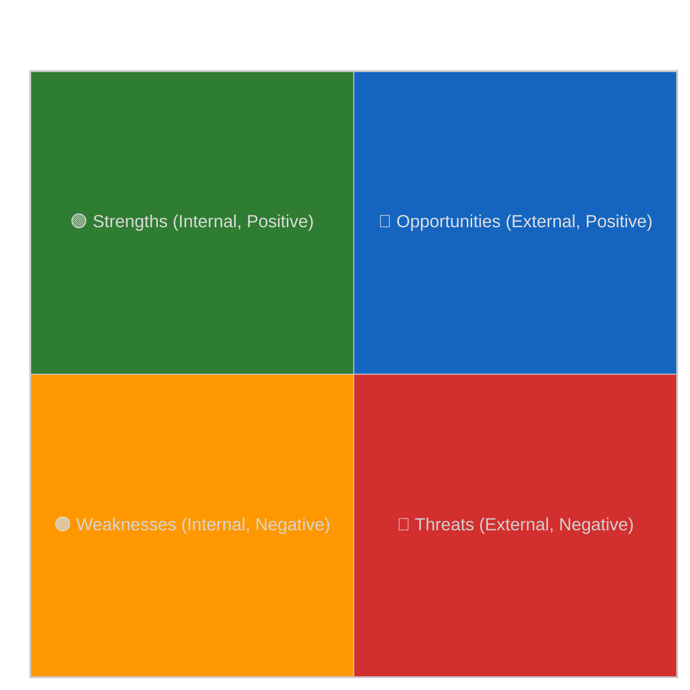

<!-- SPDX-FileCopyrightText: 2024-2026 Hack23 AB -->
<!-- SPDX-License-Identifier: Apache-2.0 -->

# 🔢 Quantitative SWOT Template — Numeric-Weight SWOT + TOWS Strategies

> **📌 Template Instructions:** Copy to `analysis/daily/{date}/{article-type}-run{N}/risk-scoring/quantitative-swot.md`. 3+3+3+3 SWOT with numeric weights plus TOWS cross-quadrant strategies. See [methodologies/per-artifact-methodologies.md §quantitative-swot](../methodologies/per-artifact-methodologies.md#quantitative-swot) and [political-swot-framework.md](../methodologies/political-swot-framework.md).

> **🎯 Purpose:** Weighted SWOT analysis with strategic implications derived from cross-quadrant TOWS matrix. Distinct from basic SWOT by adding numeric severity and strategic pairing.

---

## 📋 Document Metadata

| Field | Value |
|-------|-------|
| **Report ID** | `[REQUIRED: QS-YYYY-MM-DD-runNN]` |
| **Analysis Focus** | `[REQUIRED: issue/period being analyzed]` |
| **Confidence** | `[REQUIRED: 🟢/🟡/🔴]` |

---

## 1️⃣ SWOT Quadrants

### Strengths (Internal, Positive)

| # | Strength | Severity | Evidence |
|:-:|----------|:--------:|----------|
| 1 | `[REQUIRED: specific strength]` | `[High/Medium/Low]` | `[REQUIRED: ≥80 words with citations]` |
| 2 | `[REQUIRED]` | `[...]` | `[REQUIRED: ≥80 words]` |
| 3 | `[REQUIRED]` | `[...]` | `[REQUIRED: ≥80 words]` |

### Weaknesses (Internal, Negative)

| # | Weakness | Severity | Evidence |
|:-:|----------|:--------:|----------|
| 1 | `[REQUIRED]` | `[High/Medium/Low]` | `[REQUIRED: ≥80 words]` |
| 2 | `[REQUIRED]` | `[...]` | `[REQUIRED: ≥80 words]` |
| 3 | `[REQUIRED]` | `[...]` | `[REQUIRED: ≥80 words]` |

### Opportunities (External, Positive)

| # | Opportunity | Severity | Evidence |
|:-:|-------------|:--------:|----------|
| 1 | `[REQUIRED]` | `[High/Medium/Low]` | `[REQUIRED: ≥80 words]` |
| 2 | `[REQUIRED]` | `[...]` | `[REQUIRED: ≥80 words]` |
| 3 | `[REQUIRED]` | `[...]` | `[REQUIRED: ≥80 words]` |

### Threats (External, Negative)

| # | Threat | Severity | Evidence |
|:-:|--------|:--------:|----------|
| 1 | `[REQUIRED]` | `[High/Medium/Low]` | `[REQUIRED: ≥80 words]` |
| 2 | `[REQUIRED]` | `[...]` | `[REQUIRED: ≥80 words]` |
| 3 | `[REQUIRED]` | `[...]` | `[REQUIRED: ≥80 words]` |

---

## 2️⃣ SWOT Quadrant Chart

---

## 3️⃣ TOWS Matrix — Strategic Implications

| | **Opportunities (O)** | **Threats (T)** |
|---|----------------------|-----------------|
| **Strengths (S)** | **SO Strategies:** `[REQUIRED: ≥60 words — use strengths to capture opportunities]` | **ST Strategies:** `[REQUIRED: ≥60 words — use strengths to mitigate threats]` |
| **Weaknesses (W)** | **WO Strategies:** `[REQUIRED: ≥60 words — overcome weaknesses to pursue opportunities]` | **WT Strategies:** `[REQUIRED: ≥60 words — minimize weaknesses and avoid threats]` |

---

## 4️⃣ Cross-Quadrant Interference

**Which S reinforces which O:**

`[REQUIRED: ≥60 words mapping specific strengths to specific opportunities with amplification mechanism]`

**Which W amplifies which T:**

`[REQUIRED: ≥60 words mapping specific weaknesses to specific threats showing compound risk]`

---

## 5️⃣ Scenario Bridge

**SWOT configuration pointing to scenarios (per [`scenario-forecast.md`](../intelligence/scenario-forecast.md)):**

| SWOT Configuration | Scenario Link | Probability Impact |
|-------------------|---------------|:------------------:|
| `[REQUIRED: e.g. "High S1 + High O2 = Scenario 1 (progressive expansion)"]` | `[Scenario name]` | `[↑ / → / ↓]` |
| `[REQUIRED]` | `[Scenario name]` | `[...]` |

---

## 6️⃣ Data Sources

**EP MCP tools used:** `get_procedures`, `compare_political_groups`, `analyze_coalition_dynamics`

---

## 7️⃣ Confidence Assessment

**Overall confidence:** `[REQUIRED: 🟢 HIGH / 🟡 MEDIUM / 🔴 LOW]`

**Confidence by quadrant:**

| Quadrant | Confidence | Rationale |
|----------|:----------:|-----------|
| Strengths | `[🟢/🟡/🔴]` | `[REQUIRED]` |
| Weaknesses | `[🟢/🟡/🔴]` | `[REQUIRED]` |
| Opportunities | `[🟢/🟡/🔴]` | `[REQUIRED]` |
| Threats | `[🟢/🟡/🔴]` | `[REQUIRED]` |

---

**Document Control:** `/analysis/daily/{date}/{type}-run{N}/risk-scoring/quantitative-swot.md` · Template v1.1 · Depth floor: 140 lines.
