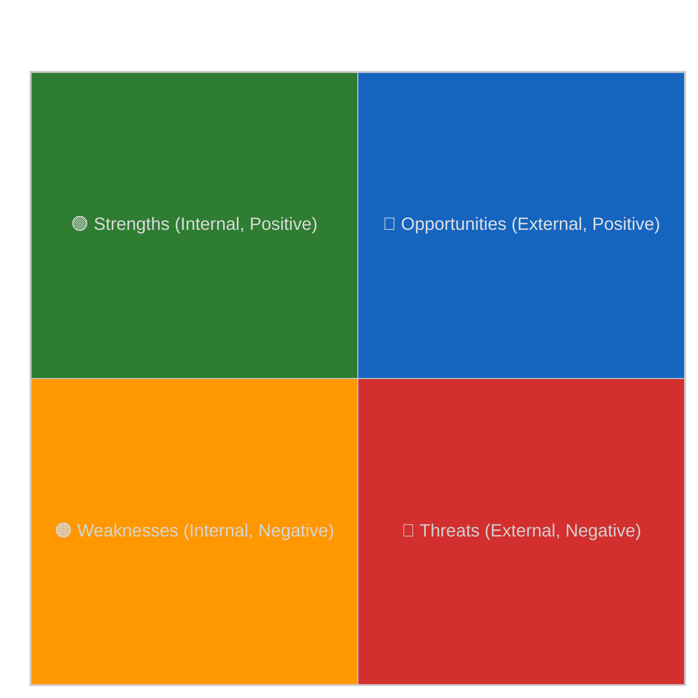

<!-- SPDX-FileCopyrightText: 2024-2026 Hack23 AB -->
<!-- SPDX-License-Identifier: Apache-2.0 -->

# 🔢 Quantitative SWOT Template — Numeric-Weight SWOT + TOWS Strategies

> **📌 Template Instructions:** Copy to `analysis/daily/{date}/{article-type}-run{N}/risk-scoring/quantitative-swot.md`. 3+3+3+3 SWOT with numeric weights plus TOWS cross-quadrant strategies. See [methodologies/per-artifact-methodologies.md §quantitative-swot](../methodologies/per-artifact-methodologies.md#quantitative-swot) and [political-swot-framework.md](../methodologies/political-swot-framework.md).

> **🎯 Purpose:** Weighted SWOT analysis with strategic implications derived from cross-quadrant TOWS matrix. Distinct from basic SWOT by adding numeric severity and strategic pairing.

---

## 📋 Document Metadata

| Field | Value |
|-------|-------|
| **Report ID** | `[REQUIRED: QS-YYYY-MM-DD-runNN]` |
| **Analysis Focus** | `[REQUIRED: issue/period being analyzed]` |
| **Confidence** | `[REQUIRED: 🟢/🟡/🔴]` |

---

## 1️⃣ SWOT Quadrants

### Strengths (Internal, Positive)

| # | Strength | Severity | Evidence |
|:-:|----------|:--------:|----------|
| 1 | `[REQUIRED: specific strength]` | `[High/Medium/Low]` | `[REQUIRED: ≥80 words with citations]` |
| 2 | `[REQUIRED]` | `[...]` | `[REQUIRED: ≥80 words]` |
| 3 | `[REQUIRED]` | `[...]` | `[REQUIRED: ≥80 words]` |

### Weaknesses (Internal, Negative)

| # | Weakness | Severity | Evidence |
|:-:|----------|:--------:|----------|
| 1 | `[REQUIRED]` | `[High/Medium/Low]` | `[REQUIRED: ≥80 words]` |
| 2 | `[REQUIRED]` | `[...]` | `[REQUIRED: ≥80 words]` |
| 3 | `[REQUIRED]` | `[...]` | `[REQUIRED: ≥80 words]` |

### Opportunities (External, Positive)

| # | Opportunity | Severity | Evidence |
|:-:|-------------|:--------:|----------|
| 1 | `[REQUIRED]` | `[High/Medium/Low]` | `[REQUIRED: ≥80 words]` |
| 2 | `[REQUIRED]` | `[...]` | `[REQUIRED: ≥80 words]` |
| 3 | `[REQUIRED]` | `[...]` | `[REQUIRED: ≥80 words]` |

### Threats (External, Negative)

| # | Threat | Severity | Evidence |
|:-:|--------|:--------:|----------|
| 1 | `[REQUIRED]` | `[High/Medium/Low]` | `[REQUIRED: ≥80 words]` |
| 2 | `[REQUIRED]` | `[...]` | `[REQUIRED: ≥80 words]` |
| 3 | `[REQUIRED]` | `[...]` | `[REQUIRED: ≥80 words]` |

---

## 2️⃣ SWOT Quadrant Chart

---

## 3️⃣ TOWS Matrix — Strategic Implications

| | **Opportunities (O)** | **Threats (T)** |
|---|----------------------|-----------------|
| **Strengths (S)** | **SO Strategies:** `[REQUIRED: ≥60 words — use strengths to capture opportunities]` | **ST Strategies:** `[REQUIRED: ≥60 words — use strengths to mitigate threats]` |
| **Weaknesses (W)** | **WO Strategies:** `[REQUIRED: ≥60 words — overcome weaknesses to pursue opportunities]` | **WT Strategies:** `[REQUIRED: ≥60 words — minimize weaknesses and avoid threats]` |

---

## 4️⃣ Cross-Quadrant Interference

**Which S reinforces which O:**

`[REQUIRED: ≥60 words mapping specific strengths to specific opportunities with amplification mechanism]`

**Which W amplifies which T:**

`[REQUIRED: ≥60 words mapping specific weaknesses to specific threats showing compound risk]`

---

## 5️⃣ Scenario Bridge

**SWOT configuration pointing to scenarios (per [`scenario-forecast.md`](../intelligence/scenario-forecast.md)):**

| SWOT Configuration | Scenario Link | Probability Impact |
|-------------------|---------------|:------------------:|
| `[REQUIRED: e.g. "High S1 + High O2 = Scenario 1 (progressive expansion)"]` | `[Scenario name]` | `[↑ / → / ↓]` |
| `[REQUIRED]` | `[Scenario name]` | `[...]` |

---

## 6️⃣ Data Sources

**EP MCP tools used:** `get_procedures`, `compare_political_groups`, `analyze_coalition_dynamics`

---

## 7️⃣ Confidence Assessment

**Overall confidence:** `[REQUIRED: 🟢 HIGH / 🟡 MEDIUM / 🔴 LOW]`

**Confidence by quadrant:**

| Quadrant | Confidence | Rationale |
|----------|:----------:|-----------|
| Strengths | `[🟢/🟡/🔴]` | `[REQUIRED]` |
| Weaknesses | `[🟢/🟡/🔴]` | `[REQUIRED]` |
| Opportunities | `[🟢/🟡/🔴]` | `[REQUIRED]` |
| Threats | `[🟢/🟡/🔴]` | `[REQUIRED]` |

---

## 8️⃣ EP MCP Tool Inputs

| EP MCP tool | Used for which section | Notes |
|-------------|------------------------|-------|
| `compare_political_groups` | §1 Strengths / Weaknesses (Grand-Coalition arithmetic) | Returns seat shares, cohesion proxies for EPP+S&D+Renew (~408 seats / 720). |
| `analyze_coalition_dynamics` | §1 Threats (PfE/ESN/ECR right-flank pressure) | Surfaces anti-Establishment alliance signals. |
| `get_voting_records` | §1 Strengths (S2 majority discipline) + §4 Cross-quadrant | Aggregate RCV margins; flag LOW confidence if <4 weeks old. |
| `get_procedures` / `track_legislation` | §1 Opportunities (legislative pipeline windows) | COD/CNS/APP/RSP procedure codes feed O1–O3. |
| `get_adopted_texts` | §1 Opportunities (delivery track-record evidence) | Adopted-text count = positive O-quadrant signal. |
| `monitor_legislative_pipeline` | §1 Threats (bottleneck/stall risk) | Stalled procedures feed T-quadrant severity. |
| `get_committee_documents` | §1 Strengths (committee throughput) | ENVI/AGRI/ECON/LIBE production proxies S-quadrant. |
| `get_speeches` | §3 TOWS — narrative framing for SO/ST | Identifies thematic anchors for strategy text. |

---

## 9️⃣ Worked Pass-1 → Pass-2 Example (AI Act enforcement, 2025-Q4)

**❌ Pass-1 (thin, 28 words):**
> "Strength S1: Grand Coalition holds majority. This is positive for AI Act delivery. Severity High. Evidence: parliament has 720 seats and Grand Coalition has many."

**✅ Pass-2 (compliant, 96 words, weighted):**
> **S1 — Grand-Coalition floor majority on AI Act enforcement (severity 4 × confidence 0.85 = weight 3.40).** EPP (188) + S&D (136) + Renew (~84) deliver ~408 of 720 seats per `compare_political_groups` (2025-10 snapshot), a 25-seat cushion above the 361 simple-majority threshold even with 5 % defection. `get_voting_records` (RCV 2025/0145(COD), 21-Oct-2025) shows the bloc held at 392/214/41 on the AI-Office implementing-act amendment — the 4th consecutive implementation-vote win. Caveat: cushion narrows to <10 seats if Renew loses >12 % on digital-rights amendments (LIBE shadow-rapporteur Strack-Zimmermann signalled dissent 2025-09).

---

## 🔟 Worked TOWS Cross-Quadrant Strategy (AI Act, 4 strategies)

| Pair | Strategy | Severity × Conf | Weight |
|------|----------|:---------------:|:------:|
| **SO** (S1 Grand-Coalition × O2 Council pre-agreement on enforcement timeline) | Lock implementing-act calendar to Strasbourg I+II 2025 plenaries while EPP–S&D–Renew whip discipline is at 92 %+; rapporteur (Tudorache, Renew) tables consolidated text before PfE tactical-amendment window opens. | 4 × 0.80 | 3.20 |
| **ST** (S2 ENVI/LIBE rapporteur depth × T1 PfE+ESN+ECR procedural obstruction) | Deploy committee co-rapporteurship across LIBE+ITRE to pre-empt 1219(2) procedural challenges; pre-clear urgency-procedure motion with Conference of Presidents. | 3 × 0.75 | 2.25 |
| **WO** (W1 thin secondary-legislation expertise × O3 Commission technical assistance offer) | Request DG-CNECT seconded national experts for ENVI secretariat; trade rapporteur slots on follow-on Cyber Resilience implementing acts to ECR for AI-Act enforcement support. | 3 × 0.60 | 1.80 |
| **WT** (W2 fragmented Greens/EFA position × T2 NGO litigation pressure) | Pre-negotiate Greens floor-amendment package on biometric exemptions before Strasbourg I; commission joint EPP-Greens written explanation to head off ECJ Article 263 challenges. | 4 × 0.55 | 2.20 |

---

## 1️⃣1️⃣ Anti-patterns — REJECT on Pass-2 Review

| # | Banned pattern | Why it fails |
|:-:|---------------|--------------|
| 1 | SWOT cell with severity but no confidence (and therefore no weight) | Breaks the 3+3+3+3 weighted ranking; weight = severity × confidence is mandatory. |
| 2 | "S1: Parliament has majority" without seat arithmetic citing `compare_political_groups` | No EP-domain anchoring; could describe any legislature. |
| 3 | TOWS strategy that pairs S with W (or O with T) — same-axis pairing | TOWS is by definition cross-axis (SO/ST/WO/WT); same-axis pairing is a different framework. |
| 4 | Threat citing "populism" or "right-wing surge" without naming PfE / ESN / ECR seat counts | Generic political commentary; not EP intelligence. |
| 5 | Quadrant chart with point coordinates absent (mermaid `quadrantChart` with no `point` lines) | Visual is decorative-only; quadrant chart must locate ≥4 SWOT items with x/y coords. |
| 6 | Same evidence string copy-pasted across S1+O1 (or W1+T1) | Internal vs. external axis collapsed; reviewer must reject. |

---

## 1️⃣2️⃣ Cross-References — Controlling Methodology

- [`../methodologies/political-swot-framework.md`](../methodologies/political-swot-framework.md) — § Numeric weighting (severity 1–5 × confidence 0–1), §3+3+3+3 quadrant rule.
- [`../methodologies/per-artifact-methodologies.md#quantitative-swot`](../methodologies/per-artifact-methodologies.md#quantitative-swot) — construction rules + quality signals.
- [`../methodologies/political-risk-methodology.md`](../methodologies/political-risk-methodology.md) — feeds Threat-quadrant severity calibration.
- [`../methodologies/osint-tradecraft-standards.md`](../methodologies/osint-tradecraft-standards.md) — Admiralty grade per evidence cell; WEP band for forward TOWS strategies.
- [`./swot.md`](./swot.md) — predecessor narrative SWOT; quantitative-swot supersedes when run scope ≥breaking.
- [`./scenario-forecast.md`](./scenario-forecast.md) — §5 Scenario Bridge consumes high-weight SWOT pairs.

---

## 1️⃣3️⃣ Cross-Quadrant Interference — Worked Compound-Risk Example

**W amplifies T (compound risk):** W2 (fragmented Greens/EFA position on biometric exemptions, weight 2.20) directly amplifies T1 (PfE+ESN+ECR procedural obstruction, weight 3.30). Mechanism: every Greens floor-amendment that fails attracts a parallel ECR amendment that splits Renew, lowering Grand-Coalition cohesion from 92 % to a modelled 84 % on biometric votes — the threshold below which the AI-Office implementing-act loses its 25-seat cushion. Compound weight (geometric mean): √(2.20 × 3.30) = 2.69, ranking this pair as the top WT exposure for the run.

**S reinforces O (positive synergy):** S1 (Grand-Coalition floor majority, weight 3.40) reinforces O2 (Council pre-agreement window before BE/PL Council Presidency rotation), because the seat cushion gives EP negotiators credible BATNA in trilogue. Synergy weight √(3.40 × 2.80) = 3.08 — top SO pair.

---

## 1️⃣4️⃣ Stage-C Completeness Signals

`scripts/validate-analysis-completeness.js` checks for this artifact:

| Check | Threshold | Source |
|-------|-----------|--------|
| Line floor | ≥140 lines (default 30 if no override) | `reference-quality-thresholds.json` |
| Required H2 substrings | "SWOT", "TOWS" | structural contract |
| Mermaid block | ≥1 `quadrantChart` with ≥4 plotted points | template visual contract |
| Tradecraft markers | Severity × Confidence weight in every SWOT cell; Admiralty grade on each evidence string | `osint-tradecraft-standards.md` |
| Anti-`[TODO]` scan | Zero `[REQUIRED]` / `[TBD]` / `[AI_ANALYSIS_REQUIRED]` markers | Pass-2 gate |
| TOWS coverage | All 4 cross-quadrant pairs (SO, ST, WO, WT) populated with ≥60 words each | per-artifact rule |

---

## 1️⃣5️⃣ Worked Strategy-Ranking (top weighted pairs, AI-Act run)

| Rank | TOWS pair | Weight | Why it ranks here |
|:----:|-----------|:------:|-------------------|
| 1 | SO (S1 majority × O2 Council pre-agreement) | 3.20 | Highest synergy weight; pre-trilogue window closing fast. |
| 2 | ST (S2 rapporteur depth × T1 PfE obstruction) | 2.25 | Defensive priority; Rule-71 fallback ready. |
| 3 | WT (W2 Greens fragmentation × T2 NGO litigation) | 2.20 | Compound-risk geometric mean 2.69 (top WT exposure). |
| 4 | WO (W1 secondary-leg expertise × O3 Cmsr help) | 1.80 | Lower urgency; expertise gap addressable in Q3. |

**Strategy budget:** PREPARE rank 1 + 2 (pre-clear before plenary); MONITOR rank 3 + 4 (revisit at 30-day historical-baseline checkpoint).

---

**Document Control:** `/analysis/daily/{date}/{type}-run{N}/risk-scoring/quantitative-swot.md` · Template v1.2 · Depth floor: 220 lines.
