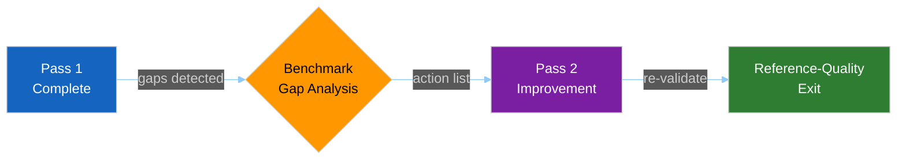

<!-- SPDX-FileCopyrightText: 2024-2026 Hack23 AB -->
<!-- SPDX-License-Identifier: Apache-2.0 -->

# 📏 Reference Analysis Quality Template — Benchmark Self-Score

> **📌 Template Instructions:** Copy to `analysis/daily/{date}/{article-type}-run{N}/intelligence/reference-analysis-quality.md`. Self-score this run against the reference benchmark (Run 184, 2026-04-18) plus Pass-2 action list. See [methodologies/per-artifact-methodologies.md §reference-analysis-quality](../methodologies/per-artifact-methodologies.md#reference-analysis-quality).

> **🎯 Purpose:** Mandatory quality gate comparing current run to the gold-standard reference. Identifies gaps and provides concrete Pass-2 improvement targets.

---

## 📋 Document Metadata

| Field | Value |
|-------|-------|
| **Report ID** | `[REQUIRED: RAQ-YYYY-MM-DD-runNN]` |
| **Current Run** | `[REQUIRED: {type}-run{N}, YYYY-MM-DD]` |
| **Reference Benchmark** | `[REQUIRED: breaking-run184, 2026-04-18]` |
| **Pass Number** | `[REQUIRED: Pass 1 / Pass 2]` |
| **Benchmark Met?** | `[REQUIRED: ✅ Yes / ⚠️ Partial / ❌ No]` |

---

## 1️⃣ Per-Artifact Line Count vs. Depth Floor

| Artifact (run-relative path) | Depth Floor | Actual Lines | Delta | Status |
|------------------------------|:-----------:|:------------:|:-----:|:------:|
| `intelligence/synthesis-summary.md` | 205 | `[#]` | `[±#]` | `[✅/⚠️/❌]` |
| `intelligence/analysis-index.md` | 160 | `[#]` | `[±#]` | `[✅/⚠️/❌]` |
| `intelligence/voting-patterns.md` | 150 | `[#]` | `[±#]` | `[✅/⚠️/❌]` |
| `intelligence/coalition-dynamics.md` | 135 | `[#]` | `[±#]` | `[✅/⚠️/❌]` |
| `intelligence/stakeholder-map.md` | 305 | `[#]` | `[±#]` | `[✅/⚠️/❌]` |
| `intelligence/scenario-forecast.md` | 280 | `[#]` | `[±#]` | `[✅/⚠️/❌]` |
| `intelligence/pestle-analysis.md` | 250 | `[#]` | `[±#]` | `[✅/⚠️/❌]` |
| `intelligence/threat-model.md` | 250 | `[#]` | `[±#]` | `[✅/⚠️/❌]` |
| `intelligence/economic-context.md` | 185 | `[#]` | `[±#]` | `[✅/⚠️/❌]` |
| `intelligence/historical-baseline.md` | 190 | `[#]` | `[±#]` | `[✅/⚠️/❌]` |
| `intelligence/mcp-reliability-audit.md` | 385 | `[#]` | `[±#]` | `[✅/⚠️/❌]` |
| `risk-scoring/risk-matrix.md` | 150 | `[#]` | `[±#]` | `[✅/⚠️/❌]` |
| `risk-scoring/quantitative-swot.md` | 140 | `[#]` | `[±#]` | `[✅/⚠️/❌]` |
| `intelligence/cross-run-diff.md` | 100 | `[#]` | `[±#]` | `[✅/⚠️/❌]` |
| `intelligence/workflow-audit.md` | 100 | `[#]` | `[±#]` | `[✅/⚠️/❌]` |

> **Note:** Floors above are the `breaking` defaults. For other article types, consult `analysis/methodologies/reference-quality-thresholds.json` — the validator keys floors by run-relative path (e.g. `intelligence/synthesis-summary.md`, `risk-scoring/risk-matrix.md`).

**Status definitions:**
- ✅ At or above floor
- ⚠️ Within 10% of floor (acceptable with LOW confidence marker)
- ❌ Below 90% of floor (breaking failure)

**Artifacts below floor:** `[REQUIRED: count or "none"]`

---

## 2️⃣ Per-Artifact Mermaid Presence & Theme Compliance

| Artifact | Mermaid Required? | Count Present | Theme Init Block? | Status |
|----------|:-----------------:|:-------------:|:-----------------:|:------:|
| `synthesis-summary.md` | Yes (≥2) | `[#]` | `[✅/❌]` | `[✅/⚠️/❌]` |
| `voting-patterns.md` | Yes (≥1) | `[#]` | `[✅/❌]` | `[✅/⚠️/❌]` |
| `coalition-dynamics.md` | Yes (≥1) | `[#]` | `[✅/❌]` | `[✅/⚠️/❌]` |
| `stakeholder-map.md` | Yes (≥1) | `[#]` | `[✅/❌]` | `[✅/⚠️/❌]` |
| `scenario-forecast.md` | Yes (≥1) | `[#]` | `[✅/❌]` | `[✅/⚠️/❌]` |
| `pestle-analysis.md` | Yes (≥1) | `[#]` | `[✅/❌]` | `[✅/⚠️/❌]` |
| `threat-model.md` | Yes (≥2) | `[#]` | `[✅/❌]` | `[✅/⚠️/❌]` |
| `risk-matrix.md` | Yes (≥1) | `[#]` | `[✅/❌]` | `[✅/⚠️/❌]` |
| `quantitative-swot.md` | Yes (≥1) | `[#]` | `[✅/❌]` | `[✅/⚠️/❌]` |
| `historical-baseline.md` | Yes (≥1) | `[#]` | `[✅/❌]` | `[✅/⚠️/❌]` |
| `wildcards-blackswans.md` | Yes (≥1) | `[#]` | `[✅/❌]` | `[✅/⚠️/❌]` |

**Mermaid failures:** `[REQUIRED: list artifacts missing required diagrams or missing theme init block]`

**Theme compliance check:**

```
%%{init: {"theme":"dark","themeVariables":{...}}}%%
```

`[REQUIRED: ✅ All diagrams use standard theme block / ❌ Some diagrams missing theme]`

---

## 3️⃣ Per-Artifact Evidence-Density Score

**Methodology:** Count citations per 100 lines (procedure IDs, RCV IDs, document IDs, indicator codes, MEP names with roles).

| Artifact | Lines | Citations | Citations/100L | Benchmark Target | Status |
|----------|:-----:|:---------:|:--------------:|:----------------:|:------:|
| `synthesis-summary.md` | `[#]` | `[#]` | `[#.#]` | ≥3.0 | `[✅/⚠️/❌]` |
| `voting-patterns.md` | `[#]` | `[#]` | `[#.#]` | ≥3.5 | `[✅/⚠️/❌]` |
| `stakeholder-map.md` | `[#]` | `[#]` | `[#.#]` | ≥4.0 | `[✅/⚠️/❌]` |
| `scenario-forecast.md` | `[#]` | `[#]` | `[#.#]` | ≥2.5 | `[✅/⚠️/❌]` |
| `threat-model.md` | `[#]` | `[#]` | `[#.#]` | ≥3.0 | `[✅/⚠️/❌]` |
| `economic-context.md` | `[#]` | `[#]` | `[#.#]` | ≥5.0 | `[✅/⚠️/❌]` |
| `risk-matrix.md` | `[#]` | `[#]` | `[#.#]` | ≥2.0 | `[✅/⚠️/❌]` |

**Artifacts below benchmark:** `[REQUIRED: count or "none"]`

---

## 4️⃣ Benchmark Gap Narrative

`[REQUIRED: ≥100 words identifying the run's weakest artifacts and why they fall short of reference quality. Examples:
- "stakeholder-map.md at 260 lines (floor 305) — quadrant narratives are 80 words each instead of required ≥150"
- "economic-context.md missing IMF forward projections — cites only backward-looking historical data; IMF is the Wave-3 mandatory primary source"
- "threat-model.md attack tree has only 2 levels instead of required ≥3"
- "synthesis-summary.md forward monitors lack date-bounded trigger events"

For each gap, cite the specific methodology requirement and the reference-run example that demonstrates compliance.]`

**Gap summary table:**

| Artifact | Gap Type | Severity | Reference Example |
|----------|----------|:--------:|-------------------|
| `[REQUIRED: artifact name]` | `[REQUIRED: Line count / Evidence / Mermaid / Section depth]` | `[🟢 Minor / 🟡 Moderate / 🔴 Breaking]` | `[REQUIRED: cite reference-run section or line]` |
| `[REQUIRED]` | `[REQUIRED]` | `[...]` | `[REQUIRED]` |
| `[REQUIRED]` | `[REQUIRED]` | `[...]` | `[REQUIRED]` |

---

## 5️⃣ Pass-2 Action List



**Specific actions for Pass 2:**

1. **`[REQUIRED: Artifact name]` · `[REQUIRED: Section name]`**  
   Action: `[REQUIRED: ≥40 words describing exactly what to add, expand, or revise. Must be concrete enough that Pass 2 can execute without re-reading the entire file. Examples: "Expand stakeholder-map.md §4.2 Champions quadrant from 80 to ≥150 words by adding named MEPs with committee roles", "Add missing IMF WEO projection table to economic-context.md §4 covering 2025-2029".]`

2. **`[REQUIRED: Artifact name]` · `[REQUIRED: Section name]`**  
   Action: `[REQUIRED: ≥40 words]`

3. **`[REQUIRED]`**  
   Action: `[REQUIRED]`

4. **`[REQUIRED]`**  
   Action: `[REQUIRED]`

5. **`[REQUIRED]`**  
   Action: `[REQUIRED]`

**Total actions:** `[REQUIRED: count — typically 5-15 for a Pass-1 run]`

**Estimated Pass-2 time:** `[REQUIRED: HH:MM based on action complexity]`

---

## 6️⃣ Reference-Run Comparison

**Run 184 metrics (benchmark):**

| Metric | Run 184 | This Run | Delta |
|--------|:-------:|:--------:|:-----:|
| Total artifacts produced | 18 | `[#]` | `[±#]` |
| Artifacts meeting depth floor | 18 (100%) | `[#]` | `[±#]` |
| Total line count (all artifacts) | 4,872 | `[#]` | `[±#]` |
| Mermaid diagrams | 26 | `[#]` | `[±#]` |
| Evidence citations | 187 | `[#]` | `[±#]` |
| Average citations/100L | 3.84 | `[#.#]` | `[±#.#]` |

**What Run 184 did exceptionally well:**

`[REQUIRED: ≥80 words highlighting 2-3 specific strengths of the reference run that this run should emulate. Examples: "Run 184 stakeholder-map.md included movement-since-prior-period analysis with ≥5 actors tracked across runs", "Run 184 synthesis-summary.md had 8 forward monitors with specific date triggers, not generic 'watch for...' statements".]`

---

## 7️⃣ Validator Output Integration

**Automated validator findings:**

`[REQUIRED: If an automated validator was run (checking depth floors, Mermaid presence, citation counts), paste or summarize its output here. If no validator was run, note "manual validation only".]`

**Validator failures addressed:** `[REQUIRED: count or "none"]`  
**Validator warnings acknowledged:** `[REQUIRED: count or "none"]`

---

## 8️⃣ Confidence Assessment

**Overall reference-quality confidence:** `[REQUIRED: 🟢 HIGH / 🟡 MEDIUM / 🔴 LOW]`

**Confidence rationale:** `[REQUIRED: ≥60 words explaining whether this run meets, approaches, or falls short of reference quality. If LOW, what are the 2-3 most severe gaps?]`

---

**Document Control:** `/analysis/daily/{date}/{type}-run{N}/intelligence/reference-analysis-quality.md` · Template v1.0 · Depth floor: 190 lines.
