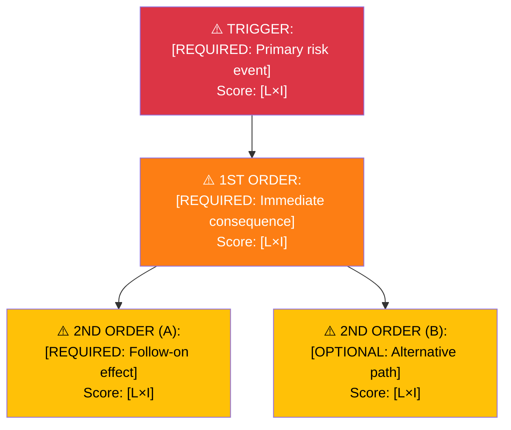
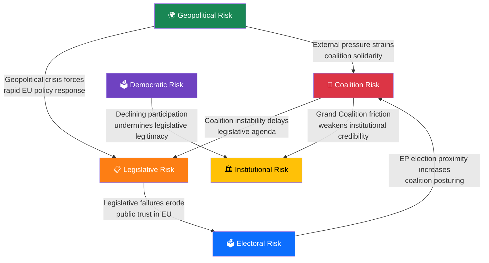

<!-- SPDX-FileCopyrightText: 2024-2026 Hack23 AB -->
<!-- SPDX-License-Identifier: Apache-2.0 -->

# ⚠️ Political Risk Assessment Template — European Parliament

> **📌 Template Instructions:** Copy to `analysis/YYYY-MM-DD/{article-type-slug}/` and name `risk-assessment.md`. Scores use Likelihood × Impact methodology from [methodologies/political-risk-methodology.md](../methodologies/political-risk-methodology.md). The AI agent MUST fill ALL `[REQUIRED]` fields using MCP data (in `analysis/YYYY-MM-DD/{article-type-slug}/data/`).

> **🚨 Anti-Pattern Warning:** Generic risk statements like "medium risk" or "various challenges" without specific Likelihood × Impact scores, EP document evidence, or calibration are REJECTED. Every risk MUST have a quantified L×I score with cited evidence. See [methodologies/ai-driven-analysis-guide.md](../methodologies/ai-driven-analysis-guide.md) for quality requirements. **Never use scripted boilerplate — AI must analyse the actual data.**

---

## 📋 Risk Context

| Field | Value |
|-------|-------|
| **Risk Assessment ID** | `[REQUIRED: RSK-YYYY-MM-DD-NNN]` |
| **Assessment Date** | `[REQUIRED: YYYY-MM-DD HH:MM UTC]` |
| **Assessment Period** | `[REQUIRED: e.g. "2026-03-28 to 2026-04-04"]` |
| **Produced By** | `[REQUIRED: workflow name]` |
| **Political Context** | `[REQUIRED: 2–3 sentences on current EP situation — grand coalition status, pending votes, recent crises]` |
| **Parliamentary Term** | `[REQUIRED: e.g. 2024-2029]` |
| **Overall Risk Level** | `[REQUIRED: LOW / MEDIUM / HIGH / CRITICAL]` |

---

## 🗂️ Risk Inventory

Risk Score = Likelihood (1–5) × Impact (1–5).

```
Risk Tiers:  1–4 = Low 🟢  |  5–9 = Medium 🟡  |  10–14 = High 🟠  |  15–25 = Critical 🔴
```

| Risk ID | Description | Likelihood (1–5) | Impact (1–5) | Risk Score | Tier | Mitigation |
|---------|-------------|:----------------:|:------------:|:----------:|------|------------|
| `RSK-001` | `[REQUIRED: e.g. "Grand coalition fracture on migration pact vote"]` | `[#]` | `[#]` | `[L×I]` | `[🟢/🟡/🟠/🔴]` | `[REQUIRED: 1 sentence]` |
| `RSK-002` | `[REQUIRED]` | `[#]` | `[#]` | `[L×I]` | `[tier]` | `[REQUIRED]` |
| `RSK-003` | `[OPTIONAL]` | `[#]` | `[#]` | `[L×I]` | `[tier]` | `[OPTIONAL]` |
| `RSK-004` | `[OPTIONAL]` | `[#]` | `[#]` | `[L×I]` | `[tier]` | `[OPTIONAL]` |
| `RSK-005` | `[OPTIONAL]` | `[#]` | `[#]` | `[L×I]` | `[tier]` | `[OPTIONAL]` |

---

## 🤝 Grand Coalition Stability Risk

### Current Coalition Assessment

| Parameter | Value |
|-----------|-------|
| **Grand Coalition** | `[REQUIRED: e.g. "EPP (188) + S&D (136) + Renew (77) = 401 seats"]` |
| **Coalition Strength** | `[REQUIRED: HIGH / MEDIUM / LOW]` |
| **Majority Threshold** | `[REQUIRED: 361 of 720 seats]` |
| **Buffer** | `[REQUIRED: seats above 361]` |
| **Key Risk Groups** | `[REQUIRED: e.g. "ECR (78) as swing; PfE (76) opposition"]` |
| **Next Major Vote** | `[OPTIONAL: YYYY-MM-DD and subject]` |

### Coalition Risk Factors

| Factor | Status | Evidence (MCP data) | Risk Contribution |
|--------|--------|-------------------|-------------------|
| Internal policy disagreements | `[REQUIRED: Active/Latent/None]` | `[MCP tool output reference]` | `[HIGH/MED/LOW]` |
| EPP-S&D alignment on key files | `[REQUIRED]` | `[source]` | `[tier]` |
| Renew reliability | `[REQUIRED]` | `[source]` | `[tier]` |
| ECR cooperation dynamics | `[OPTIONAL]` | `[source]` | `[tier]` |
| National election spillovers | `[OPTIONAL]` | `[source]` | `[tier]` |

---

## 📋 Policy Implementation Risk

| Policy/File | Committee | Stage | Risk Level | Blocking Factor |
|-------------|----------|-------|------------|-----------------|
| `[REQUIRED: legislative file name]` | `[REQUIRED: e.g. ENVI]` | `[REQUIRED: e.g. Trilogue]` | `[🟢/🟡/🟠/🔴]` | `[REQUIRED]` |
| `[OPTIONAL]` | `[OPTIONAL]` | `[OPTIONAL]` | `[tier]` | `[OPTIONAL]` |

---

## 💰 EU Budget & MFF Risk

| Parameter | Value |
|-----------|-------|
| **MFF Period** | `[REQUIRED: e.g. 2021-2027]` |
| **Budget Authority Status** | `[REQUIRED: e.g. "Annual budget 2026 adopted"]` |
| **Key Budget Risks** | `[REQUIRED: 2–3 bullet points from MCP data]` |
| **Budget Risk Level** | `[REQUIRED: LOW / MEDIUM / HIGH / CRITICAL]` |

---

## 🌍 Geopolitical Risk

| Geopolitical Event | Likelihood | Impact | Score | EP Dimension |
|-------------------|:----------:|:------:|:-----:|-------------|
| `[REQUIRED: e.g. "EU-China trade tensions"]` | `[#]` | `[#]` | `[L×I]` | `[AFET/INTA]` |
| `[OPTIONAL]` | `[#]` | `[#]` | `[L×I]` | `[committee]` |

---

## 🔑 Risk Summary & Recommendations

### Top 3 Risks This Period

1. **[Risk ID]:** `[Name]` — Score `[N]` — `[1-sentence summary]`
2. **[Risk ID]:** `[Name]` — Score `[N]` — `[1-sentence summary]`
3. **[Risk ID]:** `[Name]` — Score `[N]` — `[1-sentence summary]`

### Recommended Actions

- `[REQUIRED: specific monitoring or editorial action based on MCP data]`
- `[REQUIRED: specific monitoring or editorial action]`
- `[OPTIONAL]`

### MCP Data Files Used

```
[REQUIRED: List all analysis/YYYY-MM-DD/{article-type-slug}/data/ files consulted for this assessment]
```

---

## ⚡ Cascading Risk Chain

> **AI Instructions:** For the highest-scoring risk, trace the cascade of second-order and third-order effects.



| Chain Stage | Risk Event | L | I | Score | Circuit Breaker |
|:-----------:|-----------|:-:|:-:|:-----:|----------------|
| Trigger | `[REQUIRED]` | `[#]` | `[#]` | `[#]` | `[What stops it here?]` |
| 1st Order | `[REQUIRED]` | `[#]` | `[#]` | `[#]` | `[Intervention point]` |
| 2nd Order | `[REQUIRED]` | `[#]` | `[#]` | `[#]` | `[Recovery action]` |

---

## 🌐 Risk Interconnection Map

> **AI Instructions:** Show how the 6 EP risk dimensions affect each other.



| From → To | Connection Strength | Mechanism | Evidence |
|:---------:|:-------------------:|-----------|---------|
| Coalition → Legislative | `[Strong/Medium/Weak]` | `[REQUIRED: How coalition instability delays EP legislative agenda]` | `[EP procedure ref]` |
| Coalition → Institutional | `[Strong/Medium/Weak]` | `[REQUIRED: How Grand Coalition friction affects EU institutional credibility]` | `[EP resolution ref]` |
| Legislative → Electoral | `[Strong/Medium/Weak]` | `[REQUIRED: How legislative failures affect EU elections]` | `[Eurobarometer data]` |
| Geopolitical → Coalition | `[Strong/Medium/Weak]` | `[REQUIRED: How external pressure strains coalition]` | `[EU Council position]` |

**System fragility assessment:** `[REQUIRED: Are ≥3 risk dimensions at High level? If so, system is fragile — describe why.]`

---

## 🔮 Forward Indicators & Scenario Outlook

| Scenario | Probability | Key Trigger | Risk Dimensions Affected |
|----------|:----------:|------------|-------------------------|
| `[REQUIRED: Most likely outcome]` | `[%]` | `[Specific EP trigger]` | `[Coalition + Legislative + ...]` |
| `[REQUIRED: Alternative outcome]` | `[%]` | `[Specific EP trigger]` | `[Risk dimensions]` |
| `[OPTIONAL: Worst case]` | `[%]` | `[Specific EP trigger]` | `[Risk dimensions]` |

### Freshness Requirements

| Risk Tier | Maximum Age Before Re-evaluation |
|:---------:|:-------------------------------:|
| 🔴 Critical (15–25) | **24 hours** — must be re-assessed daily |
| 🟠 High (10–14) | **72 hours** — re-assess within 3 days |
| 🟡 Medium (5–9) | **7 days** — re-assess weekly |
| 🟢 Low (1–4) | **30 days** — re-assess monthly |

### When to Escalate from Risk Register to Breaking Analysis

| Condition | Action |
|-----------|--------|
| Any risk score increases from ≤14 to ≥15 (crosses into Critical) | Trigger breaking risk assessment; notify editorial |
| ≥ 3 risks simultaneously in High tier | Elevate overall risk level; flag in daily synthesis |
| Grand Coalition collapse probability moves from LOW to MEDIUM or HIGH | Immediate re-assessment of all coalition-related risks |
| Plenary vote approaches with unresolved High risk | Pre-position breaking analysis template |
