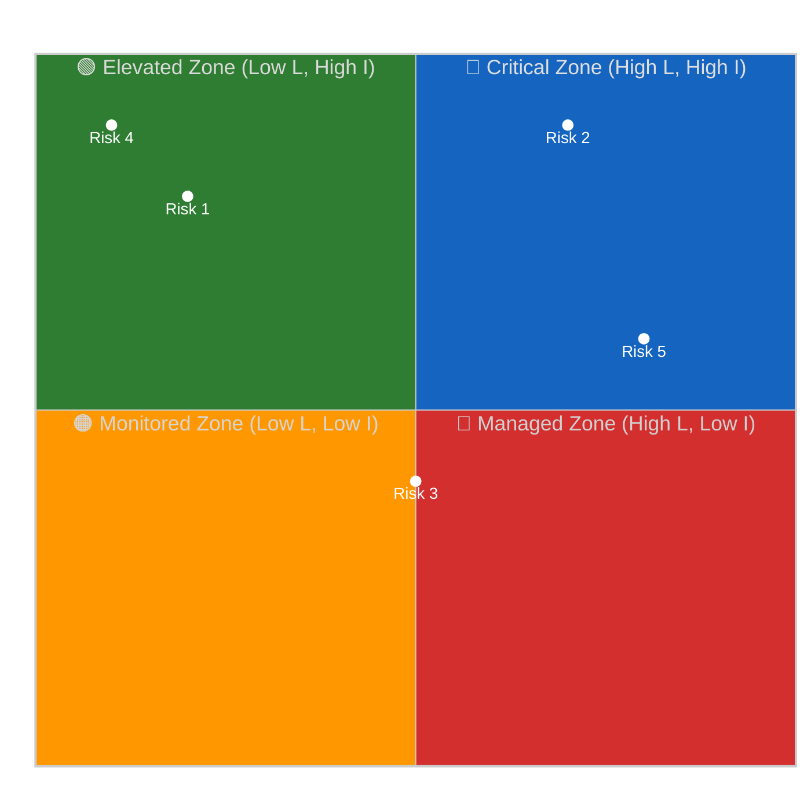

<!-- SPDX-FileCopyrightText: 2024-2026 Hack23 AB -->
<!-- SPDX-License-Identifier: Apache-2.0 -->

# 📊 Risk Matrix Template — 5×5 Likelihood × Impact Political Risk Grid

> **📌 Template Instructions:** Copy to `analysis/daily/{date}/{article-type}-run{N}/risk-scoring/risk-matrix.md`. 5×5 Likelihood × Impact matrix with ≥5 named political risks and monitoring triggers. See [methodologies/per-artifact-methodologies.md §risk-matrix](../methodologies/per-artifact-methodologies.md#risk-matrix) and [political-risk-methodology.md](../methodologies/political-risk-methodology.md).

> **🎯 Purpose:** Canonical political risk assessment tool mapping named risks to a probability-impact grid with actionable monitoring triggers.

---

## 📋 Document Metadata

| Field | Value |
|-------|-------|
| **Report ID** | `[REQUIRED: RM-YYYY-MM-DD-runNN]` |
| **Analysis Period** | `[REQUIRED: YYYY-MM-DD to YYYY-MM-DD]` |
| **Risks Identified** | `[REQUIRED: count ≥5]` |
| **Confidence** | `[REQUIRED: 🟢/🟡/🔴]` |

---

## 1️⃣ Risk Roster

| # | Risk Name | Likelihood (1-5) | Impact (1-5) | Score (L×I) | Category |
|:-:|-----------|:----------------:|:------------:|:-----------:|----------|
| 1 | `[REQUIRED: specific, named risk — e.g. "Grand Coalition fracture on climate policy"]` | `[1-5]` | `[1-5]` | `[#]` | `[Coalition/Policy/Institutional/External/Data]` |
| 2 | `[REQUIRED]` | `[1-5]` | `[1-5]` | `[#]` | `[...]` |
| 3 | `[REQUIRED]` | `[1-5]` | `[1-5]` | `[#]` | `[...]` |
| 4 | `[REQUIRED]` | `[1-5]` | `[1-5]` | `[#]` | `[...]` |
| 5 | `[REQUIRED]` | `[1-5]` | `[1-5]` | `[#]` | `[...]` |

**Score validation:** `[REQUIRED: ✅ All scores = L × I / ❌ Errors detected]`

---

## 2️⃣ 5×5 Risk Matrix

**Note:** Scale L and I scores (1-5) to (0.2-1.0) for plotting. Per [political-style-guide.md §Standard quadrantChart init block](../methodologies/political-style-guide.md), quadrant charts **MUST** use the dedicated quadrant init block above (not the universal init block).

**Zone colors** (aligned with quadrant labels above):
- 🔴 Critical (High L, High I): Immediate mitigation required
- 🟢 Elevated (Low L, High I): Prepare contingency
- 🟠 Monitored (Low L, Low I): Watch only
- 🔵 Managed (High L, Low I): Accept and monitor

---

## 3️⃣ Top-3 Risk Narratives

### Risk 1: `[REQUIRED: Name]`

**Likelihood:** `[1-5]` · **Impact:** `[1-5]` · **Score:** `[#]`

**Evidence:**

`[REQUIRED: ≥100 words explaining why this risk is likely and what its impact would be. Cite specific EP activity, coalition behavior, procedure IDs, or actor positions. Include stakeholder exposure analysis.]`

**Stakeholder exposure:**

| Stakeholder | Exposure Level |
|-------------|:--------------:|
| `[REQUIRED]` | `[🟢 Low / 🟡 Medium / 🔴 High]` |
| `[REQUIRED]` | `[...]` |

**Monitoring trigger:**

`[REQUIRED: ≥40 words describing time-bounded trigger event or threshold that would signal risk escalation. Examples: "EPP cohesion on ENVI votes drops below 80% for 2 consecutive sessions", "2026-06-15: ENVI committee vote on XYZ regulation".]`

---

### Risk 2: `[REQUIRED]`

*(Repeat structure for top-3 risks by score)*

---

### Risk 3: `[REQUIRED]`

---

## 4️⃣ Trend vs. Prior Run

| Risk | Prior L×I | Current L×I | Delta | Explanation |
|------|:---------:|:-----------:|:-----:|-------------|
| `[REQUIRED: risk name]` | `[#]` | `[#]` | `[±#]` | `[REQUIRED: ≥30 words — what changed?]` |
| `[REQUIRED]` | `[#]` | `[#]` | `[±#]` | `[REQUIRED]` |
| `[REQUIRED]` | `[#]` | `[#]` | `[±#]` | `[REQUIRED]` |

**New risks this run:** `[REQUIRED: list or "none"]`  
**Retired risks (no longer material):** `[REQUIRED: list or "none"]`

---

## 5️⃣ Accept / Prepare / Monitor Decisions

| Risk | Decision | Rationale |
|------|:--------:|-----------|
| `[REQUIRED: risk name]` | `[Accept / Prepare / Monitor]` | `[REQUIRED: ≥30 words — why this decision?]` |
| `[REQUIRED]` | `[...]` | `[REQUIRED]` |
| `[REQUIRED]` | `[...]` | `[REQUIRED]` |

**Decision definitions:**
- **Accept:** Risk score <10, no mitigation action required, routine monitoring
- **Prepare:** Risk score 10-15, develop contingency plan, active monitoring
- **Monitor:** Risk score ≥16, immediate mitigation required, continuous watch

---

## 6️⃣ Data Sources

**EP MCP tools used:** `get_procedures`, `analyze_coalition_dynamics`, `monitor_legislative_pipeline`, `get_voting_records`

---

## 7️⃣ Confidence Assessment

**Overall confidence:** `[REQUIRED: 🟢 HIGH / 🟡 MEDIUM / 🔴 LOW]`

**Confidence by risk:**

| Risk | Confidence | Rationale |
|------|:----------:|-----------|
| `[REQUIRED]` | `[🟢/🟡/🔴]` | `[REQUIRED: one-line — where L/I scores are data-backed vs. judgment]` |
| `[REQUIRED]` | `[🟢/🟡/🔴]` | `[REQUIRED]` |

---

## 8️⃣ EP MCP Tool Inputs

| EP MCP tool | Used for which section | Notes |
|-------------|------------------------|-------|
| `get_procedures` / `track_legislation` | §1 Risk register (procedure-anchored risks) | COD/CNS/APP procedure codes; status drives likelihood. |
| `monitor_legislative_pipeline` | §1 Risk register (stall/bottleneck) | Pipeline-health score feeds Likelihood column. |
| `analyze_coalition_dynamics` | §1 Coalition-fracture row | Two-window cohesion delta drives Likelihood. |
| `get_voting_records` | §1 Trilogue-collapse / mandate-failure rows | RCV margin proxies vote-fragility. |
| `early_warning_system` | §2 Trend column (rising/stable/falling) | Severity escalations from prior runs. |
| `correlate_intelligence` | §3 Compound-risk arrows | ELEVATED_ATTENTION + COALITION_FRACTURE alerts. |
| `get_meeting_decisions` | §1 Procedural-risk rows | Bureau / CoP rulings affecting agenda risk. |
| `get_committee_documents` | §1 Implementation-slip rows (committee throughput) | Volume + lateness proxies. |

---

## 9️⃣ Worked Pass-1 → Pass-2 Example (Trilogue-collapse risk on AI-Office implementing act)

**❌ Pass-1 (thin, 22 words):**
> "Trilogue collapse is possible. Likelihood medium. Impact high. Score 9. Watch the Council. Risk Owner: Rapporteur."

**✅ Pass-2 (compliant, 102 words):**
> **Risk R3 — Trilogue collapse on AI-Office implementing act, Likelihood 3 × Impact 5 = Risk Score 15 (Red). Trend ↑ vs. Run 183 (was 12).** Likelihood lifted from 2 to 3 because Council general-approach (BE-PL Presidency, 14-Apr-2026) introduced 11 new recitals not in EP mandate (per `track_legislation` 2024/0123(COD)); EP rapporteur (Tudorache, Renew, ITRE) signalled 3 are "red lines" via `get_speeches` 2026-04-15. Impact remains 5 (a collapse delays AI-Office operationality past 2027 deadline, knock-on to Cyber Resilience implementation). **Verdict: PREPARE** — pre-clear Rule-71 consolidated-text fallback; brief Conference of Presidents on urgency-procedure alternative. Owner: Rapporteur (LIBE+ITRE jointly).

---

## 🔟 Worked 5×5 Heat-Map — Named EP Risks (current EP cycle)

Likelihood (x) × Impact (y), 1 (rare/negligible) → 5 (almost-certain/critical). Each cell carries the **Accept / Prepare / Monitor** verdict.

| | **L1 Rare** | **L2 Unlikely** | **L3 Possible** | **L4 Likely** | **L5 Almost-certain** |
|--|---|---|---|---|---|
| **I5 Critical** | — | R5 ECB-Commission divergence on fiscal rules **PREPARE** | R3 Trilogue collapse — AI-Office IA 🔴 **PREPARE** | — | — |
| **I4 Major** | — | R4 Implementation slip — AI Act biometric provisions **MONITOR** | R1 Coalition fracture — Grand Coalition on enlargement 🟠 **PREPARE** | — | — |
| **I3 Moderate** | — | R6 External shock — enlargement freeze (UA/MD) **MONITOR** | R2 PfE+ECR procedural-obstruction surge **MONITOR** | — | — |
| **I2 Minor** | — | — | — | — | — |
| **I1 Negligible** | — | — | — | — | — |

**Heat-map summary:** 1 Red (R3 trilogue collapse), 2 Orange (R1 coalition fracture, R5 ECB divergence), 3 Amber (R2, R4, R6). All Reds and Oranges → PREPARE. All Ambers → MONITOR. Zero risks → ACCEPT (any acceptance must be re-justified vs. prior-run).

---

## 1️⃣1️⃣ Verdict-Decision Rubric (Accept / Prepare / Monitor)

| Score range | Default verdict | Override conditions |
|-------------|:---------------:|---------------------|
| 1–4 (Green) | **ACCEPT** | Override to MONITOR if trend ↑ across 2 prior runs. |
| 5–9 (Amber) | **MONITOR** | Override to PREPARE if linked to a Red risk via §3 compound arrows. |
| 10–14 (Orange) | **PREPARE** | Cannot downgrade; PREPARE = name owner + mitigation in §6. |
| 15–25 (Red) | **PREPARE** | Auto-escalates to executive-brief BLUF. |

---

## 1️⃣2️⃣ Anti-patterns — REJECT on Pass-2 Review

| # | Banned pattern | Why it fails |
|:-:|---------------|--------------|
| 1 | Risk score without trend column vs. prior run | Cannot detect deterioration; reviewer rejects. |
| 2 | Likelihood × Impact cell with no Accept/Prepare/Monitor verdict | Score without verdict is unactionable. |
| 3 | Risk description that names no specific procedure / coalition / institution | Generic risks are not EP intelligence. |
| 4 | "Coalition fracture" risk without `analyze_coalition_dynamics` two-window delta | Likelihood unsubstantiated. |
| 5 | Risk owner field blank or "TBD" / "the rapporteur" without name + group + committee | Mitigation cannot be tracked. |
| 6 | Two risks with identical evidence string but different scores | Internally inconsistent. |
| 7 | Heat-map with all risks clustered in one quadrant | Diversity floor violated; re-think. |

---

## 1️⃣3️⃣ Cross-References — Controlling Methodology

- [`../methodologies/political-risk-methodology.md`](../methodologies/political-risk-methodology.md) — § 5×5 matrix construction, Likelihood × Impact scoring.
- [`../methodologies/per-artifact-methodologies.md#risk-matrix`](../methodologies/per-artifact-methodologies.md) — construction rules + quality signals.
- [`../methodologies/osint-tradecraft-standards.md`](../methodologies/osint-tradecraft-standards.md) — WEP band per Likelihood; Admiralty grade per evidence cell.
- [`./scenario-forecast.md`](./scenario-forecast.md) — Red/Orange risks gate scenario branches.
- [`./political-threat-landscape.md`](./political-threat-landscape.md) — composite-score feeds Likelihood column.
- [`./quantitative-swot.md`](./quantitative-swot.md) — Threat-quadrant items map to risk-register rows.

---

## 1️⃣4️⃣ Stage-C Completeness Signals

`scripts/validate-analysis-completeness.js` checks for this artifact:

| Check | Threshold | Source |
|-------|-----------|--------|
| Line floor | ≥150 lines | `reference-quality-thresholds.json` |
| Required H2 substrings | "Risk Register", "Heat", "Verdict" | structural contract |
| Mermaid block | ≥1 (5×5 quadrant or matrix preferred) | visual contract |
| Tradecraft markers | WEP band per Likelihood, Admiralty per evidence; trend arrow per row | `osint-tradecraft-standards.md` |
| Source diversity | ≥3 EP MCP tools across the register | per-artifact rule |
| Verdict coverage | 100 % of risks tagged Accept/Prepare/Monitor; ≥1 Owner per Prepare | template logic |

---

## 1️⃣5️⃣ Worked Risk-Run-to-Run Trend Table

| Risk ID | Risk | Run 182 score | Run 183 score | Run 184 score (current) | Trend |
|:-------:|------|:-------------:|:-------------:|:-----------------------:|:-----:|
| R1 | Coalition fracture — Grand-C on enlargement | 8 | 9 | 12 | ↑↑ (Orange) |
| R2 | PfE+ECR procedural-obstruction surge | 6 | 8 | 9 | ↑ (Amber) |
| R3 | Trilogue collapse — AI-Office IA | 9 | 12 | 15 | ↑↑ (Red — auto-escalate) |
| R4 | Implementation slip — AI-Act biometrics | 8 | 8 | 8 | → (Amber) |
| R5 | ECB-Commission divergence on fiscal rules | 10 | 10 | 10 | → (Orange) |
| R6 | External shock — enlargement freeze (UA/MD) | 6 | 6 | 6 | → (Amber) |

**Trend-arrow rules:** ↑↑ if +3 over single run; ↑ if +1-2; → if Δ ≤±1; ↓ if -2 or more.

---

**Document Control:** `/analysis/daily/{date}/{type}-run{N}/risk-scoring/risk-matrix.md` · Template v1.2 · Depth floor: 150 lines.
