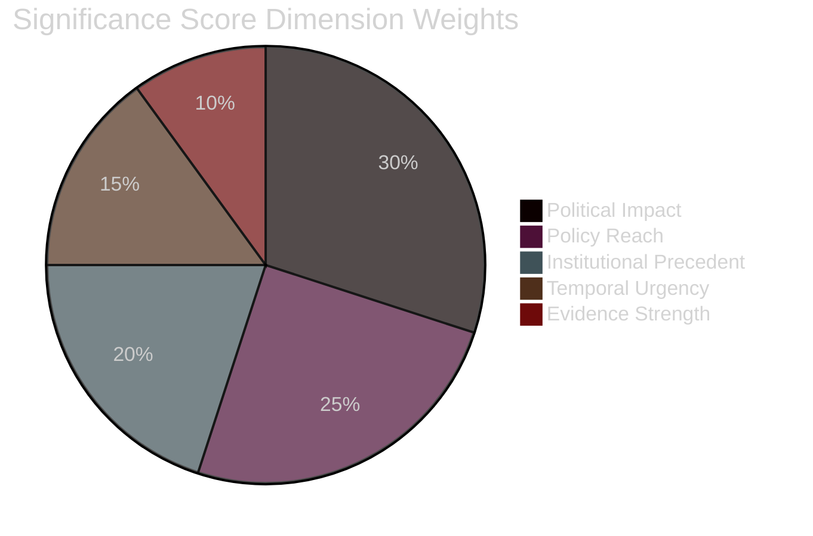

<!-- SPDX-FileCopyrightText: 2024-2026 Hack23 AB -->
<!-- SPDX-License-Identifier: Apache-2.0 -->

# 🏷️ Significance Classification Template — 5-Dimension Significance Rubric

> **📌 Template Instructions:** Copy to `analysis/daily/{date}/{article-type}-run{N}/classification/significance-classification.md`. Apply 5-dimension composite significance score per candidate item with publish/withhold decision. See [methodologies/per-artifact-methodologies.md §significance-classification](../methodologies/per-artifact-methodologies.md#significance-classification) (identical to §significance-scoring).

> **🎯 Purpose:** Structured scoring rubric determining which events/documents merit publication. Transparent decision audit trail linking scores to evidence.

---

## 📋 Document Metadata

| Field | Value |
|-------|-------|
| **Report ID** | `[REQUIRED: SIG-YYYY-MM-DD-runNN]` |
| **Analysis Date** | `[REQUIRED: YYYY-MM-DD]` |
| **Items Scored** | `[REQUIRED: count]` |
| **Decision: Publish** | `[REQUIRED: count]` |
| **Decision: Hold** | `[REQUIRED: count]` |
| **Decision: Withhold** | `[REQUIRED: count]` |

---

## 1️⃣ Rubric Recap

**Five dimensions and weights** (per [`political-classification-guide.md §significance`](../methodologies/political-classification-guide.md)):

| Dimension | Weight | Definition |
|-----------|:------:|------------|
| **Political Impact** | 30% | `[REQUIRED: one-line — e.g. "Effect on coalition dynamics, power balance, or institutional function"]` |
| **Policy Reach** | 25% | `[REQUIRED: e.g. "Geographic/sectoral scope and affected populations"]` |
| **Institutional Precedent** | 20% | `[REQUIRED: e.g. "First-occurrence, rule-setting, or norm-shifting quality"]` |
| **Temporal Urgency** | 15% | `[REQUIRED: e.g. "Proximity to decision points or deadline pressure"]` |
| **Evidence Strength** | 10% | `[REQUIRED: e.g. "Availability of roll-call data, documents, or actor statements"]` |

**Composite score formula:**

```
Composite = (Political × 0.30) + (Policy × 0.25) + (Precedent × 0.20) + (Urgency × 0.15) + (Evidence × 0.10)
```

**Decision thresholds:**
- **Publish:** Composite ≥ 7.0
- **Hold:** Composite 5.0-6.9 (monitor for next run)
- **Withhold:** Composite < 5.0

---

## 2️⃣ Scoring Table

| # | Item ID | Title/Topic | Political | Policy | Precedent | Urgency | Evidence | Composite | Decision |
|:-:|---------|-------------|:---------:|:------:|:---------:|:-------:|:--------:|:---------:|:--------:|
| 1 | `[REQUIRED: e.g. TA-10-2026-0042]` | `[REQUIRED: first 60 chars]` | `[0-10]` | `[0-10]` | `[0-10]` | `[0-10]` | `[0-10]` | `[#.#]` | `[Publish/Hold/Withhold]` |
| 2 | `[REQUIRED]` | `[REQUIRED]` | `[0-10]` | `[0-10]` | `[0-10]` | `[0-10]` | `[0-10]` | `[#.#]` | `[...]` |
| 3 | `[REQUIRED]` | `[REQUIRED]` | `[0-10]` | `[0-10]` | `[0-10]` | `[0-10]` | `[0-10]` | `[#.#]` | `[...]` |
| 4 | `[REQUIRED]` | `[REQUIRED]` | `[0-10]` | `[0-10]` | `[0-10]` | `[0-10]` | `[0-10]` | `[#.#]` | `[...]` |
| 5 | `[REQUIRED]` | `[REQUIRED]` | `[0-10]` | `[0-10]` | `[0-10]` | `[0-10]` | `[0-10]` | `[#.#]` | `[...]` |

**Composite score validation:** `[REQUIRED: ✅ All composite scores match weighted formula / ❌ Errors detected]`

---

## 3️⃣ Top-Item Narrative

**Highest-scored item:** `[REQUIRED: Item ID + title]`  
**Composite score:** `[REQUIRED: #.#]`

### Per-Dimension Justification

**Political Impact (`[score]/10`):**

`[REQUIRED: ≥100 words explaining why this score was assigned. Which coalitions, actors, or institutional functions are affected? Cite specific evidence: roll-call vote IDs, named MEPs, committee positions, or procedural maneuvers.]`

**Policy Reach (`[score]/10`):**

`[REQUIRED: ≥100 words explaining geographic scope (member states affected), sectoral scope (industries, policy domains), and population exposure. Cite economic indicators, affected regulations, or institutional coverage where relevant.]`

**Institutional Precedent (`[score]/10`):**

`[REQUIRED: ≥100 words explaining whether this is a first-occurrence, a norm-setting event, or a precedent-breaking action. Compare to historical EP activity where relevant.]`

**Temporal Urgency (`[score]/10`):**

`[REQUIRED: ≥100 words explaining proximity to decision deadlines, upcoming plenary sessions, or external trigger events. Cite specific dates or procedural timelines.]`

**Evidence Strength (`[score]/10`):**

`[REQUIRED: ≥100 words explaining data quality. Are roll-call votes available? Are actor positions documented? Are procedural records complete? Where are gaps or inferences required?]`

---

## 4️⃣ Threshold Comparison

**Composite vs. 30-day median:**

| Period | Median Score | This Run's Top Score | Delta |
|--------|:------------:|:--------------------:|:-----:|
| 30-day window | `[#.#]` | `[#.#]` | `[±#.#]` |

**Composite vs. all-time top-5:**

| Rank | Item | Date | Score |
|:----:|------|:----:|:-----:|
| 1 | `[REQUIRED: Item ID + title from historical record]` | `[YYYY-MM-DD]` | `[#.#]` |
| 2 | `[REQUIRED]` | `[YYYY-MM-DD]` | `[#.#]` |
| 3 | `[REQUIRED]` | `[YYYY-MM-DD]` | `[#.#]` |
| 4 | `[REQUIRED]` | `[YYYY-MM-DD]` | `[#.#]` |
| 5 | `[REQUIRED]` | `[YYYY-MM-DD]` | `[#.#]` |
| **This run's top** | `[Item ID]` | `[YYYY-MM-DD]` | `[#.#]` |

**Interpretation:**

`[REQUIRED: ≥60 words explaining whether this run's top items are exceptionally significant, routine, or below baseline. What does their ranking tell us about the period's political intensity?]`

---

## 5️⃣ Decision Audit

### Publish Decisions

| Item ID | Composite | Rationale |
|---------|:---------:|-----------|
| `[REQUIRED]` | `[#.#]` | `[REQUIRED: ≥30 words explaining why this item clears the Publish threshold]` |
| `[REQUIRED]` | `[#.#]` | `[REQUIRED]` |
| `[REQUIRED]` | `[#.#]` | `[REQUIRED]` |

### Withhold Decisions

| Item ID | Composite | Rationale |
|---------|:---------:|-----------|
| `[REQUIRED]` | `[#.#]` | `[REQUIRED: ≥30 words explaining why this item falls below threshold — e.g. "Routine committee amendment with no coalition impact, low policy reach, no precedent value"]` |
| `[REQUIRED]` | `[#.#]` | `[REQUIRED]` |

### Hold Decisions (monitor for next run)

| Item ID | Composite | What to Monitor |
|---------|:---------:|-----------------|
| `[REQUIRED]` | `[#.#]` | `[REQUIRED: ≥30 words explaining what signals would elevate this to Publish threshold in next run]` |
| `[REQUIRED]` | `[#.#]` | `[REQUIRED]` |

---

## 6️⃣ Dimension Weight Visualization



---

## 7️⃣ Data Sources

**Items scored from:** `[REQUIRED: list EP MCP tools or data feeds used — e.g. get_adopted_texts, get_procedures, get_voting_records]`

**Historical comparison data:** `[REQUIRED: cite get_all_generated_stats or prior-run manifest files used for 30-day median and all-time top-5]`

---

## 8️⃣ Confidence Assessment

**Overall confidence:** `[REQUIRED: 🟢 HIGH / 🟡 MEDIUM / 🔴 LOW]`

**Confidence rationale:** `[REQUIRED: ≥60 words explaining where scores are data-backed (roll-call IDs, procedure citations) vs. expert judgment. Note any dimensions where evidence was thin.]`

---

**Document Control:** `/analysis/daily/{date}/{type}-run{N}/classification/significance-classification.md` · Template v1.1 · Depth floor: 105 lines.
