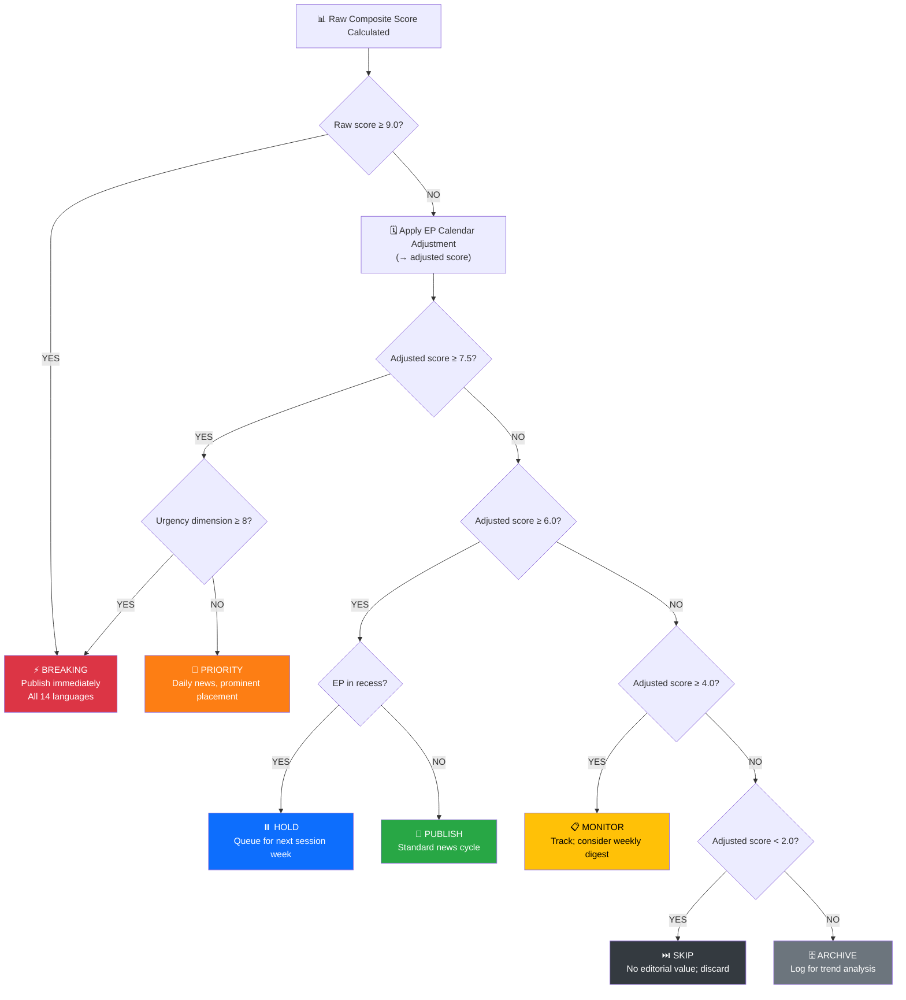

<!-- SPDX-FileCopyrightText: 2024-2026 Hack23 AB -->
<!-- SPDX-License-Identifier: Apache-2.0 -->

# 📈 Political Significance Scoring Template — European Parliament

> **📌 Template Instructions:** Copy to `analysis/YYYY-MM-DD/{article-type-slug}/` and name `significance-scoring.md`. The AI agent MUST score every significant EP event from the downloaded MCP data (in `analysis/YYYY-MM-DD/{article-type-slug}/data/`). Use this for publication prioritisation decisions.

> **🚨 Anti-Pattern Warning:** Significance scores without 5-dimension breakdowns and evidence citations are REJECTED. Every score MUST show: Political Impact (1–10) + Policy Significance (1–10) + Institutional Relevance (1–10) + Public Interest (1–10) + Temporal Urgency (1–10) = Composite (weighted average). See [methodologies/ai-driven-analysis-guide.md](../methodologies/ai-driven-analysis-guide.md) for quality requirements. **Never use scripted boilerplate — AI must analyse the actual data.**

---

## 📋 Event Context

| Field | Value |
|-------|-------|
| **Score ID** | `[REQUIRED: SIG-YYYY-MM-DD-NNN]` |
| **Event / Document** | `[REQUIRED: brief event name]` |
| **Primary EP Reference** | `[REQUIRED: procedure ID, adopted text ref, or MCP data file]` |
| **Scoring Date** | `[REQUIRED: YYYY-MM-DD HH:MM UTC]` |
| **Scored By** | `[REQUIRED: workflow name]` |
| **Classification ID** | `[OPTIONAL: CLS-ID if already classified]` |

---

## 📊 Section 1: Individual Event Scoring

Score each dimension from **0 to 10**.

### Dimension 1: Parliamentary Significance (0–10)

| Sub-criterion | Score (0–3) | Rationale |
|--------------|:-----------:|-----------|
| Legislative stage (Committee=1, Plenary 1st reading=2, Final adoption=3) | `[#]` | `[REQUIRED]` |
| Institutional dimension (routine=0, oversight=1, interinstitutional=2, Treaty=3) | `[#]` | `[REQUIRED]` |
| Number of MEPs involved (1–19=1, 20–99=2, 100+=3, all 720=3) | `[#]` | `[REQUIRED]` |

**Parliamentary Significance Score:** `[REQUIRED: normalised to 0–10]` /10

---

### Dimension 2: Policy Impact (0–10)

| Sub-criterion | Score (0–3) | Rationale |
|--------------|:-----------:|-----------|
| Scope (1=national, 2=EU-wide, 3=international) | `[#]` | `[REQUIRED]` |
| Duration (1=temporary, 2=multi-year, 3=permanent/structural) | `[#]` | `[REQUIRED]` |
| Affected population (1=<10M, 2=10M–200M, 3=>200M) | `[#]` | `[REQUIRED]` |

**Policy Impact Score:** `[REQUIRED: normalised to 0–10]` /10

---

### Dimension 3: Public Interest (0–10)

| Sub-criterion | Score (0–3) | Rationale |
|--------------|:-----------:|-----------|
| Topic salience (climate/migration/economy=3, niche=1) | `[#]` | `[REQUIRED]` |
| Controversy level (consensus=0, partisan=2, polarising=3) | `[#]` | `[REQUIRED]` |
| Citizen-facing impact (abstract=0, direct=3) | `[#]` | `[REQUIRED]` |

**Public Interest Score:** `[REQUIRED: normalised to 0–10]` /10

---

### Dimension 4: Urgency (0–10)

| Sub-criterion | Score (0–3) | Rationale |
|--------------|:-----------:|-----------|
| Time horizon (>30 days=0, 8–30 days=1, 2–7 days=2, <48h=3) | `[#]` | `[REQUIRED]` |
| Reversibility (easily reversed=0, difficult=2, irreversible=3) | `[#]` | `[REQUIRED]` |
| Cascade risk (isolated=0, single cascade=1, multiple=3) | `[#]` | `[REQUIRED]` |

**Urgency Score:** `[REQUIRED: normalised to 0–10]` /10

---

### Dimension 5: Cross-Group Relevance (0–10)

| Sub-criterion | Score (0–3) | Rationale |
|--------------|:-----------:|-----------|
| Political groups involved (1–2=1, 3–5=2, 6+=3) | `[#]` | `[REQUIRED]` |
| Grand coalition implication (none=0, tests alliance=2, fractures=3) | `[#]` | `[REQUIRED]` |
| Opposition response strength (silence=0, statement=1, formal motion=3) | `[#]` | `[REQUIRED]` |

**Cross-Group Relevance Score:** `[REQUIRED: normalised to 0–10]` /10

---

### 📐 Composite Score Calculation

```
Composite = (Parliamentary × 0.25) + (Policy × 0.25) + (Public Interest × 0.20)
          + (Urgency × 0.15) + (Cross-Group × 0.15)
```

| Dimension | Raw Score | Weight | Weighted Score |
|-----------|:---------:|:------:|:--------------:|
| Parliamentary Significance | `[#]` | 0.25 | `[#×0.25]` |
| Policy Impact | `[#]` | 0.25 | `[#×0.25]` |
| Public Interest | `[#]` | 0.20 | `[#×0.20]` |
| Urgency | `[#]` | 0.15 | `[#×0.15]` |
| Cross-Group Relevance | `[#]` | 0.15 | `[#×0.15]` |
| **COMPOSITE SCORE** | — | — | **`[sum]` / 10** |

---

### 🚦 Publication Decision Thresholds

| Score Range | Decision | Action |
|-------------|----------|--------|
| **0.0 – 1.9** | ⏭️ **Skip** | No editorial value; discard |
| **2.0 – 3.9** | 🗄️ **Archive** | Log for trend analysis; do not publish |
| **4.0 – 5.9** | 📋 **Monitor** | Track for follow-up; consider weekly digest |
| **6.0 – 7.4** | 📰 **Publish** / ⏸️ **Hold** | Publish in standard news cycle; Hold if EP in recess |
| **7.5 – 8.9** | 📰 **Priority** | Priority in daily news; prominent placement |
| **9.0 – 10.0** | ⚡ **Breaking** | Publish immediately; all-language deployment |

**This Event's Decision:** `[REQUIRED: Skip / Archive / Monitor / Publish / Hold / Priority / Breaking]`
**Decision Rationale:** `[REQUIRED: 1–2 sentences]`

### 🌳 Publication Decision Tree

> **AI Instructions:** Walk through this decision tree for every scored event. Follow the path from top to bottom. The first matching terminal node is the decision. **Use the raw composite score for the ≥9.0 check (step 1), then apply calendar adjustments for all subsequent checks.**



| Decision | Score Range | Additional Condition | Action |
|----------|:-----------:|---------------------|--------|
| ⚡ BREAKING | ≥ 9.0 OR (≥ 7.5 + Urgency ≥ 8) | — | Publish immediately; all-language deployment |
| 📰 PRIORITY | 7.5 – 8.9 | Urgency < 8 | Daily news; prominent placement |
| 📰 PUBLISH | 6.0 – 7.4 | EP in session | Standard news cycle |
| ⏸️ HOLD | 6.0 – 7.4 | EP in recess | Queue for next plenary week |
| 📋 MONITOR | 4.0 – 5.9 | — | Track for follow-up; weekly digest |
| 🗄️ ARCHIVE | 2.0 – 3.9 | — | Log for trend analysis only |
| ⏭️ SKIP | 0.0 – 1.9 | — | No editorial value; discard |

---

## 📊 Section 2: Batch Scoring Table

*Use when scoring multiple events from a single MCP data download.*

| Event | EP Reference | Parl. | Policy | Public | Urgency | X-Group | **Composite** | Decision |
|-------|-------------|:-----:|:------:|:------:|:-------:|:-------:|:-------------:|----------|
| `[event 1]` | `[ref]` | `[#]` | `[#]` | `[#]` | `[#]` | `[#]` | **`[score]`** | `[action]` |
| `[event 2]` | `[ref]` | `[#]` | `[#]` | `[#]` | `[#]` | `[#]` | **`[score]`** | `[action]` |
| `[event 3]` | `[ref]` | `[#]` | `[#]` | `[#]` | `[#]` | `[#]` | **`[score]`** | `[action]` |

---

## 📚 Calibration Examples

| Event Type | Parl. | Policy | Public | Urgency | X-Group | Composite | Notes |
|------------|:-----:|:------:|:------:|:-------:|:-------:|:---------:|-------|
| Routine committee opinion (no controversy) | 3 | 2 | 2 | 1 | 2 | **2.5** | Archive |
| New Commission AI regulation proposal | 5 | 7 | 7 | 3 | 6 | **5.8** | Monitor |
| Grand coalition agreement on migration pact | 8 | 9 | 8 | 6 | 9 | **8.2** | Priority |
| Motion of censure against Commission | 10 | 8 | 10 | 10 | 10 | **9.6** | Breaking |
| Minor technical amendment to regulation | 2 | 2 | 1 | 1 | 1 | **1.5** | Archive |
| EP resolution on Ukraine support | 7 | 8 | 9 | 5 | 8 | **7.7** | Priority |
| EP President election (new term) | 9 | 5 | 7 | 8 | 10 | **7.8** | Priority |
| ECR-PfE joint opposition on climate target | 8 | 7 | 8 | 9 | 10 | **8.3** | Priority |

### Filled Calibration Example

> *This example demonstrates how to complete the template for a real EP event. Use it as a scoring anchor.*

**Event:** Plenary adoption of EU AI Act trilogue compromise

| Field | Value |
|-------|-------|
| **Score ID** | `SIG-2026-03-13-001` |
| **Event / Document** | AI Act final plenary vote |
| **Primary EP Reference** | `P9_TA(2026)0089` |
| **Scoring Date** | `2026-03-13 14:30 UTC` |
| **Scored By** | `news-breaking` |
| **Classification ID** | `CLS-2026-03-13-001` |

| Dimension | Raw Score | Weight | Weighted Score |
|-----------|:---------:|:------:|:--------------:|
| Parliamentary Significance | 9 | 0.25 | 2.25 |
| Policy Impact | 10 | 0.25 | 2.50 |
| Public Interest | 9 | 0.20 | 1.80 |
| Urgency | 7 | 0.15 | 1.05 |
| Cross-Group Relevance | 8 | 0.15 | 1.20 |
| **COMPOSITE SCORE** | — | — | **8.8 / 10** |

**Decision:** 📰 **Priority** (significance 8.8 ≥ 7.5, below 9.0 breaking threshold)
**Rationale:** Landmark regulation with EU-wide impact on AI industry; strong cross-group support (412–156) but below breaking threshold as trilogue outcome was expected.

---

## 📊 Section 4: Significance Trend Tracking

*When multiple scoring sessions are available for related events, track the trajectory:*

| Date | Event | Composite | Δ (change) | Trend |
|------|-------|:---------:|:----------:|:-----:|
| `[date 1]` | `[event]` | `[score]` | — | — |
| `[date 2]` | `[event]` | `[score]` | `[+/-#]` | `[↑/↓/→]` |
| `[date 3]` | `[event]` | `[score]` | `[+/-#]` | `[↑/↓/→]` |

**Trend Assessment:** `[REQUIRED: Is significance rising, falling, or stable? What does this indicate about the political cycle?]`

---

## 🗓️ EP Calendar Awareness

> **AI Instructions:** Before finalizing the publication decision, check the current EP calendar context. Recess periods, upcoming plenary weeks, and election cycles significantly affect scoring thresholds.
>
> **⚠️ Evaluation Order:**
> 1. Compute the **raw composite score** using the 5-dimension formula above.
> 2. If raw score **≥ 9.0** → decision is **⚡ BREAKING** regardless of calendar context (skip step 3).
> 3. Apply calendar adjustments from the table below to produce the **adjusted composite score**.
> 4. Use the **adjusted score** in the decision tree / thresholds table for the final publication decision.

### EP Session Calendar Reference

| Period Type | Scoring Adjustment | Rationale |
|-------------|:------------------:|-----------|
| **Plenary Session Week** | No adjustment | Normal editorial cycle; full audience attention |
| **Committee Week** | −0.5 on Urgency | Lower time pressure; committee outputs mature over weeks |
| **Constituency Week** | −1.0 on Public Interest | Reduced EP activity; audiences less engaged with EP news |
| **Recess Period** (Aug, Dec–Jan) | Adjusted = min(raw, 7.4); bypassed if raw ≥ 9.0 | No plenary votes; HOLD events for return week. Raw ≥ 9.0 overrides cap (→ BREAKING) |
| **Pre-Election Period** (6 months before EP elections) | +1.0 on Cross-Group Relevance | Heightened political positioning; coalition moves are electorally significant |
| **Post-Election Transition** (first 3 months of new term) | +0.5 on Parliamentary Significance | New committee formations, group negotiations, leadership elections |

### Current EP Calendar Context

| Field | Value |
|-------|-------|
| **Current EP Period** | `[REQUIRED: e.g. "Plenary Session Week" / "Committee Week" / "Recess"]` |
| **Next Plenary Session** | `[REQUIRED: YYYY-MM-DD]` |
| **Days Until Next Plenary** | `[REQUIRED: N days]` |
| **Scoring Adjustment Applied** | `[REQUIRED: e.g. "None" or "−1.5 recess cap applied"]` |
| **Adjusted Composite Score** | `[REQUIRED: original score ± adjustment]` |

---

### MCP Data Files Used

```
[REQUIRED: List all analysis/YYYY-MM-DD/{article-type-slug}/data/ files consulted]
```

---

**Document Control:**
- **Template Path:** `/analysis/templates/significance-scoring.md`
- **Version:** 2.1
- **Advanced Features:** Composite Score Calculation, Publication Decision Thresholds, Publication Decision Tree (Mermaid), EP Calendar Awareness, Significance Trend Tracking
- **Framework Reference:** [methodologies/ai-driven-analysis-guide.md](../methodologies/ai-driven-analysis-guide.md)
- **Classification:** Public
- **Next Review:** 2026-06-30
