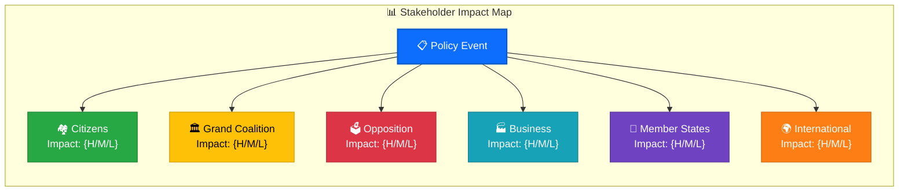

<!-- SPDX-FileCopyrightText: 2024-2026 Hack23 AB -->
<!-- SPDX-License-Identifier: Apache-2.0 -->

# 👥 Stakeholder Impact Assessment Template — European Parliament

> **📌 Template Instructions:** Copy to `analysis/YYYY-MM-DD/{article-type-slug}/` and name `stakeholder-impact.md`. Complete the context block first, then assess each stakeholder group. Groups with NONE impact still require a one-line rationale. The AI agent MUST use MCP data (in `analysis/YYYY-MM-DD/{article-type-slug}/data/`) for ALL evidence citations.

> **🚨 Anti-Pattern Warning:** Generic impact statements without specific evidence ("stakeholders are affected") are REJECTED. Every stakeholder assessment MUST include: specific impact description, EP document citation, confidence level, and impact direction (positive/negative/neutral). See [methodologies/ai-driven-analysis-guide.md](../methodologies/ai-driven-analysis-guide.md) for quality requirements. **Never use scripted boilerplate — AI must analyse the actual data.**

---

## 📋 Assessment Context

| Field | Value |
|-------|-------|
| **Assessment ID** | `[REQUIRED: STA-YYYY-MM-DD-NNN]` |
| **Assessment Date** | `[REQUIRED: YYYY-MM-DD HH:MM UTC]` |
| **Policy/Event Subject** | `[REQUIRED: brief name of the policy decision or event]` |
| **Primary EP Reference** | `[REQUIRED: procedure ID, adopted text, or MCP data file]` |
| **Stage of Process** | `[REQUIRED: e.g. "Commission proposal", "Committee vote", "Plenary adoption", "Trilogue"]` |
| **Produced By** | `[REQUIRED: workflow name]` |
| **Overall Impact Level** | `[REQUIRED: HIGH / MEDIUM / LOW]` |

---

## 👥 Stakeholder Group Assessments

### 🏘️ Group 1: EU Citizens (Direct Impact)

| Parameter | Value |
|-----------|-------|
| **Impact Level** | `[REQUIRED: HIGH / MEDIUM / LOW / NONE]` |
| **Impact Timeline** | `[REQUIRED: IMMEDIATE / SHORT (1–6 months) / MEDIUM (6–18 months) / LONG (18+ months)]` |
| **Affected Population** | `[REQUIRED: e.g. "All 450M EU residents", "Gig workers", "Digital platform users"]` |
| **Impact Type** | `[REQUIRED: FINANCIAL / LEGAL / SOCIAL / HEALTH / ENVIRONMENTAL / COMBINATION]` |
| **Evidence Sources** | `[REQUIRED: MCP data file references]` |
| **Confidence Level** | `[REQUIRED: HIGH / MEDIUM / LOW]` |

**Citizen Impact Narrative:**
`[REQUIRED: 2–4 sentences explaining how EU citizens experience this change. Be specific about amounts, eligibility, timelines, and cross-member-state variation.]`

---

### 🏛️ Group 2: Grand Coalition (EPP + S&D + Renew)

| Parameter | Value |
|-----------|-------|
| **Impact Level** | `[REQUIRED: HIGH / MEDIUM / LOW / NONE]` |
| **Impact Timeline** | `[REQUIRED: IMMEDIATE / SHORT / MEDIUM / LONG]` |
| **Primary Affected Groups** | `[REQUIRED: e.g. "EPP (primary), S&D (secondary)"]` |
| **Coalition Cohesion Effect** | `[REQUIRED: STRENGTHENS / NEUTRAL / STRAINS / FRACTURES]` |
| **Evidence Sources** | `[REQUIRED: MCP voting/coalition data]` |
| **Confidence Level** | `[REQUIRED: HIGH / MEDIUM / LOW]` |

**Coalition Impact Narrative:**
`[REQUIRED: 2–3 sentences on how this affects grand coalition dynamics.]`

---

### 🗳️ Group 3: Opposition Groups (ECR, PfE, ESN, The Left, Greens/EFA)

| Parameter | Value |
|-----------|-------|
| **Impact Level** | `[REQUIRED: HIGH / MEDIUM / LOW / NONE]` |
| **Impact Timeline** | `[REQUIRED: IMMEDIATE / SHORT / MEDIUM / LONG]` |
| **Primary Affected Groups** | `[REQUIRED: e.g. "ECR (gains credibility), Greens/EFA (marginalised)"]` |
| **Electoral Positioning Effect** | `[REQUIRED: POSITIVE / NEUTRAL / NEGATIVE — from opposition perspective]` |
| **Evidence Sources** | `[REQUIRED: MCP data references]` |
| **Confidence Level** | `[REQUIRED: HIGH / MEDIUM / LOW]` |

**Opposition Impact Narrative:**
`[REQUIRED: 2–3 sentences on opposition group dynamics.]`

---

### 🏭 Group 4: Business & Industry

| Parameter | Value |
|-----------|-------|
| **Impact Level** | `[REQUIRED: HIGH / MEDIUM / LOW / NONE]` |
| **Impact Timeline** | `[REQUIRED: IMMEDIATE / SHORT / MEDIUM / LONG]` |
| **Most Affected Sectors** | `[REQUIRED: e.g. "Digital platforms, automotive, energy"]` |
| **Economic Impact Type** | `[REQUIRED: COMPLIANCE COST / MARKET OPPORTUNITY / REGULATORY BURDEN / TAX CHANGE]` |
| **Evidence Sources** | `[REQUIRED: MCP data + World Bank indicators]` |
| **Confidence Level** | `[REQUIRED: HIGH / MEDIUM / LOW]` |

**Business Impact Narrative:**
`[REQUIRED: 2–3 sentences on economic/business impact.]`

---

### 🤝 Group 5: Member States & National Governments

| Parameter | Value |
|-----------|-------|
| **Impact Level** | `[REQUIRED: HIGH / MEDIUM / LOW / NONE]` |
| **Impact Timeline** | `[REQUIRED: IMMEDIATE / SHORT / MEDIUM / LONG]` |
| **Most Affected States** | `[REQUIRED: e.g. "Eastern EU members (transposition burden)", "Nordic states (gold-plating risk)"]` |
| **Council Alignment** | `[REQUIRED: ALIGNED / PARTIAL / OPPOSED / UNKNOWN]` |
| **Evidence Sources** | `[REQUIRED: MCP data references]` |
| **Confidence Level** | `[REQUIRED: HIGH / MEDIUM / LOW]` |

**Member State Impact Narrative:**
`[REQUIRED: 2–3 sentences on intergovernmental dynamics.]`

---

### 🌍 Group 6: International Partners & Trade

| Parameter | Value |
|-----------|-------|
| **Impact Level** | `[REQUIRED: HIGH / MEDIUM / LOW / NONE]` |
| **Impact Timeline** | `[REQUIRED: IMMEDIATE / SHORT / MEDIUM / LONG]` |
| **Affected Relationships** | `[REQUIRED: e.g. "US (trade), China (sanctions), UK (post-Brexit)"]` |
| **Treaty/Agreement Compliance** | `[REQUIRED: COMPLIANT / AT RISK / NON-COMPLIANT / UNCERTAIN]` |
| **Evidence Sources** | `[REQUIRED: MCP data references]` |
| **Confidence Level** | `[REQUIRED: HIGH / MEDIUM / LOW]` |

**International Impact Narrative:**
`[REQUIRED: 2–3 sentences on external relations impact.]`

---

## 📊 Impact Summary Matrix

| Stakeholder Group | Impact Level | Timeline | Confidence | Net Effect |
|-------------------|:------------:|:--------:|:----------:|-----------|
| 🏘️ EU Citizens | `[H/M/L/N]` | `[I/S/M/L]` | `[H/M/L]` | `[positive/negative/neutral]` |
| 🏛️ Grand Coalition | `[H/M/L/N]` | `[I/S/M/L]` | `[H/M/L]` | `[REQUIRED]` |
| 🗳️ Opposition | `[H/M/L/N]` | `[I/S/M/L]` | `[H/M/L]` | `[REQUIRED]` |
| 🏭 Business | `[H/M/L/N]` | `[I/S/M/L]` | `[H/M/L]` | `[REQUIRED]` |
| 🤝 Member States | `[H/M/L/N]` | `[I/S/M/L]` | `[H/M/L]` | `[REQUIRED]` |
| 🌍 International | `[H/M/L/N]` | `[I/S/M/L]` | `[H/M/L]` | `[REQUIRED]` |

---

## 🔑 Key Insights

`[REQUIRED: 3–5 sentences identifying the most significant stakeholder dynamics. Which groups are in tension? Where are unexpected winners/losers? What are the second-order political effects?]`

---

## ⚡ Conflicting Impact Resolution

When stakeholder impacts conflict (e.g., Citizens benefit but Business bears costs), use this decision matrix:

| Pattern | Overall Assessment | Editorial Framing |
|---------|-------------------|-------------------|
| Citizens positive + Business negative | **Politically significant** — redistribution dynamic | Lead with citizen impact; note business costs |
| Grand Coalition positive + Opposition negative | **Standard partisan** — expected dynamics | Present both perspectives equally |
| Citizens negative + Grand Coalition positive | **Accountability concern** — policy vs. people | Lead with citizen impact; scrutinise government rationale |
| All stakeholders negative | **System-level problem** — policy failure signal | Frame as shared challenge requiring cross-group response |
| All stakeholders positive | **Rare consensus** — highlight cross-party achievement | Note rarity; check for hidden costs or losers |
| Member States opposed + EP in favour | **Interinstitutional tension** — trilogue friction | Frame as EP asserting legislative power; track Council response |
| Business positive + Citizens neutral | **Regulatory capture risk** — scrutinise lobbying | Investigate industry influence; check for citizen safeguards |

### Stakeholder Impact Mermaid Diagram

> ⚠️ AI Agent: Replace placeholder values with actual impact assessments from the data.



---

**Publish Recommendation:** `[REQUIRED: YES — HIGH interest / YES — MEDIUM interest / MONITOR — low standalone value]`

### MCP Data Files Used

```
[REQUIRED: List all analysis/YYYY-MM-DD/{article-type-slug}/data/ files consulted]
```

---

**Document Control:**
- **Template Path:** `/analysis/templates/stakeholder-impact.md`
- **Version:** 2.0
- **Advanced Features:** Conflicting Impact Resolution matrix, Stakeholder Impact Mermaid diagram
- **Framework Reference:** [methodologies/political-style-guide.md](../methodologies/political-style-guide.md)
- **Classification:** Public
- **Next Review:** 2026-06-30
