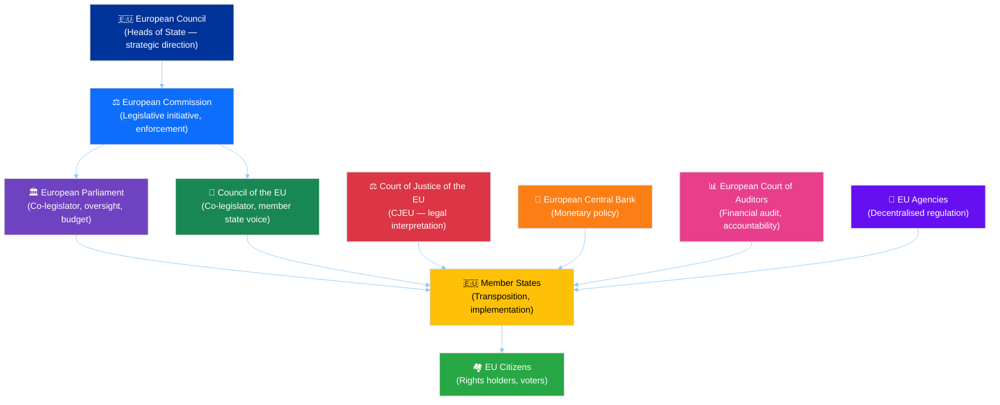
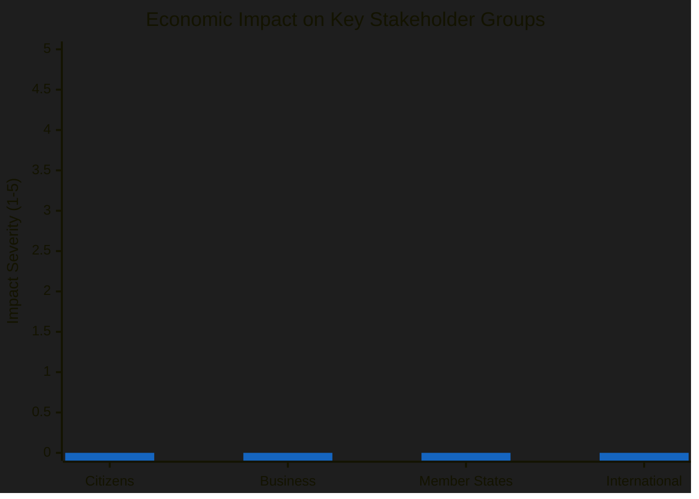

<!-- SPDX-FileCopyrightText: 2024-2026 Hack23 AB -->
<!-- SPDX-License-Identifier: Apache-2.0 -->

# 👥 Stakeholder Impact Assessment Template — European Parliament

> **📌 Template Instructions:** Copy to `analysis/YYYY-MM-DD/{article-type-slug}/` and name `stakeholder-impact.md`. Complete the context block first, then assess each stakeholder group. Groups with NONE impact still require a one-line rationale. The AI agent MUST use MCP data (in `analysis/YYYY-MM-DD/{article-type-slug}/data/`) for ALL evidence citations.

> **🚨 Anti-Pattern Warning:** Generic impact statements without specific evidence ("stakeholders are affected") are REJECTED. Every stakeholder assessment MUST include: specific impact description, EP document citation, confidence level, and impact direction (positive/negative/neutral). See [methodologies/ai-driven-analysis-guide.md](../methodologies/ai-driven-analysis-guide.md) for quality requirements. **Never use scripted boilerplate — AI must analyse the actual data.**

> **🔴 AI ANALYSIS REQUIRED**: Every field in this template MUST be filled by the AI agent through genuine analysis of the EP data. Never use scripted defaults, template placeholders in final output, or data-count summaries. Analyse what the data MEANS politically.

> **🔴 Stakeholder Evidence Depth (NEW):** Political group stakeholder assessments MUST cite actual voting data (from `get_voting_records` or `get_meeting_decisions`) when claiming group positions on specific legislation. Claims like "ECR supported DGSD2 but abstained on SRMR3" require roll-call evidence. If voting records are unavailable, mark the claim as LOW confidence and note the evidence gap.

---

## 📋 Assessment Context

| Field | Value |
|-------|-------|
| **Assessment ID** | `[REQUIRED: STA-YYYY-MM-DD-NNN]` |
| **Assessment Date** | `[REQUIRED: YYYY-MM-DD HH:MM UTC]` |
| **Policy/Event Subject** | `[REQUIRED: brief name of the policy decision or event]` |
| **Primary EP Reference** | `[REQUIRED: procedure ID, adopted text, or MCP data file]` |
| **Stage of Process** | `[REQUIRED: e.g. "Commission proposal", "Committee vote", "Plenary adoption", "Trilogue"]` |
| **Produced By** | `[REQUIRED: workflow name]` |
| **Overall Impact Level** | `[REQUIRED: HIGH / MEDIUM / LOW]` |

---

## 👥 Stakeholder Group Assessments

### 🏘️ Group 1: EU Citizens (Direct Impact)

| Parameter | Value |
|-----------|-------|
| **Impact Level** | `[REQUIRED: HIGH / MEDIUM / LOW / NONE]` |
| **Impact Timeline** | `[REQUIRED: IMMEDIATE / SHORT (1–6 months) / MEDIUM (6–18 months) / LONG (18+ months)]` |
| **Affected Population** | `[REQUIRED: e.g. "All 450M EU residents", "Gig workers", "Digital platform users"]` |
| **Impact Type** | `[REQUIRED: FINANCIAL / LEGAL / SOCIAL / HEALTH / ENVIRONMENTAL / COMBINATION]` |
| **Evidence Sources** | `[REQUIRED: MCP data file references]` |
| **Confidence Level** | `[REQUIRED: HIGH / MEDIUM / LOW]` |

**Citizen Impact Narrative:**
`[REQUIRED: 2–4 sentences explaining how EU citizens experience this change. Be specific about amounts, eligibility, timelines, and cross-member-state variation.]`

---

### 🏛️ Group 2: Grand Coalition (EPP + S&D + Renew)

| Parameter | Value |
|-----------|-------|
| **Impact Level** | `[REQUIRED: HIGH / MEDIUM / LOW / NONE]` |
| **Impact Timeline** | `[REQUIRED: IMMEDIATE / SHORT / MEDIUM / LONG]` |
| **Primary Affected Groups** | `[REQUIRED: e.g. "EPP (primary), S&D (secondary)"]` |
| **Coalition Cohesion Effect** | `[REQUIRED: STRENGTHENS / NEUTRAL / STRAINS / FRACTURES]` |
| **Evidence Sources** | `[REQUIRED: MCP voting/coalition data]` |
| **Confidence Level** | `[REQUIRED: HIGH / MEDIUM / LOW]` |

**Coalition Impact Narrative:**
`[REQUIRED: 2–3 sentences on how this affects grand coalition dynamics.]`

---

### 🗳️ Group 3: Opposition Groups (ECR, PfE, ESN, The Left, Greens/EFA)

| Parameter | Value |
|-----------|-------|
| **Impact Level** | `[REQUIRED: HIGH / MEDIUM / LOW / NONE]` |
| **Impact Timeline** | `[REQUIRED: IMMEDIATE / SHORT / MEDIUM / LONG]` |
| **Primary Affected Groups** | `[REQUIRED: e.g. "ECR (gains credibility), Greens/EFA (marginalised)"]` |
| **Electoral Positioning Effect** | `[REQUIRED: POSITIVE / NEUTRAL / NEGATIVE — from opposition perspective]` |
| **Evidence Sources** | `[REQUIRED: MCP data references]` |
| **Confidence Level** | `[REQUIRED: HIGH / MEDIUM / LOW]` |

**Opposition Impact Narrative:**
`[REQUIRED: 2–3 sentences on opposition group dynamics.]`

---

### 🏭 Group 4: Business & Industry

| Parameter | Value |
|-----------|-------|
| **Impact Level** | `[REQUIRED: HIGH / MEDIUM / LOW / NONE]` |
| **Impact Timeline** | `[REQUIRED: IMMEDIATE / SHORT / MEDIUM / LONG]` |
| **Most Affected Sectors** | `[REQUIRED: e.g. "Digital platforms, automotive, energy"]` |
| **Economic Impact Type** | `[REQUIRED: COMPLIANCE COST / MARKET OPPORTUNITY / REGULATORY BURDEN / TAX CHANGE]` |
| **Evidence Sources** | `[REQUIRED: EP MCP data + IMF indicators (primary for economic impact — Wave-4) + optional WB non-economic indicators]` |
| **Confidence Level** | `[REQUIRED: HIGH / MEDIUM / LOW]` |

**Business Impact Narrative:**
`[REQUIRED: 2–3 sentences on economic/business impact.]`

---

### 🤝 Group 5: Member States & National Governments

| Parameter | Value |
|-----------|-------|
| **Impact Level** | `[REQUIRED: HIGH / MEDIUM / LOW / NONE]` |
| **Impact Timeline** | `[REQUIRED: IMMEDIATE / SHORT / MEDIUM / LONG]` |
| **Most Affected States** | `[REQUIRED: e.g. "Eastern EU members (transposition burden)", "Nordic states (gold-plating risk)"]` |
| **Council Alignment** | `[REQUIRED: ALIGNED / PARTIAL / OPPOSED / UNKNOWN]` |
| **Evidence Sources** | `[REQUIRED: MCP data references]` |
| **Confidence Level** | `[REQUIRED: HIGH / MEDIUM / LOW]` |

**Member State Impact Narrative:**
`[REQUIRED: 2–3 sentences on intergovernmental dynamics.]`

---

### 🌍 Group 6: International Partners & Trade

| Parameter | Value |
|-----------|-------|
| **Impact Level** | `[REQUIRED: HIGH / MEDIUM / LOW / NONE]` |
| **Impact Timeline** | `[REQUIRED: IMMEDIATE / SHORT / MEDIUM / LONG]` |
| **Affected Relationships** | `[REQUIRED: e.g. "US (trade), China (sanctions), UK (post-Brexit)"]` |
| **Treaty/Agreement Compliance** | `[REQUIRED: COMPLIANT / AT RISK / NON-COMPLIANT / UNCERTAIN]` |
| **Evidence Sources** | `[REQUIRED: MCP data references]` |
| **Confidence Level** | `[REQUIRED: HIGH / MEDIUM / LOW]` |

**International Impact Narrative:**
`[REQUIRED: 2–3 sentences on external relations impact.]`

---

## 📊 Impact Summary Matrix

| Stakeholder Group | Impact Level | Timeline | Confidence | Net Effect |
|-------------------|:------------:|:--------:|:----------:|-----------|
| 🏘️ EU Citizens | `[H/M/L/N]` | `[I/S/M/L]` | `[H/M/L]` | `[positive/negative/neutral]` |
| 🏛️ Grand Coalition | `[H/M/L/N]` | `[I/S/M/L]` | `[H/M/L]` | `[REQUIRED]` |
| 🗳️ Opposition | `[H/M/L/N]` | `[I/S/M/L]` | `[H/M/L]` | `[REQUIRED]` |
| 🏭 Business | `[H/M/L/N]` | `[I/S/M/L]` | `[H/M/L]` | `[REQUIRED]` |
| 🤝 Member States | `[H/M/L/N]` | `[I/S/M/L]` | `[H/M/L]` | `[REQUIRED]` |
| 🌍 International | `[H/M/L/N]` | `[I/S/M/L]` | `[H/M/L]` | `[REQUIRED]` |

---

## 📅 Temporal Stakeholder Outlook — 30/60/90-Day Horizon — New in v2.2

> **AI Instructions:** Stakeholder impacts evolve over time. Immediate impacts (days to weeks) are different from structural impacts (months to years). This section maps both dimensions, providing a forward-looking stakeholder outlook. Use the legislative calendar and procedure timeline to anchor the timelines.

### Immediate vs. Structural Impact Classification

| Stakeholder Group | Immediate Impact (0–30d) | Short-term Impact (30–90d) | Structural Impact (90d+) | Impact Type |
|-------------------|:------------------------:|:-------------------------:|:------------------------:|------------|
| 🏘️ EU Citizens | `[description or N/A]` | `[description or N/A]` | `[description or N/A]` | `[IMMEDIATE / STRUCTURAL / BOTH / NONE]` |
| 🏛️ Grand Coalition | `[description or N/A]` | `[description or N/A]` | `[description or N/A]` | `[IMMEDIATE / STRUCTURAL / BOTH / NONE]` |
| 🗳️ Opposition | `[description or N/A]` | `[description or N/A]` | `[description or N/A]` | `[IMMEDIATE / STRUCTURAL / BOTH / NONE]` |
| 🏭 Business | `[description or N/A]` | `[description or N/A]` | `[description or N/A]` | `[IMMEDIATE / STRUCTURAL / BOTH / NONE]` |
| 🤝 Member States | `[description or N/A]` | `[description or N/A]` | `[description or N/A]` | `[IMMEDIATE / STRUCTURAL / BOTH / NONE]` |
| 🌍 International | `[description or N/A]` | `[description or N/A]` | `[description or N/A]` | `[IMMEDIATE / STRUCTURAL / BOTH / NONE]` |

### Immediate Impact (0–30 Days)

> Impacts that materialize within days to weeks of the event — typically legislative, electoral, or procedural consequences that are already underway or certain.

`[REQUIRED: 2–4 sentences describing which stakeholders are affected RIGHT NOW and how. Examples: "Grand Coalition must decide on a rapporteur replacement within 2 weeks"; "Digital platforms must publicly respond to the new gatekeeper criteria within 30 days under DMA Art. 3(3)"; "MEPs from Eastern member states face immediate constituency pressure on the migration vote."]`

**Most-Affected Stakeholder (Immediate):** `[REQUIRED: group name + specific immediate impact]`

### Structural Impact (90+ Days)

> Impacts that reshape the political landscape over months — legislative transposition, market restructuring, political positioning for 2029 elections, or institutional precedents.

`[REQUIRED: 2–4 sentences describing which stakeholders face the most significant structural changes. Examples: "The precedent of 11 EPP defections on environmental policy may structurally realign EPP positions ahead of 2029 election manifesto negotiations"; "SMEs face a structural compliance cost of €2–8M from new DMA obligations, creating competitive disadvantage vs. non-EU rivals."]`

**Most-Affected Stakeholder (Structural):** `[REQUIRED: group name + specific structural impact]`

### 30/60/90-Day Stakeholder Outlook Table

> Complete for the two or three most-affected stakeholder groups. Use EP calendar knowledge — plenary sessions, trilogue rounds, transposition deadlines — to anchor timelines.

| Stakeholder | 30-Day Outlook | 60-Day Outlook | 90-Day Outlook | Key Trigger Event |
|------------|:--------------:|:--------------:|:--------------:|-------------------|
| `[Group 1]` | `[Specific expected development]` | `[Expected development]` | `[Expected development]` | `[Calendar anchor — e.g., "April 22 plenary vote on amendment"]` |
| `[Group 2]` | `[Specific expected development]` | `[Expected development]` | `[Expected development]` | `[Calendar anchor]` |
| `[Group 3 — optional]` | `[Specific expected development]` | `[Expected development]` | `[Expected development]` | `[Calendar anchor]` |

**Good vs. Bad — Temporal Stakeholder Assessment:**

**❌ BAD (static, no temporal dimension):**
```markdown
Business is negatively impacted by new compliance requirements.
```

**✅ GOOD (temporally structured, concrete milestones):**
```markdown
| Business | [30d] Commission consultation response deadline (Art. 45 DMA) | [60d] Legal analysis complete; lobby strategy deployed | [90d] First compliance reports due; SMEs at highest risk (estimated 3,400 affected firms) | Commission delegated act publication (est. 2026-06-15) |
```

### Structural vs. Immediate Impact Assessment

`[REQUIRED: 2–3 sentences synthesising the relationship between immediate and structural impacts. E.g., "The immediate coalition stress (EPP defections) is acute but reversible — political group discipline has historically self-corrected within 2–3 plenary sessions. However, the structural impact on EPP-Green electoral positioning ahead of 2029 is more durable — this vote will feature in environmental NGO scorecards for the remainder of the parliamentary term."]`

---

## 🔑 Key Insights

`[REQUIRED: 3–5 sentences identifying the most significant stakeholder dynamics. Which groups are in tension? Where are unexpected winners/losers? What are the second-order political effects? Include at least one temporal observation from the 30/60/90-day outlook.]`

---

## ⚡ Conflicting Impact Resolution

When stakeholder impacts conflict (e.g., Citizens benefit but Business bears costs), use this decision matrix:

| Pattern | Overall Assessment | Editorial Framing |
|---------|-------------------|-------------------|
| Citizens positive + Business negative | **Politically significant** — redistribution dynamic | Lead with citizen impact; note business costs |
| Grand Coalition positive + Opposition negative | **Standard partisan** — expected dynamics | Present both perspectives equally |
| Citizens negative + Grand Coalition positive | **Accountability concern** — policy vs. people | Lead with citizen impact; scrutinise government rationale |
| All stakeholders negative | **System-level problem** — policy failure signal | Frame as shared challenge requiring cross-group response |
| All stakeholders positive | **Rare consensus** — highlight cross-party achievement | Note rarity; check for hidden costs or losers |
| Member States opposed + EP in favour | **Interinstitutional tension** — trilogue friction | Frame as EP asserting legislative power; track Council response |
| Business positive + Citizens neutral | **Regulatory capture risk** — scrutinise lobbying | Investigate industry influence; check for citizen safeguards |
| Immediate positive + Structural negative | **Short-term gain, long-term risk** — temporal conflict | Note both dimensions; track structural impact trajectory |
| Immediate negative + Structural positive | **Transition pain** — disruptive but directionally correct | Acknowledge transition cost; emphasise structural benefit |

### Stakeholder Impact Mermaid Diagram

> ⚠️ AI Agent: Replace placeholder values with actual impact assessments from the data.


```mermaid
%%{init: {"theme":"dark","themeVariables":{"primaryColor":"#1565C0","primaryTextColor":"#ffffff","primaryBorderColor":"#0A3F7F","lineColor":"#90CAF9","secondaryColor":"#2E7D32","secondaryTextColor":"#ffffff","secondaryBorderColor":"#0F3F00","tertiaryColor":"#FF9800","tertiaryTextColor":"#000000","tertiaryBorderColor":"#7F4F00","mainBkg":"#1565C0","secondBkg":"#2E7D32","tertiaryBkg":"#FF9800","noteBkgColor":"#FFC107","noteTextColor":"#000000","noteBorderColor":"#7F6000","errorBkgColor":"#D32F2F","errorTextColor":"#ffffff","fontFamily":"Inter, Helvetica, Arial, sans-serif","pie1":"#1565C0","pie2":"#2E7D32","pie3":"#FF9800","pie4":"#D32F2F","pie5":"#FFC107","pie6":"#7B1FA2","pie7":"#9E9E9E","pie8":"#0288D1","pie9":"#388E3C","pie10":"#F57C00","pie11":"#C62828","pie12":"#FBC02D","pieTitleTextSize":"18px","pieSectionTextSize":"14px","pieLegendTextSize":"13px","pieStrokeColor":"#1e1e1e","pieOuterStrokeColor":"#1e1e1e","git0":"#1565C0","git1":"#2E7D32","git2":"#FF9800","git3":"#D32F2F","gitBranchLabel0":"#ffffff","gitBranchLabel1":"#ffffff","gitBranchLabel2":"#000000","gitBranchLabel3":"#ffffff","cScale0":"#1565C0","cScale1":"#2E7D32","cScale2":"#FF9800","cScale3":"#D32F2F","cScale4":"#FFC107","cScale5":"#7B1FA2","cScale6":"#9E9E9E","cScale7":"#0288D1","xyChart":{"backgroundColor":"#1e1e1e","plotColorPalette":"#1565C0,#2E7D32,#FF9800,#D32F2F,#FFC107,#7B1FA2,#9E9E9E"}}}}%%
graph LR
    subgraph "📊 Stakeholder Impact Map"
        EVENT["📋 Policy Event"]
        C["🏘️ Citizens<br/>Impact: {H/M/L}"]
        GC["🏛️ Grand Coalition<br/>Impact: {H/M/L}"]
        O["🗳️ Opposition<br/>Impact: {H/M/L}"]
        B["🏭 Business<br/>Impact: {H/M/L}"]
        MS["🤝 Member States<br/>Impact: {H/M/L}"]
        INT["🌍 International<br/>Impact: {H/M/L}"]
    end

    EVENT --> C & GC & O & B & MS & INT

    style EVENT fill:#0d6efd,color:#fff,stroke:#0a58ca,stroke-width:2px
    style C fill:#28a745,color:#fff,stroke:#1e7e34
    style GC fill:#ffc107,color:#000,stroke:#cc9a06
    style O fill:#dc3545,color:#fff,stroke:#b02a37
    style B fill:#17a2b8,color:#fff,stroke:#117a8b
    style MS fill:#6f42c1,color:#fff,stroke:#59359a
    style INT fill:#fd7e14,color:#fff,stroke:#ca6510
```

---

**Publish Recommendation:** `[REQUIRED: YES — HIGH interest / YES — MEDIUM interest / MONITOR — low standalone value]`

---

## 🏛️ EU Institutional Hierarchy Awareness

> **AI Instructions:** When assessing stakeholder impact, apply awareness of the EU institutional hierarchy. Impact at higher tiers cascades downward. Use this hierarchy to identify second-order effects.


```mermaid
%%{init: {"theme":"dark","themeVariables":{"primaryColor":"#1565C0","primaryTextColor":"#ffffff","primaryBorderColor":"#0A3F7F","lineColor":"#90CAF9","secondaryColor":"#2E7D32","secondaryTextColor":"#ffffff","secondaryBorderColor":"#0F3F00","tertiaryColor":"#FF9800","tertiaryTextColor":"#000000","tertiaryBorderColor":"#7F4F00","mainBkg":"#1565C0","secondBkg":"#2E7D32","tertiaryBkg":"#FF9800","noteBkgColor":"#FFC107","noteTextColor":"#000000","noteBorderColor":"#7F6000","errorBkgColor":"#D32F2F","errorTextColor":"#ffffff","fontFamily":"Inter, Helvetica, Arial, sans-serif","pie1":"#1565C0","pie2":"#2E7D32","pie3":"#FF9800","pie4":"#D32F2F","pie5":"#FFC107","pie6":"#7B1FA2","pie7":"#9E9E9E","pie8":"#0288D1","pie9":"#388E3C","pie10":"#F57C00","pie11":"#C62828","pie12":"#FBC02D","pieTitleTextSize":"18px","pieSectionTextSize":"14px","pieLegendTextSize":"13px","pieStrokeColor":"#1e1e1e","pieOuterStrokeColor":"#1e1e1e","git0":"#1565C0","git1":"#2E7D32","git2":"#FF9800","git3":"#D32F2F","gitBranchLabel0":"#ffffff","gitBranchLabel1":"#ffffff","gitBranchLabel2":"#000000","gitBranchLabel3":"#ffffff","cScale0":"#1565C0","cScale1":"#2E7D32","cScale2":"#FF9800","cScale3":"#D32F2F","cScale4":"#FFC107","cScale5":"#7B1FA2","cScale6":"#9E9E9E","cScale7":"#0288D1","xyChart":{"backgroundColor":"#1e1e1e","plotColorPalette":"#1565C0,#2E7D32,#FF9800,#D32F2F,#FFC107,#7B1FA2,#9E9E9E"}}}}%%
flowchart TD
    EC["🇪🇺 European Council<br/>(Heads of State — strategic direction)"]
    COM["⚖️ European Commission<br/>(Legislative initiative, enforcement)"]
    EP["🏛️ European Parliament<br/>(Co-legislator, oversight, budget)"]
    COUNCIL["🤝 Council of the EU<br/>(Co-legislator, member state voice)"]
    CJEU["⚖️ Court of Justice of the EU<br/>(CJEU — legal interpretation)"]
    ECB["🏦 European Central Bank<br/>(Monetary policy)"]
    ECA["📊 European Court of Auditors<br/>(Financial audit, accountability)"]
    AGENCIES["🏢 EU Agencies<br/>(Decentralised regulation)"]
    MS["🇪🇺 Member States<br/>(Transposition, implementation)"]
    CIT["🏘️ EU Citizens<br/>(Rights holders, voters)"]

    EC --> COM
    COM --> EP & COUNCIL
    EP & COUNCIL --> MS
    CJEU --> MS
    ECB --> MS
    ECA --> MS
    AGENCIES --> MS
    MS --> CIT

    style EC fill:#003399,color:#fff
    style COM fill:#0d6efd,color:#fff
    style EP fill:#6f42c1,color:#fff
    style COUNCIL fill:#198754,color:#fff
    style CJEU fill:#dc3545,color:#fff
    style ECB fill:#fd7e14,color:#fff
    style ECA fill:#e83e8c,color:#fff
    style AGENCIES fill:#6610f2,color:#fff
    style MS fill:#ffc107,color:#000
    style CIT fill:#28a745,color:#fff
```

### Institutional Impact Cascade Assessment

| Impact Origin | Direct Impact | Cascade To | Second-Order Effect | Confidence |
|:------------:|:------------:|:----------:|--------------------:|:----------:|
| `[REQUIRED: e.g. "EP plenary vote"]` | `[e.g. "Commission must draft delegated acts"]` | `[e.g. "Member States → transposition"]` | `[e.g. "Citizens — new compliance obligations by 2028"]` | `[H/M/L]` |
| `[OPTIONAL]` | `[direct]` | `[cascade]` | `[second-order]` | `[H/M/L]` |

---

## 🔗 Cross-Committee Stakeholder Mapping

> **AI Instructions:** When the policy event involves multiple EP committees (lead + opinion committees), map how stakeholders are affected differently by each committee's perspective. First identify lead and opinion committees from the legislative procedure metadata using `get_procedures` or `track_legislation`, then use `get_committee_info` to retrieve committee details.

| Committee | Role | Primary Stakeholder Affected | Impact Direction | Key Concern |
|-----------|------|:---------------------------:|:----------------:|-------------|
| `[REQUIRED: e.g. ENVI]` | Lead | `[e.g. Business & Industry]` | `[positive/negative/neutral]` | `[e.g. "Emissions compliance costs"]` |
| `[REQUIRED: e.g. ITRE]` | Opinion | `[e.g. Business & Industry]` | `[positive/negative/neutral]` | `[e.g. "Innovation incentives for green tech"]` |
| `[OPTIONAL: e.g. ECON]` | Opinion | `[e.g. Member States]` | `[positive/negative/neutral]` | `[e.g. "MFF allocation for transition funds"]` |

**Cross-Committee Tension:** `[REQUIRED: 1–2 sentences on whether committees align or diverge on stakeholder impact. E.g., "ENVI prioritizes environmental protection (negative for Business) while ITRE emphasizes competitiveness (positive for Business), creating legislative tension during inter-committee compromise amendments and subsequent trilogue with Council/Commission."]`

---

## 📊 IMF Economic Context (primary) + WB Non-Economic Cross-Refs for Stakeholder Impact

> **AI Instructions (Wave-4):** When stakeholder impacts have economic dimensions, quantify with **IMF** data (WEO / FM / IFS / BOP / ER / PCPS / GFSR / EREO / FSI / GFS / DOT) as the primary source — Wave-4 policy. Use `analysis/imf/indicator-catalog.md` + `analysis/imf/database-directory.md` as the full indicator/database references. Use `analysis/imf/eu-country-mapping.md` for comparison country groups (aggregates `EU`, `EA`, `G7`, `G20` all accepted). For non-economic dimensions (health, education, social, environment, demographics), use World Bank via documented MCP tools — reference `analysis/worldbank/indicator-catalog.md`.

### Key Economic Indicators for Stakeholder Assessment (IMF primary)

| Stakeholder Group | IMF Indicators (SDMX) | Database | Non-Economic WB Cross-Refs | Comparison Group |
|-------------------|-----------------------|:--------:|----------------------------|------------------|
| 🏘️ Citizens | `PCPIPCH` (inflation), `LUR` (unemployment) | WEO + IFS | `SH.XPD.CHEX.GD.ZS` (health) | Affected member states |
| 🏭 Business | `NGDP_RPCH` (GDP growth), `BFD_BP6_USD` (FDI) | WEO + BOP_AGG | — | EU Big Four + competitors |
| 🤝 Member States | `NGDP_RPCH`, `PCPIPCH`, `GGXWDG_NGDP` (debt) | WEO + FM | — | Eurozone Core vs Convergence |
| 🌍 International | `TX_RPCH` (exports), `BFD_BP6_USD` (FDI), DOT bilateral | WEO + BOP + DOT | — | EU vs G7, EU vs BRICS |

> **Note (Wave-4):** IMF is the required primary source for every economic citation in this section. Any projected number must include a forecast marker (`forecast`/`projection`/`projects`/`expects`) within 30 words, plus the vintage in prose (`IMF WEO April 2026`), plus `data-vintage="WEO-April-2026"` on the enclosing `<section>` element.
>
> **WB fallback note:** Some WB indicators (e.g. GINI, Ease of Business) are not accepted as direct indicator keys by `get-social-data`/`get-health-data`/etc. Call `search-indicators` first to verify; use documented fallback mechanisms (e.g. legacy `get_indicator_for_country`) when needed.

### IMF Data Mermaid Template for Stakeholder Impact

> Replace placeholder values with actual IMF SDMX REST data.


```mermaid
%%{init: {"theme":"dark","themeVariables":{"primaryColor":"#1565C0","primaryTextColor":"#ffffff","primaryBorderColor":"#0A3F7F","lineColor":"#90CAF9","secondaryColor":"#2E7D32","secondaryTextColor":"#ffffff","secondaryBorderColor":"#0F3F00","tertiaryColor":"#FF9800","tertiaryTextColor":"#000000","tertiaryBorderColor":"#7F4F00","mainBkg":"#1565C0","secondBkg":"#2E7D32","tertiaryBkg":"#FF9800","noteBkgColor":"#FFC107","noteTextColor":"#000000","noteBorderColor":"#7F6000","errorBkgColor":"#D32F2F","errorTextColor":"#ffffff","fontFamily":"Inter, Helvetica, Arial, sans-serif","pie1":"#1565C0","pie2":"#2E7D32","pie3":"#FF9800","pie4":"#D32F2F","pie5":"#FFC107","pie6":"#7B1FA2","pie7":"#9E9E9E","pie8":"#0288D1","pie9":"#388E3C","pie10":"#F57C00","pie11":"#C62828","pie12":"#FBC02D","pieTitleTextSize":"18px","pieSectionTextSize":"14px","pieLegendTextSize":"13px","pieStrokeColor":"#1e1e1e","pieOuterStrokeColor":"#1e1e1e","git0":"#1565C0","git1":"#2E7D32","git2":"#FF9800","git3":"#D32F2F","gitBranchLabel0":"#ffffff","gitBranchLabel1":"#ffffff","gitBranchLabel2":"#000000","gitBranchLabel3":"#ffffff","cScale0":"#1565C0","cScale1":"#2E7D32","cScale2":"#FF9800","cScale3":"#D32F2F","cScale4":"#FFC107","cScale5":"#7B1FA2","cScale6":"#9E9E9E","cScale7":"#0288D1","xyChart":{"backgroundColor":"#1e1e1e","plotColorPalette":"#1565C0,#2E7D32,#FF9800,#D32F2F,#FFC107,#7B1FA2,#9E9E9E"}}}}%%
xychart-beta
    title "Economic Impact on Key Stakeholder Groups"
    x-axis ["Citizens", "Business", "Member States", "International"]
    y-axis "Impact Severity (1-5)" 0 --> 5
    bar [0, 0, 0, 0]
```

### MCP Data Files Used

```
[REQUIRED: List all analysis/YYYY-MM-DD/{article-type-slug}/data/ files consulted]
```

---

**Document Control:**
- **Template Path:** `/analysis/templates/stakeholder-impact.md`
- **Version:** 2.2
- **Advanced Features (v2.2):** Temporal Stakeholder Outlook (30/60/90-Day Horizon), Immediate vs. Structural Impact classification, temporal conflict patterns in Conflicting Impact Resolution matrix
- **Advanced Features (v2.1):** Conflicting Impact Resolution matrix, Stakeholder Impact Mermaid diagram, EU Institutional Hierarchy Awareness, Cross-Committee Stakeholder Mapping
- **Framework Reference:** [methodologies/political-style-guide.md](../methodologies/political-style-guide.md)
- **Classification:** Public
- **Next Review:** 2026-06-30
