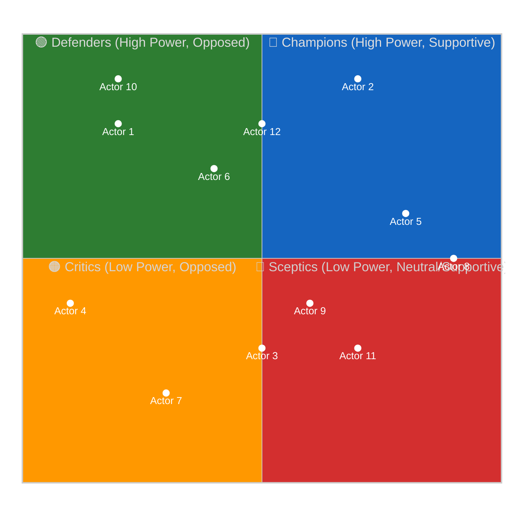

<!-- SPDX-FileCopyrightText: 2024-2026 Hack23 AB -->
<!-- SPDX-License-Identifier: Apache-2.0 -->

# 🗺️ Stakeholder Map Template — Power × Alignment Grid

> **📌 Template Instructions:** Copy to `analysis/daily/{date}/{article-type}-run{N}/intelligence/stakeholder-map.md`. Map ≥12 named actors on a Power × Alignment grid for the period's dominant issue. See [methodologies/per-artifact-methodologies.md §stakeholder-map](../methodologies/per-artifact-methodologies.md#stakeholder-map).

> **🎯 Purpose:** Named-stakeholder map placing political groups, key MEPs, committees, Commission DGs, Council configurations, external lobbies, and citizen groups on a two-dimensional grid showing who holds power and where they stand on the period's dominant question.

---

## 📋 Document Metadata

| Field | Value |
|-------|-------|
| **Report ID** | `[REQUIRED: SM-YYYY-MM-DD-runNN]` |
| **Analysis Period** | `[REQUIRED: YYYY-MM-DD to YYYY-MM-DD]` |
| **Dominant Issue** | `[REQUIRED: one-line issue frame]` |
| **Actors Mapped** | `[REQUIRED: count ≥12]` |
| **Confidence** | `[REQUIRED: 🟢/🟡/🔴]` |

---

## 1️⃣ Issue Frame

**Question this map answers:**

`[REQUIRED: ≥100 words stating the exact political question the map addresses. What issue unites or divides these actors? What decision or policy is at stake? Include timeframe and context.]`

---

## 2️⃣ Actor Roster

| # | Actor Name | Role | Power (0-10) | Power Justification | Alignment (-5 … +5) | Alignment Justification |
|:-:|------------|------|:------------:|---------------------|:-------------------:|------------------------|
| 1 | `[REQUIRED]` | `[REQUIRED: e.g. Political Group / MEP / Committee / DG / Lobby]` | `[0-10]` | `[REQUIRED: cite MEP influence index, committee role, seat share, or institutional position]` | `[-5 … +5]` | `[REQUIRED: cite roll-call vote, speech, public position, or document]` |
| 2 | `[REQUIRED]` | `[REQUIRED]` | `[0-10]` | `[REQUIRED]` | `[-5 … +5]` | `[REQUIRED]` |
| 3 | `[REQUIRED]` | `[REQUIRED]` | `[0-10]` | `[REQUIRED]` | `[-5 … +5]` | `[REQUIRED]` |
| 4 | `[REQUIRED]` | `[REQUIRED]` | `[0-10]` | `[REQUIRED]` | `[-5 … +5]` | `[REQUIRED]` |
| 5 | `[REQUIRED]` | `[REQUIRED]` | `[0-10]` | `[REQUIRED]` | `[-5 … +5]` | `[REQUIRED]` |
| 6 | `[REQUIRED]` | `[REQUIRED]` | `[0-10]` | `[REQUIRED]` | `[-5 … +5]` | `[REQUIRED]` |
| 7 | `[REQUIRED]` | `[REQUIRED]` | `[0-10]` | `[REQUIRED]` | `[-5 … +5]` | `[REQUIRED]` |
| 8 | `[REQUIRED]` | `[REQUIRED]` | `[0-10]` | `[REQUIRED]` | `[-5 … +5]` | `[REQUIRED]` |
| 9 | `[REQUIRED]` | `[REQUIRED]` | `[0-10]` | `[REQUIRED]` | `[-5 … +5]` | `[REQUIRED]` |
| 10 | `[REQUIRED]` | `[REQUIRED]` | `[0-10]` | `[REQUIRED]` | `[-5 … +5]` | `[REQUIRED]` |
| 11 | `[REQUIRED]` | `[REQUIRED]` | `[0-10]` | `[REQUIRED]` | `[-5 … +5]` | `[REQUIRED]` |
| 12 | `[REQUIRED]` | `[REQUIRED]` | `[0-10]` | `[REQUIRED]` | `[-5 … +5]` | `[REQUIRED]` |

**Scale definitions:**
- **Power (0-10):** 0=no institutional leverage, 5=moderate influence (backbencher/small group), 10=decisive leverage (rapporteur/chair/major group)
- **Alignment (-5 … +5):** -5=strongly opposed, 0=neutral/uncommitted, +5=strongly supportive

---

## 3️⃣ Power × Alignment Grid

> Per [political-style-guide.md §Standard quadrantChart init block](../methodologies/political-style-guide.md), quadrant charts **MUST** use the dedicated quadrant init block above (not the universal init block). Replace `Actor N` with actual stakeholder names.

**Note:** Replace `[ActorN]` labels and coordinates with actual actor names and scaled positions derived from roster table.

---

## 4️⃣ Quadrant Narratives

### Champions (High Power, Supportive — Q1)

`[REQUIRED: ≥150 words analyzing actors in the top-right quadrant. Who are they? What institutional leverage do they hold? What motivates their support? What coalition-building capacity do they have? Cite specific EP roles, committee positions, or voting records.]`

### Defenders (High Power, Opposed — Q2)

`[REQUIRED: ≥150 words analyzing actors in the top-left quadrant. Who opposes and why? What veto points or procedural tools do they control? What is their fallback position? What would shift them to neutral or supportive?]`

### Critics (Low Power, Opposed — Q3)

`[REQUIRED: ≥150 words analyzing actors in the bottom-left quadrant. Why do they oppose despite limited institutional leverage? What coalitions might amplify their voice? What signal would their shift send to higher-power actors?]`

### Sceptics (Low Power, Neutral/Supportive — Q4)

`[REQUIRED: ≥150 words analyzing actors in the bottom-right quadrant. Why are they supportive or uncommitted? What would activate their engagement? What prevents them from moving to the Champions quadrant?]`

---

## 5️⃣ Movement Since Prior Period

| Actor | Prior Position | Current Position | Direction | Explanation |
|-------|:--------------:|:----------------:|:---------:|-------------|
| `[REQUIRED]` | `[Power, Alignment]` | `[Power, Alignment]` | `[↑ / → / ↓ / ↗ / ↘]` | `[REQUIRED: ≥30 words — what changed and why]` |
| `[REQUIRED]` | `[...]` | `[...]` | `[...]` | `[REQUIRED]` |
| `[REQUIRED]` | `[...]` | `[...]` | `[...]` | `[REQUIRED]` |

**New entrants this period:** `[REQUIRED: list actors not present in prior map, or note "none"]`  
**Exits this period:** `[REQUIRED: list actors no longer relevant, or note "none"]`

---

## 6️⃣ Coalition Implications

**Majority threshold for this issue:** `[REQUIRED: 361 votes or qualified majority requirement]`

**Viable coalitions:**

| Coalition | Members | Combined Power | Estimated Votes | Viable? |
|-----------|---------|:--------------:|:---------------:|:-------:|
| `[REQUIRED: name]` | `[REQUIRED: actors]` | `[sum of power scores]` | `[estimated]` | `[✅/⚠️/❌]` |
| `[REQUIRED]` | `[REQUIRED]` | `[sum]` | `[estimated]` | `[✅/⚠️/❌]` |
| `[REQUIRED]` | `[REQUIRED]` | `[sum]` | `[estimated]` | `[✅/⚠️/❌]` |

**Blocking minorities:** `[REQUIRED: which quadrant combinations can block progress?]`

---

## 7️⃣ Strategic Observations

**Most influential swing actor:** `[REQUIRED: name + 50-word explanation]`  
**Most fragile alliance:** `[REQUIRED: which coalition is most vulnerable to defection?]`  
**Surprise positioning:** `[REQUIRED: any actor in an unexpected quadrant?]`

---

## 8️⃣ Forward Monitors

| Actor | Watch for… | Signal timing |
|-------|-----------|---------------|
| `[REQUIRED]` | `[REQUIRED: what would indicate a position shift]` | `[REQUIRED: date or trigger event]` |
| `[REQUIRED]` | `[REQUIRED]` | `[REQUIRED]` |
| `[REQUIRED]` | `[REQUIRED]` | `[REQUIRED]` |

---

## 9️⃣ Data Sources & Confidence

**EP MCP tools used:** `get_meps`, `get_committee_info`, `analyze_country_delegation`, `assess_mep_influence`, `get_speeches`

**Confidence level:** `[REQUIRED: 🟢 HIGH / 🟡 MEDIUM / 🔴 LOW]`  
**Confidence explanation:** `[REQUIRED: where power/alignment scores are data-backed vs. inference-based]`

---

**Document Control:** `/analysis/daily/{date}/{type}-run{N}/intelligence/stakeholder-map.md` · Template v1.1 · Depth floor: 305 lines.
